```python
# ============================================================
# FedGCF-Net XAI / Heatmap Figure Generator (NO SAVES, NO METRICS TABLES)
# FIXED: dataset root paths may be invalid when checkpoint is moved between Kaggle/Colab.
# This script will AUTO-LOCATE (or re-download via kagglehub) DS1 & DS2 roots by folder structure.
#
# Uses your pipeline pieces:
#  - GA-FELCM (EnhancedFELCM)  ✅
#  - Tri-gate conditioning (g0/g1/g2 with source+client+theta) ✅
#  - PVTv2-B2 backbone + Multi-scale fusion + token attention pooling ✅
#  - (Augmentation is TRAIN-time; XAI should use deterministic EVAL transforms.)
#
# Outputs (inline only):
#  A) ConVLM-style panel: Raw | Fixed-FELCM | GA-FELCM (top) + token-attn maps + Δ
#  B) Same-layer Grad-CAM (fuser.fuse feature map): Fixed vs GA + ΔCAM
#  C) Occlusion sensitivity: Fixed vs GA
#  D) Cross-client consensus saliency: mean + variance across clients (Fixed vs GA)
#
# Plots for ALL 4 classes: glioma, meningioma, notumor, pituitary
# ============================================================

import os, random, math
import numpy as np
import pandas as pd
from PIL import Image

import torch
import torch.nn as nn
import torch.nn.functional as F

import matplotlib.pyplot as plt
from matplotlib import gridspec

# -------------------------
# Reproducibility + Device
# -------------------------
SEED = 42
random.seed(SEED)
np.random.seed(SEED)
torch.manual_seed(SEED)
if torch.cuda.is_available():
    torch.cuda.manual_seed_all(SEED)

DEVICE = torch.device("cuda" if torch.cuda.is_available() else "cpu")
print("DEVICE:", DEVICE)

# -------------------------
# timm (install if missing)
# -------------------------
try:
    import timm
except Exception:
    import sys, subprocess
    subprocess.check_call([sys.executable, "-m", "pip", "-q", "install", "timm"])
    import timm

from torchvision import transforms

plt.rcParams["figure.dpi"] = 140

IMG_EXTS = (".jpg",".jpeg",".png",".bmp",".tif",".tiff",".webp")

# ============================================================
# 0) Find + Load checkpoint (uploaded locally to Colab is usually /content or current dir)
# ============================================================
CKPT_BASENAME = "FL_GAFELCM_PVTv2B2_FUSION_checkpoint.pth"

def find_checkpoint():
    # Try common locations fast
    fast = [
        CKPT_BASENAME,
        os.path.join("/content", CKPT_BASENAME),
        os.path.join("/mnt/data", CKPT_BASENAME),
        "/mnt/data/FL_GAFELCM_PVTv2B2_FUSION_checkpoint.pth",
    ]
    for p in fast:
        if os.path.exists(p):
            return p

    # Fallback: light search in /content
    for root in ["/content", os.getcwd()]:
        if os.path.isdir(root):
            for r, _, files in os.walk(root):
                if CKPT_BASENAME in files:
                    return os.path.join(r, CKPT_BASENAME)
    return None

CKPT_PATH = find_checkpoint()
if CKPT_PATH is None:
    raise FileNotFoundError(
        f"Checkpoint not found.\nUpload {CKPT_BASENAME} to Colab (Files panel) or put it in /content."
    )

ckpt = torch.load(CKPT_PATH, map_location="cpu")
print("Loaded checkpoint:", os.path.basename(CKPT_PATH))

CFG = ckpt.get("config", {})
labels = ckpt.get("labels", ["glioma", "meningioma", "notumor", "pituitary"])
label2id = ckpt.get("label2id", {l:i for i,l in enumerate(labels)})
id2label = ckpt.get("id2label", {i:l for l,i in label2id.items()})
NUM_CLASSES = len(labels)

CLIENTS_PER_DS = int(CFG.get("clients_per_dataset", 3))
CLIENTS_TOTAL  = int(CFG.get("clients_total", 6))
BACKBONE_NAME  = str(ckpt.get("backbone_name", CFG.get("backbone_name", "pvt_v2_b2")))

IMG_SIZE = int(CFG.get("img_size", 224))
if IMG_SIZE < 96:
    IMG_SIZE = 224

IMAGENET_MEAN = torch.tensor([0.485, 0.456, 0.406], device=DEVICE).view(1,3,1,1)
IMAGENET_STD  = torch.tensor([0.229, 0.224, 0.225], device=DEVICE).view(1,3,1,1)

EVAL_TFMS = transforms.Compose([
    transforms.Resize((IMG_SIZE, IMG_SIZE)),
    transforms.ToTensor(),
])

# ============================================================
# 1) Robust dataset root resolution (AUTO-FIND or kagglehub download)
# ============================================================
REQ1 = {"512Glioma", "512Meningioma", "512Normal", "512Pituitary"}  # DS1 expected dirs
REQ2 = {"glioma", "meningioma", "notumor", "pituitary"}             # DS2 expected dirs

def find_root_with_required_class_dirs(base_dir, required_set, prefer_raw=True, max_candidates=40_000):
    """
    Walk base_dir and find a directory whose immediate subdirs contain required_set.
    prefer_raw boosts paths containing 'raw' / 'raw data' and penalizes 'augmented'.
    max_candidates prevents pathological cases.
    """
    if base_dir is None or (not os.path.isdir(base_dir)):
        return None

    candidates = []
    walked = 0
    for root, dirs, _ in os.walk(base_dir):
        walked += 1
        if walked > max_candidates:
            break
        if required_set.issubset(set(dirs)):
            candidates.append(root)

    if not candidates:
        return None

    def score(p):
        pl = p.lower()
        sc = 0
        if prefer_raw:
            if "raw data" in pl: sc += 8
            if os.path.basename(p).lower() == "raw": sc += 8
            if "/raw/" in pl or "\\raw\\" in pl: sc += 4
            if "augmented" in pl: sc -= 30
        # slightly prefer shorter paths
        sc -= 0.0001 * len(p)
        return sc

    return max(candidates, key=score)

def try_auto_locate_anywhere(required_set, prefer_raw):
    # Search a few likely parent dirs (kept small to avoid slow full-disk scan)
    candidates = [
        "/content",
        "/content/data",
        "/content/datasets",
        "/kaggle/input",     # sometimes in Kaggle
        "/mnt",
        "/mnt/data",
        os.getcwd(),
    ]
    for base in candidates:
        r = find_root_with_required_class_dirs(base, required_set, prefer_raw=prefer_raw)
        if r is not None:
            return r
    return None

def ensure_kagglehub():
    try:
        import kagglehub
        return kagglehub
    except Exception:
        import sys, subprocess
        subprocess.check_call([sys.executable, "-m", "pip", "-q", "install", "kagglehub"])
        import kagglehub
        return kagglehub

def resolve_dataset_roots():
    # 1) Try roots stored in checkpoint (may be Kaggle paths and invalid on Colab)
    ds1_root_ckpt = ckpt.get("dataset1_raw_root", None)
    ds2_root_ckpt = ckpt.get("dataset2_root", None)

    ds1_root = ds1_root_ckpt if (ds1_root_ckpt and os.path.isdir(ds1_root_ckpt)) else None
    ds2_root = ds2_root_ckpt if (ds2_root_ckpt and os.path.isdir(ds2_root_ckpt)) else None

    # 2) Try auto-locate in common locations
    if ds1_root is None:
        ds1_root = try_auto_locate_anywhere(REQ1, prefer_raw=True)
    if ds2_root is None:
        ds2_root = try_auto_locate_anywhere(REQ2, prefer_raw=False)

    # 3) If still missing, download via kagglehub (same as your training script)
    if ds1_root is None or ds2_root is None:
        try:
            kagglehub = ensure_kagglehub()
            # These are the same dataset slugs you used in training (ds1, ds2)
            ds2_base = kagglehub.dataset_download("yassinebazgour/preprocessed-brain-mri-scans-for-tumors-detection")
            ds1_base = kagglehub.dataset_download("orvile/pmram-bangladeshi-brain-cancer-mri-dataset")

            # Now find roots inside the downloaded folders
            if ds1_root is None:
                ds1_root = find_root_with_required_class_dirs(ds1_base, REQ1, prefer_raw=True)
            if ds2_root is None:
                ds2_root = find_root_with_required_class_dirs(ds2_base, REQ2, prefer_raw=False)
        except Exception as e:
            print("⚠️ kagglehub download failed (maybe no Kaggle token in this Colab).")
            print("   Error:", str(e))

    return ds1_root, ds2_root

DS1_ROOT, DS2_ROOT = resolve_dataset_roots()

print("DS1_ROOT:", DS1_ROOT)
print("DS2_ROOT:", DS2_ROOT)

if DS1_ROOT is None or (not os.path.isdir(DS1_ROOT)):
    raise FileNotFoundError(
        "Could not locate DS1 root containing folders: "
        f"{sorted(list(REQ1))}\n"
        "Fix: ensure DS1 exists in your runtime (or kagglehub works), then rerun."
    )
if DS2_ROOT is None or (not os.path.isdir(DS2_ROOT)):
    raise FileNotFoundError(
        "Could not locate DS2 root containing folders: "
        f"{sorted(list(REQ2))}\n"
        "Fix: ensure DS2 exists in your runtime (or kagglehub works), then rerun."
    )

# ============================================================
# 2) Your GA-FELCM module (EnhancedFELCM) + helpers
# ============================================================
class EnhancedFELCM(nn.Module):
    def __init__(self, gamma=1.0, alpha=0.35, beta=6.0, tau=2.5, blur_k=7, sharpen=0.0, denoise=0.0):
        super().__init__()
        self.gamma = float(gamma)
        self.alpha = float(alpha)
        self.beta  = float(beta)
        self.tau   = float(tau)
        self.blur_k = int(blur_k)
        self.sharpen = float(sharpen)
        self.denoise = float(denoise)

        lap = torch.tensor([[0, -1, 0], [-1, 4, -1], [0, -1, 0]], dtype=torch.float32)
        self.register_buffer("lap", lap.view(1, 1, 3, 3))

        sharp = torch.tensor([[0, -1, 0], [-1, 5, -1], [0, -1, 0]], dtype=torch.float32)
        self.register_buffer("sharp_kernel", sharp.view(1, 1, 3, 3))

    def forward(self, x):
        eps = 1e-6
        B, C, H, W = x.shape

        if self.denoise > 0:
            k = 3
            x_blur = F.avg_pool2d(F.pad(x, (1, 1, 1, 1), mode="reflect"), k, 1)
            x = x * (1 - self.denoise) + x_blur * self.denoise

        mu = x.mean(dim=(2, 3), keepdim=True)
        sd = x.std(dim=(2, 3), keepdim=True).clamp_min(eps)
        x0 = (x - mu) / sd
        x0 = x0.clamp(-self.tau, self.tau)

        x1 = torch.sign(x0) * torch.pow(torch.abs(x0).clamp_min(eps), self.gamma)

        gray = x1.mean(dim=1, keepdim=True)
        lap = F.conv2d(F.pad(gray, (1, 1, 1, 1), mode="reflect"), self.lap)
        mag = lap.abs()

        k = self.blur_k if self.blur_k % 2 == 1 else self.blur_k + 1
        pad = k // 2
        blur = F.avg_pool2d(F.pad(mag, (pad, pad, pad, pad), mode="reflect"), k, 1)
        C_map = mag / (blur + eps)

        x2 = x1 + self.alpha * torch.tanh(self.beta * C_map)

        if self.sharpen > 0:
            outs = []
            for c in range(C):
                x_c = x2[:, c: c + 1, :, :]
                x_sharp = F.conv2d(F.pad(x_c, (1, 1, 1, 1), mode="reflect"), self.sharp_kernel)
                outs.append(x_c * (1 - self.sharpen) + x_sharp * self.sharpen)
            x2 = torch.cat(outs, dim=1)

        mn = x2.amin(dim=(2, 3), keepdim=True)
        mx = x2.amax(dim=(2, 3), keepdim=True)
        x3 = (x2 - mn) / (mx - mn + eps)
        return x3.clamp(0, 1)

def theta_to_module(theta):
    if theta is None:
        return EnhancedFELCM()
    g, a, b, t, k, sh, dn = theta
    return EnhancedFELCM(gamma=g, alpha=a, beta=b, tau=t, blur_k=int(k), sharpen=sh, denoise=dn)

def preproc_theta_vec(preproc_module, batch_size):
    theta = torch.tensor(
        [
            float(preproc_module.gamma),
            float(preproc_module.alpha),
            float(preproc_module.beta),
            float(preproc_module.tau),
            float(preproc_module.blur_k) / 7.0,
            float(preproc_module.sharpen),
            float(preproc_module.denoise),
        ],
        device=DEVICE,
        dtype=torch.float32,
    )
    return theta.unsqueeze(0).repeat(batch_size, 1)

fixed_pre = EnhancedFELCM().to(DEVICE).eval()
best_theta_ds1 = ckpt.get("best_theta_ds1", None)
best_theta_ds2 = ckpt.get("best_theta_ds2", None)
ga_pre_ds1 = theta_to_module(best_theta_ds1).to(DEVICE).eval()
ga_pre_ds2 = theta_to_module(best_theta_ds2).to(DEVICE).eval()

print("best_theta_ds1:", best_theta_ds1)
print("best_theta_ds2:", best_theta_ds2)

# ============================================================
# 3) Your FedGCF-Net model (PVTv2-B2 + fusion + tri-gate)
# ============================================================
class TokenAttentionPooling(nn.Module):
    def __init__(self, dim):
        super().__init__()
        self.query = nn.Linear(dim, 1)

    def forward(self, x_tokens):  # [B, HW, C]
        attn = torch.softmax(self.query(x_tokens).squeeze(-1), dim=1)  # [B, HW]
        pooled = (x_tokens * attn.unsqueeze(-1)).sum(dim=1)
        return pooled, attn

class MultiScaleFeatureFuser(nn.Module):
    def __init__(self, in_channels, out_dim):
        super().__init__()
        self.proj = nn.ModuleList([
            nn.Sequential(
                nn.Conv2d(c, out_dim, kernel_size=1, bias=False),
                nn.GroupNorm(8, out_dim),
                nn.GELU(),
            )
            for c in in_channels
        ])
        self.fuse = nn.Sequential(
            nn.Conv2d(out_dim, out_dim, kernel_size=3, padding=1, bias=False),
            nn.GroupNorm(8, out_dim),
            nn.GELU(),
        )
        self.pool = TokenAttentionPooling(out_dim)

class EnhancedBrainTuner(nn.Module):
    def __init__(self, dim, dropout=0.1):
        super().__init__()
        self.se = nn.Sequential(
            nn.Linear(dim, max(8, dim // 4)),
            nn.ReLU(inplace=True),
            nn.Linear(max(8, dim // 4), dim),
            nn.Sigmoid(),
        )
        self.refine = nn.Sequential(
            nn.LayerNorm(dim),
            nn.Linear(dim, dim),
            nn.GELU(),
            nn.Dropout(dropout),
            nn.Linear(dim, dim),
        )
        self.gate = nn.Parameter(torch.ones(2) / 2)

    def forward(self, x):
        gate = F.softmax(self.gate, dim=0)
        out1 = x * self.se(x)
        out2 = x + 0.2 * self.refine(x)
        return gate[0] * out1 + gate[1] * out2

class PVTv2B2_MultiScale(nn.Module):
    def __init__(self, num_classes, head_dropout=0.3, cond_dim=128, num_clients=6):
        super().__init__()
        self.backbone = timm.create_model(
            BACKBONE_NAME,
            pretrained=False,
            features_only=True,
            out_indices=(0,1,2,3),
        )
        in_channels = self.backbone.feature_info.channels()
        out_dim = max(256, in_channels[-1] // 2)

        self.fuser = MultiScaleFeatureFuser(in_channels, out_dim)
        self.tuner = EnhancedBrainTuner(out_dim, dropout=0.1)

        self.classifier = nn.Sequential(
            nn.LayerNorm(out_dim),
            nn.Dropout(head_dropout),
            nn.Linear(out_dim, max(64, out_dim // 2)),
            nn.GELU(),
            nn.Dropout(head_dropout * 0.5),
            nn.Linear(max(64, out_dim // 2), num_classes),
        )

        self.theta_mlp = nn.Sequential(
            nn.Linear(7, cond_dim),
            nn.GELU(),
            nn.Linear(cond_dim, cond_dim),
        )
        self.source_emb = nn.Embedding(2, cond_dim)
        self.client_emb = nn.Embedding(num_clients, cond_dim)
        self.cond_norm = nn.LayerNorm(cond_dim)

        self.gate_early = nn.Linear(cond_dim, 3)
        self.gate_mid   = nn.Linear(cond_dim, out_dim)
        self.gate_late  = nn.Linear(cond_dim, out_dim)

    def _cond_vec(self, theta_vec, source_id, client_id):
        cond = self.theta_mlp(theta_vec)
        cond = cond + self.source_emb(source_id) + self.client_emb(client_id)
        return self.cond_norm(cond)

model = PVTv2B2_MultiScale(
    num_classes=NUM_CLASSES,
    head_dropout=float(CFG.get("head_dropout", 0.3)),
    cond_dim=int(CFG.get("cond_dim", 128)),
    num_clients=CLIENTS_TOTAL,
).to(DEVICE).eval()

sd = ckpt.get("state_dict", None)
if sd is None:
    raise RuntimeError("Checkpoint missing state_dict.")
model.load_state_dict(sd, strict=True)
print("✅ Model weights loaded.")

# ============================================================
# 4) Build sample-per-class (ALL 4 classes) for DS1 and DS2
# ============================================================
def list_images_under_class_root(class_root, class_dir_name):
    class_dir = os.path.join(class_root, class_dir_name)
    out = []
    if not os.path.isdir(class_dir):
        return out
    for r, _, files in os.walk(class_dir):
        for fn in files:
            if fn.lower().endswith(IMG_EXTS):
                out.append(os.path.join(r, fn))
    return out

def pick_one_per_class_from_root(ds_root, class_dirs_map, seed=SEED):
    rng = random.Random(seed)
    samples = {}
    for lab in labels:
        dir_name = class_dirs_map[lab]
        imgs = list_images_under_class_root(ds_root, dir_name)
        if len(imgs) == 0:
            samples[lab] = None
        else:
            samples[lab] = rng.choice(imgs)
    return samples

# DS1 folder names
DS1_CLASS_DIRS = {
    "glioma": "512Glioma",
    "meningioma": "512Meningioma",
    "notumor": "512Normal",
    "pituitary": "512Pituitary",
}
# DS2 folder names
DS2_CLASS_DIRS = {
    "glioma": "glioma",
    "meningioma": "meningioma",
    "notumor": "notumor",
    "pituitary": "pituitary",
}

ds1_samples = pick_one_per_class_from_root(DS1_ROOT, DS1_CLASS_DIRS, seed=SEED)
ds2_samples = pick_one_per_class_from_root(DS2_ROOT, DS2_CLASS_DIRS, seed=SEED + 7)

print("DS1 samples:")
for k,v in ds1_samples.items(): print(" ", k, "->", v)
print("DS2 samples:")
for k,v in ds2_samples.items(): print(" ", k, "->", v)

# if any missing, pick another seed attempt (robust)
def fill_missing_samples(ds_root, class_dirs_map, samples, tries=5):
    for t in range(tries):
        if all(samples[l] is not None for l in labels):
            return samples
        samples2 = pick_one_per_class_from_root(ds_root, class_dirs_map, seed=SEED + 100 + t)
        for l in labels:
            if samples[l] is None:
                samples[l] = samples2[l]
    return samples

ds1_samples = fill_missing_samples(DS1_ROOT, DS1_CLASS_DIRS, ds1_samples)
ds2_samples = fill_missing_samples(DS2_ROOT, DS2_CLASS_DIRS, ds2_samples)

if any(ds1_samples[l] is None for l in labels):
    raise RuntimeError("DS1: Could not find at least 1 image for every class folder.")
if any(ds2_samples[l] is None for l in labels):
    raise RuntimeError("DS2: Could not find at least 1 image for every class folder.")

def load_rgb(path):
    try:
        return Image.open(path).convert("RGB")
    except Exception:
        return Image.new("RGB", (IMG_SIZE, IMG_SIZE), (128,128,128))

# ============================================================
# 5) Forward pieces to extract token-attention + same-layer conv map
# ============================================================
def fuser_conv_pooled_attn(fuser, feats):
    proj_feats = [p(f) for p, f in zip(fuser.proj, feats)]
    x = proj_feats[-1]
    for f in reversed(proj_feats[:-1]):
        x = F.interpolate(x, size=f.shape[-2:], mode="bilinear", align_corners=False)
        x = x + f
    x = fuser.fuse(x)  # [B,C,H,W]
    B, C, H, W = x.shape
    tokens = x.flatten(2).transpose(1, 2)  # [B,HW,C]
    pooled, attn = fuser.pool(tokens)       # pooled [B,C], attn [B,HW]
    attn_map = attn.view(B, H, W)
    return x, pooled, attn_map

def attn_entropy(attn_map_2d):
    p = attn_map_2d.flatten().clamp(1e-9, 1.0)
    p = p / p.sum()
    return float(-(p * torch.log2(p)).sum().item())

@torch.no_grad()
def run_token_attn_only(x01, preproc, source_id, client_id):
    x01 = x01.to(DEVICE)
    x_fel = preproc(x01).clamp(0,1)
    x_raw_n = (x01 - IMAGENET_MEAN) / IMAGENET_STD
    x_fel_n = (x_fel - IMAGENET_MEAN) / IMAGENET_STD

    theta_vec = preproc_theta_vec(preproc, batch_size=1)
    sid = torch.tensor([source_id], device=DEVICE, dtype=torch.long)
    cid = torch.tensor([client_id], device=DEVICE, dtype=torch.long)

    cond = model._cond_vec(theta_vec, sid, cid)
    g0 = torch.sigmoid(model.gate_early(cond)).view(-1,3,1,1)
    xmix = (1-g0)*x_raw_n + g0*x_fel_n

    feats0 = model.backbone(xmix)
    _, f0, att0 = fuser_conv_pooled_attn(model.fuser, feats0)

    # second view (fel-only)
    feats1 = model.backbone(x_fel_n)
    _, f1, _ = fuser_conv_pooled_attn(model.fuser, feats1)

    g1 = torch.sigmoid(model.gate_mid(cond))
    f_mid = (1-g1)*f0 + g1*f1

    t0 = model.tuner(f0)
    t1 = model.tuner(f1)
    t_mid = model.tuner(f_mid)

    t_views = 0.5*(t0+t1)
    g2 = torch.sigmoid(model.gate_late(cond))
    t_final = (1-g2)*t_mid + g2*t_views

    logits = model.classifier(t_final)
    prob = torch.softmax(logits, dim=1)[0]
    conf = float(prob.max().item())
    pred = int(prob.argmax().item())

    return {
        "attn_map": att0[0].detach().cpu(),  # [h,w]
        "conf": conf,
        "pred": pred,
    }

def gradcam_same_layer(x01, preproc, source_id, client_id, target_class=None):
    model.eval()
    preproc.eval()

    x01 = x01.to(DEVICE)
    x_fel = preproc(x01).clamp(0,1)
    x_raw_n = (x01 - IMAGENET_MEAN) / IMAGENET_STD
    x_fel_n = (x_fel - IMAGENET_MEAN) / IMAGENET_STD

    theta_vec = preproc_theta_vec(preproc, batch_size=1)
    sid = torch.tensor([source_id], device=DEVICE, dtype=torch.long)
    cid = torch.tensor([client_id], device=DEVICE, dtype=torch.long)

    # grads on
    for p in model.parameters():
        p.requires_grad = True
    model.zero_grad(set_to_none=True)

    cond = model._cond_vec(theta_vec, sid, cid)
    g0 = torch.sigmoid(model.gate_early(cond)).view(-1,3,1,1)
    xmix = (1-g0)*x_raw_n + g0*x_fel_n

    feats0 = model.backbone(xmix)
    conv0, f0, _ = fuser_conv_pooled_attn(model.fuser, feats0)
    conv0.retain_grad()

    feats1 = model.backbone(x_fel_n)
    _, f1, _ = fuser_conv_pooled_attn(model.fuser, feats1)

    g1 = torch.sigmoid(model.gate_mid(cond))
    f_mid = (1-g1)*f0 + g1*f1

    t0 = model.tuner(f0)
    t1 = model.tuner(f1)
    t_mid = model.tuner(f_mid)

    t_views = 0.5*(t0+t1)
    g2 = torch.sigmoid(model.gate_late(cond))
    t_final = (1-g2)*t_mid + g2*t_views

    logits = model.classifier(t_final)
    prob = torch.softmax(logits, dim=1)[0]
    pred = int(prob.argmax().item())
    if target_class is None:
        target_class = pred

    logits[0, target_class].backward()

    grad = conv0.grad[0]       # [C,h,w]
    act  = conv0.detach()[0]   # [C,h,w]
    w = grad.mean(dim=(1,2), keepdim=True)
    cam = torch.relu((w * act).sum(dim=0))
    cam = cam - cam.min()
    cam = cam / (cam.max() + 1e-9)

    conf = float(prob.max().item())
    return cam.detach().cpu(), conf, pred, int(target_class)

@torch.no_grad()
def occlusion_sensitivity_map(x01, preproc, source_id, client_id, patch=32, stride=32, target_class=None):
    x01 = x01.to(DEVICE)
    x_fel = preproc(x01).clamp(0,1)
    x_raw_n = (x01 - IMAGENET_MEAN) / IMAGENET_STD
    x_fel_n = (x_fel - IMAGENET_MEAN) / IMAGENET_STD

    theta_vec = preproc_theta_vec(preproc, batch_size=1)
    sid = torch.tensor([source_id], device=DEVICE, dtype=torch.long)
    cid = torch.tensor([client_id], device=DEVICE, dtype=torch.long)

    # baseline
    cond = model._cond_vec(theta_vec, sid, cid)
    g0 = torch.sigmoid(model.gate_early(cond)).view(-1,3,1,1)
    xmix = (1-g0)*x_raw_n + g0*x_fel_n

    feats0 = model.backbone(xmix)
    _, f0, _ = fuser_conv_pooled_attn(model.fuser, feats0)

    feats1 = model.backbone(x_fel_n)
    _, f1, _ = fuser_conv_pooled_attn(model.fuser, feats1)

    g1 = torch.sigmoid(model.gate_mid(cond))
    f_mid = (1-g1)*f0 + g1*f1

    t0 = model.tuner(f0)
    t1 = model.tuner(f1)
    t_mid = model.tuner(f_mid)

    t_views = 0.5*(t0+t1)
    g2 = torch.sigmoid(model.gate_late(cond))
    t_final = (1-g2)*t_mid + g2*t_views

    logits = model.classifier(t_final)
    prob = torch.softmax(logits, dim=1)[0]
    pred = int(prob.argmax().item())
    if target_class is None:
        target_class = pred
    base_p = float(prob[target_class].item())

    _, _, H, W = x01.shape
    ys = list(range(0, H, stride))
    xs = list(range(0, W, stride))
    grid = np.zeros((len(ys), len(xs)), dtype=np.float32)

    for iy, y0 in enumerate(ys):
        for ix, x0p in enumerate(xs):
            x_mask = x01.clone()
            y1 = min(H, y0 + patch)
            x1 = min(W, x0p + patch)
            x_mask[:, :, y0:y1, x0p:x1] = 0.0

            x_fel_m = preproc(x_mask).clamp(0,1)
            x_raw_n_m = (x_mask - IMAGENET_MEAN) / IMAGENET_STD
            x_fel_n_m = (x_fel_m - IMAGENET_MEAN) / IMAGENET_STD

            cond_m = model._cond_vec(theta_vec, sid, cid)
            g0m = torch.sigmoid(model.gate_early(cond_m)).view(-1,3,1,1)
            xmix_m = (1-g0m)*x_raw_n_m + g0m*x_fel_n_m

            feats0m = model.backbone(xmix_m)
            _, f0m, _ = fuser_conv_pooled_attn(model.fuser, feats0m)

            feats1m = model.backbone(x_fel_n_m)
            _, f1m, _ = fuser_conv_pooled_attn(model.fuser, feats1m)

            g1m = torch.sigmoid(model.gate_mid(cond_m))
            f_mid_m = (1-g1m)*f0m + g1m*f1m

            t0m = model.tuner(f0m)
            t1m = model.tuner(f1m)
            t_mid_m = model.tuner(f_mid_m)

            t_views_m = 0.5*(t0m+t1m)
            g2m = torch.sigmoid(model.gate_late(cond_m))
            t_final_m = (1-g2m)*t_mid_m + g2m*t_views_m

            logits_m = model.classifier(t_final_m)
            prob_m = torch.softmax(logits_m, dim=1)[0]
            p_m = float(prob_m[target_class].item())

            grid[iy, ix] = max(0.0, base_p - p_m)

    if grid.max() > 1e-9:
        grid = grid / grid.max()
    return grid

# ============================================================
# 6) Plot helpers
# ============================================================
def to_gray_np(x01_1x3):
    g = x01_1x3[0].mean(dim=0).detach().cpu().numpy()
    return np.clip(g, 0, 1)

def upsample_map(m, out_hw):
    if isinstance(m, np.ndarray):
        t = torch.tensor(m)[None,None,:,:].float()
    else:
        t = m[None,None,:,:].float()
    t2 = F.interpolate(t, size=out_hw, mode="bilinear", align_corners=False)[0,0]
    return t2.detach().cpu().numpy()

def overlay_heat(gray, heat, alpha=0.55):
    gray3 = np.stack([gray,gray,gray], axis=-1)
    heat3 = plt.cm.jet(np.clip(heat,0,1))[...,:3]
    out = (1-alpha)*gray3 + alpha*heat3
    return np.clip(out, 0, 1)

def show_img(ax, img, title=None):
    ax.imshow(img, cmap=None if (img.ndim==3) else "gray")
    ax.axis("off")
    if title:
        ax.set_title(title, fontsize=9)

# ============================================================
# 7) Figures: Main ConVLM-style, Grad-CAM, Occlusion (ALL 4 classes)
# ============================================================
def plot_main_convlm_style(ds_name, sample_map, source_id, rep_client_id, pre_ga):
    rows, cols = NUM_CLASSES, 6
    fig = plt.figure(figsize=(cols*3.0 + 2.8, rows*2.7))
    gs = gridspec.GridSpec(rows, cols, figure=fig, wspace=0.12, hspace=0.22)
    fig.suptitle(
        f"{ds_name.upper()} — Raw vs Fixed-FELCM vs GA-FELCM + Token-Attention (FedGCF-Net)",
        fontsize=13, fontweight="bold"
    )

    for r, lab in enumerate(labels):
        x = EVAL_TFMS(load_rgb(sample_map[lab])).unsqueeze(0)
        gray = to_gray_np(x)

        with torch.no_grad():
            x_fixed = fixed_pre(x.to(DEVICE)).clamp(0,1).cpu()
            x_ga    = pre_ga(x.to(DEVICE)).clamp(0,1).cpu()
        gray_fixed = to_gray_np(x_fixed)
        gray_ga    = to_gray_np(x_ga)

        out_fixed = run_token_attn_only(x, fixed_pre, source_id, rep_client_id)
        out_ga    = run_token_attn_only(x, pre_ga,    source_id, rep_client_id)

        att_fixed_u = upsample_map(out_fixed["attn_map"], (IMG_SIZE, IMG_SIZE))
        att_ga_u    = upsample_map(out_ga["attn_map"],    (IMG_SIZE, IMG_SIZE))

        ent_fixed = attn_entropy(torch.tensor(att_fixed_u))
        ent_ga    = attn_entropy(torch.tensor(att_ga_u))

        delta = att_ga_u - att_fixed_u
        dmin, dmax = float(delta.min()), float(delta.max())
        delta_norm = np.zeros_like(delta) if abs(dmax-dmin) < 1e-9 else (delta - dmin) / (dmax - dmin)

        ov_fixed = overlay_heat(gray_fixed, att_fixed_u, alpha=0.55)
        ov_ga    = overlay_heat(gray_ga,    att_ga_u,    alpha=0.55)
        ov_delta = overlay_heat(gray,       delta_norm,  alpha=0.55)

        ax = fig.add_subplot(gs[r,0]); show_img(ax, gray,       f"{lab}\nRaw")
        ax = fig.add_subplot(gs[r,1]); show_img(ax, gray_fixed, "Fixed-FELCM")
        ax = fig.add_subplot(gs[r,2]); show_img(ax, gray_ga,    "GA-FELCM")
        ax = fig.add_subplot(gs[r,3]); show_img(ax, ov_fixed,   f"Fixed token-attn\nconf={out_fixed['conf']:.2f}, H={ent_fixed:.2f}")
        ax = fig.add_subplot(gs[r,4]); show_img(ax, ov_ga,      f"GA token-attn\nconf={out_ga['conf']:.2f}, H={ent_ga:.2f}")
        ax = fig.add_subplot(gs[r,5]); show_img(ax, ov_delta,   "Δ attn (GA - Fixed)")

    fig.text(0.86, 0.78, "Lesion-aligned salient tokens\n(stronger diagnostic focus)",
             fontsize=10, bbox=dict(boxstyle="round,pad=0.35", fc="#fff5e6", ec="#f0a23b"))
    fig.text(0.86, 0.66, "Suppressed irrelevant tokens\n(background / artifacts)",
             fontsize=10, bbox=dict(boxstyle="round,pad=0.35", fc="#eef6ff", ec="#5aa0ff"))
    fig.text(0.86, 0.54, "Tiny stats:\nconf=max softmax\nH=attn entropy (lower=more focused)",
             fontsize=9, bbox=dict(boxstyle="round,pad=0.35", fc="#f7f7f7", ec="#999999"))
    plt.show()

def plot_gradcam_panel(ds_name, sample_map, source_id, rep_client_id, pre_ga):
    rows, cols = NUM_CLASSES, 4
    fig = plt.figure(figsize=(cols*3.2 + 2.0, rows*2.7))
    gs = gridspec.GridSpec(rows, cols, figure=fig, wspace=0.12, hspace=0.22)
    fig.suptitle(
        f"{ds_name.upper()} — Same-layer Grad-CAM (fuser.fuse): Fixed vs GA + ΔCAM",
        fontsize=13, fontweight="bold"
    )

    for r, lab in enumerate(labels):
        x = EVAL_TFMS(load_rgb(sample_map[lab])).unsqueeze(0)
        gray = to_gray_np(x)
        target = label2id[lab]

        cam_f, conf_f, _, _ = gradcam_same_layer(x, fixed_pre, source_id, rep_client_id, target_class=target)
        cam_g, conf_g, _, _ = gradcam_same_layer(x, pre_ga,    source_id, rep_client_id, target_class=target)

        cam_f_u = upsample_map(cam_f, (IMG_SIZE, IMG_SIZE))
        cam_g_u = upsample_map(cam_g, (IMG_SIZE, IMG_SIZE))

        delta = cam_g_u - cam_f_u
        dmin, dmax = float(delta.min()), float(delta.max())
        delta_norm = np.zeros_like(delta) if abs(dmax-dmin) < 1e-9 else (delta - dmin) / (dmax - dmin)

        ov_f = overlay_heat(gray, cam_f_u, alpha=0.55)
        ov_g = overlay_heat(gray, cam_g_u, alpha=0.55)
        ov_d = overlay_heat(gray, delta_norm, alpha=0.55)

        ax = fig.add_subplot(gs[r,0]); show_img(ax, gray, f"{lab}\nRaw")
        ax = fig.add_subplot(gs[r,1]); show_img(ax, ov_f, f"Fixed CAM\nconf={conf_f:.2f}")
        ax = fig.add_subplot(gs[r,2]); show_img(ax, ov_g, f"GA CAM\nconf={conf_g:.2f}")
        ax = fig.add_subplot(gs[r,3]); show_img(ax, ov_d, "ΔCAM (GA - Fixed)")

    plt.show()

def plot_occlusion_panel(ds_name, sample_map, source_id, rep_client_id, pre_ga, patch=32, stride=32):
    rows, cols = NUM_CLASSES, 3
    fig = plt.figure(figsize=(cols*3.2 + 1.8, rows*2.7))
    gs = gridspec.GridSpec(rows, cols, figure=fig, wspace=0.12, hspace=0.22)
    fig.suptitle(
        f"{ds_name.upper()} — Occlusion Sensitivity (causal): Fixed vs GA",
        fontsize=13, fontweight="bold"
    )

    for r, lab in enumerate(labels):
        x = EVAL_TFMS(load_rgb(sample_map[lab])).unsqueeze(0)
        gray = to_gray_np(x)
        target = label2id[lab]

        occ_f = occlusion_sensitivity_map(x, fixed_pre, source_id, rep_client_id, patch=patch, stride=stride, target_class=target)
        occ_g = occlusion_sensitivity_map(x, pre_ga,    source_id, rep_client_id, patch=patch, stride=stride, target_class=target)

        occ_f_u = upsample_map(occ_f, (IMG_SIZE, IMG_SIZE))
        occ_g_u = upsample_map(occ_g, (IMG_SIZE, IMG_SIZE))

        ov_f = overlay_heat(gray, occ_f_u, alpha=0.55)
        ov_g = overlay_heat(gray, occ_g_u, alpha=0.55)

        ax = fig.add_subplot(gs[r,0]); show_img(ax, gray, f"{lab}\nRaw")
        ax = fig.add_subplot(gs[r,1]); show_img(ax, ov_f, "Fixed occlusion")
        ax = fig.add_subplot(gs[r,2]); show_img(ax, ov_g, "GA occlusion")

    fig.text(0.80, 0.72,
             "Occlusion meaning:\ncolor = prob drop when region masked\n(higher = more causal dependence)",
             fontsize=10, bbox=dict(boxstyle="round,pad=0.35", fc="#f7f7f7", ec="#999999"))
    plt.show()

# ============================================================
# 8) Cross-client consensus saliency (mean + variance across clients)
# ============================================================
def build_local_history_df(ckpt):
    h = ckpt.get("history_local", None)
    if h is None or not isinstance(h, dict) or len(h) == 0:
        return None
    try:
        return pd.DataFrame(h)
    except Exception:
        return None

loc_df = build_local_history_df(ckpt)

def theta_from_row(row):
    return (
        float(row["gamma_power"]),
        float(row["alpha_contrast_weight"]),
        float(row["beta_contrast_sharpness"]),
        float(row["tau_clip"]),
        int(round(float(row["k_blur_kernel_size"]))),
        float(row["sh_sharpen_strength"]),
        float(row["dn_denoise_strength"]),
    )

def collect_client_thetas_for_round(ds_name, round_pick):
    out = {}
    if loc_df is None:
        return out
    sub = loc_df[loc_df["dataset"] == ds_name].copy()
    if len(sub) == 0:
        return out

    # best effort choose round
    sub["round_num"] = pd.to_numeric(sub["round"], errors="coerce")
    rounds_avail = sorted(sub["round_num"].dropna().unique().tolist())
    if not rounds_avail:
        return out
    if round_pick not in rounds_avail:
        round_pick = int(max(rounds_avail))

    sub = sub[sub["round_num"] == round_pick]
    needed = ["gamma_power","alpha_contrast_weight","beta_contrast_sharpness","tau_clip",
              "k_blur_kernel_size","sh_sharpen_strength","dn_denoise_strength"]

    for _, r in sub.iterrows():
        cstr = str(r.get("client",""))
        if "client_" not in cstr:
            continue
        cid = int(cstr.split("client_")[-1])
        if any(pd.isna(r.get(k, np.nan)) for k in needed):
            continue
        out[cid] = theta_from_row(r)
    return out

def plot_cross_client_consensus(ds_name, sample_path, source_id, client_ids, round_pick, fallback_theta):
    x = EVAL_TFMS(load_rgb(sample_path)).unsqueeze(0)
    gray = to_gray_np(x)

    thetas = collect_client_thetas_for_round(ds_name, round_pick)
    if not thetas:
        thetas = {cid: fallback_theta for cid in client_ids}

    fixed_maps, ga_maps = [], []
    for cid in client_ids:
        out_f = run_token_attn_only(x, fixed_pre, source_id, cid)
        fixed_maps.append(out_f["attn_map"].numpy())

        th = thetas.get(cid, fallback_theta)
        pre_c = theta_to_module(th).to(DEVICE).eval()
        out_g = run_token_attn_only(x, pre_c, source_id, cid)
        ga_maps.append(out_g["attn_map"].numpy())

    fixed_maps = np.stack(fixed_maps, axis=0)
    ga_maps    = np.stack(ga_maps, axis=0)

    mean_f = fixed_maps.mean(axis=0)
    var_f  = fixed_maps.var(axis=0)
    mean_g = ga_maps.mean(axis=0)
    var_g  = ga_maps.var(axis=0)

    var_f = var_f / (var_f.max() + 1e-9)
    var_g = var_g / (var_g.max() + 1e-9)

    mean_f_u = upsample_map(mean_f, (IMG_SIZE, IMG_SIZE))
    mean_g_u = upsample_map(mean_g, (IMG_SIZE, IMG_SIZE))
    var_f_u  = upsample_map(var_f,  (IMG_SIZE, IMG_SIZE))
    var_g_u  = upsample_map(var_g,  (IMG_SIZE, IMG_SIZE))

    ov_mean_f = overlay_heat(gray, mean_f_u, alpha=0.55)
    ov_mean_g = overlay_heat(gray, mean_g_u, alpha=0.55)
    ov_var_f  = overlay_heat(gray, var_f_u,  alpha=0.55)
    ov_var_g  = overlay_heat(gray, var_g_u,  alpha=0.55)

    fig = plt.figure(figsize=(12.8, 6.2))
    gs = gridspec.GridSpec(2, 2, figure=fig, wspace=0.12, hspace=0.18)
    fig.suptitle(f"{ds_name.upper()} — Cross-client consensus token-attn: Mean + Variance",
                 fontsize=13, fontweight="bold")

    ax = fig.add_subplot(gs[0,0]); show_img(ax, ov_mean_f, "Mean heatmap (Fixed)")
    ax = fig.add_subplot(gs[0,1]); show_img(ax, ov_mean_g, "Mean heatmap (GA per-client θ)")
    ax = fig.add_subplot(gs[1,0]); show_img(ax, ov_var_f,  "Variance map (Fixed)")
    ax = fig.add_subplot(gs[1,1]); show_img(ax, ov_var_g,  "Variance map (GA per-client θ)")

    fig.text(0.73, 0.28,
             "Text you can write:\nGA-FELCM → more stable shared focus\nacross clients (variance ↓)\nunder federated heterogeneity",
             fontsize=10, bbox=dict(boxstyle="round,pad=0.35", fc="#f7f7f7", ec="#999999"))
    plt.show()

# ============================================================
# 9) RUN ALL (DS1 + DS2)
# ============================================================
REP_CLIENT_DS1 = 0
REP_CLIENT_DS2 = CLIENTS_PER_DS  # first DS2 client global id

best_round_saved_ckpt = ckpt.get("best_round_saved", None)
ROUND_PICK = int(best_round_saved_ckpt) if best_round_saved_ckpt is not None else int(CFG.get("rounds", 12))
print("ROUND_PICK for client θ:", ROUND_PICK)

# ---- DS1
plot_main_convlm_style("ds1", ds1_samples, source_id=0, rep_client_id=REP_CLIENT_DS1, pre_ga=ga_pre_ds1)
plot_gradcam_panel("ds1", ds1_samples, source_id=0, rep_client_id=REP_CLIENT_DS1, pre_ga=ga_pre_ds1)
plot_occlusion_panel("ds1", ds1_samples, source_id=0, rep_client_id=REP_CLIENT_DS1, pre_ga=ga_pre_ds1, patch=32, stride=32)

# ---- DS2
plot_main_convlm_style("ds2", ds2_samples, source_id=1, rep_client_id=REP_CLIENT_DS2, pre_ga=ga_pre_ds2)
plot_gradcam_panel("ds2", ds2_samples, source_id=1, rep_client_id=REP_CLIENT_DS2, pre_ga=ga_pre_ds2)
plot_occlusion_panel("ds2", ds2_samples, source_id=1, rep_client_id=REP_CLIENT_DS2, pre_ga=ga_pre_ds2, patch=32, stride=32)

# ---- Consensus (use glioma sample by default)
ds1_client_ids = list(range(0, CLIENTS_PER_DS))                 # 0,1,2
ds2_client_ids = list(range(CLIENTS_PER_DS, 2*CLIENTS_PER_DS))  # 3,4,5

fallback_ds1 = best_theta_ds1 if best_theta_ds1 is not None else (1.0,0.35,6.0,2.5,7,0.0,0.0)
fallback_ds2 = best_theta_ds2 if best_theta_ds2 is not None else (1.0,0.35,6.0,2.5,7,0.0,0.0)

plot_cross_client_consensus("ds1", ds1_samples["glioma"], source_id=0,
                            client_ids=ds1_client_ids, round_pick=ROUND_PICK, fallback_theta=fallback_ds1)
plot_cross_client_consensus("ds2", ds2_samples["glioma"], source_id=1,
                            client_ids=ds2_client_ids, round_pick=ROUND_PICK, fallback_theta=fallback_ds2)

print("✅ Done. All figures shown inline. No files saved.")

```

    DEVICE: cuda
    Loaded checkpoint: FL_GAFELCM_PVTv2B2_FUSION_checkpoint.pth
    Using Colab cache for faster access to the 'preprocessed-brain-mri-scans-for-tumors-detection' dataset.
    Using Colab cache for faster access to the 'pmram-bangladeshi-brain-cancer-mri-dataset' dataset.
    DS1_ROOT: /kaggle/input/pmram-bangladeshi-brain-cancer-mri-dataset/PMRAM Bangladeshi Brain Cancer - MRI Dataset/PMRAM Bangladeshi Brain Cancer - MRI Dataset/Raw Data/Raw
    DS2_ROOT: /kaggle/input/preprocessed-brain-mri-scans-for-tumors-detection/preprocessed_brain_mri_dataset
    best_theta_ds1: (0.8691190920946698, 0.14638119124496368, 4.979632045170437, 3.0575420884551208, 3, 0.0785443065746324, 0.061965816106073934)
    best_theta_ds2: (0.9111575672524029, 0.1117406200775371, 4.076292700715077, 3.1254010769471825, 3, 0.08851913869503575, 0.22986520357718737)
    ✅ Model weights loaded.
    DS1 samples:
      glioma -> /kaggle/input/pmram-bangladeshi-brain-cancer-mri-dataset/PMRAM Bangladeshi Brain Cancer - MRI Dataset/PMRAM Bangladeshi Brain Cancer - MRI Dataset/Raw Data/Raw/512Glioma/glioma (34).jpg
      meningioma -> /kaggle/input/pmram-bangladeshi-brain-cancer-mri-dataset/PMRAM Bangladeshi Brain Cancer - MRI Dataset/PMRAM Bangladeshi Brain Cancer - MRI Dataset/Raw Data/Raw/512Meningioma/M_111.jpg
      notumor -> /kaggle/input/pmram-bangladeshi-brain-cancer-mri-dataset/PMRAM Bangladeshi Brain Cancer - MRI Dataset/PMRAM Bangladeshi Brain Cancer - MRI Dataset/Raw Data/Raw/512Normal/normal (75).jpg
      pituitary -> /kaggle/input/pmram-bangladeshi-brain-cancer-mri-dataset/PMRAM Bangladeshi Brain Cancer - MRI Dataset/PMRAM Bangladeshi Brain Cancer - MRI Dataset/Raw Data/Raw/512Pituitary/pituitary (133).jpg
    DS2 samples:
      glioma -> /kaggle/input/preprocessed-brain-mri-scans-for-tumors-detection/preprocessed_brain_mri_dataset/glioma/Tr-gl_0382.jpg
      meningioma -> /kaggle/input/preprocessed-brain-mri-scans-for-tumors-detection/preprocessed_brain_mri_dataset/meningioma/Tr-me_1008.jpg
      notumor -> /kaggle/input/preprocessed-brain-mri-scans-for-tumors-detection/preprocessed_brain_mri_dataset/notumor/Tr-no_0543.jpg
      pituitary -> /kaggle/input/preprocessed-brain-mri-scans-for-tumors-detection/preprocessed_brain_mri_dataset/pituitary/Tr-pi_0661.jpg
    ROUND_PICK for client θ: 11
    


    
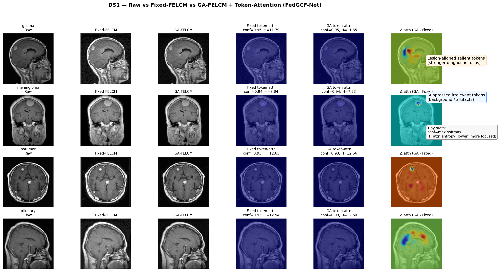
    


    
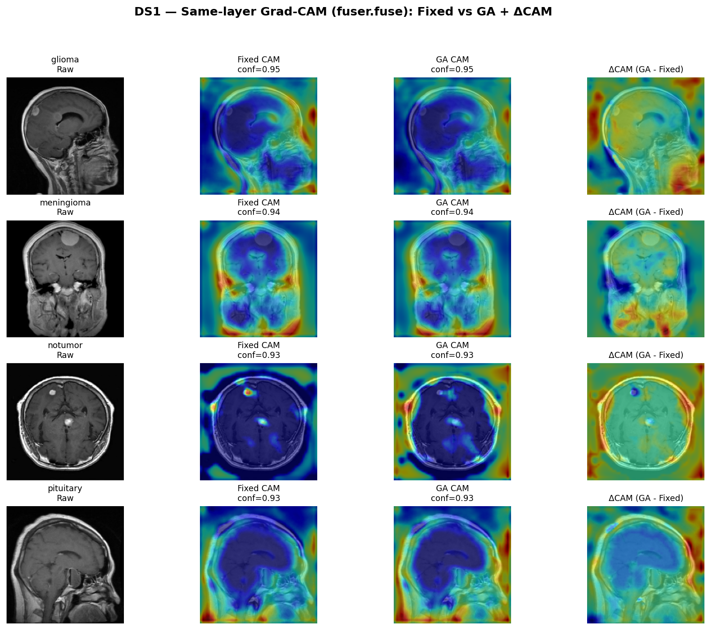
    


    
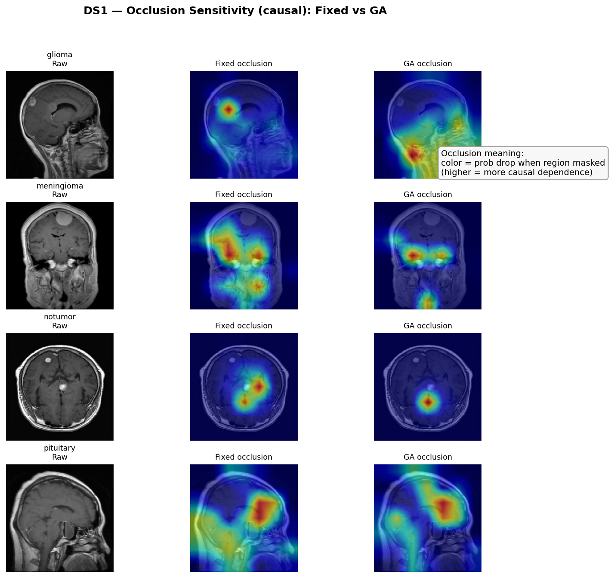
    


    
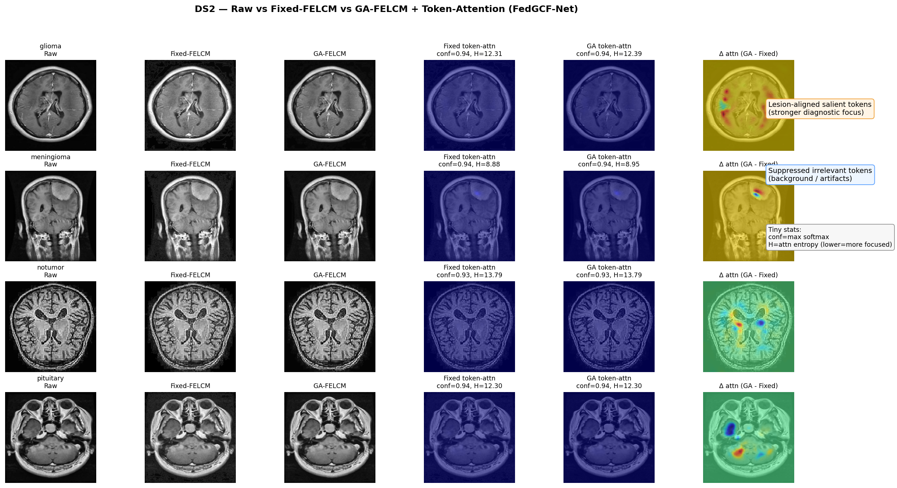
    


    
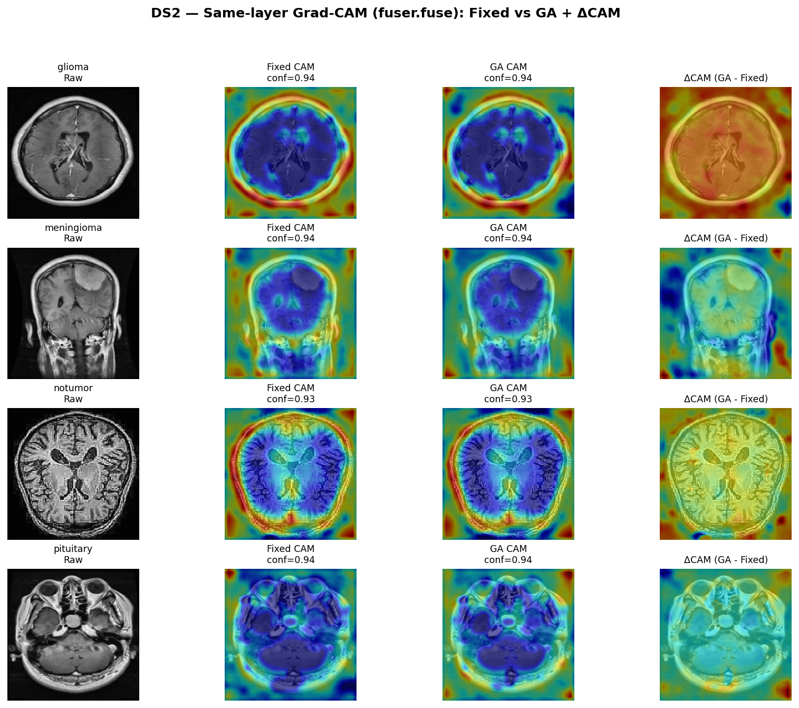
    


    
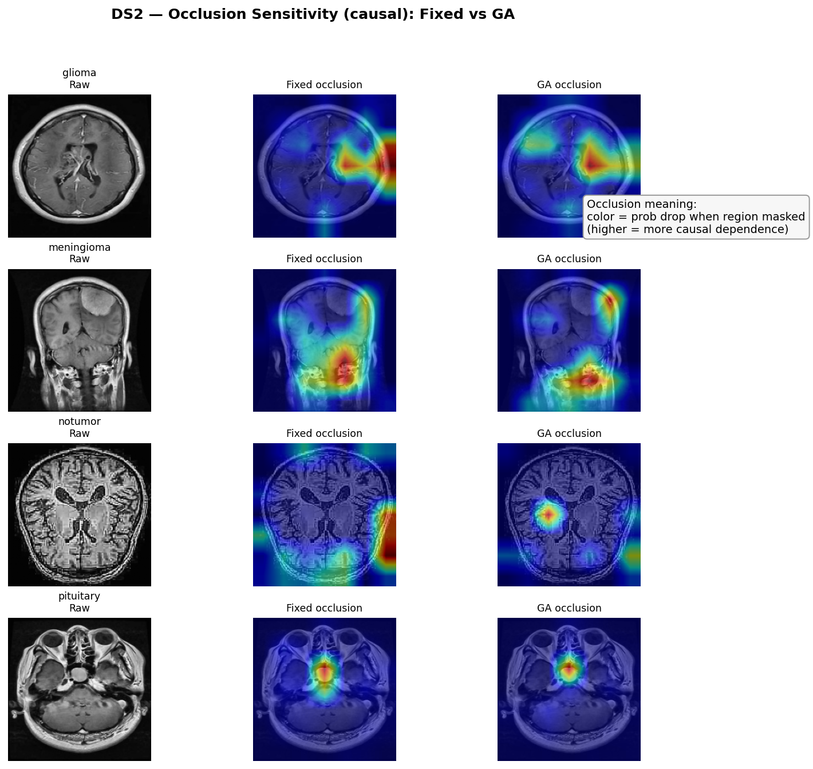
    


    
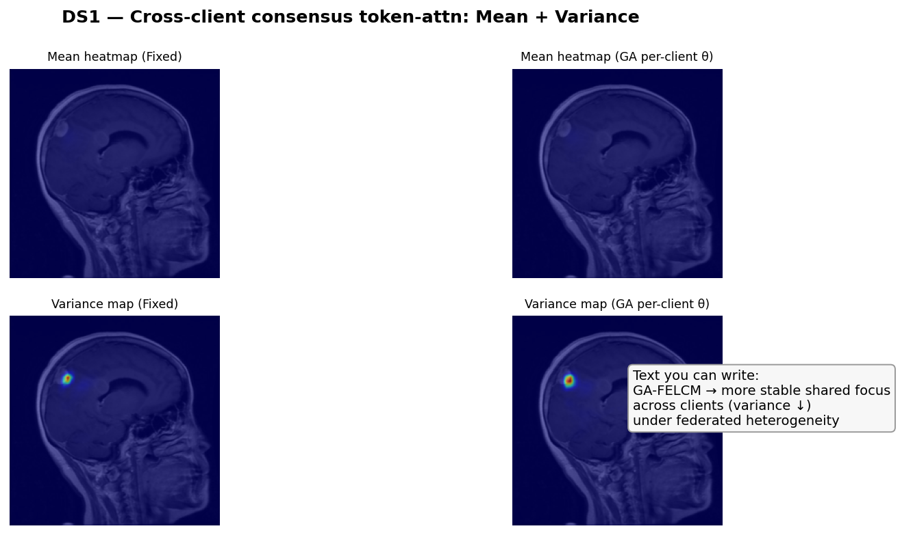
    


    
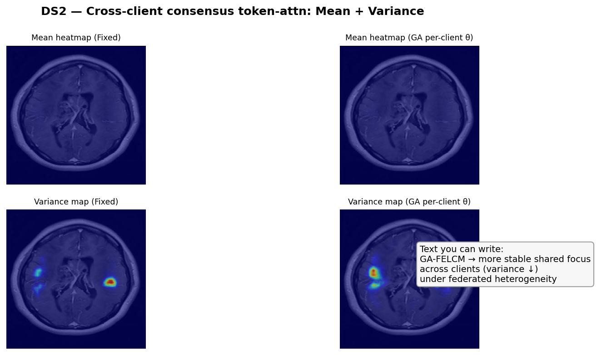
    


    ✅ Done. All figures shown inline. No files saved.
    


```python
# ============================================================
# FedGCF-Net — Dense XAI Figure Generator (NO SAVES)
# ✅ Uses: GA-FELCM + tri-gate conditioning + PVTv2-B2 + multi-scale fusion + token-attn pooling
# ✅ Plots (DS1 + DS2):
#   (1) Compact ConVLM-style: Raw | Fixed-FELCM | GA-FELCM | TokenAttn(Fixed) | TokenAttn(GA) | ΔAttn
#   (2) Compact Same-layer Grad-CAM: Raw | Fixed | GA | ΔCAM (diverging)
#   (3) Compact Occlusion (causal): Raw | Fixed | GA
#   (4) Combined Cross-client consensus: DS1 row + DS2 row (Mean/Var, Fixed vs GA)
#   (5) Flagship (combined): Preproc change + TokenAttn + GradCAM + Occlusion in ONE tight grid
#   (6) Optional Patch gallery: Top-K / Bottom-K attended patches (Fixed vs GA)
# ✅ Tight layout: minimal whitespace, no right-side comment boxes
# ============================================================

import os, random, math
import numpy as np
import pandas as pd
from PIL import Image

import torch
import torch.nn as nn
import torch.nn.functional as F

import matplotlib.pyplot as plt
from matplotlib import gridspec

# -------------------------
# Visual tightening (GLOBAL)
# -------------------------
plt.rcParams.update({
    "figure.dpi": 160,
    "axes.titlesize": 8,
    "axes.titlepad": 2,
    "axes.labelpad": 2,
})

# -------------------------
# Reproducibility + Device
# -------------------------
SEED = 42
random.seed(SEED)
np.random.seed(SEED)
torch.manual_seed(SEED)
if torch.cuda.is_available():
    torch.cuda.manual_seed_all(SEED)

DEVICE = torch.device("cuda" if torch.cuda.is_available() else "cpu")
print("DEVICE:", DEVICE)

# -------------------------
# timm (install if missing)
# -------------------------
try:
    import timm
except Exception:
    import sys, subprocess
    subprocess.check_call([sys.executable, "-m", "pip", "-q", "install", "timm"])
    import timm

from torchvision import transforms

IMG_EXTS = (".jpg",".jpeg",".png",".bmp",".tif",".tiff",".webp")

# ============================================================
# 0) Find + Load checkpoint (uploaded locally)
# ============================================================
CKPT_BASENAME = "FL_GAFELCM_PVTv2B2_FUSION_checkpoint.pth"

def find_checkpoint():
    fast = [
        CKPT_BASENAME,
        os.path.join("/content", CKPT_BASENAME),
        os.path.join("/mnt/data", CKPT_BASENAME),
        "/mnt/data/FL_GAFELCM_PVTv2B2_FUSION_checkpoint.pth",
    ]
    for p in fast:
        if os.path.exists(p):
            return p

    for root in ["/content", os.getcwd(), "/mnt/data"]:
        if os.path.isdir(root):
            for r, _, files in os.walk(root):
                if CKPT_BASENAME in files:
                    return os.path.join(r, CKPT_BASENAME)
    return None

CKPT_PATH = find_checkpoint()
if CKPT_PATH is None:
    raise FileNotFoundError(
        f"Checkpoint not found.\nUpload {CKPT_BASENAME} to Colab (Files panel) or put it in /content."
    )

ckpt = torch.load(CKPT_PATH, map_location="cpu")
print("Loaded checkpoint:", os.path.basename(CKPT_PATH))

CFG = ckpt.get("config", {})
labels = ckpt.get("labels", ["glioma", "meningioma", "notumor", "pituitary"])
label2id = ckpt.get("label2id", {l:i for i,l in enumerate(labels)})
id2label = ckpt.get("id2label", {i:l for l,i in label2id.items()})
NUM_CLASSES = len(labels)

CLIENTS_PER_DS = int(CFG.get("clients_per_dataset", 3))
CLIENTS_TOTAL  = int(CFG.get("clients_total", 6))
BACKBONE_NAME  = str(ckpt.get("backbone_name", CFG.get("backbone_name", "pvt_v2_b2")))

IMG_SIZE = int(CFG.get("img_size", 224))
if IMG_SIZE < 96:
    IMG_SIZE = 224

IMAGENET_MEAN = torch.tensor([0.485, 0.456, 0.406], device=DEVICE).view(1,3,1,1)
IMAGENET_STD  = torch.tensor([0.229, 0.224, 0.225], device=DEVICE).view(1,3,1,1)

EVAL_TFMS = transforms.Compose([
    transforms.Resize((IMG_SIZE, IMG_SIZE)),
    transforms.ToTensor(),
])

# ============================================================
# 1) Robust dataset root resolution (AUTO-FIND or kagglehub)
# ============================================================
REQ1 = {"512Glioma", "512Meningioma", "512Normal", "512Pituitary"}  # DS1 expected dirs
REQ2 = {"glioma", "meningioma", "notumor", "pituitary"}             # DS2 expected dirs

def find_root_with_required_class_dirs(base_dir, required_set, prefer_raw=True, max_walk=60000):
    if base_dir is None or (not os.path.isdir(base_dir)):
        return None
    candidates = []
    walked = 0
    for root, dirs, _ in os.walk(base_dir):
        walked += 1
        if walked > max_walk:
            break
        if required_set.issubset(set(dirs)):
            candidates.append(root)
    if not candidates:
        return None

    def score(p):
        pl = p.lower()
        sc = 0
        if prefer_raw:
            if "raw data" in pl: sc += 8
            if os.path.basename(p).lower() == "raw": sc += 8
            if "/raw/" in pl or "\\raw\\" in pl: sc += 4
            if "augmented" in pl: sc -= 30
        sc -= 0.0001 * len(p)  # slightly prefer shorter paths
        return sc

    return max(candidates, key=score)

def try_auto_locate_anywhere(required_set, prefer_raw):
    candidates = [
        "/content",
        "/content/data",
        "/content/datasets",
        "/kaggle/input",
        "/mnt",
        "/mnt/data",
        os.getcwd(),
    ]
    for base in candidates:
        r = find_root_with_required_class_dirs(base, required_set, prefer_raw=prefer_raw)
        if r is not None:
            return r
    return None

def ensure_kagglehub():
    try:
        import kagglehub
        return kagglehub
    except Exception:
        import sys, subprocess
        subprocess.check_call([sys.executable, "-m", "pip", "-q", "install", "kagglehub"])
        import kagglehub
        return kagglehub

def resolve_dataset_roots():
    ds1_root_ckpt = ckpt.get("dataset1_raw_root", None)
    ds2_root_ckpt = ckpt.get("dataset2_root", None)

    ds1_root = ds1_root_ckpt if (ds1_root_ckpt and os.path.isdir(ds1_root_ckpt)) else None
    ds2_root = ds2_root_ckpt if (ds2_root_ckpt and os.path.isdir(ds2_root_ckpt)) else None

    if ds1_root is None:
        ds1_root = try_auto_locate_anywhere(REQ1, prefer_raw=True)
    if ds2_root is None:
        ds2_root = try_auto_locate_anywhere(REQ2, prefer_raw=False)

    if ds1_root is None or ds2_root is None:
        try:
            kagglehub = ensure_kagglehub()
            ds2_base = kagglehub.dataset_download("yassinebazgour/preprocessed-brain-mri-scans-for-tumors-detection")
            ds1_base = kagglehub.dataset_download("orvile/pmram-bangladeshi-brain-cancer-mri-dataset")
            if ds1_root is None:
                ds1_root = find_root_with_required_class_dirs(ds1_base, REQ1, prefer_raw=True)
            if ds2_root is None:
                ds2_root = find_root_with_required_class_dirs(ds2_base, REQ2, prefer_raw=False)
        except Exception as e:
            print("⚠️ kagglehub download failed (often due to missing Kaggle token in Colab).")
            print("   Error:", str(e))

    return ds1_root, ds2_root

DS1_ROOT, DS2_ROOT = resolve_dataset_roots()
print("DS1_ROOT:", DS1_ROOT)
print("DS2_ROOT:", DS2_ROOT)

if DS1_ROOT is None or (not os.path.isdir(DS1_ROOT)):
    raise FileNotFoundError(
        "Could not locate DS1 root containing folders: "
        f"{sorted(list(REQ1))}\n"
        "Fix: ensure DS1 exists in runtime (or kagglehub works), then rerun."
    )
if DS2_ROOT is None or (not os.path.isdir(DS2_ROOT)):
    raise FileNotFoundError(
        "Could not locate DS2 root containing folders: "
        f"{sorted(list(REQ2))}\n"
        "Fix: ensure DS2 exists in runtime (or kagglehub works), then rerun."
    )

# ============================================================
# 2) GA-FELCM (EnhancedFELCM)
# ============================================================
class EnhancedFELCM(nn.Module):
    def __init__(self, gamma=1.0, alpha=0.35, beta=6.0, tau=2.5, blur_k=7, sharpen=0.0, denoise=0.0):
        super().__init__()
        self.gamma = float(gamma)
        self.alpha = float(alpha)
        self.beta  = float(beta)
        self.tau   = float(tau)
        self.blur_k = int(blur_k)
        self.sharpen = float(sharpen)
        self.denoise = float(denoise)

        lap = torch.tensor([[0, -1, 0], [-1, 4, -1], [0, -1, 0]], dtype=torch.float32)
        self.register_buffer("lap", lap.view(1, 1, 3, 3))

        sharp = torch.tensor([[0, -1, 0], [-1, 5, -1], [0, -1, 0]], dtype=torch.float32)
        self.register_buffer("sharp_kernel", sharp.view(1, 1, 3, 3))

    def forward(self, x):
        eps = 1e-6
        B, C, H, W = x.shape

        if self.denoise > 0:
            x_blur = F.avg_pool2d(F.pad(x, (1, 1, 1, 1), mode="reflect"), 3, 1)
            x = x * (1 - self.denoise) + x_blur * self.denoise

        mu = x.mean(dim=(2, 3), keepdim=True)
        sd = x.std(dim=(2, 3), keepdim=True).clamp_min(eps)
        x0 = (x - mu) / sd
        x0 = x0.clamp(-self.tau, self.tau)

        x1 = torch.sign(x0) * torch.pow(torch.abs(x0).clamp_min(eps), self.gamma)

        gray = x1.mean(dim=1, keepdim=True)
        lap = F.conv2d(F.pad(gray, (1, 1, 1, 1), mode="reflect"), self.lap)
        mag = lap.abs()

        k = self.blur_k if self.blur_k % 2 == 1 else self.blur_k + 1
        pad = k // 2
        blur = F.avg_pool2d(F.pad(mag, (pad, pad, pad, pad), mode="reflect"), k, 1)
        C_map = mag / (blur + eps)

        x2 = x1 + self.alpha * torch.tanh(self.beta * C_map)

        if self.sharpen > 0:
            outs = []
            for c in range(C):
                x_c = x2[:, c: c + 1, :, :]
                x_sharp = F.conv2d(F.pad(x_c, (1, 1, 1, 1), mode="reflect"), self.sharp_kernel)
                outs.append(x_c * (1 - self.sharpen) + x_sharp * self.sharpen)
            x2 = torch.cat(outs, dim=1)

        mn = x2.amin(dim=(2, 3), keepdim=True)
        mx = x2.amax(dim=(2, 3), keepdim=True)
        x3 = (x2 - mn) / (mx - mn + eps)
        return x3.clamp(0, 1)

def theta_to_module(theta):
    if theta is None:
        return EnhancedFELCM()
    g, a, b, t, k, sh, dn = theta
    return EnhancedFELCM(gamma=g, alpha=a, beta=b, tau=t, blur_k=int(k), sharpen=sh, denoise=dn)

def preproc_theta_vec(preproc_module, batch_size):
    theta = torch.tensor(
        [
            float(preproc_module.gamma),
            float(preproc_module.alpha),
            float(preproc_module.beta),
            float(preproc_module.tau),
            float(preproc_module.blur_k) / 7.0,
            float(preproc_module.sharpen),
            float(preproc_module.denoise),
        ],
        device=DEVICE,
        dtype=torch.float32,
    )
    return theta.unsqueeze(0).repeat(batch_size, 1)

fixed_pre = EnhancedFELCM().to(DEVICE).eval()
best_theta_ds1 = ckpt.get("best_theta_ds1", None)
best_theta_ds2 = ckpt.get("best_theta_ds2", None)
ga_pre_ds1 = theta_to_module(best_theta_ds1).to(DEVICE).eval()
ga_pre_ds2 = theta_to_module(best_theta_ds2).to(DEVICE).eval()

print("best_theta_ds1:", best_theta_ds1)
print("best_theta_ds2:", best_theta_ds2)

# ============================================================
# 3) FedGCF-Net model (PVTv2-B2 + fusion + tri-gate)
# ============================================================
class TokenAttentionPooling(nn.Module):
    def __init__(self, dim):
        super().__init__()
        self.query = nn.Linear(dim, 1)

    def forward(self, x_tokens):  # [B, HW, C]
        attn = torch.softmax(self.query(x_tokens).squeeze(-1), dim=1)  # [B, HW]
        pooled = (x_tokens * attn.unsqueeze(-1)).sum(dim=1)
        return pooled, attn

class MultiScaleFeatureFuser(nn.Module):
    def __init__(self, in_channels, out_dim):
        super().__init__()
        self.proj = nn.ModuleList([
            nn.Sequential(
                nn.Conv2d(c, out_dim, kernel_size=1, bias=False),
                nn.GroupNorm(8, out_dim),
                nn.GELU(),
            )
            for c in in_channels
        ])
        self.fuse = nn.Sequential(
            nn.Conv2d(out_dim, out_dim, kernel_size=3, padding=1, bias=False),
            nn.GroupNorm(8, out_dim),
            nn.GELU(),
        )
        self.pool = TokenAttentionPooling(out_dim)

class EnhancedBrainTuner(nn.Module):
    def __init__(self, dim, dropout=0.1):
        super().__init__()
        self.se = nn.Sequential(
            nn.Linear(dim, max(8, dim // 4)),
            nn.ReLU(inplace=True),
            nn.Linear(max(8, dim // 4), dim),
            nn.Sigmoid(),
        )
        self.refine = nn.Sequential(
            nn.LayerNorm(dim),
            nn.Linear(dim, dim),
            nn.GELU(),
            nn.Dropout(dropout),
            nn.Linear(dim, dim),
        )
        self.gate = nn.Parameter(torch.ones(2) / 2)

    def forward(self, x):
        gate = F.softmax(self.gate, dim=0)
        out1 = x * self.se(x)
        out2 = x + 0.2 * self.refine(x)
        return gate[0] * out1 + gate[1] * out2

class PVTv2B2_MultiScale(nn.Module):
    def __init__(self, num_classes, head_dropout=0.3, cond_dim=128, num_clients=6):
        super().__init__()
        self.backbone = timm.create_model(
            BACKBONE_NAME,
            pretrained=False,
            features_only=True,
            out_indices=(0,1,2,3),
        )
        in_channels = self.backbone.feature_info.channels()
        out_dim = max(256, in_channels[-1] // 2)

        self.fuser = MultiScaleFeatureFuser(in_channels, out_dim)
        self.tuner = EnhancedBrainTuner(out_dim, dropout=0.1)

        self.classifier = nn.Sequential(
            nn.LayerNorm(out_dim),
            nn.Dropout(head_dropout),
            nn.Linear(out_dim, max(64, out_dim // 2)),
            nn.GELU(),
            nn.Dropout(head_dropout * 0.5),
            nn.Linear(max(64, out_dim // 2), num_classes),
        )

        self.theta_mlp = nn.Sequential(
            nn.Linear(7, cond_dim),
            nn.GELU(),
            nn.Linear(cond_dim, cond_dim),
        )
        self.source_emb = nn.Embedding(2, cond_dim)
        self.client_emb = nn.Embedding(num_clients, cond_dim)
        self.cond_norm = nn.LayerNorm(cond_dim)

        self.gate_early = nn.Linear(cond_dim, 3)
        self.gate_mid   = nn.Linear(cond_dim, out_dim)
        self.gate_late  = nn.Linear(cond_dim, out_dim)

    def _cond_vec(self, theta_vec, source_id, client_id):
        cond = self.theta_mlp(theta_vec)
        cond = cond + self.source_emb(source_id) + self.client_emb(client_id)
        return self.cond_norm(cond)

model = PVTv2B2_MultiScale(
    num_classes=NUM_CLASSES,
    head_dropout=float(CFG.get("head_dropout", 0.3)),
    cond_dim=int(CFG.get("cond_dim", 128)),
    num_clients=CLIENTS_TOTAL,
).to(DEVICE).eval()

sd = ckpt.get("state_dict", None)
if sd is None:
    raise RuntimeError("Checkpoint missing state_dict.")
model.load_state_dict(sd, strict=True)
print("✅ Model weights loaded (strict=True).")

# ============================================================
# 4) Build sample-per-class for DS1 and DS2 (ALL 4 classes)
# ============================================================
DS1_CLASS_DIRS = {
    "glioma": "512Glioma",
    "meningioma": "512Meningioma",
    "notumor": "512Normal",
    "pituitary": "512Pituitary",
}
DS2_CLASS_DIRS = {
    "glioma": "glioma",
    "meningioma": "meningioma",
    "notumor": "notumor",
    "pituitary": "pituitary",
}

def list_images_under_class_root(class_root, class_dir_name):
    class_dir = os.path.join(class_root, class_dir_name)
    out = []
    if not os.path.isdir(class_dir):
        return out
    for r, _, files in os.walk(class_dir):
        for fn in files:
            if fn.lower().endswith(IMG_EXTS):
                out.append(os.path.join(r, fn))
    return out

def pick_one_per_class_from_root(ds_root, class_dirs_map, seed=SEED):
    rng = random.Random(seed)
    samples = {}
    for lab in labels:
        dir_name = class_dirs_map[lab]
        imgs = list_images_under_class_root(ds_root, dir_name)
        if len(imgs) == 0:
            samples[lab] = None
        else:
            samples[lab] = rng.choice(imgs)
    return samples

def fill_missing_samples(ds_root, class_dirs_map, samples, tries=8):
    for t in range(tries):
        if all(samples[l] is not None for l in labels):
            return samples
        samples2 = pick_one_per_class_from_root(ds_root, class_dirs_map, seed=SEED + 100 + t)
        for l in labels:
            if samples[l] is None:
                samples[l] = samples2[l]
    return samples

ds1_samples = fill_missing_samples(DS1_ROOT, DS1_CLASS_DIRS, pick_one_per_class_from_root(DS1_ROOT, DS1_CLASS_DIRS, seed=SEED))
ds2_samples = fill_missing_samples(DS2_ROOT, DS2_CLASS_DIRS, pick_one_per_class_from_root(DS2_ROOT, DS2_CLASS_DIRS, seed=SEED+7))

if any(ds1_samples[l] is None for l in labels):
    raise RuntimeError("DS1: Could not find at least 1 image for every class folder.")
if any(ds2_samples[l] is None for l in labels):
    raise RuntimeError("DS2: Could not find at least 1 image for every class folder.")

def load_rgb(path):
    try:
        return Image.open(path).convert("RGB")
    except Exception:
        return Image.new("RGB", (IMG_SIZE, IMG_SIZE), (128,128,128))

print("DS1 samples:")
for k,v in ds1_samples.items(): print(" ", k, "->", v)
print("DS2 samples:")
for k,v in ds2_samples.items(): print(" ", k, "->", v)

# ============================================================
# 5) Internals extraction: fuser conv map + token-attn map
# ============================================================
def fuser_conv_pooled_attn(fuser, feats):
    proj_feats = [p(f) for p, f in zip(fuser.proj, feats)]
    x = proj_feats[-1]
    for f in reversed(proj_feats[:-1]):
        x = F.interpolate(x, size=f.shape[-2:], mode="bilinear", align_corners=False)
        x = x + f
    x = fuser.fuse(x)  # [B,C,H,W]
    B, C, H, W = x.shape
    tokens = x.flatten(2).transpose(1, 2)  # [B,HW,C]
    pooled, attn = fuser.pool(tokens)       # pooled [B,C], attn [B,HW]
    attn_map = attn.view(B, H, W)
    return x, pooled, attn_map

def attn_entropy(attn_map_2d):
    p = attn_map_2d.flatten().clamp(1e-9, 1.0)
    p = p / p.sum()
    return float(-(p * torch.log2(p)).sum().item())

# ============================================================
# 6) Forward functions (TokenAttn / GradCAM / Occlusion)
# ============================================================
@torch.no_grad()
def run_token_attn_only(x01, preproc, source_id, client_id):
    x01 = x01.to(DEVICE)
    x_fel = preproc(x01).clamp(0,1)

    x_raw_n = (x01 - IMAGENET_MEAN) / IMAGENET_STD
    x_fel_n = (x_fel - IMAGENET_MEAN) / IMAGENET_STD

    theta_vec = preproc_theta_vec(preproc, batch_size=1)
    sid = torch.tensor([source_id], device=DEVICE, dtype=torch.long)
    cid = torch.tensor([client_id], device=DEVICE, dtype=torch.long)

    cond = model._cond_vec(theta_vec, sid, cid)

    g0 = torch.sigmoid(model.gate_early(cond)).view(-1,3,1,1)
    xmix = (1-g0)*x_raw_n + g0*x_fel_n

    feats0 = model.backbone(xmix)
    _, f0, att0 = fuser_conv_pooled_attn(model.fuser, feats0)

    feats1 = model.backbone(x_fel_n)
    _, f1, _ = fuser_conv_pooled_attn(model.fuser, feats1)

    g1 = torch.sigmoid(model.gate_mid(cond))
    f_mid = (1-g1)*f0 + g1*f1

    t0 = model.tuner(f0)
    t1 = model.tuner(f1)
    t_mid = model.tuner(f_mid)

    t_views = 0.5*(t0+t1)
    g2 = torch.sigmoid(model.gate_late(cond))
    t_final = (1-g2)*t_mid + g2*t_views

    logits = model.classifier(t_final)
    prob = torch.softmax(logits, dim=1)[0]
    conf = float(prob.max().item())
    pred = int(prob.argmax().item())

    return {
        "attn_map": att0[0].detach().cpu(),  # [h,w]
        "conf": conf,
        "pred": pred,
    }

def gradcam_same_layer(x01, preproc, source_id, client_id, target_class=None):
    model.eval()
    preproc.eval()

    x01 = x01.to(DEVICE)
    x_fel = preproc(x01).clamp(0,1)

    x_raw_n = (x01 - IMAGENET_MEAN) / IMAGENET_STD
    x_fel_n = (x_fel - IMAGENET_MEAN) / IMAGENET_STD

    theta_vec = preproc_theta_vec(preproc, batch_size=1)
    sid = torch.tensor([source_id], device=DEVICE, dtype=torch.long)
    cid = torch.tensor([client_id], device=DEVICE, dtype=torch.long)

    model.zero_grad(set_to_none=True)

    with torch.enable_grad():
        cond = model._cond_vec(theta_vec, sid, cid)

        g0 = torch.sigmoid(model.gate_early(cond)).view(-1,3,1,1)
        xmix = (1-g0)*x_raw_n + g0*x_fel_n

        feats0 = model.backbone(xmix)
        conv0, f0, _ = fuser_conv_pooled_attn(model.fuser, feats0)
        conv0.retain_grad()

        feats1 = model.backbone(x_fel_n)
        _, f1, _ = fuser_conv_pooled_attn(model.fuser, feats1)

        g1 = torch.sigmoid(model.gate_mid(cond))
        f_mid = (1-g1)*f0 + g1*f1

        t0 = model.tuner(f0)
        t1 = model.tuner(f1)
        t_mid = model.tuner(f_mid)

        t_views = 0.5*(t0+t1)
        g2 = torch.sigmoid(model.gate_late(cond))
        t_final = (1-g2)*t_mid + g2*t_views

        logits = model.classifier(t_final)
        prob = torch.softmax(logits, dim=1)[0]
        pred = int(prob.argmax().item())
        if target_class is None:
            target_class = pred

        logits[0, target_class].backward()

        grad = conv0.grad[0]       # [C,h,w]
        act  = conv0.detach()[0]   # [C,h,w]
        w = grad.mean(dim=(1,2), keepdim=True)
        cam = torch.relu((w * act).sum(dim=0))
        cam = cam - cam.min()
        cam = cam / (cam.max() + 1e-9)

        conf = float(prob.max().item())
        return cam.detach().cpu(), conf, pred, int(target_class)

@torch.no_grad()
def forward_prob_of_class(x01, preproc, source_id, client_id, target_class):
    x01 = x01.to(DEVICE)
    x_fel = preproc(x01).clamp(0,1)

    x_raw_n = (x01 - IMAGENET_MEAN) / IMAGENET_STD
    x_fel_n = (x_fel - IMAGENET_MEAN) / IMAGENET_STD

    theta_vec = preproc_theta_vec(preproc, batch_size=1)
    sid = torch.tensor([source_id], device=DEVICE, dtype=torch.long)
    cid = torch.tensor([client_id], device=DEVICE, dtype=torch.long)

    cond = model._cond_vec(theta_vec, sid, cid)

    g0 = torch.sigmoid(model.gate_early(cond)).view(-1,3,1,1)
    xmix = (1-g0)*x_raw_n + g0*x_fel_n

    feats0 = model.backbone(xmix)
    _, f0, _ = fuser_conv_pooled_attn(model.fuser, feats0)

    feats1 = model.backbone(x_fel_n)
    _, f1, _ = fuser_conv_pooled_attn(model.fuser, feats1)

    g1 = torch.sigmoid(model.gate_mid(cond))
    f_mid = (1-g1)*f0 + g1*f1

    t0 = model.tuner(f0)
    t1 = model.tuner(f1)
    t_mid = model.tuner(f_mid)

    t_views = 0.5*(t0+t1)
    g2 = torch.sigmoid(model.gate_late(cond))
    t_final = (1-g2)*t_mid + g2*t_views

    logits = model.classifier(t_final)
    prob = torch.softmax(logits, dim=1)[0]
    return float(prob[target_class].item())

@torch.no_grad()
def occlusion_sensitivity_map(x01, preproc, source_id, client_id, patch=32, stride=32, target_class=None):
    x01 = x01.to(DEVICE)

    # baseline predicted class if none
    if target_class is None:
        # quick baseline forward using target = argmax
        x_fel = preproc(x01).clamp(0,1)
        x_raw_n = (x01 - IMAGENET_MEAN) / IMAGENET_STD
        x_fel_n = (x_fel - IMAGENET_MEAN) / IMAGENET_STD
        theta_vec = preproc_theta_vec(preproc, batch_size=1)
        sid = torch.tensor([source_id], device=DEVICE, dtype=torch.long)
        cid = torch.tensor([client_id], device=DEVICE, dtype=torch.long)
        cond = model._cond_vec(theta_vec, sid, cid)
        g0 = torch.sigmoid(model.gate_early(cond)).view(-1,3,1,1)
        xmix = (1-g0)*x_raw_n + g0*x_fel_n
        feats0 = model.backbone(xmix)
        _, f0, _ = fuser_conv_pooled_attn(model.fuser, feats0)
        feats1 = model.backbone(x_fel_n)
        _, f1, _ = fuser_conv_pooled_attn(model.fuser, feats1)
        g1 = torch.sigmoid(model.gate_mid(cond))
        f_mid = (1-g1)*f0 + g1*f1
        t0 = model.tuner(f0)
        t1 = model.tuner(f1)
        t_mid = model.tuner(f_mid)
        t_views = 0.5*(t0+t1)
        g2 = torch.sigmoid(model.gate_late(cond))
        t_final = (1-g2)*t_mid + g2*t_views
        logits = model.classifier(t_final)
        prob = torch.softmax(logits, dim=1)[0]
        target_class = int(prob.argmax().item())

    base_p = forward_prob_of_class(x01, preproc, source_id, client_id, target_class)

    _, _, H, W = x01.shape
    ys = list(range(0, H, stride))
    xs = list(range(0, W, stride))
    grid = np.zeros((len(ys), len(xs)), dtype=np.float32)

    for iy, y0 in enumerate(ys):
        for ix, x0p in enumerate(xs):
            x_mask = x01.clone()
            y1 = min(H, y0 + patch)
            x1 = min(W, x0p + patch)
            x_mask[:, :, y0:y1, x0p:x1] = 0.0
            p_m = forward_prob_of_class(x_mask, preproc, source_id, client_id, target_class)
            grid[iy, ix] = max(0.0, base_p - p_m)

    if grid.max() > 1e-9:
        grid = grid / grid.max()
    return grid

# ============================================================
# 7) Visualization helpers (better color spread; less "tiny red")
# ============================================================
def to_gray_np(x01_1x3):
    g = x01_1x3[0].mean(dim=0).detach().cpu().numpy()
    return np.clip(g, 0, 1)

def upsample_map(m, out_hw):
    if isinstance(m, np.ndarray):
        t = torch.tensor(m)[None,None,:,:].float()
    else:
        t = m[None,None,:,:].float()
    t2 = F.interpolate(t, size=out_hw, mode="bilinear", align_corners=False)[0,0]
    return t2.detach().cpu().numpy()

def normalize_map(m, pmin=5, pmax=99, power=0.9):
    """Percentile clip + rescale; power<1 spreads high values (more visible red area)."""
    x = np.array(m, dtype=np.float32)
    lo = np.percentile(x, pmin)
    hi = np.percentile(x, pmax)
    x = np.clip(x, lo, hi)
    x = (x - x.min()) / (x.max() - x.min() + 1e-9)
    if power != 1.0:
        x = np.power(x, power)
    return np.clip(x, 0, 1)

def overlay_heat(gray, heat01, alpha=0.65, cmap="jet"):
    gray3 = np.stack([gray,gray,gray], axis=-1)
    cm = plt.get_cmap(cmap)
    heat3 = cm(np.clip(heat01,0,1))[...,:3]
    out = (1-alpha)*gray3 + alpha*heat3
    return np.clip(out, 0, 1)

def show(ax, img, title=None, cmap=None):
    ax.imshow(img, cmap=cmap)
    ax.set_xticks([]); ax.set_yticks([])
    ax.set_frame_on(False)
    if title is not None:
        ax.set_title(title)

def tight_show(fig, pad=0.001):
    plt.subplots_adjust(left=pad, right=1-pad, top=1-pad, bottom=pad, wspace=0.0, hspace=0.0)
    plt.show()

# ============================================================
# 8) Dense plot functions (NO right-side comment boxes)
# ============================================================
def plot_main_convlm_dense(ds_name, sample_map, source_id, rep_client_id, pre_ga,
                           pmin=5, pmax=99, power=0.9):
    rows, cols = NUM_CLASSES, 6
    fig = plt.figure(figsize=(cols*2.05, rows*2.05))
    gs = gridspec.GridSpec(rows, cols, figure=fig, wspace=0.003, hspace=0.01)

    col_titles = ["Raw", "Fixed-FELCM", "GA-FELCM", "TokAttn(Fixed)", "TokAttn(GA)", "ΔAttn(GA-Fixed)"]

    for r, lab in enumerate(labels):
        x = EVAL_TFMS(load_rgb(sample_map[lab])).unsqueeze(0)
        gray = to_gray_np(x)

        with torch.no_grad():
            x_fixed = fixed_pre(x.to(DEVICE)).clamp(0,1).cpu()
            x_ga    = pre_ga(x.to(DEVICE)).clamp(0,1).cpu()

        gray_fixed = to_gray_np(x_fixed)
        gray_ga    = to_gray_np(x_ga)

        out_fixed = run_token_attn_only(x, fixed_pre, source_id, rep_client_id)
        out_ga    = run_token_attn_only(x, pre_ga,    source_id, rep_client_id)

        att_fixed_u = normalize_map(upsample_map(out_fixed["attn_map"], (IMG_SIZE, IMG_SIZE)), pmin, pmax, power)
        att_ga_u    = normalize_map(upsample_map(out_ga["attn_map"],    (IMG_SIZE, IMG_SIZE)), pmin, pmax, power)

        ov_fixed = overlay_heat(gray_fixed, att_fixed_u, alpha=0.68, cmap="jet")
        ov_ga    = overlay_heat(gray_ga,    att_ga_u,    alpha=0.68, cmap="jet")

        # Diverging delta (no overlay, clearer positive/negative)
        delta = att_ga_u - att_fixed_u
        dscale = np.percentile(np.abs(delta), 99) + 1e-9
        delta = np.clip(delta, -dscale, dscale)

        imgs = [
            gray,
            gray_fixed,
            gray_ga,
            ov_fixed,
            ov_ga,
            delta,
        ]

        for c in range(cols):
            ax = fig.add_subplot(gs[r,c])
            if c == 5:
                show(ax, imgs[c], title=(col_titles[c] if r==0 else None), cmap="coolwarm")
            else:
                show(ax, imgs[c], title=(col_titles[c] if r==0 else None), cmap=None)

            # row label (compact): add only on first column
            if c == 0:
                ax.text(-0.02, 0.5, lab, transform=ax.transAxes,
                        ha="right", va="center", fontsize=9, fontweight="bold")

            # tiny stats (inside image; no extra space)
            if c == 3:
                H = attn_entropy(torch.tensor(att_fixed_u))
                ax.text(0.02, 0.98, f"conf={out_fixed['conf']:.2f}  H={H:.2f}",
                        transform=ax.transAxes, ha="left", va="top",
                        fontsize=7, bbox=dict(boxstyle="round,pad=0.2", fc=(1,1,1,0.55), ec=(0,0,0,0)))
            if c == 4:
                H = attn_entropy(torch.tensor(att_ga_u))
                ax.text(0.02, 0.98, f"conf={out_ga['conf']:.2f}  H={H:.2f}",
                        transform=ax.transAxes, ha="left", va="top",
                        fontsize=7, bbox=dict(boxstyle="round,pad=0.2", fc=(1,1,1,0.55), ec=(0,0,0,0)))

    fig.suptitle(f"{ds_name.upper()} — Raw vs Fixed vs GA + Token-Attn (FedGCF-Net)", y=0.995, fontsize=11, fontweight="bold")
    tight_show(fig, pad=0.002)

def plot_gradcam_dense(ds_name, sample_map, source_id, rep_client_id, pre_ga,
                       pmin=5, pmax=99, power=0.95):
    rows, cols = NUM_CLASSES, 4
    fig = plt.figure(figsize=(cols*2.05, rows*2.05))
    gs = gridspec.GridSpec(rows, cols, figure=fig, wspace=0.003, hspace=0.01)

    col_titles = ["Raw", "GradCAM(Fixed)", "GradCAM(GA)", "ΔCAM(GA-Fixed)"]

    for r, lab in enumerate(labels):
        x = EVAL_TFMS(load_rgb(sample_map[lab])).unsqueeze(0)
        gray = to_gray_np(x)
        target = label2id[lab]

        cam_f, conf_f, _, _ = gradcam_same_layer(x, fixed_pre, source_id, rep_client_id, target_class=target)
        cam_g, conf_g, _, _ = gradcam_same_layer(x, pre_ga,    source_id, rep_client_id, target_class=target)

        cam_f_u = normalize_map(upsample_map(cam_f, (IMG_SIZE, IMG_SIZE)), pmin, pmax, power)
        cam_g_u = normalize_map(upsample_map(cam_g, (IMG_SIZE, IMG_SIZE)), pmin, pmax, power)

        ov_f = overlay_heat(gray, cam_f_u, alpha=0.68, cmap="jet")
        ov_g = overlay_heat(gray, cam_g_u, alpha=0.68, cmap="jet")

        delta = cam_g_u - cam_f_u
        dscale = np.percentile(np.abs(delta), 99) + 1e-9
        delta = np.clip(delta, -dscale, dscale)

        imgs = [gray, ov_f, ov_g, delta]

        for c in range(cols):
            ax = fig.add_subplot(gs[r,c])
            if c == 3:
                show(ax, imgs[c], title=(col_titles[c] if r==0 else None), cmap="coolwarm")
            else:
                show(ax, imgs[c], title=(col_titles[c] if r==0 else None), cmap=None)

            if c == 0:
                ax.text(-0.02, 0.5, lab, transform=ax.transAxes,
                        ha="right", va="center", fontsize=9, fontweight="bold")

            if c == 1:
                ax.text(0.02, 0.98, f"conf={conf_f:.2f}",
                        transform=ax.transAxes, ha="left", va="top",
                        fontsize=7, bbox=dict(boxstyle="round,pad=0.2", fc=(1,1,1,0.55), ec=(0,0,0,0)))
            if c == 2:
                ax.text(0.02, 0.98, f"conf={conf_g:.2f}",
                        transform=ax.transAxes, ha="left", va="top",
                        fontsize=7, bbox=dict(boxstyle="round,pad=0.2", fc=(1,1,1,0.55), ec=(0,0,0,0)))

    fig.suptitle(f"{ds_name.upper()} — Same-layer Grad-CAM (fuser.fuse): Fixed vs GA", y=0.995, fontsize=11, fontweight="bold")
    tight_show(fig, pad=0.002)

def plot_occlusion_dense(ds_name, sample_map, source_id, rep_client_id, pre_ga,
                         patch=32, stride=32, pmin=5, pmax=99, power=0.95):
    rows, cols = NUM_CLASSES, 3
    fig = plt.figure(figsize=(cols*2.05, rows*2.05))
    gs = gridspec.GridSpec(rows, cols, figure=fig, wspace=0.003, hspace=0.01)

    col_titles = ["Raw", "Occlusion(Fixed)", "Occlusion(GA)"]

    for r, lab in enumerate(labels):
        x = EVAL_TFMS(load_rgb(sample_map[lab])).unsqueeze(0)
        gray = to_gray_np(x)
        target = label2id[lab]

        occ_f = occlusion_sensitivity_map(x, fixed_pre, source_id, rep_client_id, patch=patch, stride=stride, target_class=target)
        occ_g = occlusion_sensitivity_map(x, pre_ga,    source_id, rep_client_id, patch=patch, stride=stride, target_class=target)

        occ_f_u = normalize_map(upsample_map(occ_f, (IMG_SIZE, IMG_SIZE)), pmin, pmax, power)
        occ_g_u = normalize_map(upsample_map(occ_g, (IMG_SIZE, IMG_SIZE)), pmin, pmax, power)

        ov_f = overlay_heat(gray, occ_f_u, alpha=0.68, cmap="jet")
        ov_g = overlay_heat(gray, occ_g_u, alpha=0.68, cmap="jet")

        imgs = [gray, ov_f, ov_g]

        for c in range(cols):
            ax = fig.add_subplot(gs[r,c])
            show(ax, imgs[c], title=(col_titles[c] if r==0 else None), cmap=None)
            if c == 0:
                ax.text(-0.02, 0.5, lab, transform=ax.transAxes,
                        ha="right", va="center", fontsize=9, fontweight="bold")

    fig.suptitle(f"{ds_name.upper()} — Occlusion Sensitivity (causal): Fixed vs GA", y=0.995, fontsize=11, fontweight="bold")
    tight_show(fig, pad=0.002)

# ============================================================
# 9) Cross-client consensus (Mean + Variance) — COMBINED DS1+DS2
# ============================================================
def build_local_history_df(ckpt):
    h = ckpt.get("history_local", None)
    if h is None or not isinstance(h, dict) or len(h) == 0:
        return None
    try:
        return pd.DataFrame(h)
    except Exception:
        return None

loc_df = build_local_history_df(ckpt)

def theta_from_row(row):
    return (
        float(row["gamma_power"]),
        float(row["alpha_contrast_weight"]),
        float(row["beta_contrast_sharpness"]),
        float(row["tau_clip"]),
        int(round(float(row["k_blur_kernel_size"]))),
        float(row["sh_sharpen_strength"]),
        float(row["dn_denoise_strength"]),
    )

def collect_client_thetas_for_round(ds_name, round_pick):
    out = {}
    if loc_df is None:
        return out
    sub = loc_df[loc_df["dataset"] == ds_name].copy()
    if len(sub) == 0:
        return out
    sub["round_num"] = pd.to_numeric(sub["round"], errors="coerce")
    rounds_avail = sorted(sub["round_num"].dropna().unique().tolist())
    if not rounds_avail:
        return out
    if round_pick not in rounds_avail:
        round_pick = int(max(rounds_avail))
    sub = sub[sub["round_num"] == round_pick]

    needed = ["gamma_power","alpha_contrast_weight","beta_contrast_sharpness","tau_clip",
              "k_blur_kernel_size","sh_sharpen_strength","dn_denoise_strength"]

    for _, r in sub.iterrows():
        cstr = str(r.get("client",""))
        if "client_" not in cstr:
            continue
        cid = int(cstr.split("client_")[-1])
        if any(pd.isna(r.get(k, np.nan)) for k in needed):
            continue
        out[cid] = theta_from_row(r)
    return out

@torch.no_grad()
def consensus_maps(ds_name, sample_path, source_id, client_ids, round_pick, fallback_theta):
    x = EVAL_TFMS(load_rgb(sample_path)).unsqueeze(0)
    gray = to_gray_np(x)

    thetas = collect_client_thetas_for_round(ds_name, round_pick)
    if not thetas:
        thetas = {cid: fallback_theta for cid in client_ids}

    fixed_maps, ga_maps = [], []
    for cid in client_ids:
        out_f = run_token_attn_only(x, fixed_pre, source_id, cid)
        fixed_maps.append(out_f["attn_map"].numpy())

        th = thetas.get(cid, fallback_theta)
        pre_c = theta_to_module(th).to(DEVICE).eval()
        out_g = run_token_attn_only(x, pre_c, source_id, cid)
        ga_maps.append(out_g["attn_map"].numpy())

    fixed_maps = np.stack(fixed_maps, axis=0)
    ga_maps    = np.stack(ga_maps, axis=0)

    mean_f = fixed_maps.mean(axis=0)
    var_f  = fixed_maps.var(axis=0)
    mean_g = ga_maps.mean(axis=0)
    var_g  = ga_maps.var(axis=0)

    # normalize variance within each (for visibility)
    var_f = var_f / (var_f.max() + 1e-9)
    var_g = var_g / (var_g.max() + 1e-9)

    mean_f_u = normalize_map(upsample_map(mean_f, (IMG_SIZE, IMG_SIZE)), 5, 99, 0.95)
    mean_g_u = normalize_map(upsample_map(mean_g, (IMG_SIZE, IMG_SIZE)), 5, 99, 0.95)
    var_f_u  = normalize_map(upsample_map(var_f,  (IMG_SIZE, IMG_SIZE)), 5, 99, 0.95)
    var_g_u  = normalize_map(upsample_map(var_g,  (IMG_SIZE, IMG_SIZE)), 5, 99, 0.95)

    ov_mean_f = overlay_heat(gray, mean_f_u, alpha=0.68, cmap="jet")
    ov_mean_g = overlay_heat(gray, mean_g_u, alpha=0.68, cmap="jet")
    ov_var_f  = overlay_heat(gray, var_f_u,  alpha=0.68, cmap="jet")
    ov_var_g  = overlay_heat(gray, var_g_u,  alpha=0.68, cmap="jet")

    return ov_mean_f, ov_mean_g, ov_var_f, ov_var_g

def plot_consensus_combined(ds1_path, ds2_path, round_pick):
    ds1_client_ids = list(range(0, CLIENTS_PER_DS))                 # 0,1,2
    ds2_client_ids = list(range(CLIENTS_PER_DS, 2*CLIENTS_PER_DS))  # 3,4,5

    fallback_ds1 = best_theta_ds1 if best_theta_ds1 is not None else (1.0,0.35,6.0,2.5,7,0.0,0.0)
    fallback_ds2 = best_theta_ds2 if best_theta_ds2 is not None else (1.0,0.35,6.0,2.5,7,0.0,0.0)

    ds1_mf, ds1_mg, ds1_vf, ds1_vg = consensus_maps(
        "ds1", ds1_path, source_id=0, client_ids=ds1_client_ids,
        round_pick=round_pick, fallback_theta=fallback_ds1
    )
    ds2_mf, ds2_mg, ds2_vf, ds2_vg = consensus_maps(
        "ds2", ds2_path, source_id=1, client_ids=ds2_client_ids,
        round_pick=round_pick, fallback_theta=fallback_ds2
    )

    fig = plt.figure(figsize=(4*2.05, 2*2.05))
    gs = gridspec.GridSpec(2, 4, figure=fig, wspace=0.003, hspace=0.01)

    titles = ["Mean(Fixed)", "Mean(GA θ)", "Var(Fixed)", "Var(GA θ)"]
    ds1_imgs = [ds1_mf, ds1_mg, ds1_vf, ds1_vg]
    ds2_imgs = [ds2_mf, ds2_mg, ds2_vf, ds2_vg]

    for c in range(4):
        ax = fig.add_subplot(gs[0,c])
        show(ax, ds1_imgs[c], title=titles[c], cmap=None)
        if c == 0:
            ax.text(-0.02, 0.5, "DS1", transform=ax.transAxes,
                    ha="right", va="center", fontsize=10, fontweight="bold")

    for c in range(4):
        ax = fig.add_subplot(gs[1,c])
        show(ax, ds2_imgs[c], title=None, cmap=None)
        if c == 0:
            ax.text(-0.02, 0.5, "DS2", transform=ax.transAxes,
                    ha="right", va="center", fontsize=10, fontweight="bold")

    fig.suptitle("Cross-client consensus (Token-Attn): Mean + Variance — Fixed vs GA", y=0.995, fontsize=11, fontweight="bold")
    tight_show(fig, pad=0.002)

# ============================================================
# 10) Flagship (combined) — ONE strong figure per dataset
#     Rows: (Preproc change) + (TokenAttn) + (GradCAM/Occlusion)
# ============================================================
def plot_flagship_dense(ds_name, sample_path, source_id, rep_client_id, pre_ga,
                        patch=32, stride=32):
    x = EVAL_TFMS(load_rgb(sample_path)).unsqueeze(0)
    gray = to_gray_np(x)

    with torch.no_grad():
        x_fixed = fixed_pre(x.to(DEVICE)).clamp(0,1).cpu()
        x_ga    = pre_ga(x.to(DEVICE)).clamp(0,1).cpu()

    g_fixed = to_gray_np(x_fixed)
    g_ga    = to_gray_np(x_ga)
    pre_delta = np.clip(g_ga - g_fixed, -0.5, 0.5)  # signed

    out_fixed = run_token_attn_only(x, fixed_pre, source_id, rep_client_id)
    out_ga    = run_token_attn_only(x, pre_ga,    source_id, rep_client_id)

    att_f = normalize_map(upsample_map(out_fixed["attn_map"], (IMG_SIZE, IMG_SIZE)), 5, 99, 0.9)
    att_g = normalize_map(upsample_map(out_ga["attn_map"],    (IMG_SIZE, IMG_SIZE)), 5, 99, 0.9)

    cam_f, conf_f, _, _ = gradcam_same_layer(x, fixed_pre, source_id, rep_client_id, target_class=None)
    cam_g, conf_g, _, _ = gradcam_same_layer(x, pre_ga,    source_id, rep_client_id, target_class=None)
    cam_f = normalize_map(upsample_map(cam_f, (IMG_SIZE, IMG_SIZE)), 5, 99, 0.95)
    cam_g = normalize_map(upsample_map(cam_g, (IMG_SIZE, IMG_SIZE)), 5, 99, 0.95)

    occ_f = occlusion_sensitivity_map(x, fixed_pre, source_id, rep_client_id, patch=patch, stride=stride, target_class=None)
    occ_g = occlusion_sensitivity_map(x, pre_ga,    source_id, rep_client_id, patch=patch, stride=stride, target_class=None)
    occ_f = normalize_map(upsample_map(occ_f, (IMG_SIZE, IMG_SIZE)), 5, 99, 0.95)
    occ_g = normalize_map(upsample_map(occ_g, (IMG_SIZE, IMG_SIZE)), 5, 99, 0.95)

    fig = plt.figure(figsize=(4*2.05, 3*2.05))
    gs = gridspec.GridSpec(3, 4, figure=fig, wspace=0.003, hspace=0.01)

    # Row 1: preproc
    show(fig.add_subplot(gs[0,0]), gray,    "Raw")
    show(fig.add_subplot(gs[0,1]), g_fixed, "Fixed-FELCM")
    show(fig.add_subplot(gs[0,2]), g_ga,    "GA-FELCM")
    show(fig.add_subplot(gs[0,3]), pre_delta, "ΔPre (GA-Fixed)", cmap="coolwarm")

    # Row 2: token attn
    ov_tf = overlay_heat(g_fixed, att_f, alpha=0.68, cmap="jet")
    ov_tg = overlay_heat(g_ga,    att_g, alpha=0.68, cmap="jet")
    delta_att = att_g - att_f
    dscale = np.percentile(np.abs(delta_att), 99) + 1e-9
    delta_att = np.clip(delta_att, -dscale, dscale)

    ax = fig.add_subplot(gs[1,0]); show(ax, ov_tf, "TokAttn(Fixed)")
    ax.text(0.02, 0.98, f"conf={out_fixed['conf']:.2f}  H={attn_entropy(torch.tensor(att_f)):.2f}",
            transform=ax.transAxes, ha="left", va="top", fontsize=7,
            bbox=dict(boxstyle="round,pad=0.2", fc=(1,1,1,0.55), ec=(0,0,0,0)))
    ax = fig.add_subplot(gs[1,1]); show(ax, ov_tg, "TokAttn(GA)")
    ax.text(0.02, 0.98, f"conf={out_ga['conf']:.2f}  H={attn_entropy(torch.tensor(att_g)):.2f}",
            transform=ax.transAxes, ha="left", va="top", fontsize=7,
            bbox=dict(boxstyle="round,pad=0.2", fc=(1,1,1,0.55), ec=(0,0,0,0)))
    show(fig.add_subplot(gs[1,2]), delta_att, "ΔAttn", cmap="coolwarm")
    show(fig.add_subplot(gs[1,3]), gray, "", cmap=None)  # keep grid symmetric; empty cell

    # Row 3: GradCAM + Occlusion (Fixed vs GA)
    show(fig.add_subplot(gs[2,0]), overlay_heat(gray, cam_f, alpha=0.68, cmap="jet"), "GradCAM(Fixed)")
    show(fig.add_subplot(gs[2,1]), overlay_heat(gray, cam_g, alpha=0.68, cmap="jet"), "GradCAM(GA)")
    show(fig.add_subplot(gs[2,2]), overlay_heat(gray, occ_f, alpha=0.68, cmap="jet"), "Occlusion(Fixed)")
    show(fig.add_subplot(gs[2,3]), overlay_heat(gray, occ_g, alpha=0.68, cmap="jet"), "Occlusion(GA)")

    fig.suptitle(f"{ds_name.upper()} — Flagship (Preproc + TokenAttn + CAM + Occlusion)", y=0.995, fontsize=11, fontweight="bold")
    tight_show(fig, pad=0.002)

# ============================================================
# 11) Optional: Patch gallery (Top-K / Bottom-K attention patches)
# ============================================================
def extract_patches(gray, attn01, k=4, patch=56):
    H, W = gray.shape
    a = attn01.copy()
    # pick top-k centers
    flat = a.reshape(-1)
    idx_sorted = np.argsort(flat)
    top_idx = idx_sorted[-k:][::-1]
    bot_idx = idx_sorted[:k]

    def crop(center_idx):
        y = center_idx // W
        x = center_idx % W
        y0 = int(np.clip(y - patch//2, 0, H - patch))
        x0 = int(np.clip(x - patch//2, 0, W - patch))
        return gray[y0:y0+patch, x0:x0+patch]

    top = [crop(i) for i in top_idx]
    bot = [crop(i) for i in bot_idx]
    return top, bot

def plot_patch_gallery(ds_name, sample_path, source_id, rep_client_id, pre_ga,
                       k=4, patch=56):
    x = EVAL_TFMS(load_rgb(sample_path)).unsqueeze(0)
    gray = to_gray_np(x)

    out_f = run_token_attn_only(x, fixed_pre, source_id, rep_client_id)
    out_g = run_token_attn_only(x, pre_ga,    source_id, rep_client_id)

    att_f = normalize_map(upsample_map(out_f["attn_map"], (IMG_SIZE, IMG_SIZE)), 5, 99, 0.9)
    att_g = normalize_map(upsample_map(out_g["attn_map"], (IMG_SIZE, IMG_SIZE)), 5, 99, 0.9)

    top_f, bot_f = extract_patches(gray, att_f, k=k, patch=patch)
    top_g, bot_g = extract_patches(gray, att_g, k=k, patch=patch)

    # Layout: 4 rows
    # Row1: overlay fixed + overlay ga
    # Row2: top-k fixed patches
    # Row3: top-k ga patches
    # Row4: bottom-k fixed + bottom-k ga (two halves)
    fig = plt.figure(figsize=(max(8, (k+2)*1.2), 6.0))
    gs = gridspec.GridSpec(4, k+2, figure=fig, wspace=0.003, hspace=0.01)

    ov_f = overlay_heat(gray, att_f, alpha=0.68, cmap="jet")
    ov_g = overlay_heat(gray, att_g, alpha=0.68, cmap="jet")

    show(fig.add_subplot(gs[0,0]), ov_f, "Fixed TokAttn")
    show(fig.add_subplot(gs[0,1]), ov_g, "GA TokAttn")
    for c in range(2, k+2):
        show(fig.add_subplot(gs[0,c]), np.ones((patch, patch), dtype=np.float32), "", cmap="gray")

    # Top-k patches (Fixed)
    for i in range(k):
        show(fig.add_subplot(gs[1, i+2]), top_f[i], f"Top{i+1} F", cmap="gray")
    show(fig.add_subplot(gs[1,0]), np.ones((patch, patch), dtype=np.float32), "", cmap="gray")
    show(fig.add_subplot(gs[1,1]), np.ones((patch, patch), dtype=np.float32), "", cmap="gray")

    # Top-k patches (GA)
    for i in range(k):
        show(fig.add_subplot(gs[2, i+2]), top_g[i], f"Top{i+1} GA", cmap="gray")
    show(fig.add_subplot(gs[2,0]), np.ones((patch, patch), dtype=np.float32), "", cmap="gray")
    show(fig.add_subplot(gs[2,1]), np.ones((patch, patch), dtype=np.float32), "", cmap="gray")

    # Bottom-k patches (Fixed vs GA)
    for i in range(k):
        show(fig.add_subplot(gs[3, i+2]), bot_f[i], f"Bot{i+1} F", cmap="gray")
    show(fig.add_subplot(gs[3,0]), np.ones((patch, patch), dtype=np.float32), "", cmap="gray")
    show(fig.add_subplot(gs[3,1]), np.ones((patch, patch), dtype=np.float32), "", cmap="gray")

    fig.suptitle(f"{ds_name.upper()} — Patch gallery (TokenAttn Top/Bottom): Fixed vs GA", y=0.995, fontsize=11, fontweight="bold")
    tight_show(fig, pad=0.002)

# ============================================================
# 12) RUN ALL (DS1 + DS2) — many plots, logically structured
# ============================================================
REP_CLIENT_DS1 = 0
REP_CLIENT_DS2 = CLIENTS_PER_DS  # first DS2 client global id

best_round_saved_ckpt = ckpt.get("best_round_saved", None)
ROUND_PICK = int(best_round_saved_ckpt) if best_round_saved_ckpt is not None else int(CFG.get("rounds", 12))
print("ROUND_PICK for client θ:", ROUND_PICK)

# Choose which sample to use for single-sample flagship / gallery:
FLAGSHIP_CLASS = "glioma"
ds1_flagship_path = ds1_samples[FLAGSHIP_CLASS]
ds2_flagship_path = ds2_samples[FLAGSHIP_CLASS]

# ---- DS1
plot_main_convlm_dense("ds1", ds1_samples, source_id=0, rep_client_id=REP_CLIENT_DS1, pre_ga=ga_pre_ds1)
plot_gradcam_dense("ds1", ds1_samples, source_id=0, rep_client_id=REP_CLIENT_DS1, pre_ga=ga_pre_ds1)
plot_occlusion_dense("ds1", ds1_samples, source_id=0, rep_client_id=REP_CLIENT_DS1, pre_ga=ga_pre_ds1, patch=32, stride=32)
plot_flagship_dense("ds1", ds1_flagship_path, source_id=0, rep_client_id=REP_CLIENT_DS1, pre_ga=ga_pre_ds1, patch=32, stride=32)
plot_patch_gallery("ds1", ds1_flagship_path, source_id=0, rep_client_id=REP_CLIENT_DS1, pre_ga=ga_pre_ds1, k=4, patch=56)

# ---- DS2
plot_main_convlm_dense("ds2", ds2_samples, source_id=1, rep_client_id=REP_CLIENT_DS2, pre_ga=ga_pre_ds2)
plot_gradcam_dense("ds2", ds2_samples, source_id=1, rep_client_id=REP_CLIENT_DS2, pre_ga=ga_pre_ds2)
plot_occlusion_dense("ds2", ds2_samples, source_id=1, rep_client_id=REP_CLIENT_DS2, pre_ga=ga_pre_ds2, patch=32, stride=32)
plot_flagship_dense("ds2", ds2_flagship_path, source_id=1, rep_client_id=REP_CLIENT_DS2, pre_ga=ga_pre_ds2, patch=32, stride=32)
plot_patch_gallery("ds2", ds2_flagship_path, source_id=1, rep_client_id=REP_CLIENT_DS2, pre_ga=ga_pre_ds2, k=4, patch=56)

# ---- Combined consensus (DS1 + DS2 in one tight figure)
plot_consensus_combined(ds1_flagship_path, ds2_flagship_path, round_pick=ROUND_PICK)

print("✅ Done. All figures displayed inline. No files saved.")

```

    DEVICE: cuda
    Loaded checkpoint: FL_GAFELCM_PVTv2B2_FUSION_checkpoint.pth
    DS1_ROOT: /kaggle/input/pmram-bangladeshi-brain-cancer-mri-dataset/PMRAM Bangladeshi Brain Cancer - MRI Dataset/PMRAM Bangladeshi Brain Cancer - MRI Dataset/Raw Data/Raw
    DS2_ROOT: /kaggle/input/preprocessed-brain-mri-scans-for-tumors-detection/preprocessed_brain_mri_dataset
    best_theta_ds1: (0.8691190920946698, 0.14638119124496368, 4.979632045170437, 3.0575420884551208, 3, 0.0785443065746324, 0.061965816106073934)
    best_theta_ds2: (0.9111575672524029, 0.1117406200775371, 4.076292700715077, 3.1254010769471825, 3, 0.08851913869503575, 0.22986520357718737)
    ✅ Model weights loaded (strict=True).
    DS1 samples:
      glioma -> /kaggle/input/pmram-bangladeshi-brain-cancer-mri-dataset/PMRAM Bangladeshi Brain Cancer - MRI Dataset/PMRAM Bangladeshi Brain Cancer - MRI Dataset/Raw Data/Raw/512Glioma/glioma (34).jpg
      meningioma -> /kaggle/input/pmram-bangladeshi-brain-cancer-mri-dataset/PMRAM Bangladeshi Brain Cancer - MRI Dataset/PMRAM Bangladeshi Brain Cancer - MRI Dataset/Raw Data/Raw/512Meningioma/M_111.jpg
      notumor -> /kaggle/input/pmram-bangladeshi-brain-cancer-mri-dataset/PMRAM Bangladeshi Brain Cancer - MRI Dataset/PMRAM Bangladeshi Brain Cancer - MRI Dataset/Raw Data/Raw/512Normal/normal (75).jpg
      pituitary -> /kaggle/input/pmram-bangladeshi-brain-cancer-mri-dataset/PMRAM Bangladeshi Brain Cancer - MRI Dataset/PMRAM Bangladeshi Brain Cancer - MRI Dataset/Raw Data/Raw/512Pituitary/pituitary (133).jpg
    DS2 samples:
      glioma -> /kaggle/input/preprocessed-brain-mri-scans-for-tumors-detection/preprocessed_brain_mri_dataset/glioma/Tr-gl_0382.jpg
      meningioma -> /kaggle/input/preprocessed-brain-mri-scans-for-tumors-detection/preprocessed_brain_mri_dataset/meningioma/Tr-me_1008.jpg
      notumor -> /kaggle/input/preprocessed-brain-mri-scans-for-tumors-detection/preprocessed_brain_mri_dataset/notumor/Tr-no_0543.jpg
      pituitary -> /kaggle/input/preprocessed-brain-mri-scans-for-tumors-detection/preprocessed_brain_mri_dataset/pituitary/Tr-pi_0661.jpg
    ROUND_PICK for client θ: 11
    


    
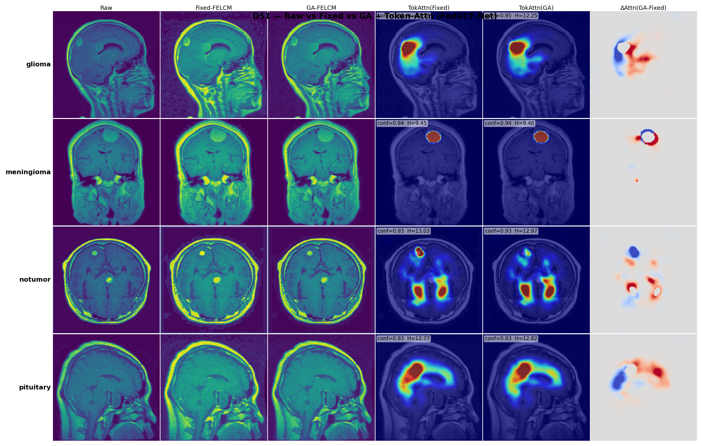
    


    
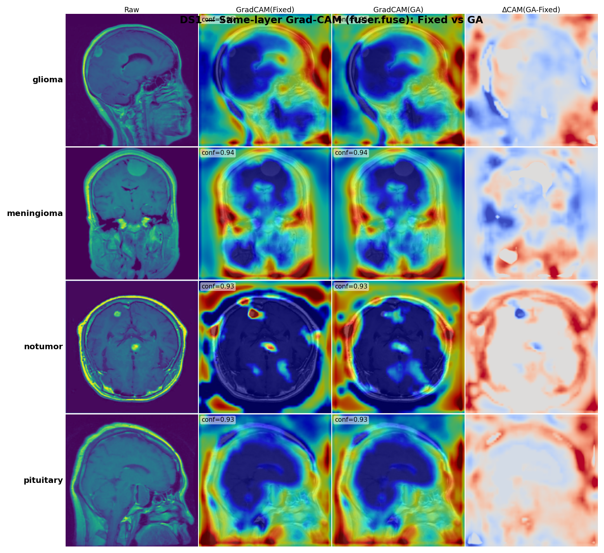
    


    
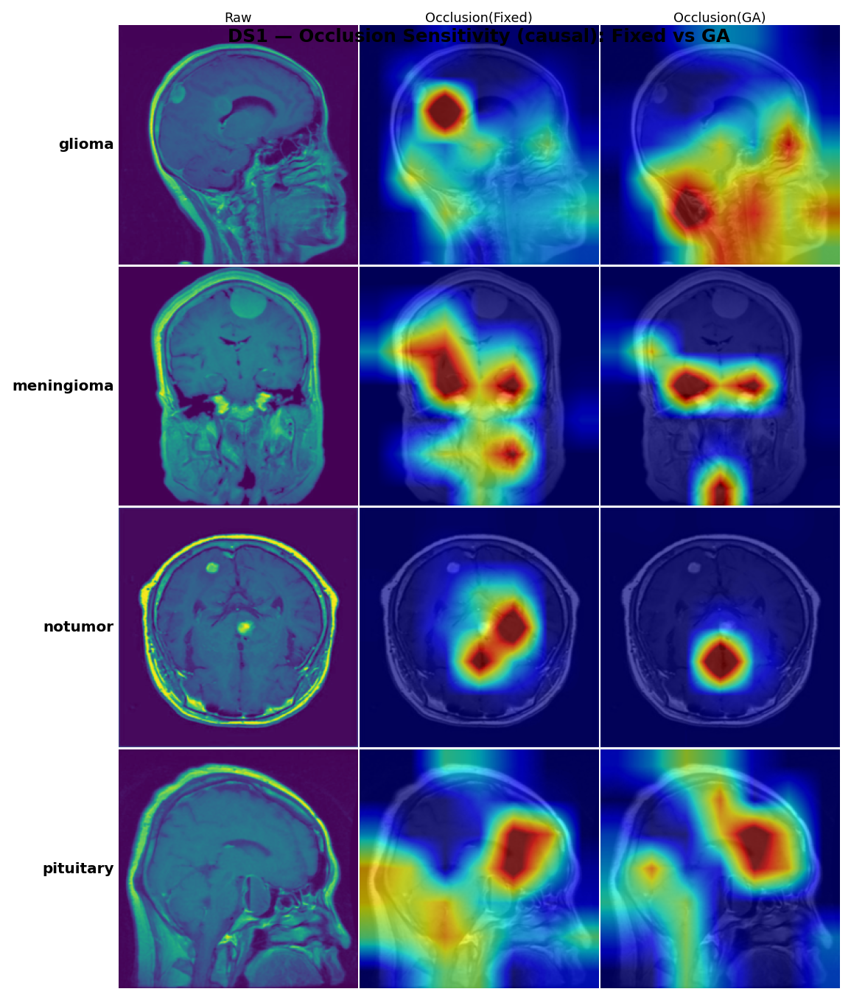
    


    
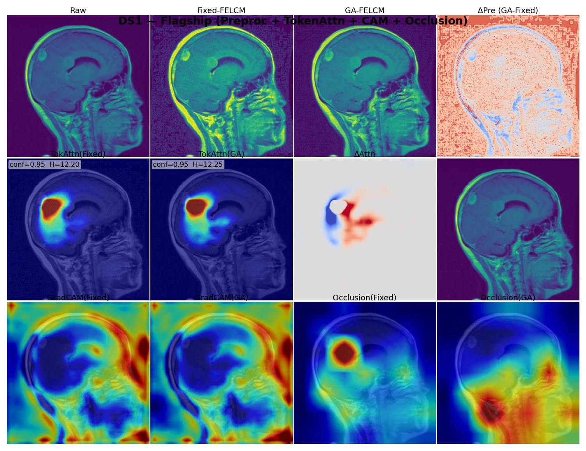
    


    
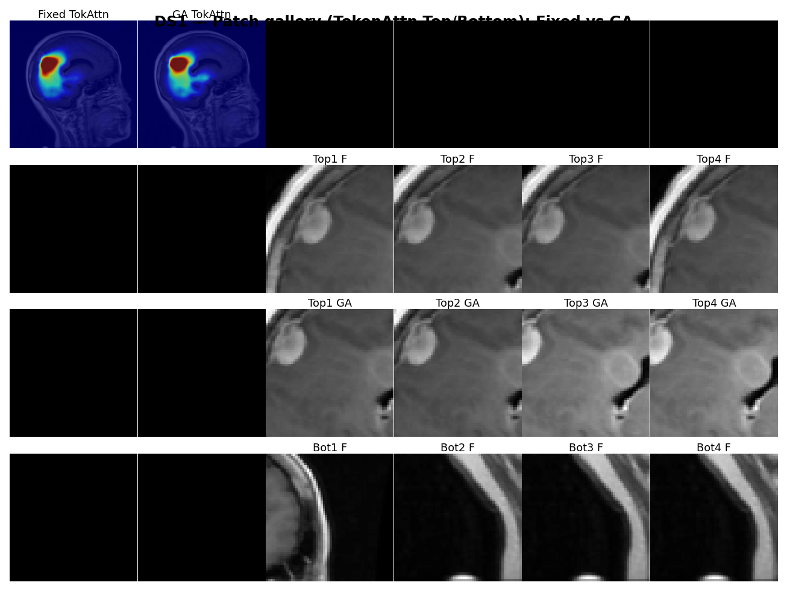
    


    
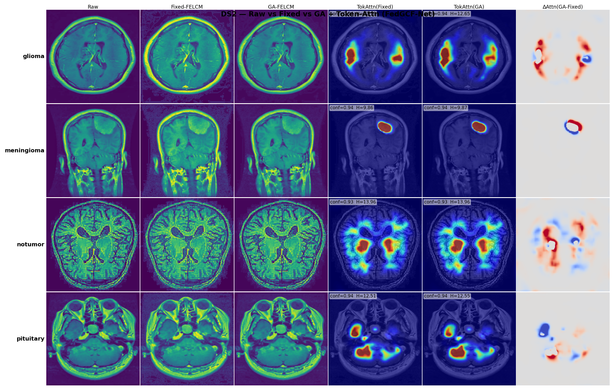
    


    
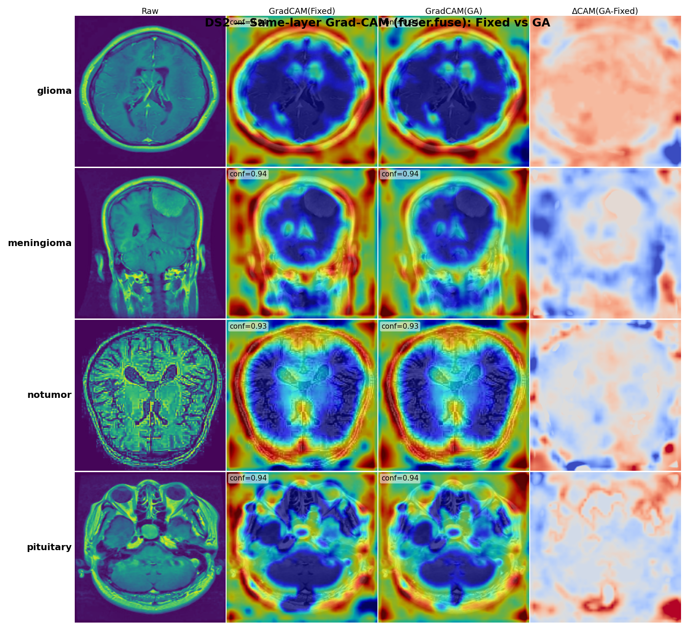
    


    
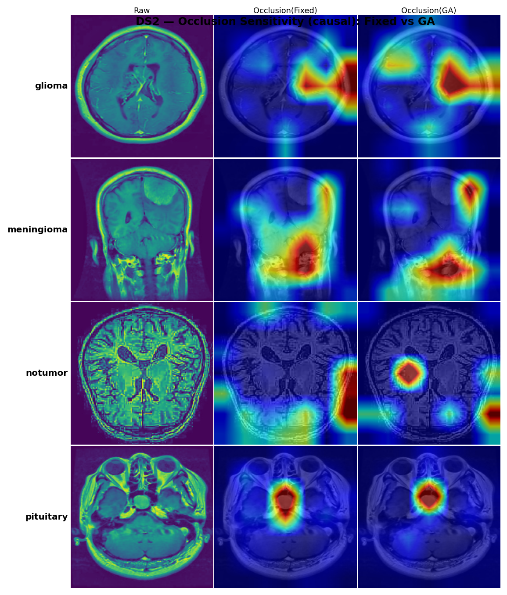
    


    
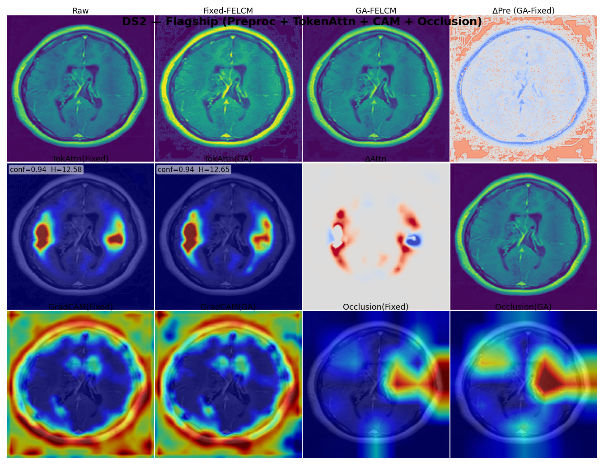
    


    
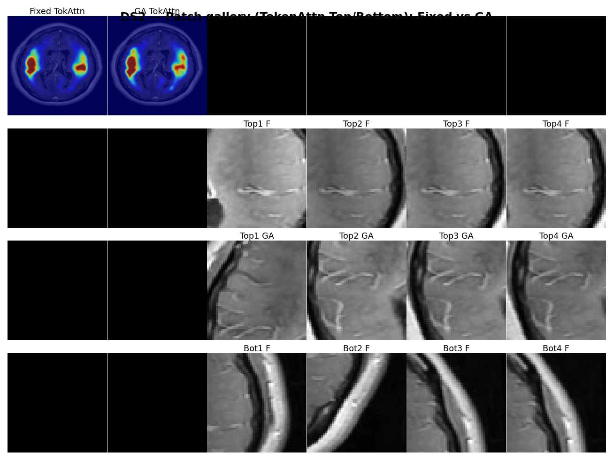
    


    
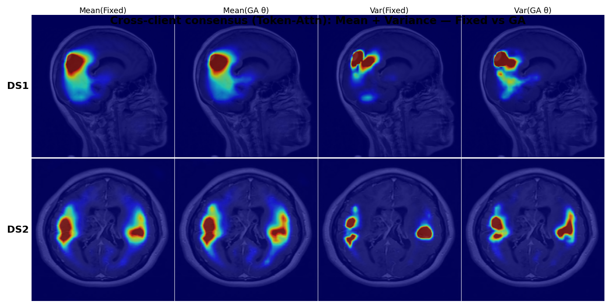
    


    ✅ Done. All figures displayed inline. No files saved.
    


```python
# ============================================================
# FedGCF-Net XAI Figure Generator (COMPACT, NO IN-PLOT TITLES)
# - GA-FELCM (EnhancedFELCM) ✅
# - Tri-gate conditioning (g0/g1/g2) ✅
# - PVTv2-B2 backbone + multi-scale fuser + token-attn pooling ✅
# - Outputs (DS1 + DS2):
#   (1) Compact ConVLM-style (Raw | Fixed | GA | TokAttn(F) | TokAttn(GA) | ΔAttn)
#   (2) Compact Same-layer Grad-CAM (Raw | CAM(F) | CAM(GA) | ΔCAM)
#   (3) Compact Occlusion (Raw | Occ(F) | Occ(GA))
#   (4) Flagship (3x4 grid: Preproc + TokAttn + CAM + Occlusion)
#   (5) Patch gallery (TokAttn(F) vs TokAttn(GA) + TopK/BottomK crops)
#   (6) Cross-client consensus (Mean/Var) if local history exists (fallback otherwise)
#
# FIXES:
# - Big titles are ABOVE the grid (never overlap subplots)
# - No subplot titles above each panel; only outer headers/row labels
# - Very tight spacing (wspace/hspace ~ 0)
# ============================================================

import os, random, math
import numpy as np
import pandas as pd
from PIL import Image

import torch
import torch.nn as nn
import torch.nn.functional as F

import matplotlib.pyplot as plt
from matplotlib import gridspec

# -----------------------------
# GLOBAL VISUAL SETTINGS (tight)
# -----------------------------
plt.rcParams.update({
    "figure.dpi": 180,
    "font.size": 9,
    "axes.titlesize": 9,
    "axes.titlepad": 2,
})

# -------------------------
# Reproducibility + Device
# -------------------------
SEED = 42
random.seed(SEED)
np.random.seed(SEED)
torch.manual_seed(SEED)
if torch.cuda.is_available():
    torch.cuda.manual_seed_all(SEED)

DEVICE = torch.device("cuda" if torch.cuda.is_available() else "cpu")
print("DEVICE:", DEVICE)

IMG_EXTS = (".jpg",".jpeg",".png",".bmp",".tif",".tiff",".webp")

# -------------------------
# timm (install if missing)
# -------------------------
try:
    import timm
except Exception:
    import sys, subprocess
    subprocess.check_call([sys.executable, "-m", "pip", "-q", "install", "timm"])
    import timm

from torchvision import transforms


# ============================================================
# 0) Find + Load checkpoint
# ============================================================
CKPT_BASENAME = "FL_GAFELCM_PVTv2B2_FUSION_checkpoint.pth"

def find_checkpoint():
    fast = [
        CKPT_BASENAME,
        os.path.join("/content", CKPT_BASENAME),
        os.path.join("/mnt/data", CKPT_BASENAME),
        "/mnt/data/FL_GAFELCM_PVTv2B2_FUSION_checkpoint.pth",
    ]
    for p in fast:
        if os.path.exists(p):
            return p
    for root in ["/content", os.getcwd(), "/mnt/data"]:
        if os.path.isdir(root):
            for r, _, files in os.walk(root):
                if CKPT_BASENAME in files:
                    return os.path.join(r, CKPT_BASENAME)
    return None

CKPT_PATH = find_checkpoint()
if CKPT_PATH is None:
    raise FileNotFoundError(
        f"Checkpoint not found.\nUpload {CKPT_BASENAME} to Colab (Files panel) or put it in /content."
    )

ckpt = torch.load(CKPT_PATH, map_location="cpu")
print("Loaded checkpoint:", os.path.basename(CKPT_PATH))

CFG = ckpt.get("config", {})
labels = ckpt.get("labels", ["glioma", "meningioma", "notumor", "pituitary"])
label2id = ckpt.get("label2id", {l:i for i,l in enumerate(labels)})
id2label = ckpt.get("id2label", {i:l for l,i in label2id.items()})
NUM_CLASSES = len(labels)

CLIENTS_PER_DS = int(CFG.get("clients_per_dataset", 3))
CLIENTS_TOTAL  = int(CFG.get("clients_total", 6))
BACKBONE_NAME  = str(ckpt.get("backbone_name", CFG.get("backbone_name", "pvt_v2_b2")))

IMG_SIZE = int(CFG.get("img_size", 224))
if IMG_SIZE < 96:
    IMG_SIZE = 224

IMAGENET_MEAN = torch.tensor([0.485, 0.456, 0.406], device=DEVICE).view(1,3,1,1)
IMAGENET_STD  = torch.tensor([0.229, 0.224, 0.225], device=DEVICE).view(1,3,1,1)

EVAL_TFMS = transforms.Compose([
    transforms.Resize((IMG_SIZE, IMG_SIZE)),
    transforms.ToTensor(),
])


# ============================================================
# 1) Dataset root resolution (AUTO-FIND or kagglehub)
# ============================================================
REQ1 = {"512Glioma", "512Meningioma", "512Normal", "512Pituitary"}  # DS1
REQ2 = {"glioma", "meningioma", "notumor", "pituitary"}             # DS2

def find_root_with_required_class_dirs(base_dir, required_set, prefer_raw=True, max_candidates=50_000):
    if base_dir is None or (not os.path.isdir(base_dir)):
        return None
    candidates = []
    walked = 0
    for root, dirs, _ in os.walk(base_dir):
        walked += 1
        if walked > max_candidates:
            break
        if required_set.issubset(set(dirs)):
            candidates.append(root)
    if not candidates:
        return None

    def score(p):
        pl = p.lower()
        sc = 0
        if prefer_raw:
            if "raw data" in pl: sc += 8
            if os.path.basename(p).lower() == "raw": sc += 8
            if "/raw/" in pl or "\\raw\\" in pl: sc += 4
            if "augmented" in pl: sc -= 30
        sc -= 0.0001 * len(p)
        return sc

    return max(candidates, key=score)

def try_auto_locate_anywhere(required_set, prefer_raw):
    candidates = ["/content", "/content/data", "/content/datasets", "/kaggle/input", "/mnt", "/mnt/data", os.getcwd()]
    for base in candidates:
        r = find_root_with_required_class_dirs(base, required_set, prefer_raw=prefer_raw)
        if r is not None:
            return r
    return None

def ensure_kagglehub():
    try:
        import kagglehub
        return kagglehub
    except Exception:
        import sys, subprocess
        subprocess.check_call([sys.executable, "-m", "pip", "-q", "install", "kagglehub"])
        import kagglehub
        return kagglehub

def resolve_dataset_roots():
    ds1_root_ckpt = ckpt.get("dataset1_raw_root", None)
    ds2_root_ckpt = ckpt.get("dataset2_root", None)

    ds1_root = ds1_root_ckpt if (ds1_root_ckpt and os.path.isdir(ds1_root_ckpt)) else None
    ds2_root = ds2_root_ckpt if (ds2_root_ckpt and os.path.isdir(ds2_root_ckpt)) else None

    if ds1_root is None:
        ds1_root = try_auto_locate_anywhere(REQ1, prefer_raw=True)
    if ds2_root is None:
        ds2_root = try_auto_locate_anywhere(REQ2, prefer_raw=False)

    if ds1_root is None or ds2_root is None:
        try:
            kagglehub = ensure_kagglehub()
            ds2_base = kagglehub.dataset_download("yassinebazgour/preprocessed-brain-mri-scans-for-tumors-detection")
            ds1_base = kagglehub.dataset_download("orvile/pmram-bangladeshi-brain-cancer-mri-dataset")
            if ds1_root is None:
                ds1_root = find_root_with_required_class_dirs(ds1_base, REQ1, prefer_raw=True)
            if ds2_root is None:
                ds2_root = find_root_with_required_class_dirs(ds2_base, REQ2, prefer_raw=False)
        except Exception as e:
            print("⚠️ kagglehub download failed (maybe no Kaggle token). Error:", str(e))

    return ds1_root, ds2_root

DS1_ROOT, DS2_ROOT = resolve_dataset_roots()
print("DS1_ROOT:", DS1_ROOT)
print("DS2_ROOT:", DS2_ROOT)

if DS1_ROOT is None or (not os.path.isdir(DS1_ROOT)):
    raise FileNotFoundError(f"Could not locate DS1 root containing folders: {sorted(list(REQ1))}")
if DS2_ROOT is None or (not os.path.isdir(DS2_ROOT)):
    raise FileNotFoundError(f"Could not locate DS2 root containing folders: {sorted(list(REQ2))}")


# ============================================================
# 2) GA-FELCM module (EnhancedFELCM)
# ============================================================
class EnhancedFELCM(nn.Module):
    def __init__(self, gamma=1.0, alpha=0.35, beta=6.0, tau=2.5, blur_k=7, sharpen=0.0, denoise=0.0):
        super().__init__()
        self.gamma = float(gamma)
        self.alpha = float(alpha)
        self.beta  = float(beta)
        self.tau   = float(tau)
        self.blur_k = int(blur_k)
        self.sharpen = float(sharpen)
        self.denoise = float(denoise)

        lap = torch.tensor([[0, -1, 0], [-1, 4, -1], [0, -1, 0]], dtype=torch.float32)
        self.register_buffer("lap", lap.view(1, 1, 3, 3))

        sharp = torch.tensor([[0, -1, 0], [-1, 5, -1], [0, -1, 0]], dtype=torch.float32)
        self.register_buffer("sharp_kernel", sharp.view(1, 1, 3, 3))

    def forward(self, x):
        eps = 1e-6
        B, C, H, W = x.shape

        if self.denoise > 0:
            k = 3
            x_blur = F.avg_pool2d(F.pad(x, (1, 1, 1, 1), mode="reflect"), k, 1)
            x = x * (1 - self.denoise) + x_blur * self.denoise

        mu = x.mean(dim=(2, 3), keepdim=True)
        sd = x.std(dim=(2, 3), keepdim=True).clamp_min(eps)
        x0 = (x - mu) / sd
        x0 = x0.clamp(-self.tau, self.tau)

        x1 = torch.sign(x0) * torch.pow(torch.abs(x0).clamp_min(eps), self.gamma)

        gray = x1.mean(dim=1, keepdim=True)
        lap = F.conv2d(F.pad(gray, (1, 1, 1, 1), mode="reflect"), self.lap)
        mag = lap.abs()

        k = self.blur_k if self.blur_k % 2 == 1 else self.blur_k + 1
        pad = k // 2
        blur = F.avg_pool2d(F.pad(mag, (pad, pad, pad, pad), mode="reflect"), k, 1)
        C_map = mag / (blur + eps)

        x2 = x1 + self.alpha * torch.tanh(self.beta * C_map)

        if self.sharpen > 0:
            outs = []
            for c in range(C):
                x_c = x2[:, c: c + 1, :, :]
                x_sharp = F.conv2d(F.pad(x_c, (1, 1, 1, 1), mode="reflect"), self.sharp_kernel)
                outs.append(x_c * (1 - self.sharpen) + x_sharp * self.sharpen)
            x2 = torch.cat(outs, dim=1)

        mn = x2.amin(dim=(2, 3), keepdim=True)
        mx = x2.amax(dim=(2, 3), keepdim=True)
        x3 = (x2 - mn) / (mx - mn + eps)
        return x3.clamp(0, 1)

def theta_to_module(theta):
    if theta is None:
        return EnhancedFELCM()
    g, a, b, t, k, sh, dn = theta
    return EnhancedFELCM(gamma=g, alpha=a, beta=b, tau=t, blur_k=int(k), sharpen=sh, denoise=dn)

def preproc_theta_vec(preproc_module, batch_size):
    theta = torch.tensor(
        [
            float(preproc_module.gamma),
            float(preproc_module.alpha),
            float(preproc_module.beta),
            float(preproc_module.tau),
            float(preproc_module.blur_k) / 7.0,
            float(preproc_module.sharpen),
            float(preproc_module.denoise),
        ],
        device=DEVICE,
        dtype=torch.float32,
    )
    return theta.unsqueeze(0).repeat(batch_size, 1)

fixed_pre = EnhancedFELCM().to(DEVICE).eval()
best_theta_ds1 = ckpt.get("best_theta_ds1", None)
best_theta_ds2 = ckpt.get("best_theta_ds2", None)
ga_pre_ds1 = theta_to_module(best_theta_ds1).to(DEVICE).eval()
ga_pre_ds2 = theta_to_module(best_theta_ds2).to(DEVICE).eval()

print("best_theta_ds1:", best_theta_ds1)
print("best_theta_ds2:", best_theta_ds2)


# ============================================================
# 3) FedGCF-Net model (PVTv2-B2 + fusion + tri-gate)
# ============================================================
class TokenAttentionPooling(nn.Module):
    def __init__(self, dim):
        super().__init__()
        self.query = nn.Linear(dim, 1)

    def forward(self, x_tokens):  # [B, HW, C]
        attn = torch.softmax(self.query(x_tokens).squeeze(-1), dim=1)  # [B, HW]
        pooled = (x_tokens * attn.unsqueeze(-1)).sum(dim=1)
        return pooled, attn

class MultiScaleFeatureFuser(nn.Module):
    def __init__(self, in_channels, out_dim):
        super().__init__()
        self.proj = nn.ModuleList([
            nn.Sequential(
                nn.Conv2d(c, out_dim, kernel_size=1, bias=False),
                nn.GroupNorm(8, out_dim),
                nn.GELU(),
            )
            for c in in_channels
        ])
        self.fuse = nn.Sequential(
            nn.Conv2d(out_dim, out_dim, kernel_size=3, padding=1, bias=False),
            nn.GroupNorm(8, out_dim),
            nn.GELU(),
        )
        self.pool = TokenAttentionPooling(out_dim)

class EnhancedBrainTuner(nn.Module):
    def __init__(self, dim, dropout=0.1):
        super().__init__()
        self.se = nn.Sequential(
            nn.Linear(dim, max(8, dim // 4)),
            nn.ReLU(inplace=True),
            nn.Linear(max(8, dim // 4), dim),
            nn.Sigmoid(),
        )
        self.refine = nn.Sequential(
            nn.LayerNorm(dim),
            nn.Linear(dim, dim),
            nn.GELU(),
            nn.Dropout(dropout),
            nn.Linear(dim, dim),
        )
        self.gate = nn.Parameter(torch.ones(2) / 2)

    def forward(self, x):
        gate = F.softmax(self.gate, dim=0)
        out1 = x * self.se(x)
        out2 = x + 0.2 * self.refine(x)
        return gate[0] * out1 + gate[1] * out2

class PVTv2B2_MultiScale(nn.Module):
    def __init__(self, num_classes, head_dropout=0.3, cond_dim=128, num_clients=6):
        super().__init__()
        self.backbone = timm.create_model(
            BACKBONE_NAME,
            pretrained=False,
            features_only=True,
            out_indices=(0,1,2,3),
        )
        in_channels = self.backbone.feature_info.channels()
        out_dim = max(256, in_channels[-1] // 2)

        self.fuser = MultiScaleFeatureFuser(in_channels, out_dim)
        self.tuner = EnhancedBrainTuner(out_dim, dropout=0.1)

        self.classifier = nn.Sequential(
            nn.LayerNorm(out_dim),
            nn.Dropout(head_dropout),
            nn.Linear(out_dim, max(64, out_dim // 2)),
            nn.GELU(),
            nn.Dropout(head_dropout * 0.5),
            nn.Linear(max(64, out_dim // 2), num_classes),
        )

        self.theta_mlp = nn.Sequential(
            nn.Linear(7, cond_dim),
            nn.GELU(),
            nn.Linear(cond_dim, cond_dim),
        )
        self.source_emb = nn.Embedding(2, cond_dim)
        self.client_emb = nn.Embedding(num_clients, cond_dim)
        self.cond_norm = nn.LayerNorm(cond_dim)

        self.gate_early = nn.Linear(cond_dim, 3)
        self.gate_mid   = nn.Linear(cond_dim, out_dim)
        self.gate_late  = nn.Linear(cond_dim, out_dim)

    def _cond_vec(self, theta_vec, source_id, client_id):
        cond = self.theta_mlp(theta_vec)
        cond = cond + self.source_emb(source_id) + self.client_emb(client_id)
        return self.cond_norm(cond)

model = PVTv2B2_MultiScale(
    num_classes=NUM_CLASSES,
    head_dropout=float(CFG.get("head_dropout", 0.3)),
    cond_dim=int(CFG.get("cond_dim", 128)),
    num_clients=CLIENTS_TOTAL,
).to(DEVICE).eval()

sd = ckpt.get("state_dict", None)
if sd is None:
    raise RuntimeError("Checkpoint missing state_dict.")
model.load_state_dict(sd, strict=True)
print("✅ Model weights loaded.")


# ============================================================
# 4) Sample-per-class (ALL 4 classes) for DS1 and DS2
# ============================================================
def list_images_under_class_root(class_root, class_dir_name):
    class_dir = os.path.join(class_root, class_dir_name)
    out = []
    if not os.path.isdir(class_dir):
        return out
    for r, _, files in os.walk(class_dir):
        for fn in files:
            if fn.lower().endswith(IMG_EXTS):
                out.append(os.path.join(r, fn))
    return out

def pick_one_per_class_from_root(ds_root, class_dirs_map, seed=SEED):
    rng = random.Random(seed)
    samples = {}
    for lab in labels:
        dir_name = class_dirs_map[lab]
        imgs = list_images_under_class_root(ds_root, dir_name)
        samples[lab] = rng.choice(imgs) if len(imgs) else None
    return samples

DS1_CLASS_DIRS = {
    "glioma": "512Glioma",
    "meningioma": "512Meningioma",
    "notumor": "512Normal",
    "pituitary": "512Pituitary",
}
DS2_CLASS_DIRS = {
    "glioma": "glioma",
    "meningioma": "meningioma",
    "notumor": "notumor",
    "pituitary": "pituitary",
}

def fill_missing_samples(ds_root, class_dirs_map, samples, tries=10):
    for t in range(tries):
        if all(samples[l] is not None for l in labels):
            return samples
        samples2 = pick_one_per_class_from_root(ds_root, class_dirs_map, seed=SEED + 100 + t)
        for l in labels:
            if samples[l] is None:
                samples[l] = samples2[l]
    return samples

ds1_samples = fill_missing_samples(DS1_ROOT, DS1_CLASS_DIRS, pick_one_per_class_from_root(DS1_ROOT, DS1_CLASS_DIRS, seed=SEED))
ds2_samples = fill_missing_samples(DS2_ROOT, DS2_CLASS_DIRS, pick_one_per_class_from_root(DS2_ROOT, DS2_CLASS_DIRS, seed=SEED+7))

if any(ds1_samples[l] is None for l in labels):
    raise RuntimeError("DS1: Could not find at least 1 image for every class folder.")
if any(ds2_samples[l] is None for l in labels):
    raise RuntimeError("DS2: Could not find at least 1 image for every class folder.")

def load_rgb(path):
    try:
        return Image.open(path).convert("RGB")
    except Exception:
        return Image.new("RGB", (IMG_SIZE, IMG_SIZE), (128,128,128))


# ============================================================
# 5) Forward pieces to extract token-attn + same-layer conv map
# ============================================================
def fuser_conv_pooled_attn(fuser, feats):
    proj_feats = [p(f) for p, f in zip(fuser.proj, feats)]
    x = proj_feats[-1]
    for f in reversed(proj_feats[:-1]):
        x = F.interpolate(x, size=f.shape[-2:], mode="bilinear", align_corners=False)
        x = x + f
    x = fuser.fuse(x)  # [B,C,H,W]
    B, C, H, W = x.shape
    tokens = x.flatten(2).transpose(1, 2)  # [B,HW,C]
    pooled, attn = fuser.pool(tokens)       # pooled [B,C], attn [B,HW]
    attn_map = attn.view(B, H, W)
    return x, pooled, attn_map

def attn_entropy(attn_map_2d):
    p = attn_map_2d.flatten().clamp(1e-9, 1.0)
    p = p / p.sum()
    return float(-(p * torch.log2(p)).sum().item())

@torch.no_grad()
def run_token_attn_only(x01, preproc, source_id, client_id):
    x01 = x01.to(DEVICE)
    x_fel = preproc(x01).clamp(0,1)
    x_raw_n = (x01 - IMAGENET_MEAN) / IMAGENET_STD
    x_fel_n = (x_fel - IMAGENET_MEAN) / IMAGENET_STD

    theta_vec = preproc_theta_vec(preproc, batch_size=1)
    sid = torch.tensor([source_id], device=DEVICE, dtype=torch.long)
    cid = torch.tensor([client_id], device=DEVICE, dtype=torch.long)

    cond = model._cond_vec(theta_vec, sid, cid)

    g0 = torch.sigmoid(model.gate_early(cond)).view(-1,3,1,1)
    xmix = (1-g0)*x_raw_n + g0*x_fel_n

    feats0 = model.backbone(xmix)
    _, f0, att0 = fuser_conv_pooled_attn(model.fuser, feats0)

    feats1 = model.backbone(x_fel_n)
    _, f1, _ = fuser_conv_pooled_attn(model.fuser, feats1)

    g1 = torch.sigmoid(model.gate_mid(cond))
    f_mid = (1-g1)*f0 + g1*f1

    t0 = model.tuner(f0)
    t1 = model.tuner(f1)
    t_mid = model.tuner(f_mid)

    t_views = 0.5*(t0+t1)
    g2 = torch.sigmoid(model.gate_late(cond))
    t_final = (1-g2)*t_mid + g2*t_views

    logits = model.classifier(t_final)
    prob = torch.softmax(logits, dim=1)[0]
    conf = float(prob.max().item())
    pred = int(prob.argmax().item())

    return {"attn_map": att0[0].detach().cpu(), "conf": conf, "pred": pred}

def gradcam_same_layer(x01, preproc, source_id, client_id, target_class=None):
    model.eval()
    preproc.eval()

    x01 = x01.to(DEVICE)
    x_fel = preproc(x01).clamp(0,1)
    x_raw_n = (x01 - IMAGENET_MEAN) / IMAGENET_STD
    x_fel_n = (x_fel - IMAGENET_MEAN) / IMAGENET_STD

    theta_vec = preproc_theta_vec(preproc, batch_size=1)
    sid = torch.tensor([source_id], device=DEVICE, dtype=torch.long)
    cid = torch.tensor([client_id], device=DEVICE, dtype=torch.long)

    for p in model.parameters():
        p.requires_grad = True
    model.zero_grad(set_to_none=True)

    cond = model._cond_vec(theta_vec, sid, cid)
    g0 = torch.sigmoid(model.gate_early(cond)).view(-1,3,1,1)
    xmix = (1-g0)*x_raw_n + g0*x_fel_n

    feats0 = model.backbone(xmix)
    conv0, f0, _ = fuser_conv_pooled_attn(model.fuser, feats0)
    conv0.retain_grad()

    feats1 = model.backbone(x_fel_n)
    _, f1, _ = fuser_conv_pooled_attn(model.fuser, feats1)

    g1 = torch.sigmoid(model.gate_mid(cond))
    f_mid = (1-g1)*f0 + g1*f1

    t0 = model.tuner(f0)
    t1 = model.tuner(f1)
    t_mid = model.tuner(f_mid)

    t_views = 0.5*(t0+t1)
    g2 = torch.sigmoid(model.gate_late(cond))
    t_final = (1-g2)*t_mid + g2*t_views

    logits = model.classifier(t_final)
    prob = torch.softmax(logits, dim=1)[0]
    pred = int(prob.argmax().item())
    if target_class is None:
        target_class = pred

    logits[0, target_class].backward()

    grad = conv0.grad[0]       # [C,h,w]
    act  = conv0.detach()[0]   # [C,h,w]
    w = grad.mean(dim=(1,2), keepdim=True)
    cam = torch.relu((w * act).sum(dim=0))
    cam = cam - cam.min()
    cam = cam / (cam.max() + 1e-9)

    conf = float(prob.max().item())
    return cam.detach().cpu(), conf, pred, int(target_class)

@torch.no_grad()
def occlusion_sensitivity_map(x01, preproc, source_id, client_id, patch=32, stride=32, target_class=None):
    x01 = x01.to(DEVICE)
    x_fel = preproc(x01).clamp(0,1)
    x_raw_n = (x01 - IMAGENET_MEAN) / IMAGENET_STD
    x_fel_n = (x_fel - IMAGENET_MEAN) / IMAGENET_STD

    theta_vec = preproc_theta_vec(preproc, batch_size=1)
    sid = torch.tensor([source_id], device=DEVICE, dtype=torch.long)
    cid = torch.tensor([client_id], device=DEVICE, dtype=torch.long)

    cond = model._cond_vec(theta_vec, sid, cid)
    g0 = torch.sigmoid(model.gate_early(cond)).view(-1,3,1,1)
    xmix = (1-g0)*x_raw_n + g0*x_fel_n

    feats0 = model.backbone(xmix)
    _, f0, _ = fuser_conv_pooled_attn(model.fuser, feats0)

    feats1 = model.backbone(x_fel_n)
    _, f1, _ = fuser_conv_pooled_attn(model.fuser, feats1)

    g1 = torch.sigmoid(model.gate_mid(cond))
    f_mid = (1-g1)*f0 + g1*f1

    t0 = model.tuner(f0)
    t1 = model.tuner(f1)
    t_mid = model.tuner(f_mid)

    t_views = 0.5*(t0+t1)
    g2 = torch.sigmoid(model.gate_late(cond))
    t_final = (1-g2)*t_mid + g2*t_views

    logits = model.classifier(t_final)
    prob = torch.softmax(logits, dim=1)[0]
    pred = int(prob.argmax().item())
    if target_class is None:
        target_class = pred
    base_p = float(prob[target_class].item())

    _, _, H, W = x01.shape
    ys = list(range(0, H, stride))
    xs = list(range(0, W, stride))
    grid = np.zeros((len(ys), len(xs)), dtype=np.float32)

    for iy, y0 in enumerate(ys):
        for ix, x0p in enumerate(xs):
            x_mask = x01.clone()
            y1 = min(H, y0 + patch)
            x1 = min(W, x0p + patch)
            x_mask[:, :, y0:y1, x0p:x1] = 0.0

            x_fel_m = preproc(x_mask).clamp(0,1)
            x_raw_n_m = (x_mask - IMAGENET_MEAN) / IMAGENET_STD
            x_fel_n_m = (x_fel_m - IMAGENET_MEAN) / IMAGENET_STD

            cond_m = model._cond_vec(theta_vec, sid, cid)
            g0m = torch.sigmoid(model.gate_early(cond_m)).view(-1,3,1,1)
            xmix_m = (1-g0m)*x_raw_n_m + g0m*x_fel_n_m

            feats0m = model.backbone(xmix_m)
            _, f0m, _ = fuser_conv_pooled_attn(model.fuser, feats0m)

            feats1m = model.backbone(x_fel_n_m)
            _, f1m, _ = fuser_conv_pooled_attn(model.fuser, feats1m)

            g1m = torch.sigmoid(model.gate_mid(cond_m))
            f_mid_m = (1-g1m)*f0m + g1m*f1m

            t0m = model.tuner(f0m)
            t1m = model.tuner(f1m)
            t_mid_m = model.tuner(f_mid_m)

            t_views_m = 0.5*(t0m+t1m)
            g2m = torch.sigmoid(model.gate_late(cond_m))
            t_final_m = (1-g2m)*t_mid_m + g2m*t_views_m

            logits_m = model.classifier(t_final_m)
            prob_m = torch.softmax(logits_m, dim=1)[0]
            p_m = float(prob_m[target_class].item())

            grid[iy, ix] = max(0.0, base_p - p_m)

    if grid.max() > 1e-9:
        grid = grid / grid.max()
    return grid


# ============================================================
# 6) Plot helpers (NO subplot titles; use outer headers)
# ============================================================
def to_gray_np(x01_1x3):
    g = x01_1x3[0].mean(dim=0).detach().cpu().numpy()
    return np.clip(g, 0, 1)

def upsample_map(m, out_hw):
    if isinstance(m, np.ndarray):
        t = torch.tensor(m)[None,None,:,:].float()
    else:
        t = m[None,None,:,:].float()
    t2 = F.interpolate(t, size=out_hw, mode="bilinear", align_corners=False)[0,0]
    return t2.detach().cpu().numpy()

def overlay_heat(gray, heat, alpha=0.60, cmap="jet"):
    gray3 = np.stack([gray,gray,gray], axis=-1)
    heat3 = plt.get_cmap(cmap)(np.clip(heat,0,1))[...,:3]
    out = (1-alpha)*gray3 + alpha*heat3
    return np.clip(out, 0, 1)

def safe_norm01(x):
    x = x.astype(np.float32)
    mn, mx = float(x.min()), float(x.max())
    if abs(mx-mn) < 1e-9:
        return np.zeros_like(x)
    return (x - mn) / (mx - mn + 1e-9)

def delta_diverging(a, b):
    # returns in [-1, 1] after robust scaling
    d = (a - b).astype(np.float32)
    s = np.percentile(np.abs(d), 99.0) + 1e-9
    d = np.clip(d / s, -1.0, 1.0)
    return d

def ax_im(ax, img, cmap=None, vmin=None, vmax=None):
    ax.imshow(img, cmap=cmap, vmin=vmin, vmax=vmax)
    ax.set_xticks([]); ax.set_yticks([])
    for sp in ax.spines.values():
        sp.set_visible(False)

def add_outer_headers(fig, axes_grid, col_headers, row_headers, header_pad=0.006, side_pad=0.006, fz=10):
    rows = len(axes_grid)
    cols = len(axes_grid[0])

    # Column headers (use first row axes positions)
    for c in range(cols):
        pos = axes_grid[0][c].get_position()
        xc = pos.x0 + pos.width/2
        yt = pos.y1 + header_pad
        fig.text(xc, yt, col_headers[c], ha="center", va="bottom", fontsize=fz, fontweight="bold")

    # Row headers (use first col axes positions)
    for r in range(rows):
        pos = axes_grid[r][0].get_position()
        yl = pos.y0 + pos.height/2
        xl = pos.x0 - side_pad
        fig.text(xl, yl, row_headers[r], ha="right", va="center", fontsize=fz, fontweight="bold")


# ============================================================
# 7) Plotters (COMPACT, NO subplot titles)
# ============================================================
def plot_convlm_compact(ds_name, sample_map, source_id, rep_client_id, pre_ga,
                        show_stats=True, saliency_gamma=1.25):
    # Layout: rows x 6
    col_headers = ["Raw", "Fixed-FELCM", "GA-FELCM", "TokAttn(Fixed)", "TokAttn(GA)", "ΔAttn(GA−Fixed)"]
    row_headers = [lab for lab in labels]

    rows, cols = NUM_CLASSES, 6
    fig = plt.figure(figsize=(cols*2.05, rows*2.05))

    # Reserve top margin for title + headers so NOTHING overlaps images
    gs = gridspec.GridSpec(
        rows, cols, figure=fig,
        left=0.055, right=0.995, bottom=0.02, top=0.90,
        wspace=0.005, hspace=0.005
    )

    axes = [[None]*cols for _ in range(rows)]

    fig.text(0.5, 0.965, f"{ds_name.upper()} — Raw vs Fixed vs GA + Token-Attention (FedGCF-Net)",
             ha="center", va="top", fontsize=13, fontweight="bold")

    for r, lab in enumerate(labels):
        x = EVAL_TFMS(load_rgb(sample_map[lab])).unsqueeze(0)
        gray = to_gray_np(x)

        with torch.no_grad():
            x_fixed = fixed_pre(x.to(DEVICE)).clamp(0,1).cpu()
            x_ga    = pre_ga(x.to(DEVICE)).clamp(0,1).cpu()

        gray_fixed = to_gray_np(x_fixed)
        gray_ga    = to_gray_np(x_ga)

        out_fixed = run_token_attn_only(x, fixed_pre, source_id, rep_client_id)
        out_ga    = run_token_attn_only(x, pre_ga,    source_id, rep_client_id)

        att_fixed = upsample_map(out_fixed["attn_map"], (IMG_SIZE, IMG_SIZE))
        att_ga    = upsample_map(out_ga["attn_map"],    (IMG_SIZE, IMG_SIZE))

        # same visualization transform for BOTH (fair)
        att_fixed = np.power(np.clip(att_fixed,0,1), saliency_gamma)
        att_ga    = np.power(np.clip(att_ga,0,1), saliency_gamma)

        ov_fixed = overlay_heat(gray_fixed, att_fixed, alpha=0.62, cmap="jet")
        ov_ga    = overlay_heat(gray_ga,    att_ga,    alpha=0.62, cmap="jet")

        d_att = delta_diverging(att_ga, att_fixed)  # [-1,1]

        imgs = [
            gray,
            gray_fixed,
            gray_ga,
            ov_fixed,
            ov_ga,
            d_att
        ]

        for c in range(cols):
            ax = fig.add_subplot(gs[r,c]); axes[r][c] = ax
            if c == 5:
                ax_im(ax, imgs[c], cmap="seismic", vmin=-1, vmax=1)
            else:
                ax_im(ax, imgs[c], cmap="gray" if imgs[c].ndim==2 else None)

            if show_stats and (c in [3,4]):
                # Small in-image overlay (NOT a title above)
                conf = out_fixed["conf"] if c == 3 else out_ga["conf"]
                ent  = attn_entropy(torch.tensor(att_fixed)) if c == 3 else attn_entropy(torch.tensor(att_ga))
                ax.text(0.01, 0.01, f"conf={conf:.2f}  H={ent:.2f}",
                        transform=ax.transAxes, ha="left", va="bottom",
                        fontsize=8, color="white",
                        bbox=dict(boxstyle="round,pad=0.2", fc=(0,0,0,0.35), ec=(0,0,0,0)))

    add_outer_headers(fig, axes, col_headers, row_headers, header_pad=0.006, side_pad=0.010, fz=10)
    plt.show()


def plot_gradcam_compact(ds_name, sample_map, source_id, rep_client_id, pre_ga,
                         show_stats=True, cam_gamma=1.35):
    col_headers = ["Raw", "GradCAM(Fixed)", "GradCAM(GA)", "ΔCAM(GA−Fixed)"]
    row_headers = [lab for lab in labels]

    rows, cols = NUM_CLASSES, 4
    fig = plt.figure(figsize=(cols*2.15, rows*2.15))

    gs = gridspec.GridSpec(
        rows, cols, figure=fig,
        left=0.055, right=0.995, bottom=0.02, top=0.90,
        wspace=0.005, hspace=0.005
    )

    axes = [[None]*cols for _ in range(rows)]

    fig.text(0.5, 0.965, f"{ds_name.upper()} — Same-layer Grad-CAM (fuser.fuse): Fixed vs GA",
             ha="center", va="top", fontsize=13, fontweight="bold")

    for r, lab in enumerate(labels):
        x = EVAL_TFMS(load_rgb(sample_map[lab])).unsqueeze(0)
        gray = to_gray_np(x)
        target = label2id[lab]

        cam_f, conf_f, _, _ = gradcam_same_layer(x, fixed_pre, source_id, rep_client_id, target_class=target)
        cam_g, conf_g, _, _ = gradcam_same_layer(x, pre_ga,    source_id, rep_client_id, target_class=target)

        cam_f = np.power(np.clip(upsample_map(cam_f, (IMG_SIZE, IMG_SIZE)),0,1), cam_gamma)
        cam_g = np.power(np.clip(upsample_map(cam_g, (IMG_SIZE, IMG_SIZE)),0,1), cam_gamma)

        ov_f = overlay_heat(gray, cam_f, alpha=0.62, cmap="jet")
        ov_g = overlay_heat(gray, cam_g, alpha=0.62, cmap="jet")

        d_cam = delta_diverging(cam_g, cam_f)  # [-1,1]

        imgs = [gray, ov_f, ov_g, d_cam]

        for c in range(cols):
            ax = fig.add_subplot(gs[r,c]); axes[r][c] = ax
            if c == 3:
                ax_im(ax, imgs[c], cmap="seismic", vmin=-1, vmax=1)
            else:
                ax_im(ax, imgs[c], cmap="gray" if imgs[c].ndim==2 else None)

            if show_stats and (c in [1,2]):
                conf = conf_f if c == 1 else conf_g
                ax.text(0.01, 0.01, f"conf={conf:.2f}",
                        transform=ax.transAxes, ha="left", va="bottom",
                        fontsize=8, color="white",
                        bbox=dict(boxstyle="round,pad=0.2", fc=(0,0,0,0.35), ec=(0,0,0,0)))

    add_outer_headers(fig, axes, col_headers, row_headers, header_pad=0.006, side_pad=0.010, fz=10)
    plt.show()


def plot_occlusion_compact(ds_name, sample_map, source_id, rep_client_id, pre_ga,
                           patch=32, stride=32, occ_gamma=1.15):
    col_headers = ["Raw", "Occlusion(Fixed)", "Occlusion(GA)"]
    row_headers = [lab for lab in labels]

    rows, cols = NUM_CLASSES, 3
    fig = plt.figure(figsize=(cols*2.15, rows*2.15))

    gs = gridspec.GridSpec(
        rows, cols, figure=fig,
        left=0.055, right=0.995, bottom=0.02, top=0.90,
        wspace=0.005, hspace=0.005
    )

    axes = [[None]*cols for _ in range(rows)]

    fig.text(0.5, 0.965, f"{ds_name.upper()} — Occlusion Sensitivity (causal): Fixed vs GA",
             ha="center", va="top", fontsize=13, fontweight="bold")

    for r, lab in enumerate(labels):
        x = EVAL_TFMS(load_rgb(sample_map[lab])).unsqueeze(0)
        gray = to_gray_np(x)
        target = label2id[lab]

        occ_f = occlusion_sensitivity_map(x, fixed_pre, source_id, rep_client_id, patch=patch, stride=stride, target_class=target)
        occ_g = occlusion_sensitivity_map(x, pre_ga,    source_id, rep_client_id, patch=patch, stride=stride, target_class=target)

        occ_f = np.power(np.clip(upsample_map(occ_f, (IMG_SIZE, IMG_SIZE)),0,1), occ_gamma)
        occ_g = np.power(np.clip(upsample_map(occ_g, (IMG_SIZE, IMG_SIZE)),0,1), occ_gamma)

        ov_f = overlay_heat(gray, occ_f, alpha=0.62, cmap="jet")
        ov_g = overlay_heat(gray, occ_g, alpha=0.62, cmap="jet")

        imgs = [gray, ov_f, ov_g]

        for c in range(cols):
            ax = fig.add_subplot(gs[r,c]); axes[r][c] = ax
            ax_im(ax, imgs[c], cmap="gray" if imgs[c].ndim==2 else None)

    add_outer_headers(fig, axes, col_headers, row_headers, header_pad=0.006, side_pad=0.010, fz=10)
    plt.show()


def plot_flagship(ds_name, sample_map, source_id, rep_client_id, pre_ga,
                  choose_label="glioma", show_stats=True):
    # 3 x 4 grid
    fig = plt.figure(figsize=(12, 8))
    gs = gridspec.GridSpec(
        3, 4, figure=fig,
        left=0.04, right=0.995, bottom=0.04, top=0.92,
        wspace=0.005, hspace=0.005
    )

    fig.text(0.5, 0.975, f"{ds_name.upper()} — Flagship (Preproc + TokAttn + CAM + Occlusion)",
             ha="center", va="top", fontsize=14, fontweight="bold")

    lab = choose_label if choose_label in labels else labels[0]
    x = EVAL_TFMS(load_rgb(sample_map[lab])).unsqueeze(0)
    gray = to_gray_np(x)

    with torch.no_grad():
        x_fixed = fixed_pre(x.to(DEVICE)).clamp(0,1).cpu()
        x_ga    = pre_ga(x.to(DEVICE)).clamp(0,1).cpu()
    gray_fixed = to_gray_np(x_fixed)
    gray_ga    = to_gray_np(x_ga)

    d_pre = delta_diverging(gray_ga, gray_fixed)  # [-1,1]

    tok_f = run_token_attn_only(x, fixed_pre, source_id, rep_client_id)
    tok_g = run_token_attn_only(x, pre_ga,    source_id, rep_client_id)
    att_f = upsample_map(tok_f["attn_map"], (IMG_SIZE, IMG_SIZE))
    att_g = upsample_map(tok_g["attn_map"], (IMG_SIZE, IMG_SIZE))
    d_att = delta_diverging(att_g, att_f)

    cam_f, conf_f, _, _ = gradcam_same_layer(x, fixed_pre, source_id, rep_client_id, target_class=label2id[lab])
    cam_g, conf_g, _, _ = gradcam_same_layer(x, pre_ga,    source_id, rep_client_id, target_class=label2id[lab])
    cam_f = upsample_map(cam_f, (IMG_SIZE, IMG_SIZE))
    cam_g = upsample_map(cam_g, (IMG_SIZE, IMG_SIZE))
    d_cam = delta_diverging(cam_g, cam_f)

    occ_f = occlusion_sensitivity_map(x, fixed_pre, source_id, rep_client_id, patch=32, stride=32, target_class=label2id[lab])
    occ_g = occlusion_sensitivity_map(x, pre_ga,    source_id, rep_client_id, patch=32, stride=32, target_class=label2id[lab])
    occ_f = upsample_map(occ_f, (IMG_SIZE, IMG_SIZE))
    occ_g = upsample_map(occ_g, (IMG_SIZE, IMG_SIZE))

    # Row 1: Raw | Fixed | GA | ΔPre
    panels = [
        (gray, "gray", None, None),
        (gray_fixed, "gray", None, None),
        (gray_ga, "gray", None, None),
        (d_pre, "seismic", -1, 1),

        # Row 2: TokAttn(F) | TokAttn(GA) | ΔAttn | (blank) show Raw again for symmetry
        (overlay_heat(gray, safe_norm01(att_f), alpha=0.62), None, None, None),
        (overlay_heat(gray, safe_norm01(att_g), alpha=0.62), None, None, None),
        (d_att, "seismic", -1, 1),
        (gray, "gray", None, None),

        # Row 3: CAM(F) | CAM(GA) | Occ(F) | Occ(GA)
        (overlay_heat(gray, safe_norm01(cam_f), alpha=0.62), None, None, None),
        (overlay_heat(gray, safe_norm01(cam_g), alpha=0.62), None, None, None),
        (overlay_heat(gray, safe_norm01(occ_f), alpha=0.62), None, None, None),
        (overlay_heat(gray, safe_norm01(occ_g), alpha=0.62), None, None, None),
    ]

    # Outer headers (only once)
    header_grid = [["Raw", "Fixed-FELCM", "GA-FELCM", "ΔPre(GA−Fixed)"],
                   ["TokAttn(Fixed)", "TokAttn(GA)", "ΔAttn", "Raw"],
                   ["GradCAM(Fixed)", "GradCAM(GA)", "Occlusion(Fixed)", "Occlusion(GA)"]]

    idx = 0
    axes = [[None]*4 for _ in range(3)]
    for rr in range(3):
        for cc in range(4):
            img, cmap, vmin, vmax = panels[idx]; idx += 1
            ax = fig.add_subplot(gs[rr,cc]); axes[rr][cc] = ax
            if cmap == "seismic":
                ax_im(ax, img, cmap="seismic", vmin=vmin, vmax=vmax)
            else:
                ax_im(ax, img, cmap="gray" if (isinstance(img, np.ndarray) and img.ndim==2) else None)

    # Headers as outer texts (not subplot titles)
    for rr in range(3):
        for cc in range(4):
            pos = axes[rr][cc].get_position()
            xc = pos.x0 + pos.width/2
            yt = pos.y1 + 0.004
            fig.text(xc, yt, header_grid[rr][cc], ha="center", va="bottom", fontsize=10, fontweight="bold")

    if show_stats:
        ent_f = attn_entropy(torch.tensor(np.clip(att_f,0,1)))
        ent_g = attn_entropy(torch.tensor(np.clip(att_g,0,1)))
        axes[1][0].text(0.01, 0.01, f"conf={tok_f['conf']:.2f}  H={ent_f:.2f}",
                        transform=axes[1][0].transAxes, ha="left", va="bottom",
                        fontsize=8, color="white",
                        bbox=dict(boxstyle="round,pad=0.2", fc=(0,0,0,0.35), ec=(0,0,0,0)))
        axes[1][1].text(0.01, 0.01, f"conf={tok_g['conf']:.2f}  H={ent_g:.2f}",
                        transform=axes[1][1].transAxes, ha="left", va="bottom",
                        fontsize=8, color="white",
                        bbox=dict(boxstyle="round,pad=0.2", fc=(0,0,0,0.35), ec=(0,0,0,0)))

    plt.show()


# ============================================================
# 8) Patch gallery (NO titles above patches; labels inside)
# ============================================================
def crop_patch(gray_img, cx, cy, size=80):
    H, W = gray_img.shape
    r = size // 2
    x0 = max(0, cx - r); x1 = min(W, cx + r)
    y0 = max(0, cy - r); y1 = min(H, cy + r)
    patch = gray_img[y0:y1, x0:x1]
    if patch.size == 0:
        return np.zeros((size, size), dtype=np.float32)
    # pad to consistent size
    out = np.zeros((size, size), dtype=np.float32)
    ph, pw = patch.shape
    out[:ph, :pw] = patch
    return out

def pick_topk_coords(heat, k=4, min_dist=30):
    # heat: (H,W) in [0,1]
    H, W = heat.shape
    flat = heat.flatten()
    order = np.argsort(-flat)  # desc
    coords = []
    for idx in order:
        y = idx // W
        x = idx % W
        ok = True
        for (xx, yy) in coords:
            if (x-xx)**2 + (y-yy)**2 < min_dist**2:
                ok = False
                break
        if ok:
            coords.append((x,y))
        if len(coords) >= k:
            break
    return coords

def pick_bottomk_coords(heat, k=4, min_dist=30):
    H, W = heat.shape
    flat = heat.flatten()
    order = np.argsort(flat)  # asc
    coords = []
    for idx in order:
        y = idx // W
        x = idx % W
        ok = True
        for (xx, yy) in coords:
            if (x-xx)**2 + (y-yy)**2 < min_dist**2:
                ok = False
                break
        if ok:
            coords.append((x,y))
        if len(coords) >= k:
            break
    return coords

def plot_patch_gallery(ds_name, sample_map, source_id, rep_client_id, pre_ga,
                       choose_label="glioma", k=4, patch_size=90):
    lab = choose_label if choose_label in labels else labels[0]
    x = EVAL_TFMS(load_rgb(sample_map[lab])).unsqueeze(0)
    gray = to_gray_np(x)

    tok_f = run_token_attn_only(x, fixed_pre, source_id, rep_client_id)
    tok_g = run_token_attn_only(x, pre_ga,    source_id, rep_client_id)
    att_f = safe_norm01(upsample_map(tok_f["attn_map"], (IMG_SIZE, IMG_SIZE)))
    att_g = safe_norm01(upsample_map(tok_g["attn_map"], (IMG_SIZE, IMG_SIZE)))

    ov_f = overlay_heat(gray, att_f, alpha=0.62, cmap="jet")
    ov_g = overlay_heat(gray, att_g, alpha=0.62, cmap="jet")

    top_f = pick_topk_coords(att_f, k=k, min_dist=patch_size//2)
    top_g = pick_topk_coords(att_g, k=k, min_dist=patch_size//2)
    bot_f = pick_bottomk_coords(att_f, k=k, min_dist=patch_size//2)

    fig = plt.figure(figsize=(14, 7))
    gs = gridspec.GridSpec(
        4, 1, figure=fig,
        left=0.03, right=0.995, bottom=0.05, top=0.92,
        hspace=0.08
    )
    fig.text(0.5, 0.975, f"{ds_name.upper()} — Patch gallery (TokenAttn Top/Bottom): Fixed vs GA",
             ha="center", va="top", fontsize=14, fontweight="bold")

    # Row 1: heatmaps side by side
    gs0 = gridspec.GridSpecFromSubplotSpec(1, 2, subplot_spec=gs[0], wspace=0.01)
    ax0 = fig.add_subplot(gs0[0,0]); ax_im(ax0, ov_f); ax0.text(0.02, 0.02, "Fixed TokAttn", transform=ax0.transAxes,
                                                               color="white", fontsize=10,
                                                               bbox=dict(boxstyle="round,pad=0.2", fc=(0,0,0,0.35), ec=(0,0,0,0)))
    ax1 = fig.add_subplot(gs0[0,1]); ax_im(ax1, ov_g); ax1.text(0.02, 0.02, "GA TokAttn", transform=ax1.transAxes,
                                                               color="white", fontsize=10,
                                                               bbox=dict(boxstyle="round,pad=0.2", fc=(0,0,0,0.35), ec=(0,0,0,0)))

    # Row 2: TopK Fixed
    gs1 = gridspec.GridSpecFromSubplotSpec(1, k, subplot_spec=gs[1], wspace=0.01)
    for i,(cx,cy) in enumerate(top_f):
        ax = fig.add_subplot(gs1[0,i])
        patch = crop_patch(gray, cx, cy, size=patch_size)
        ax_im(ax, patch, cmap="gray")
        ax.text(0.02, 0.02, f"Top{i+1} F", transform=ax.transAxes, color="white", fontsize=9,
                bbox=dict(boxstyle="round,pad=0.2", fc=(0,0,0,0.35), ec=(0,0,0,0)))

    # Row 3: TopK GA
    gs2 = gridspec.GridSpecFromSubplotSpec(1, k, subplot_spec=gs[2], wspace=0.01)
    for i,(cx,cy) in enumerate(top_g):
        ax = fig.add_subplot(gs2[0,i])
        patch = crop_patch(gray, cx, cy, size=patch_size)
        ax_im(ax, patch, cmap="gray")
        ax.text(0.02, 0.02, f"Top{i+1} GA", transform=ax.transAxes, color="white", fontsize=9,
                bbox=dict(boxstyle="round,pad=0.2", fc=(0,0,0,0.35), ec=(0,0,0,0)))

    # Row 4: BottomK Fixed (low-attn)
    gs3 = gridspec.GridSpecFromSubplotSpec(1, k, subplot_spec=gs[3], wspace=0.01)
    for i,(cx,cy) in enumerate(bot_f):
        ax = fig.add_subplot(gs3[0,i])
        patch = crop_patch(gray, cx, cy, size=patch_size)
        ax_im(ax, patch, cmap="gray")
        ax.text(0.02, 0.02, f"Bot{i+1} F", transform=ax.transAxes, color="white", fontsize=9,
                bbox=dict(boxstyle="round,pad=0.2", fc=(0,0,0,0.35), ec=(0,0,0,0)))

    plt.show()


# ============================================================
# 9) Cross-client consensus (Mean/Var) if history_local exists
# ============================================================
def build_local_history_df(ckpt):
    h = ckpt.get("history_local", None)
    if h is None or not isinstance(h, dict) or len(h) == 0:
        return None
    try:
        return pd.DataFrame(h)
    except Exception:
        return None

loc_df = build_local_history_df(ckpt)

def theta_from_row(row):
    return (
        float(row["gamma_power"]),
        float(row["alpha_contrast_weight"]),
        float(row["beta_contrast_sharpness"]),
        float(row["tau_clip"]),
        int(round(float(row["k_blur_kernel_size"]))),
        float(row["sh_sharpen_strength"]),
        float(row["dn_denoise_strength"]),
    )

def collect_client_thetas_for_round(ds_name, round_pick):
    out = {}
    if loc_df is None:
        return out
    sub = loc_df[loc_df["dataset"] == ds_name].copy()
    if len(sub) == 0:
        return out

    sub["round_num"] = pd.to_numeric(sub["round"], errors="coerce")
    rounds_avail = sorted(sub["round_num"].dropna().unique().tolist())
    if not rounds_avail:
        return out
    if round_pick not in rounds_avail:
        round_pick = int(max(rounds_avail))

    sub = sub[sub["round_num"] == round_pick]
    needed = ["gamma_power","alpha_contrast_weight","beta_contrast_sharpness","tau_clip",
              "k_blur_kernel_size","sh_sharpen_strength","dn_denoise_strength"]

    for _, r in sub.iterrows():
        cstr = str(r.get("client",""))
        if "client_" not in cstr:
            continue
        cid = int(cstr.split("client_")[-1])
        if any(pd.isna(r.get(k, np.nan)) for k in needed):
            continue
        out[cid] = theta_from_row(r)
    return out

def plot_cross_client_consensus(ds_name, sample_path, source_id, client_ids, round_pick, fallback_theta):
    x = EVAL_TFMS(load_rgb(sample_path)).unsqueeze(0)
    gray = to_gray_np(x)

    thetas = collect_client_thetas_for_round(ds_name, round_pick)
    if not thetas:
        thetas = {cid: fallback_theta for cid in client_ids}

    fixed_maps, ga_maps = [], []
    for cid in client_ids:
        out_f = run_token_attn_only(x, fixed_pre, source_id, cid)
        fixed_maps.append(out_f["attn_map"].numpy())

        th = thetas.get(cid, fallback_theta)
        pre_c = theta_to_module(th).to(DEVICE).eval()
        out_g = run_token_attn_only(x, pre_c, source_id, cid)
        ga_maps.append(out_g["attn_map"].numpy())

    fixed_maps = np.stack(fixed_maps, axis=0)
    ga_maps    = np.stack(ga_maps, axis=0)

    mean_f = safe_norm01(fixed_maps.mean(axis=0))
    var_f  = safe_norm01(fixed_maps.var(axis=0))
    mean_g = safe_norm01(ga_maps.mean(axis=0))
    var_g  = safe_norm01(ga_maps.var(axis=0))

    mean_f_u = safe_norm01(upsample_map(mean_f, (IMG_SIZE, IMG_SIZE)))
    mean_g_u = safe_norm01(upsample_map(mean_g, (IMG_SIZE, IMG_SIZE)))
    var_f_u  = safe_norm01(upsample_map(var_f,  (IMG_SIZE, IMG_SIZE)))
    var_g_u  = safe_norm01(upsample_map(var_g,  (IMG_SIZE, IMG_SIZE)))

    ov_mean_f = overlay_heat(gray, mean_f_u, alpha=0.62, cmap="jet")
    ov_mean_g = overlay_heat(gray, mean_g_u, alpha=0.62, cmap="jet")
    ov_var_f  = overlay_heat(gray, var_f_u,  alpha=0.62, cmap="jet")
    ov_var_g  = overlay_heat(gray, var_g_u,  alpha=0.62, cmap="jet")

    fig = plt.figure(figsize=(12, 6))
    gs = gridspec.GridSpec(2, 2, figure=fig, left=0.04, right=0.995, bottom=0.05, top=0.90, wspace=0.01, hspace=0.01)

    fig.text(0.5, 0.975, f"{ds_name.upper()} — Cross-client consensus TokAttn (Mean + Variance)",
             ha="center", va="top", fontsize=14, fontweight="bold")

    ax00 = fig.add_subplot(gs[0,0]); ax_im(ax00, ov_mean_f)
    ax01 = fig.add_subplot(gs[0,1]); ax_im(ax01, ov_mean_g)
    ax10 = fig.add_subplot(gs[1,0]); ax_im(ax10, ov_var_f)
    ax11 = fig.add_subplot(gs[1,1]); ax_im(ax11, ov_var_g)

    # outer labels
    for ax, txt in [(ax00,"Mean (Fixed)"), (ax01,"Mean (GA per-client θ)"), (ax10,"Variance (Fixed)"), (ax11,"Variance (GA)")] :
        pos = ax.get_position()
        fig.text(pos.x0 + pos.width/2, pos.y1 + 0.006, txt, ha="center", va="bottom", fontsize=10, fontweight="bold")

    plt.show()


# ============================================================
# 10) RUN ALL (DS1 + DS2)
# ============================================================
REP_CLIENT_DS1 = 0
REP_CLIENT_DS2 = CLIENTS_PER_DS  # first DS2 client global id

best_round_saved_ckpt = ckpt.get("best_round_saved", None)
ROUND_PICK = int(best_round_saved_ckpt) if best_round_saved_ckpt is not None else int(CFG.get("rounds", 12))
print("ROUND_PICK for client θ:", ROUND_PICK)

def run_all_for_dataset(ds_name, sample_map, source_id, rep_client_id, ga_pre):
    plot_convlm_compact(ds_name, sample_map, source_id, rep_client_id, ga_pre, show_stats=True)
    plot_gradcam_compact(ds_name, sample_map, source_id, rep_client_id, ga_pre, show_stats=True)
    plot_occlusion_compact(ds_name, sample_map, source_id, rep_client_id, ga_pre, patch=32, stride=32)
    plot_flagship(ds_name, sample_map, source_id, rep_client_id, ga_pre, choose_label="glioma", show_stats=True)
    plot_patch_gallery(ds_name, sample_map, source_id, rep_client_id, ga_pre, choose_label="glioma", k=4, patch_size=90)

# ---- DS1
run_all_for_dataset("ds1", ds1_samples, source_id=0, rep_client_id=REP_CLIENT_DS1, ga_pre=ga_pre_ds1)

# ---- DS2
run_all_for_dataset("ds2", ds2_samples, source_id=1, rep_client_id=REP_CLIENT_DS2, ga_pre=ga_pre_ds2)

# ---- Consensus (optional; works best if history_local exists)
ds1_client_ids = list(range(0, CLIENTS_PER_DS))                 # 0,1,2
ds2_client_ids = list(range(CLIENTS_PER_DS, 2*CLIENTS_PER_DS))  # 3,4,5

fallback_ds1 = best_theta_ds1 if best_theta_ds1 is not None else (1.0,0.35,6.0,2.5,7,0.0,0.0)
fallback_ds2 = best_theta_ds2 if best_theta_ds2 is not None else (1.0,0.35,6.0,2.5,7,0.0,0.0)

plot_cross_client_consensus("ds1", ds1_samples["glioma"], source_id=0,
                            client_ids=ds1_client_ids, round_pick=ROUND_PICK, fallback_theta=fallback_ds1)
plot_cross_client_consensus("ds2", ds2_samples["glioma"], source_id=1,
                            client_ids=ds2_client_ids, round_pick=ROUND_PICK, fallback_theta=fallback_ds2)

print("✅ Done. Titles are outside grids, no per-subplot titles above images, compact spacing.")

```

    DEVICE: cuda
    Loaded checkpoint: FL_GAFELCM_PVTv2B2_FUSION_checkpoint.pth
    DS1_ROOT: /kaggle/input/pmram-bangladeshi-brain-cancer-mri-dataset/PMRAM Bangladeshi Brain Cancer - MRI Dataset/PMRAM Bangladeshi Brain Cancer - MRI Dataset/Raw Data/Raw
    DS2_ROOT: /kaggle/input/preprocessed-brain-mri-scans-for-tumors-detection/preprocessed_brain_mri_dataset
    best_theta_ds1: (0.8691190920946698, 0.14638119124496368, 4.979632045170437, 3.0575420884551208, 3, 0.0785443065746324, 0.061965816106073934)
    best_theta_ds2: (0.9111575672524029, 0.1117406200775371, 4.076292700715077, 3.1254010769471825, 3, 0.08851913869503575, 0.22986520357718737)
    ✅ Model weights loaded.
    ROUND_PICK for client θ: 11
    


    
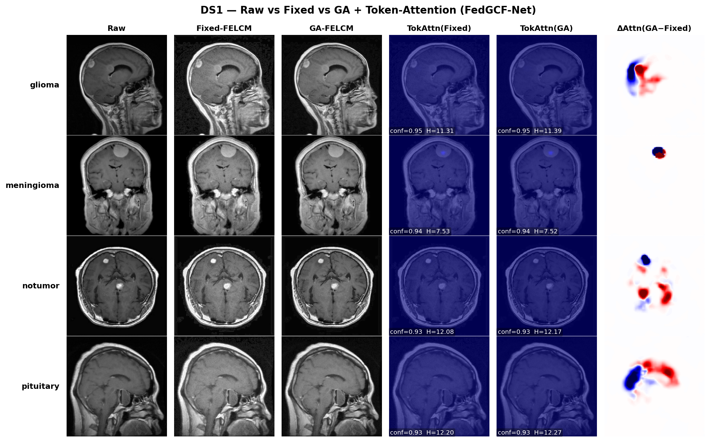
    


    
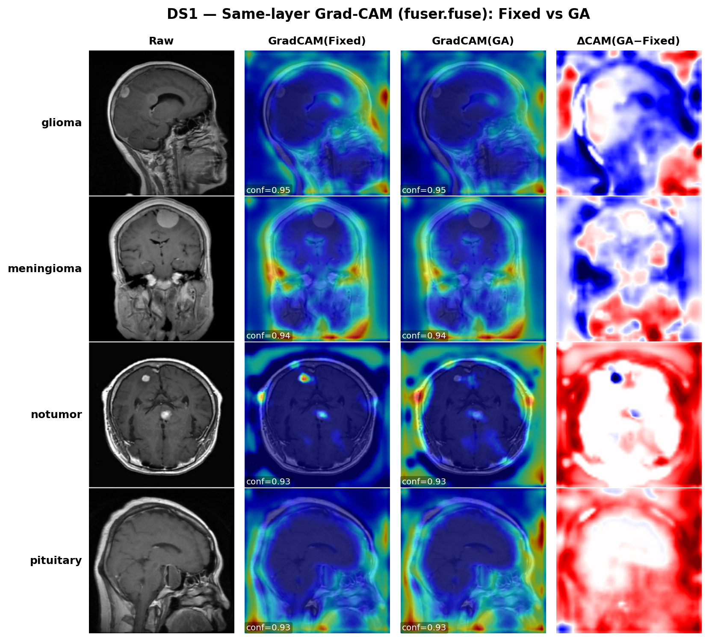
    


    
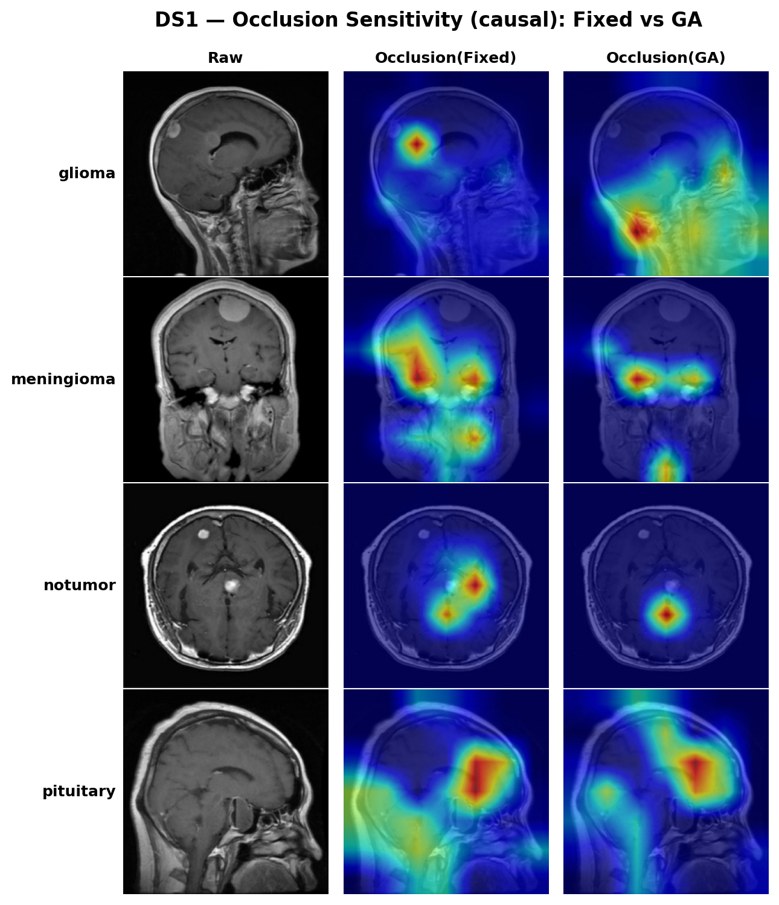
    


    
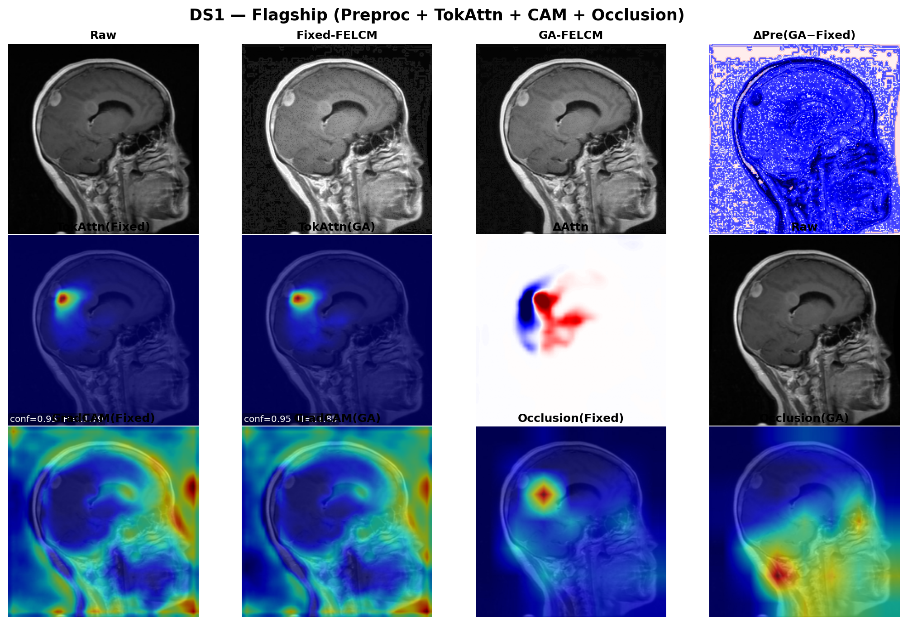
    


    
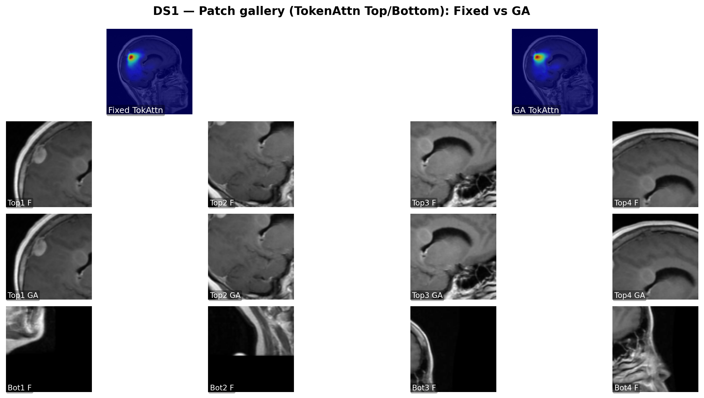
    


    
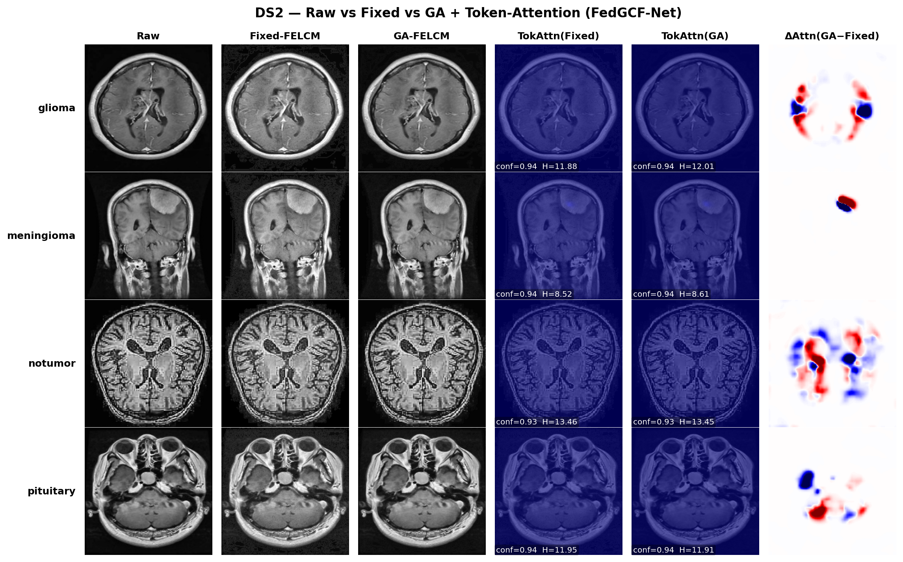
    


    

    


    
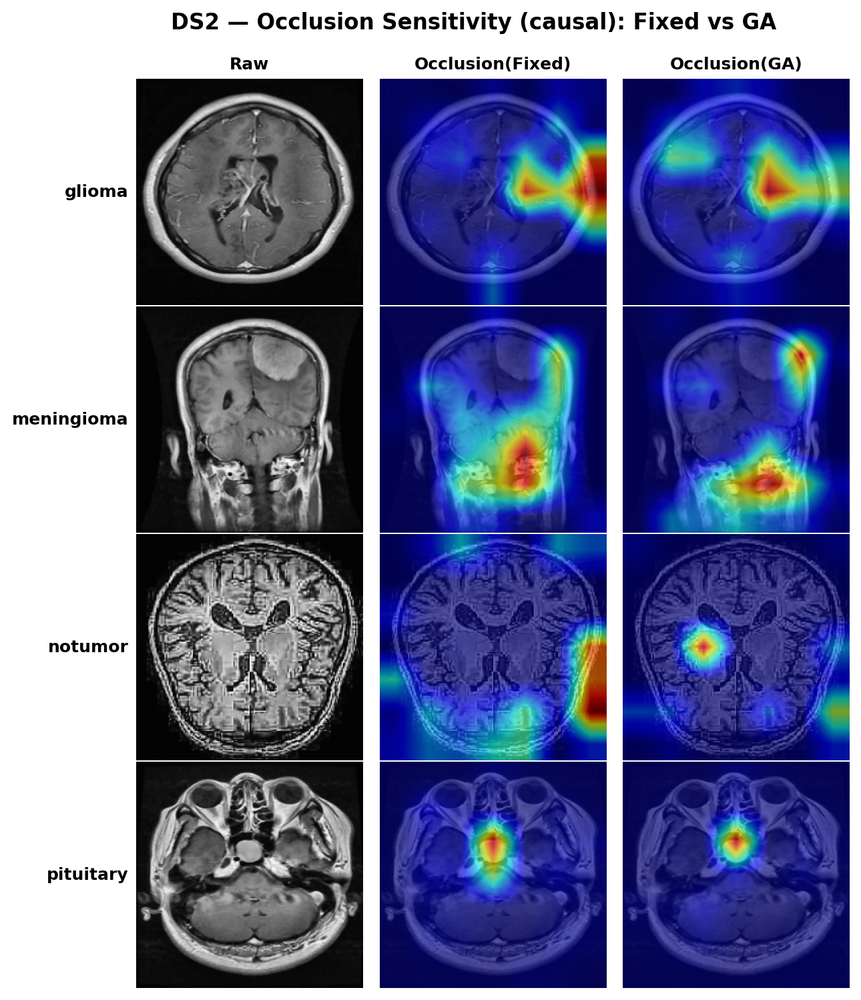
    


    
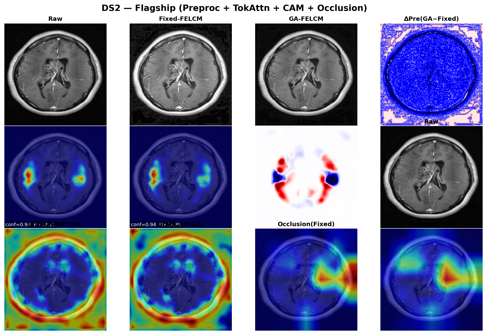
    


    
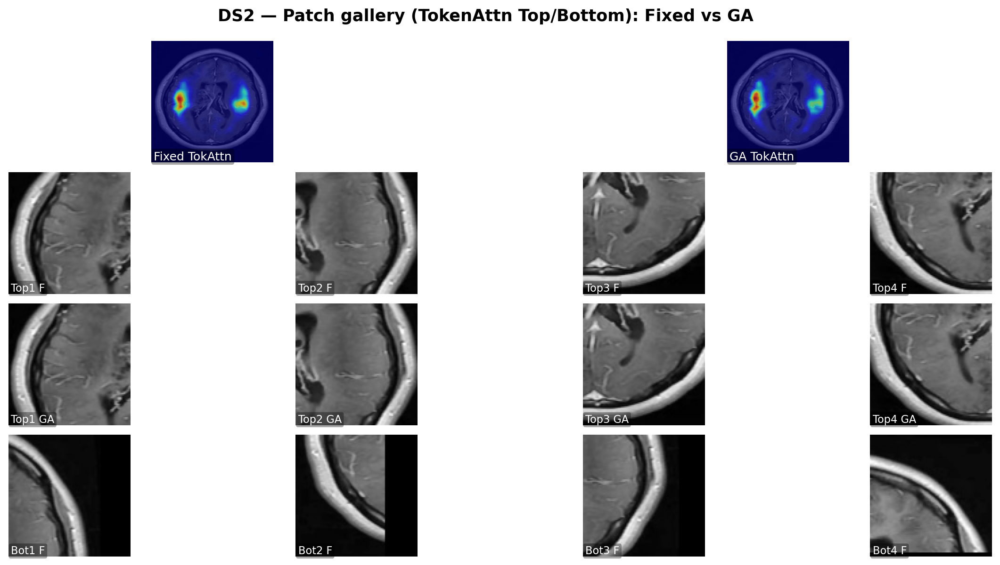
    


    
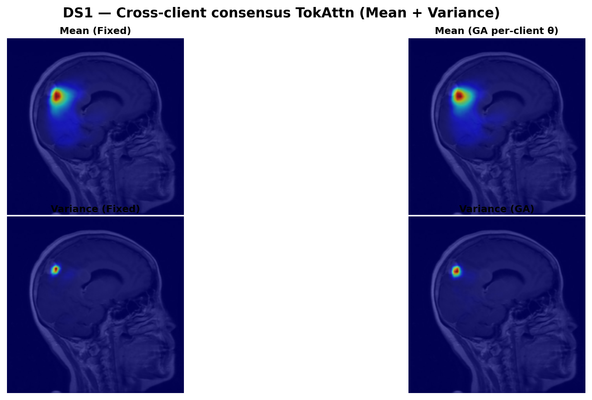
    


    
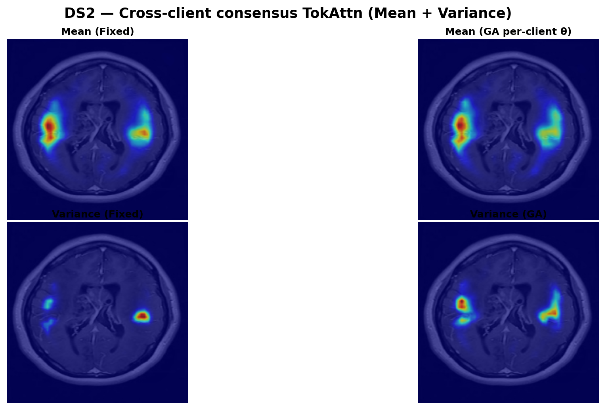
    


    ✅ Done. Titles are outside grids, no per-subplot titles above images, compact spacing.
    


```python
# ============================================================
# FedGCF-Net XAI / Heatmap Figure Generator (TIGHT + CLEAN TITLES)
# - No titles overlapping images
# - No per-tile titles above axes (labels are OVERLAID inside tiles)
# - Column/row headers are placed OUTSIDE the grid (where used)
# - Very small inter-column/row spacing
# - Produces ALL plots:
#   (1) TokenAttn grid: Raw | Fixed | GA | TokAttn(F) | TokAttn(GA) | ΔAttn
#   (2) Grad-CAM grid: Raw | CAM(F) | CAM(GA) | ΔCAM
#   (3) Occlusion grid: Raw | Occ(F) | Occ(GA)
#   (4) Flagship (single sample): Preproc + TokAttn + CAM + Occlusion (tight)
#   (5) Patch gallery: TokAttn + TopK/BottomK patches (Fixed vs GA) (tight)
#   (6) Cross-client consensus: Mean + Variance (Fixed vs GA per-client θ) (tight)
# ============================================================

import os, random, math
import numpy as np
import pandas as pd
from PIL import Image

import torch
import torch.nn as nn
import torch.nn.functional as F

import matplotlib.pyplot as plt
from matplotlib import gridspec

# ---------- GLOBAL PLOT STYLE ----------
plt.rcParams.update({
    "figure.dpi": 170,
    "axes.titlesize": 10,
    "axes.titlepad": 6,
    "font.size": 10,
})

# ---------- REPRO + DEVICE ----------
SEED = 42
random.seed(SEED)
np.random.seed(SEED)
torch.manual_seed(SEED)
if torch.cuda.is_available():
    torch.cuda.manual_seed_all(SEED)

DEVICE = torch.device("cuda" if torch.cuda.is_available() else "cpu")
print("DEVICE:", DEVICE)

# ---------- timm ----------
try:
    import timm
except Exception:
    import sys, subprocess
    subprocess.check_call([sys.executable, "-m", "pip", "-q", "install", "timm"])
    import timm

from torchvision import transforms

IMG_EXTS = (".jpg",".jpeg",".png",".bmp",".tif",".tiff",".webp")

# ============================================================
# 0) Load checkpoint
# ============================================================
CKPT_BASENAME = "FL_GAFELCM_PVTv2B2_FUSION_checkpoint.pth"

def find_checkpoint():
    fast = [
        CKPT_BASENAME,
        os.path.join("/content", CKPT_BASENAME),
        os.path.join("/mnt/data", CKPT_BASENAME),
        "/mnt/data/FL_GAFELCM_PVTv2B2_FUSION_checkpoint.pth",
    ]
    for p in fast:
        if os.path.exists(p):
            return p
    for root in ["/content", os.getcwd(), "/mnt/data"]:
        if os.path.isdir(root):
            for r, _, files in os.walk(root):
                if CKPT_BASENAME in files:
                    return os.path.join(r, CKPT_BASENAME)
    return None

CKPT_PATH = find_checkpoint()
if CKPT_PATH is None:
    raise FileNotFoundError(f"Checkpoint not found: {CKPT_BASENAME}")

ckpt = torch.load(CKPT_PATH, map_location="cpu")
print("Loaded checkpoint:", os.path.basename(CKPT_PATH))

CFG = ckpt.get("config", {})
labels = ckpt.get("labels", ["glioma", "meningioma", "notumor", "pituitary"])
label2id = ckpt.get("label2id", {l:i for i,l in enumerate(labels)})
id2label = ckpt.get("id2label", {i:l for l,i in label2id.items()})
NUM_CLASSES = len(labels)

CLIENTS_PER_DS = int(CFG.get("clients_per_dataset", 3))
CLIENTS_TOTAL  = int(CFG.get("clients_total", 6))
BACKBONE_NAME  = str(ckpt.get("backbone_name", CFG.get("backbone_name", "pvt_v2_b2")))

IMG_SIZE = int(CFG.get("img_size", 224))
if IMG_SIZE < 96:
    IMG_SIZE = 224

IMAGENET_MEAN = torch.tensor([0.485, 0.456, 0.406], device=DEVICE).view(1,3,1,1)
IMAGENET_STD  = torch.tensor([0.229, 0.224, 0.225], device=DEVICE).view(1,3,1,1)

EVAL_TFMS = transforms.Compose([
    transforms.Resize((IMG_SIZE, IMG_SIZE)),
    transforms.ToTensor(),
])

# ============================================================
# 1) Robust dataset root resolution
# ============================================================
REQ1 = {"512Glioma", "512Meningioma", "512Normal", "512Pituitary"}  # DS1 dirs
REQ2 = {"glioma", "meningioma", "notumor", "pituitary"}             # DS2 dirs

def find_root_with_required_class_dirs(base_dir, required_set, prefer_raw=True, max_candidates=40_000):
    if base_dir is None or (not os.path.isdir(base_dir)):
        return None
    candidates = []
    walked = 0
    for root, dirs, _ in os.walk(base_dir):
        walked += 1
        if walked > max_candidates:
            break
        if required_set.issubset(set(dirs)):
            candidates.append(root)
    if not candidates:
        return None
    def score(p):
        pl = p.lower()
        sc = 0
        if prefer_raw:
            if "raw data" in pl: sc += 8
            if os.path.basename(p).lower() == "raw": sc += 8
            if "/raw/" in pl or "\\raw\\" in pl: sc += 4
            if "augmented" in pl: sc -= 30
        sc -= 0.0001 * len(p)
        return sc
    return max(candidates, key=score)

def try_auto_locate_anywhere(required_set, prefer_raw):
    candidates = [
        "/content",
        "/content/data",
        "/content/datasets",
        "/kaggle/input",
        "/mnt",
        "/mnt/data",
        os.getcwd(),
    ]
    for base in candidates:
        r = find_root_with_required_class_dirs(base, required_set, prefer_raw=prefer_raw)
        if r is not None:
            return r
    return None

def ensure_kagglehub():
    try:
        import kagglehub
        return kagglehub
    except Exception:
        import sys, subprocess
        subprocess.check_call([sys.executable, "-m", "pip", "-q", "install", "kagglehub"])
        import kagglehub
        return kagglehub

def resolve_dataset_roots():
    ds1_root_ckpt = ckpt.get("dataset1_raw_root", None)
    ds2_root_ckpt = ckpt.get("dataset2_root", None)

    ds1_root = ds1_root_ckpt if (ds1_root_ckpt and os.path.isdir(ds1_root_ckpt)) else None
    ds2_root = ds2_root_ckpt if (ds2_root_ckpt and os.path.isdir(ds2_root_ckpt)) else None

    if ds1_root is None:
        ds1_root = try_auto_locate_anywhere(REQ1, prefer_raw=True)
    if ds2_root is None:
        ds2_root = try_auto_locate_anywhere(REQ2, prefer_raw=False)

    if ds1_root is None or ds2_root is None:
        try:
            kagglehub = ensure_kagglehub()
            ds2_base = kagglehub.dataset_download("yassinebazgour/preprocessed-brain-mri-scans-for-tumors-detection")
            ds1_base = kagglehub.dataset_download("orvile/pmram-bangladeshi-brain-cancer-mri-dataset")
            if ds1_root is None:
                ds1_root = find_root_with_required_class_dirs(ds1_base, REQ1, prefer_raw=True)
            if ds2_root is None:
                ds2_root = find_root_with_required_class_dirs(ds2_base, REQ2, prefer_raw=False)
        except Exception as e:
            print("⚠️ kagglehub download failed:", str(e))
    return ds1_root, ds2_root

DS1_ROOT, DS2_ROOT = resolve_dataset_roots()
print("DS1_ROOT:", DS1_ROOT)
print("DS2_ROOT:", DS2_ROOT)

if DS1_ROOT is None or (not os.path.isdir(DS1_ROOT)):
    raise FileNotFoundError(f"Could not locate DS1 root containing: {sorted(list(REQ1))}")
if DS2_ROOT is None or (not os.path.isdir(DS2_ROOT)):
    raise FileNotFoundError(f"Could not locate DS2 root containing: {sorted(list(REQ2))}")

# ============================================================
# 2) GA-FELCM
# ============================================================
class EnhancedFELCM(nn.Module):
    def __init__(self, gamma=1.0, alpha=0.35, beta=6.0, tau=2.5, blur_k=7, sharpen=0.0, denoise=0.0):
        super().__init__()
        self.gamma = float(gamma)
        self.alpha = float(alpha)
        self.beta  = float(beta)
        self.tau   = float(tau)
        self.blur_k = int(blur_k)
        self.sharpen = float(sharpen)
        self.denoise = float(denoise)

        lap = torch.tensor([[0, -1, 0], [-1, 4, -1], [0, -1, 0]], dtype=torch.float32)
        self.register_buffer("lap", lap.view(1, 1, 3, 3))

        sharp = torch.tensor([[0, -1, 0], [-1, 5, -1], [0, -1, 0]], dtype=torch.float32)
        self.register_buffer("sharp_kernel", sharp.view(1, 1, 3, 3))

    def forward(self, x):
        eps = 1e-6
        B, C, H, W = x.shape

        if self.denoise > 0:
            k = 3
            x_blur = F.avg_pool2d(F.pad(x, (1, 1, 1, 1), mode="reflect"), k, 1)
            x = x * (1 - self.denoise) + x_blur * self.denoise

        mu = x.mean(dim=(2, 3), keepdim=True)
        sd = x.std(dim=(2, 3), keepdim=True).clamp_min(eps)
        x0 = (x - mu) / sd
        x0 = x0.clamp(-self.tau, self.tau)

        x1 = torch.sign(x0) * torch.pow(torch.abs(x0).clamp_min(eps), self.gamma)

        gray = x1.mean(dim=1, keepdim=True)
        lap = F.conv2d(F.pad(gray, (1, 1, 1, 1), mode="reflect"), self.lap)
        mag = lap.abs()

        k = self.blur_k if self.blur_k % 2 == 1 else self.blur_k + 1
        pad = k // 2
        blur = F.avg_pool2d(F.pad(mag, (pad, pad, pad, pad), mode="reflect"), k, 1)
        C_map = mag / (blur + eps)

        x2 = x1 + self.alpha * torch.tanh(self.beta * C_map)

        if self.sharpen > 0:
            outs = []
            for c in range(C):
                x_c = x2[:, c: c + 1, :, :]
                x_sharp = F.conv2d(F.pad(x_c, (1, 1, 1, 1), mode="reflect"), self.sharp_kernel)
                outs.append(x_c * (1 - self.sharpen) + x_sharp * self.sharpen)
            x2 = torch.cat(outs, dim=1)

        mn = x2.amin(dim=(2, 3), keepdim=True)
        mx = x2.amax(dim=(2, 3), keepdim=True)
        x3 = (x2 - mn) / (mx - mn + eps)
        return x3.clamp(0, 1)

def theta_to_module(theta):
    if theta is None:
        return EnhancedFELCM()
    g, a, b, t, k, sh, dn = theta
    return EnhancedFELCM(gamma=g, alpha=a, beta=b, tau=t, blur_k=int(k), sharpen=sh, denoise=dn)

def preproc_theta_vec(preproc_module, batch_size):
    theta = torch.tensor(
        [
            float(preproc_module.gamma),
            float(preproc_module.alpha),
            float(preproc_module.beta),
            float(preproc_module.tau),
            float(preproc_module.blur_k) / 7.0,
            float(preproc_module.sharpen),
            float(preproc_module.denoise),
        ],
        device=DEVICE,
        dtype=torch.float32,
    )
    return theta.unsqueeze(0).repeat(batch_size, 1)

fixed_pre = EnhancedFELCM().to(DEVICE).eval()
best_theta_ds1 = ckpt.get("best_theta_ds1", None)
best_theta_ds2 = ckpt.get("best_theta_ds2", None)
ga_pre_ds1 = theta_to_module(best_theta_ds1).to(DEVICE).eval()
ga_pre_ds2 = theta_to_module(best_theta_ds2).to(DEVICE).eval()

print("best_theta_ds1:", best_theta_ds1)
print("best_theta_ds2:", best_theta_ds2)

# ============================================================
# 3) FedGCF-Net pieces (PVTv2 + fusion + tri-gate)
# ============================================================
class TokenAttentionPooling(nn.Module):
    def __init__(self, dim):
        super().__init__()
        self.query = nn.Linear(dim, 1)
    def forward(self, x_tokens):  # [B, HW, C]
        attn = torch.softmax(self.query(x_tokens).squeeze(-1), dim=1)  # [B, HW]
        pooled = (x_tokens * attn.unsqueeze(-1)).sum(dim=1)
        return pooled, attn

class MultiScaleFeatureFuser(nn.Module):
    def __init__(self, in_channels, out_dim):
        super().__init__()
        self.proj = nn.ModuleList([
            nn.Sequential(
                nn.Conv2d(c, out_dim, kernel_size=1, bias=False),
                nn.GroupNorm(8, out_dim),
                nn.GELU(),
            )
            for c in in_channels
        ])
        self.fuse = nn.Sequential(
            nn.Conv2d(out_dim, out_dim, kernel_size=3, padding=1, bias=False),
            nn.GroupNorm(8, out_dim),
            nn.GELU(),
        )
        self.pool = TokenAttentionPooling(out_dim)

class EnhancedBrainTuner(nn.Module):
    def __init__(self, dim, dropout=0.1):
        super().__init__()
        self.se = nn.Sequential(
            nn.Linear(dim, max(8, dim // 4)),
            nn.ReLU(inplace=True),
            nn.Linear(max(8, dim // 4), dim),
            nn.Sigmoid(),
        )
        self.refine = nn.Sequential(
            nn.LayerNorm(dim),
            nn.Linear(dim, dim),
            nn.GELU(),
            nn.Dropout(dropout),
            nn.Linear(dim, dim),
        )
        self.gate = nn.Parameter(torch.ones(2) / 2)
    def forward(self, x):
        gate = F.softmax(self.gate, dim=0)
        out1 = x * self.se(x)
        out2 = x + 0.2 * self.refine(x)
        return gate[0] * out1 + gate[1] * out2

class PVTv2B2_MultiScale(nn.Module):
    def __init__(self, num_classes, head_dropout=0.3, cond_dim=128, num_clients=6):
        super().__init__()
        self.backbone = timm.create_model(
            BACKBONE_NAME,
            pretrained=False,
            features_only=True,
            out_indices=(0,1,2,3),
        )
        in_channels = self.backbone.feature_info.channels()
        out_dim = max(256, in_channels[-1] // 2)

        self.fuser = MultiScaleFeatureFuser(in_channels, out_dim)
        self.tuner = EnhancedBrainTuner(out_dim, dropout=0.1)

        self.classifier = nn.Sequential(
            nn.LayerNorm(out_dim),
            nn.Dropout(head_dropout),
            nn.Linear(out_dim, max(64, out_dim // 2)),
            nn.GELU(),
            nn.Dropout(head_dropout * 0.5),
            nn.Linear(max(64, out_dim // 2), num_classes),
        )

        self.theta_mlp = nn.Sequential(
            nn.Linear(7, cond_dim),
            nn.GELU(),
            nn.Linear(cond_dim, cond_dim),
        )
        self.source_emb = nn.Embedding(2, cond_dim)
        self.client_emb = nn.Embedding(num_clients, cond_dim)
        self.cond_norm = nn.LayerNorm(cond_dim)

        self.gate_early = nn.Linear(cond_dim, 3)
        self.gate_mid   = nn.Linear(cond_dim, out_dim)
        self.gate_late  = nn.Linear(cond_dim, out_dim)

    def _cond_vec(self, theta_vec, source_id, client_id):
        cond = self.theta_mlp(theta_vec)
        cond = cond + self.source_emb(source_id) + self.client_emb(client_id)
        return self.cond_norm(cond)

model = PVTv2B2_MultiScale(
    num_classes=NUM_CLASSES,
    head_dropout=float(CFG.get("head_dropout", 0.3)),
    cond_dim=int(CFG.get("cond_dim", 128)),
    num_clients=CLIENTS_TOTAL,
).to(DEVICE).eval()

sd = ckpt.get("state_dict", None)
if sd is None:
    raise RuntimeError("Checkpoint missing state_dict.")
model.load_state_dict(sd, strict=True)
print("✅ Model weights loaded.")

# ============================================================
# 4) Samples (one per class)
# ============================================================
DS1_CLASS_DIRS = {
    "glioma": "512Glioma",
    "meningioma": "512Meningioma",
    "notumor": "512Normal",
    "pituitary": "512Pituitary",
}
DS2_CLASS_DIRS = {
    "glioma": "glioma",
    "meningioma": "meningioma",
    "notumor": "notumor",
    "pituitary": "pituitary",
}

def list_images_under_class_root(class_root, class_dir_name):
    class_dir = os.path.join(class_root, class_dir_name)
    out = []
    if not os.path.isdir(class_dir):
        return out
    for r, _, files in os.walk(class_dir):
        for fn in files:
            if fn.lower().endswith(IMG_EXTS):
                out.append(os.path.join(r, fn))
    return out

def pick_one_per_class_from_root(ds_root, class_dirs_map, seed=SEED):
    rng = random.Random(seed)
    samples = {}
    for lab in labels:
        dir_name = class_dirs_map[lab]
        imgs = list_images_under_class_root(ds_root, dir_name)
        samples[lab] = rng.choice(imgs) if len(imgs) else None
    return samples

def fill_missing_samples(ds_root, class_dirs_map, samples, tries=6):
    for t in range(tries):
        if all(samples[l] is not None for l in labels):
            return samples
        s2 = pick_one_per_class_from_root(ds_root, class_dirs_map, seed=SEED + 100 + t)
        for l in labels:
            if samples[l] is None:
                samples[l] = s2[l]
    return samples

ds1_samples = fill_missing_samples(DS1_ROOT, DS1_CLASS_DIRS, pick_one_per_class_from_root(DS1_ROOT, DS1_CLASS_DIRS, seed=SEED))
ds2_samples = fill_missing_samples(DS2_ROOT, DS2_CLASS_DIRS, pick_one_per_class_from_root(DS2_ROOT, DS2_CLASS_DIRS, seed=SEED + 7))

if any(ds1_samples[l] is None for l in labels):
    raise RuntimeError("DS1: missing class image(s).")
if any(ds2_samples[l] is None for l in labels):
    raise RuntimeError("DS2: missing class image(s).")

def load_rgb(path):
    return Image.open(path).convert("RGB")

# ============================================================
# 5) Extraction helpers (TokAttn, CAM, Occlusion)
# ============================================================
def fuser_conv_pooled_attn(fuser, feats):
    proj_feats = [p(f) for p, f in zip(fuser.proj, feats)]
    x = proj_feats[-1]
    for f in reversed(proj_feats[:-1]):
        x = F.interpolate(x, size=f.shape[-2:], mode="bilinear", align_corners=False)
        x = x + f
    x = fuser.fuse(x)  # [B,C,H,W]
    B, C, H, W = x.shape
    tokens = x.flatten(2).transpose(1, 2)  # [B,HW,C]
    pooled, attn = fuser.pool(tokens)       # pooled [B,C], attn [B,HW]
    attn_map = attn.view(B, H, W)
    return x, pooled, attn_map

def attn_entropy_from_map(attn_2d):
    p = attn_2d.flatten().clamp(1e-9, 1.0)
    p = p / p.sum()
    return float(-(p * torch.log2(p)).sum().item())

def to_gray_np(x01_1x3):
    g = x01_1x3[0].mean(dim=0).detach().cpu().numpy()
    return np.clip(g, 0, 1)

def upsample_map(m, out_hw):
    if isinstance(m, np.ndarray):
        t = torch.tensor(m)[None,None,:,:].float()
    else:
        t = m[None,None,:,:].float()
    t2 = F.interpolate(t, size=out_hw, mode="bilinear", align_corners=False)[0,0]
    return t2.detach().cpu().numpy()

def overlay_heat(gray01, heat01, alpha=0.6, cmap_name="jet"):
    gray3 = np.stack([gray01, gray01, gray01], axis=-1)
    cmap = getattr(plt.cm, cmap_name)
    heat3 = cmap(np.clip(heat01, 0, 1))[...,:3]
    out = (1-alpha)*gray3 + alpha*heat3
    return np.clip(out, 0, 1)

def diverging_map(delta, clip_q=0.98):
    d = delta.astype(np.float32)
    s = np.quantile(np.abs(d), clip_q) + 1e-9
    d = np.clip(d / s, -1, 1)
    rgb = plt.cm.seismic((d + 1.0) / 2.0)[...,:3]
    return np.clip(rgb, 0, 1)

def label_box(ax, text, loc="tl", fontsize=9):
    if text is None or text == "":
        return
    ha, va = "left", "top"
    x, y = 0.02, 0.98
    if loc == "tr":
        ha, va = "right", "top"
        x, y = 0.98, 0.98
    elif loc == "bl":
        ha, va = "left", "bottom"
        x, y = 0.02, 0.02
    elif loc == "br":
        ha, va = "right", "bottom"
        x, y = 0.98, 0.02
    ax.text(
        x, y, text,
        transform=ax.transAxes,
        ha=ha, va=va,
        color="white",
        fontsize=fontsize,
        bbox=dict(boxstyle="round,pad=0.25", fc="black", ec="none", alpha=0.55),
        zorder=10,
    )

def add_col_headers(fig, axes_top_row, headers, y_pad=0.012, fontsize=11):
    for ax, h in zip(axes_top_row, headers):
        bb = ax.get_position()
        x = (bb.x0 + bb.x1) / 2
        y = bb.y1 + y_pad
        fig.text(x, y, h, ha="center", va="bottom", fontsize=fontsize, fontweight="bold")

def add_row_labels(fig, axes_left_col, row_labels, x_pad=0.012, fontsize=11):
    for ax, lab in zip(axes_left_col, row_labels):
        bb = ax.get_position()
        x = bb.x0 - x_pad
        y = (bb.y0 + bb.y1) / 2
        fig.text(x, y, lab, ha="right", va="center", fontsize=fontsize, fontweight="bold")

@torch.no_grad()
def run_token_attn_only(x01, preproc, source_id, client_id):
    x01 = x01.to(DEVICE)
    x_fel = preproc(x01).clamp(0,1)
    x_raw_n = (x01 - IMAGENET_MEAN) / IMAGENET_STD
    x_fel_n = (x_fel - IMAGENET_MEAN) / IMAGENET_STD

    theta_vec = preproc_theta_vec(preproc, batch_size=1)
    sid = torch.tensor([source_id], device=DEVICE, dtype=torch.long)
    cid = torch.tensor([client_id], device=DEVICE, dtype=torch.long)

    cond = model._cond_vec(theta_vec, sid, cid)
    g0 = torch.sigmoid(model.gate_early(cond)).view(-1,3,1,1)
    xmix = (1-g0)*x_raw_n + g0*x_fel_n

    feats0 = model.backbone(xmix)
    _, f0, att0 = fuser_conv_pooled_attn(model.fuser, feats0)

    feats1 = model.backbone(x_fel_n)
    _, f1, _ = fuser_conv_pooled_attn(model.fuser, feats1)

    g1 = torch.sigmoid(model.gate_mid(cond))
    f_mid = (1-g1)*f0 + g1*f1

    t0 = model.tuner(f0)
    t1 = model.tuner(f1)
    t_mid = model.tuner(f_mid)

    t_views = 0.5*(t0+t1)
    g2 = torch.sigmoid(model.gate_late(cond))
    t_final = (1-g2)*t_mid + g2*t_views

    logits = model.classifier(t_final)
    prob = torch.softmax(logits, dim=1)[0]
    conf = float(prob.max().item())
    pred = int(prob.argmax().item())

    return {
        "attn_map": att0[0].detach().cpu(),  # [h,w]
        "conf": conf,
        "pred": pred,
    }

def gradcam_same_layer(x01, preproc, source_id, client_id, target_class=None):
    model.eval()
    preproc.eval()

    x01 = x01.to(DEVICE)
    x_fel = preproc(x01).clamp(0,1)
    x_raw_n = (x01 - IMAGENET_MEAN) / IMAGENET_STD
    x_fel_n = (x_fel - IMAGENET_MEAN) / IMAGENET_STD

    theta_vec = preproc_theta_vec(preproc, batch_size=1)
    sid = torch.tensor([source_id], device=DEVICE, dtype=torch.long)
    cid = torch.tensor([client_id], device=DEVICE, dtype=torch.long)

    model.zero_grad(set_to_none=True)

    cond = model._cond_vec(theta_vec, sid, cid)
    g0 = torch.sigmoid(model.gate_early(cond)).view(-1,3,1,1)
    xmix = (1-g0)*x_raw_n + g0*x_fel_n

    feats0 = model.backbone(xmix)
    conv0, f0, _ = fuser_conv_pooled_attn(model.fuser, feats0)
    conv0.retain_grad()

    feats1 = model.backbone(x_fel_n)
    _, f1, _ = fuser_conv_pooled_attn(model.fuser, feats1)

    g1 = torch.sigmoid(model.gate_mid(cond))
    f_mid = (1-g1)*f0 + g1*f1

    t0 = model.tuner(f0)
    t1 = model.tuner(f1)
    t_mid = model.tuner(f_mid)

    t_views = 0.5*(t0+t1)
    g2 = torch.sigmoid(model.gate_late(cond))
    t_final = (1-g2)*t_mid + g2*t_views

    logits = model.classifier(t_final)
    prob = torch.softmax(logits, dim=1)[0]
    pred = int(prob.argmax().item())
    if target_class is None:
        target_class = pred

    logits[0, target_class].backward()

    grad = conv0.grad[0]       # [C,h,w]
    act  = conv0.detach()[0]   # [C,h,w]
    w = grad.mean(dim=(1,2), keepdim=True)
    cam = torch.relu((w * act).sum(dim=0))
    cam = cam - cam.min()
    cam = cam / (cam.max() + 1e-9)

    conf = float(prob.max().item())
    return cam.detach().cpu(), conf, pred, int(target_class)

@torch.no_grad()
def occlusion_sensitivity_map(x01, preproc, source_id, client_id, patch=32, stride=32, target_class=None):
    x01 = x01.to(DEVICE)

    x_fel = preproc(x01).clamp(0,1)
    x_raw_n = (x01 - IMAGENET_MEAN) / IMAGENET_STD
    x_fel_n = (x_fel - IMAGENET_MEAN) / IMAGENET_STD

    theta_vec = preproc_theta_vec(preproc, batch_size=1)
    sid = torch.tensor([source_id], device=DEVICE, dtype=torch.long)
    cid = torch.tensor([client_id], device=DEVICE, dtype=torch.long)

    cond = model._cond_vec(theta_vec, sid, cid)
    g0 = torch.sigmoid(model.gate_early(cond)).view(-1,3,1,1)
    xmix = (1-g0)*x_raw_n + g0*x_fel_n

    feats0 = model.backbone(xmix)
    _, f0, _ = fuser_conv_pooled_attn(model.fuser, feats0)

    feats1 = model.backbone(x_fel_n)
    _, f1, _ = fuser_conv_pooled_attn(model.fuser, feats1)

    g1 = torch.sigmoid(model.gate_mid(cond))
    f_mid = (1-g1)*f0 + g1*f1

    t0 = model.tuner(f0)
    t1 = model.tuner(f1)
    t_mid = model.tuner(f_mid)

    t_views = 0.5*(t0+t1)
    g2 = torch.sigmoid(model.gate_late(cond))
    t_final = (1-g2)*t_mid + g2*t_views

    logits = model.classifier(t_final)
    prob = torch.softmax(logits, dim=1)[0]
    pred = int(prob.argmax().item())
    if target_class is None:
        target_class = pred
    base_p = float(prob[target_class].item())

    _, _, H, W = x01.shape
    ys = list(range(0, H, stride))
    xs = list(range(0, W, stride))
    grid = np.zeros((len(ys), len(xs)), dtype=np.float32)

    for iy, y0 in enumerate(ys):
        for ix, x0p in enumerate(xs):
            x_mask = x01.clone()
            y1 = min(H, y0 + patch)
            x1 = min(W, x0p + patch)
            x_mask[:, :, y0:y1, x0p:x1] = 0.0

            x_fel_m = preproc(x_mask).clamp(0,1)
            x_raw_n_m = (x_mask - IMAGENET_MEAN) / IMAGENET_STD
            x_fel_n_m = (x_fel_m - IMAGENET_MEAN) / IMAGENET_STD

            cond_m = model._cond_vec(theta_vec, sid, cid)
            g0m = torch.sigmoid(model.gate_early(cond_m)).view(-1,3,1,1)
            xmix_m = (1-g0m)*x_raw_n_m + g0m*x_fel_n_m

            feats0m = model.backbone(xmix_m)
            _, f0m, _ = fuser_conv_pooled_attn(model.fuser, feats0m)

            feats1m = model.backbone(x_fel_n_m)
            _, f1m, _ = fuser_conv_pooled_attn(model.fuser, feats1m)

            g1m = torch.sigmoid(model.gate_mid(cond_m))
            f_mid_m = (1-g1m)*f0m + g1m*f1m

            t0m = model.tuner(f0m)
            t1m = model.tuner(f1m)
            t_mid_m = model.tuner(f_mid_m)

            t_views_m = 0.5*(t0m+t1m)
            g2m = torch.sigmoid(model.gate_late(cond_m))
            t_final_m = (1-g2m)*t_mid_m + g2m*t_views_m

            logits_m = model.classifier(t_final_m)
            prob_m = torch.softmax(logits_m, dim=1)[0]
            p_m = float(prob_m[target_class].item())

            grid[iy, ix] = max(0.0, base_p - p_m)

    if grid.max() > 1e-9:
        grid = grid / grid.max()
    return grid

# ============================================================
# 6) TIGHT PLOTTING (NO TITLE OVERLAP)
# ============================================================
def _imshow(ax, img, gray=False):
    ax.axis("off")
    if gray:
        ax.imshow(img, cmap="gray", vmin=0, vmax=1, interpolation="nearest", aspect="equal")
    else:
        ax.imshow(img, interpolation="nearest", aspect="equal")

def plot_tokenattn_grid(ds_name, sample_map, source_id, rep_client_id, pre_ga):
    headers = ["Raw", "Fixed-FELCM", "GA-FELCM", "TokAttn(Fixed)", "TokAttn(GA)", "ΔAttn(GA−Fixed)"]

    fig = plt.figure(figsize=(14.2, 9.2))
    gs = gridspec.GridSpec(NUM_CLASSES, 6, figure=fig, wspace=0.002, hspace=0.002)

    axes = [[None]*6 for _ in range(NUM_CLASSES)]

    for r, lab in enumerate(labels):
        x = EVAL_TFMS(load_rgb(sample_map[lab])).unsqueeze(0)
        gray = to_gray_np(x)

        with torch.no_grad():
            x_fixed = fixed_pre(x.to(DEVICE)).clamp(0,1).cpu()
            x_ga    = pre_ga(x.to(DEVICE)).clamp(0,1).cpu()

        gray_fixed = to_gray_np(x_fixed)
        gray_ga    = to_gray_np(x_ga)

        out_fixed = run_token_attn_only(x, fixed_pre, source_id, rep_client_id)
        out_ga    = run_token_attn_only(x, pre_ga,    source_id, rep_client_id)

        att_fixed_u = upsample_map(out_fixed["attn_map"], (IMG_SIZE, IMG_SIZE))
        att_ga_u    = upsample_map(out_ga["attn_map"],    (IMG_SIZE, IMG_SIZE))

        ent_fixed = attn_entropy_from_map(torch.tensor(att_fixed_u))
        ent_ga    = attn_entropy_from_map(torch.tensor(att_ga_u))

        ov_fixed = overlay_heat(gray_fixed, np.clip(att_fixed_u,0,1), alpha=0.62, cmap_name="jet")
        ov_ga    = overlay_heat(gray_ga,    np.clip(att_ga_u,0,1),    alpha=0.62, cmap_name="jet")

        delta = att_ga_u - att_fixed_u
        delta_rgb = diverging_map(delta)

        tiles = [
            (gray, True,  lab),  # row label as overlay only in first col
            (gray_fixed, True, ""),
            (gray_ga, True, ""),
            (ov_fixed, False, f"conf={out_fixed['conf']:.2f}  H={ent_fixed:.2f}"),
            (ov_ga,    False, f"conf={out_ga['conf']:.2f}  H={ent_ga:.2f}"),
            (delta_rgb, False, ""),
        ]

        for c in range(6):
            ax = fig.add_subplot(gs[r, c])
            axes[r][c] = ax
            _imshow(ax, tiles[c][0], gray=tiles[c][1])

            if c == 0:
                label_box(ax, lab, loc="bl", fontsize=11)
            if tiles[c][2]:
                label_box(ax, tiles[c][2], loc="tl", fontsize=9)

    fig.subplots_adjust(left=0.06, right=0.995, bottom=0.02, top=0.92, wspace=0.002, hspace=0.002)
    fig.suptitle(f"{ds_name.upper()} — Raw vs Fixed vs GA + Token-Attention (FedGCF-Net)", y=0.985, fontsize=16, fontweight="bold")
    add_col_headers(fig, [axes[0][i] for i in range(6)], headers, y_pad=0.010, fontsize=12)
    plt.show()

def plot_gradcam_grid(ds_name, sample_map, source_id, rep_client_id, pre_ga):
    headers = ["Raw", "Grad-CAM(Fixed)", "Grad-CAM(GA)", "ΔCAM(GA−Fixed)"]

    fig = plt.figure(figsize=(11.2, 9.2))
    gs = gridspec.GridSpec(NUM_CLASSES, 4, figure=fig, wspace=0.002, hspace=0.002)

    axes = [[None]*4 for _ in range(NUM_CLASSES)]

    for r, lab in enumerate(labels):
        x = EVAL_TFMS(load_rgb(sample_map[lab])).unsqueeze(0)
        gray = to_gray_np(x)
        target = label2id[lab]

        cam_f, conf_f, _, _ = gradcam_same_layer(x, fixed_pre, source_id, rep_client_id, target_class=target)
        cam_g, conf_g, _, _ = gradcam_same_layer(x, pre_ga,    source_id, rep_client_id, target_class=target)

        cam_f_u = upsample_map(cam_f, (IMG_SIZE, IMG_SIZE))
        cam_g_u = upsample_map(cam_g, (IMG_SIZE, IMG_SIZE))

        ov_f = overlay_heat(gray, np.clip(cam_f_u,0,1), alpha=0.62, cmap_name="jet")
        ov_g = overlay_heat(gray, np.clip(cam_g_u,0,1), alpha=0.62, cmap_name="jet")
        delta_rgb = diverging_map(cam_g_u - cam_f_u)

        tiles = [
            (gray, True, lab),
            (ov_f, False, f"conf={conf_f:.2f}"),
            (ov_g, False, f"conf={conf_g:.2f}"),
            (delta_rgb, False, ""),
        ]

        for c in range(4):
            ax = fig.add_subplot(gs[r, c])
            axes[r][c] = ax
            _imshow(ax, tiles[c][0], gray=tiles[c][1])
            if c == 0:
                label_box(ax, lab, loc="bl", fontsize=11)
            if tiles[c][2] and c != 0:
                label_box(ax, tiles[c][2], loc="tl", fontsize=9)

    fig.subplots_adjust(left=0.06, right=0.995, bottom=0.02, top=0.92, wspace=0.002, hspace=0.002)
    fig.suptitle(f"{ds_name.upper()} — Same-layer Grad-CAM (fuser.fuse): Fixed vs GA", y=0.985, fontsize=16, fontweight="bold")
    add_col_headers(fig, [axes[0][i] for i in range(4)], headers, y_pad=0.010, fontsize=12)
    plt.show()

def plot_occlusion_grid(ds_name, sample_map, source_id, rep_client_id, pre_ga, patch=32, stride=32):
    headers = ["Raw", "Occlusion(Fixed)", "Occlusion(GA)"]

    fig = plt.figure(figsize=(8.8, 9.2))
    gs = gridspec.GridSpec(NUM_CLASSES, 3, figure=fig, wspace=0.002, hspace=0.002)

    axes = [[None]*3 for _ in range(NUM_CLASSES)]

    for r, lab in enumerate(labels):
        x = EVAL_TFMS(load_rgb(sample_map[lab])).unsqueeze(0)
        gray = to_gray_np(x)
        target = label2id[lab]

        occ_f = occlusion_sensitivity_map(x, fixed_pre, source_id, rep_client_id, patch=patch, stride=stride, target_class=target)
        occ_g = occlusion_sensitivity_map(x, pre_ga,    source_id, rep_client_id, patch=patch, stride=stride, target_class=target)

        occ_f_u = upsample_map(occ_f, (IMG_SIZE, IMG_SIZE))
        occ_g_u = upsample_map(occ_g, (IMG_SIZE, IMG_SIZE))

        ov_f = overlay_heat(gray, np.clip(occ_f_u,0,1), alpha=0.62, cmap_name="jet")
        ov_g = overlay_heat(gray, np.clip(occ_g_u,0,1), alpha=0.62, cmap_name="jet")

        tiles = [
            (gray, True, lab),
            (ov_f, False, ""),
            (ov_g, False, ""),
        ]

        for c in range(3):
            ax = fig.add_subplot(gs[r, c])
            axes[r][c] = ax
            _imshow(ax, tiles[c][0], gray=tiles[c][1])
            if c == 0:
                label_box(ax, lab, loc="bl", fontsize=11)

    fig.subplots_adjust(left=0.06, right=0.995, bottom=0.02, top=0.92, wspace=0.002, hspace=0.002)
    fig.suptitle(f"{ds_name.upper()} — Occlusion Sensitivity (causal): Fixed vs GA", y=0.985, fontsize=16, fontweight="bold")
    add_col_headers(fig, [axes[0][i] for i in range(3)], headers, y_pad=0.010, fontsize=12)
    plt.show()

def plot_flagship_single(ds_name, sample_path, source_id, rep_client_id, pre_ga):
    x = EVAL_TFMS(load_rgb(sample_path)).unsqueeze(0)
    gray = to_gray_np(x)

    with torch.no_grad():
        x_fixed = fixed_pre(x.to(DEVICE)).clamp(0,1).cpu()
        x_ga    = pre_ga(x.to(DEVICE)).clamp(0,1).cpu()
    gray_fixed = to_gray_np(x_fixed)
    gray_ga    = to_gray_np(x_ga)

    pre_delta = (gray_ga - gray_fixed)
    pre_delta_rgb = diverging_map(pre_delta)

    tok_f = run_token_attn_only(x, fixed_pre, source_id, rep_client_id)
    tok_g = run_token_attn_only(x, pre_ga,    source_id, rep_client_id)
    att_f = upsample_map(tok_f["attn_map"], (IMG_SIZE, IMG_SIZE))
    att_g = upsample_map(tok_g["attn_map"], (IMG_SIZE, IMG_SIZE))
    att_delta_rgb = diverging_map(att_g - att_f)

    ent_f = attn_entropy_from_map(torch.tensor(att_f))
    ent_g = attn_entropy_from_map(torch.tensor(att_g))

    tok_f_ov = overlay_heat(gray, np.clip(att_f,0,1), alpha=0.62, cmap_name="jet")
    tok_g_ov = overlay_heat(gray, np.clip(att_g,0,1), alpha=0.62, cmap_name="jet")

    cam_f, conf_f, _, _ = gradcam_same_layer(x, fixed_pre, source_id, rep_client_id, target_class=None)
    cam_g, conf_g, _, _ = gradcam_same_layer(x, pre_ga,    source_id, rep_client_id, target_class=None)
    cam_f_u = upsample_map(cam_f, (IMG_SIZE, IMG_SIZE))
    cam_g_u = upsample_map(cam_g, (IMG_SIZE, IMG_SIZE))
    cam_f_ov = overlay_heat(gray, np.clip(cam_f_u,0,1), alpha=0.62, cmap_name="jet")
    cam_g_ov = overlay_heat(gray, np.clip(cam_g_u,0,1), alpha=0.62, cmap_name="jet")

    occ_f = occlusion_sensitivity_map(x, fixed_pre, source_id, rep_client_id, patch=32, stride=32, target_class=None)
    occ_g = occlusion_sensitivity_map(x, pre_ga,    source_id, rep_client_id, patch=32, stride=32, target_class=None)
    occ_f_u = upsample_map(occ_f, (IMG_SIZE, IMG_SIZE))
    occ_g_u = upsample_map(occ_g, (IMG_SIZE, IMG_SIZE))
    occ_f_ov = overlay_heat(gray, np.clip(occ_f_u,0,1), alpha=0.62, cmap_name="jet")
    occ_g_ov = overlay_heat(gray, np.clip(occ_g_u,0,1), alpha=0.62, cmap_name="jet")

    fig = plt.figure(figsize=(12.2, 9.2))
    gs = gridspec.GridSpec(3, 4, figure=fig, wspace=0.002, hspace=0.002)

    # Row 0: Preproc
    ax00 = fig.add_subplot(gs[0,0]); _imshow(ax00, gray, True);       label_box(ax00, "Raw", "tl", 10)
    ax01 = fig.add_subplot(gs[0,1]); _imshow(ax01, gray_fixed, True); label_box(ax01, "Fixed-FELCM", "tl", 10)
    ax02 = fig.add_subplot(gs[0,2]); _imshow(ax02, gray_ga, True);    label_box(ax02, "GA-FELCM", "tl", 10)
    ax03 = fig.add_subplot(gs[0,3]); _imshow(ax03, pre_delta_rgb, False); label_box(ax03, "ΔPre (GA−Fixed)", "tl", 10)

    # Row 1: TokAttn
    ax10 = fig.add_subplot(gs[1,0]); _imshow(ax10, tok_f_ov, False); label_box(ax10, f"TokAttn(F)\nconf={tok_f['conf']:.2f}  H={ent_f:.2f}", "tl", 9)
    ax11 = fig.add_subplot(gs[1,1]); _imshow(ax11, tok_g_ov, False); label_box(ax11, f"TokAttn(GA)\nconf={tok_g['conf']:.2f}  H={ent_g:.2f}", "tl", 9)
    ax12 = fig.add_subplot(gs[1,2]); _imshow(ax12, att_delta_rgb, False); label_box(ax12, "ΔAttn (GA−Fixed)", "tl", 9)
    ax13 = fig.add_subplot(gs[1,3]); _imshow(ax13, gray, True); label_box(ax13, "Raw (ref)", "tl", 9)

    # Row 2: CAM + Occlusion
    ax20 = fig.add_subplot(gs[2,0]); _imshow(ax20, cam_f_ov, False); label_box(ax20, f"Grad-CAM(F)\nconf={conf_f:.2f}", "tl", 9)
    ax21 = fig.add_subplot(gs[2,1]); _imshow(ax21, cam_g_ov, False); label_box(ax21, f"Grad-CAM(GA)\nconf={conf_g:.2f}", "tl", 9)
    ax22 = fig.add_subplot(gs[2,2]); _imshow(ax22, occ_f_ov, False); label_box(ax22, "Occlusion(F)", "tl", 9)
    ax23 = fig.add_subplot(gs[2,3]); _imshow(ax23, occ_g_ov, False); label_box(ax23, "Occlusion(GA)", "tl", 9)

    fig.subplots_adjust(left=0.02, right=0.995, bottom=0.02, top=0.92, wspace=0.002, hspace=0.002)
    fig.suptitle(f"{ds_name.upper()} — Flagship (Preproc + TokAttn + CAM + Occlusion)", y=0.985, fontsize=16, fontweight="bold")
    plt.show()

def pick_topk_coords(score2d, k=4, min_dist=18):
    H, W = score2d.shape
    flat = score2d.flatten()
    idxs = np.argsort(-flat)  # desc
    coords = []
    for idx in idxs:
        y = idx // W
        x = idx % W
        ok = True
        for (yy, xx) in coords:
            if (yy - y)**2 + (xx - x)**2 < (min_dist**2):
                ok = False
                break
        if ok:
            coords.append((y, x))
        if len(coords) >= k:
            break
    return coords

def pick_bottomk_coords(score2d, k=4, min_dist=18):
    H, W = score2d.shape
    flat = score2d.flatten()
    idxs = np.argsort(flat)  # asc
    coords = []
    for idx in idxs:
        y = idx // W
        x = idx % W
        ok = True
        for (yy, xx) in coords:
            if (yy - y)**2 + (xx - x)**2 < (min_dist**2):
                ok = False
                break
        if ok:
            coords.append((y, x))
        if len(coords) >= k:
            break
    return coords

def crop_patch(gray01, cy, cx, patch_px=80):
    H, W = gray01.shape
    r = patch_px // 2
    y0 = max(0, cy - r); y1 = min(H, cy + r)
    x0 = max(0, cx - r); x1 = min(W, cx + r)
    p = gray01[y0:y1, x0:x1]
    if p.shape[0] < patch_px or p.shape[1] < patch_px:
        out = np.zeros((patch_px, patch_px), dtype=np.float32)
        out[:p.shape[0], :p.shape[1]] = p
        p = out
    return p

def plot_patch_gallery(ds_name, sample_path, source_id, rep_client_id, pre_ga, k=4, patch_px=88):
    x = EVAL_TFMS(load_rgb(sample_path)).unsqueeze(0)
    gray = to_gray_np(x)

    tok_f = run_token_attn_only(x, fixed_pre, source_id, rep_client_id)
    tok_g = run_token_attn_only(x, pre_ga,    source_id, rep_client_id)

    att_f = upsample_map(tok_f["attn_map"], (IMG_SIZE, IMG_SIZE))
    att_g = upsample_map(tok_g["attn_map"], (IMG_SIZE, IMG_SIZE))

    tok_f_ov = overlay_heat(gray, np.clip(att_f,0,1), alpha=0.62, cmap_name="jet")
    tok_g_ov = overlay_heat(gray, np.clip(att_g,0,1), alpha=0.62, cmap_name="jet")

    top_f = pick_topk_coords(att_f, k=k, min_dist=18)
    top_g = pick_topk_coords(att_g, k=k, min_dist=18)
    bot_f = pick_bottomk_coords(att_f, k=k, min_dist=18)
    bot_g = pick_bottomk_coords(att_g, k=k, min_dist=18)

    top_f_p = [crop_patch(gray, y, x, patch_px=patch_px) for (y,x) in top_f]
    top_g_p = [crop_patch(gray, y, x, patch_px=patch_px) for (y,x) in top_g]
    bot_f_p = [crop_patch(gray, y, x, patch_px=patch_px) for (y,x) in bot_f]
    bot_g_p = [crop_patch(gray, y, x, patch_px=patch_px) for (y,x) in bot_g]

    fig = plt.figure(figsize=(13.2, 9.2))
    gs = gridspec.GridSpec(5, k, figure=fig, wspace=0.002, hspace=0.002)

    # Row0: TokAttn overview (span by placing into 2 rows of k each would be messy).
    # Instead: show Fixed TokAttn on left half (first k//2 cols) and GA TokAttn on right half.
    # But k can be 4; use col0-1 for Fixed, col2-3 for GA.
    if k < 4:
        raise ValueError("Use k>=4 for clean gallery.")
    ax00 = fig.add_subplot(gs[0,0:2]); _imshow(ax00, tok_f_ov, False); label_box(ax00, "Fixed TokAttn", "bl", 11)
    ax01 = fig.add_subplot(gs[0,2:4]); _imshow(ax01, tok_g_ov, False); label_box(ax01, "GA TokAttn", "bl", 11)
    for c in range(4, k):
        ax = fig.add_subplot(gs[0,c]); ax.axis("off")

    # Row1: Top Fixed
    for i in range(k):
        ax = fig.add_subplot(gs[1,i]); _imshow(ax, top_f_p[i], True); label_box(ax, f"Top{i+1} F", "bl", 10)

    # Row2: Top GA
    for i in range(k):
        ax = fig.add_subplot(gs[2,i]); _imshow(ax, top_g_p[i], True); label_box(ax, f"Top{i+1} GA", "bl", 10)

    # Row3: Bottom Fixed
    for i in range(k):
        ax = fig.add_subplot(gs[3,i]); _imshow(ax, bot_f_p[i], True); label_box(ax, f"Bot{i+1} F", "bl", 10)

    # Row4: Bottom GA
    for i in range(k):
        ax = fig.add_subplot(gs[4,i]); _imshow(ax, bot_g_p[i], True); label_box(ax, f"Bot{i+1} GA", "bl", 10)

    fig.subplots_adjust(left=0.02, right=0.995, bottom=0.02, top=0.92, wspace=0.002, hspace=0.002)
    fig.suptitle(f"{ds_name.upper()} — Patch gallery (TokenAttn Top/Bottom): Fixed vs GA", y=0.985, fontsize=16, fontweight="bold")
    plt.show()

# ============================================================
# 7) Cross-client consensus (tight, no huge gap)
# ============================================================
def build_local_history_df(ckpt):
    h = ckpt.get("history_local", None)
    if h is None or not isinstance(h, dict) or len(h) == 0:
        return None
    try:
        return pd.DataFrame(h)
    except Exception:
        return None

loc_df = build_local_history_df(ckpt)

def theta_from_row(row):
    return (
        float(row["gamma_power"]),
        float(row["alpha_contrast_weight"]),
        float(row["beta_contrast_sharpness"]),
        float(row["tau_clip"]),
        int(round(float(row["k_blur_kernel_size"]))),
        float(row["sh_sharpen_strength"]),
        float(row["dn_denoise_strength"]),
    )

def collect_client_thetas_for_round(ds_name, round_pick):
    out = {}
    if loc_df is None:
        return out
    sub = loc_df[loc_df["dataset"] == ds_name].copy()
    if len(sub) == 0:
        return out

    sub["round_num"] = pd.to_numeric(sub["round"], errors="coerce")
    rounds_avail = sorted(sub["round_num"].dropna().unique().tolist())
    if not rounds_avail:
        return out
    if round_pick not in rounds_avail:
        round_pick = int(max(rounds_avail))

    sub = sub[sub["round_num"] == round_pick]
    needed = ["gamma_power","alpha_contrast_weight","beta_contrast_sharpness","tau_clip",
              "k_blur_kernel_size","sh_sharpen_strength","dn_denoise_strength"]

    for _, r in sub.iterrows():
        cstr = str(r.get("client",""))
        if "client_" not in cstr:
            continue
        cid = int(cstr.split("client_")[-1])
        if any(pd.isna(r.get(k, np.nan)) for k in needed):
            continue
        out[cid] = theta_from_row(r)
    return out

def plot_cross_client_consensus_tight(ds_name, sample_path, source_id, client_ids, round_pick, fallback_theta, pre_ga_fallback):
    x = EVAL_TFMS(load_rgb(sample_path)).unsqueeze(0)
    gray = to_gray_np(x)

    thetas = collect_client_thetas_for_round(ds_name, round_pick)
    if not thetas:
        thetas = {cid: fallback_theta for cid in client_ids}

    fixed_maps, ga_maps = [], []
    for cid in client_ids:
        out_f = run_token_attn_only(x, fixed_pre, source_id, cid)
        fixed_maps.append(out_f["attn_map"].numpy())

        th = thetas.get(cid, fallback_theta)
        pre_c = theta_to_module(th).to(DEVICE).eval()
        out_g = run_token_attn_only(x, pre_c, source_id, cid)
        ga_maps.append(out_g["attn_map"].numpy())

    fixed_maps = np.stack(fixed_maps, axis=0)
    ga_maps    = np.stack(ga_maps, axis=0)

    mean_f = fixed_maps.mean(axis=0)
    var_f  = fixed_maps.var(axis=0)
    mean_g = ga_maps.mean(axis=0)
    var_g  = ga_maps.var(axis=0)

    mean_f_u = upsample_map(mean_f, (IMG_SIZE, IMG_SIZE))
    mean_g_u = upsample_map(mean_g, (IMG_SIZE, IMG_SIZE))

    var_f_u  = upsample_map(var_f / (var_f.max() + 1e-9), (IMG_SIZE, IMG_SIZE))
    var_g_u  = upsample_map(var_g / (var_g.max() + 1e-9), (IMG_SIZE, IMG_SIZE))

    mean_f_ov = overlay_heat(gray, np.clip(mean_f_u,0,1), alpha=0.62, cmap_name="jet")
    mean_g_ov = overlay_heat(gray, np.clip(mean_g_u,0,1), alpha=0.62, cmap_name="jet")
    var_f_ov  = overlay_heat(gray, np.clip(var_f_u,0,1),  alpha=0.62, cmap_name="jet")
    var_g_ov  = overlay_heat(gray, np.clip(var_g_u,0,1),  alpha=0.62, cmap_name="jet")

    fig = plt.figure(figsize=(9.2, 7.6))
    gs = gridspec.GridSpec(2, 2, figure=fig, wspace=0.002, hspace=0.002)

    ax00 = fig.add_subplot(gs[0,0]); _imshow(ax00, mean_f_ov, False); label_box(ax00, "Mean (Fixed)", "tl", 11)
    ax01 = fig.add_subplot(gs[0,1]); _imshow(ax01, mean_g_ov, False); label_box(ax01, "Mean (GA per-client θ)", "tl", 11)
    ax10 = fig.add_subplot(gs[1,0]); _imshow(ax10, var_f_ov,  False); label_box(ax10, "Variance (Fixed)", "tl", 11)
    ax11 = fig.add_subplot(gs[1,1]); _imshow(ax11, var_g_ov,  False); label_box(ax11, "Variance (GA)", "tl", 11)

    fig.subplots_adjust(left=0.02, right=0.995, bottom=0.02, top=0.90, wspace=0.002, hspace=0.002)
    fig.suptitle(f"{ds_name.upper()} — Cross-client consensus TokAttn (Mean + Variance)", y=0.975, fontsize=18, fontweight="bold")
    plt.show()

# ============================================================
# 8) RUN ALL (DS1 + DS2)
# ============================================================
REP_CLIENT_DS1 = 0
REP_CLIENT_DS2 = CLIENTS_PER_DS

best_round_saved_ckpt = ckpt.get("best_round_saved", None)
ROUND_PICK = int(best_round_saved_ckpt) if best_round_saved_ckpt is not None else int(CFG.get("rounds", 12))
print("ROUND_PICK for client θ:", ROUND_PICK)

ds1_client_ids = list(range(0, CLIENTS_PER_DS))                 # 0,1,2
ds2_client_ids = list(range(CLIENTS_PER_DS, 2*CLIENTS_PER_DS))  # 3,4,5

fallback_ds1 = best_theta_ds1 if best_theta_ds1 is not None else (1.0,0.35,6.0,2.5,7,0.0,0.0)
fallback_ds2 = best_theta_ds2 if best_theta_ds2 is not None else (1.0,0.35,6.0,2.5,7,0.0,0.0)

# DS1 plots
plot_tokenattn_grid("ds1", ds1_samples, source_id=0, rep_client_id=REP_CLIENT_DS1, pre_ga=ga_pre_ds1)
plot_gradcam_grid("ds1", ds1_samples, source_id=0, rep_client_id=REP_CLIENT_DS1, pre_ga=ga_pre_ds1)
plot_occlusion_grid("ds1", ds1_samples, source_id=0, rep_client_id=REP_CLIENT_DS1, pre_ga=ga_pre_ds1, patch=32, stride=32)

# DS1 flagship + patch gallery (use glioma sample)
plot_flagship_single("ds1", ds1_samples["glioma"], source_id=0, rep_client_id=REP_CLIENT_DS1, pre_ga=ga_pre_ds1)
plot_patch_gallery("ds1", ds1_samples["glioma"], source_id=0, rep_client_id=REP_CLIENT_DS1, pre_ga=ga_pre_ds1, k=4, patch_px=92)

# DS1 consensus
plot_cross_client_consensus_tight(
    "ds1", ds1_samples["glioma"], source_id=0,
    client_ids=ds1_client_ids, round_pick=ROUND_PICK,
    fallback_theta=fallback_ds1, pre_ga_fallback=ga_pre_ds1
)

# DS2 plots
plot_tokenattn_grid("ds2", ds2_samples, source_id=1, rep_client_id=REP_CLIENT_DS2, pre_ga=ga_pre_ds2)
plot_gradcam_grid("ds2", ds2_samples, source_id=1, rep_client_id=REP_CLIENT_DS2, pre_ga=ga_pre_ds2)
plot_occlusion_grid("ds2", ds2_samples, source_id=1, rep_client_id=REP_CLIENT_DS2, pre_ga=ga_pre_ds2, patch=32, stride=32)

# DS2 flagship + patch gallery (use glioma sample)
plot_flagship_single("ds2", ds2_samples["glioma"], source_id=1, rep_client_id=REP_CLIENT_DS2, pre_ga=ga_pre_ds2)
plot_patch_gallery("ds2", ds2_samples["glioma"], source_id=1, rep_client_id=REP_CLIENT_DS2, pre_ga=ga_pre_ds2, k=4, patch_px=92)

# DS2 consensus
plot_cross_client_consensus_tight(
    "ds2", ds2_samples["glioma"], source_id=1,
    client_ids=ds2_client_ids, round_pick=ROUND_PICK,
    fallback_theta=fallback_ds2, pre_ga_fallback=ga_pre_ds2
)

print("✅ Done. Titles will NOT overlap tiles. No big column gaps. No per-tile titles above images.")

```

    DEVICE: cuda
    Loaded checkpoint: FL_GAFELCM_PVTv2B2_FUSION_checkpoint.pth
    DS1_ROOT: /kaggle/input/pmram-bangladeshi-brain-cancer-mri-dataset/PMRAM Bangladeshi Brain Cancer - MRI Dataset/PMRAM Bangladeshi Brain Cancer - MRI Dataset/Raw Data/Raw
    DS2_ROOT: /kaggle/input/preprocessed-brain-mri-scans-for-tumors-detection/preprocessed_brain_mri_dataset
    best_theta_ds1: (0.8691190920946698, 0.14638119124496368, 4.979632045170437, 3.0575420884551208, 3, 0.0785443065746324, 0.061965816106073934)
    best_theta_ds2: (0.9111575672524029, 0.1117406200775371, 4.076292700715077, 3.1254010769471825, 3, 0.08851913869503575, 0.22986520357718737)
    ✅ Model weights loaded.
    ROUND_PICK for client θ: 11
    


    
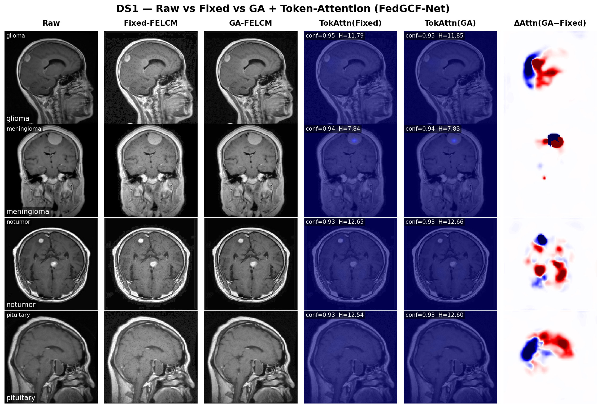
    


    
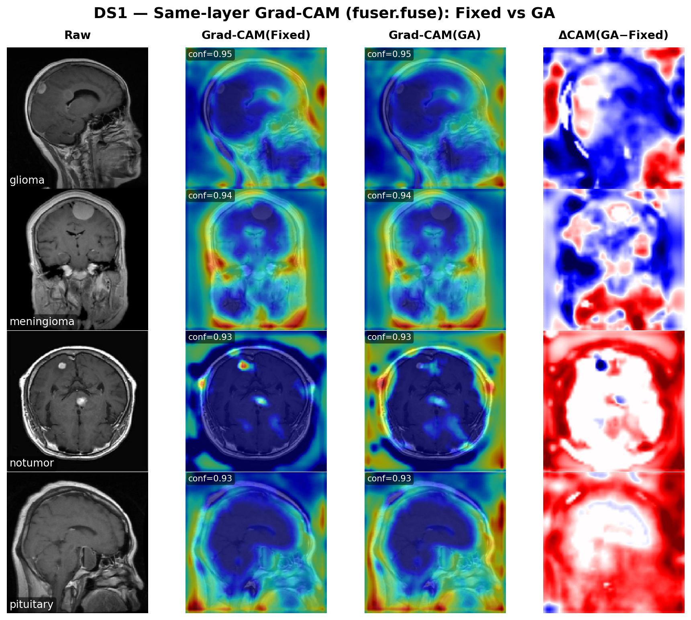
    


    
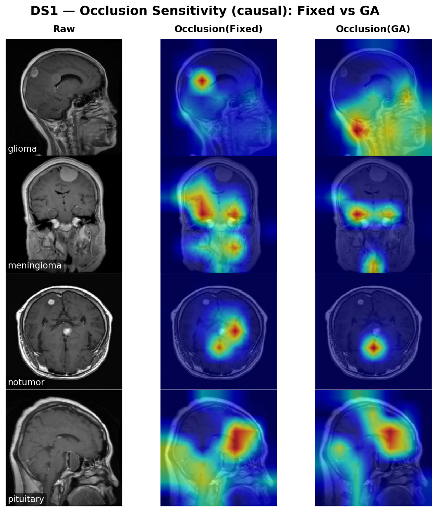
    


    
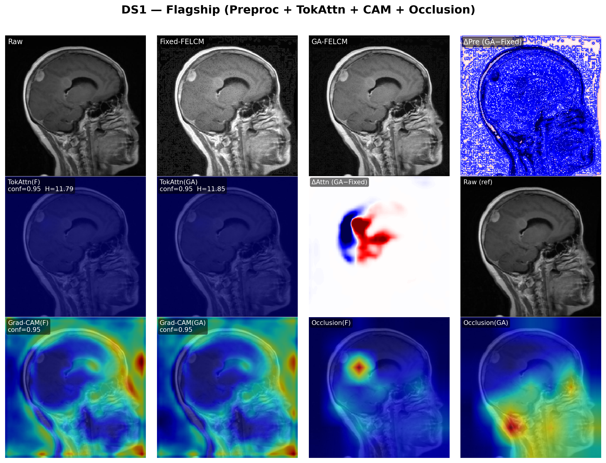
    


    
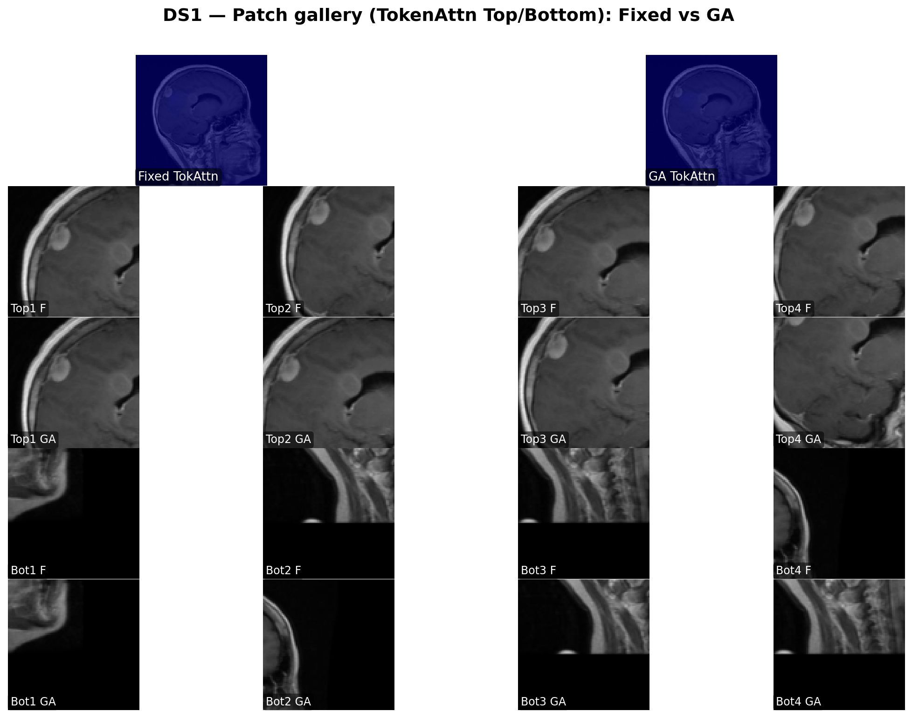
    


    

    


    

    


    
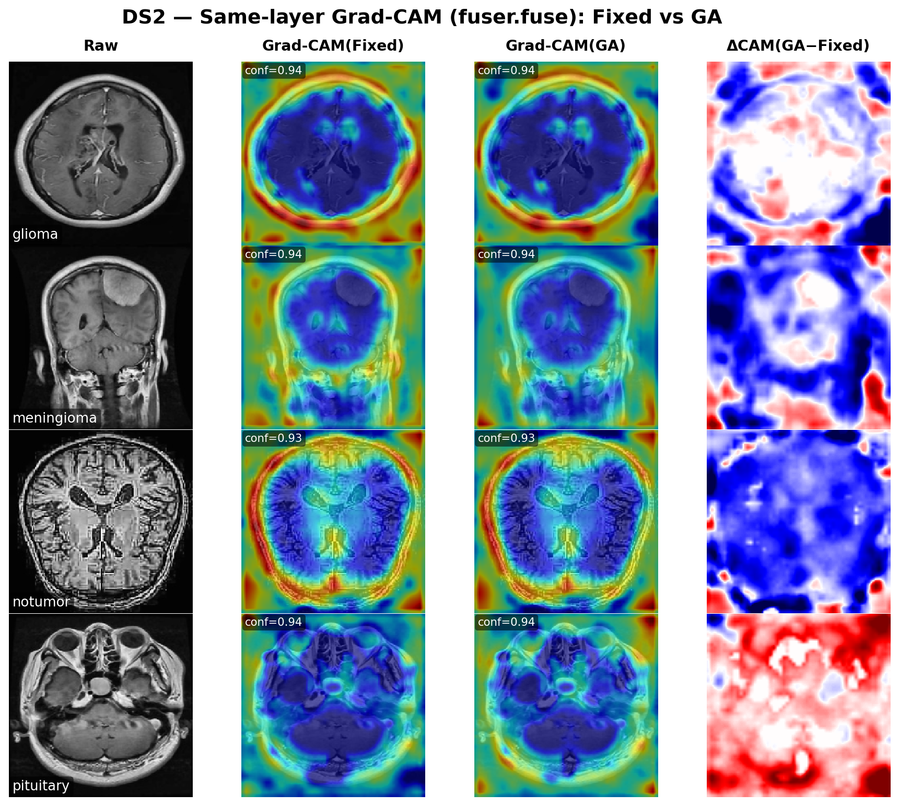
    


    
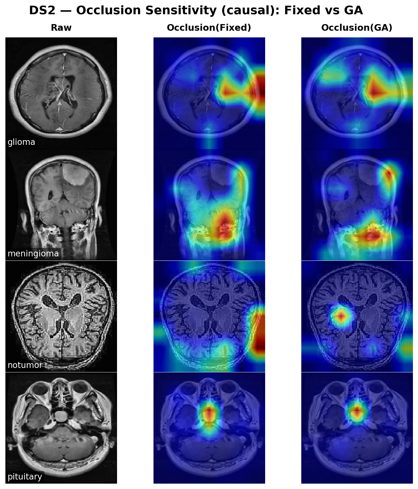
    


    
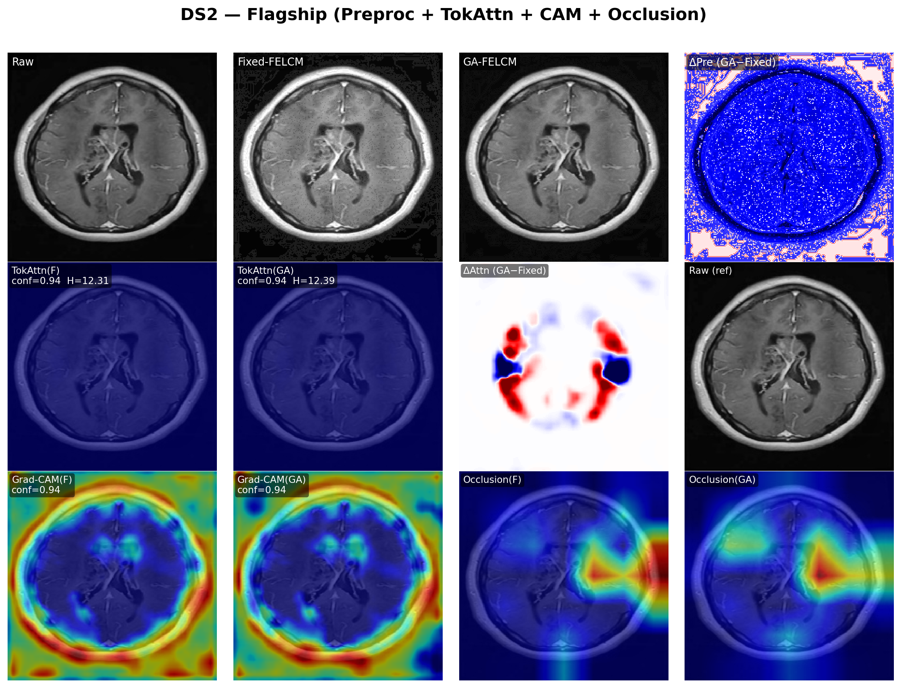
    


    
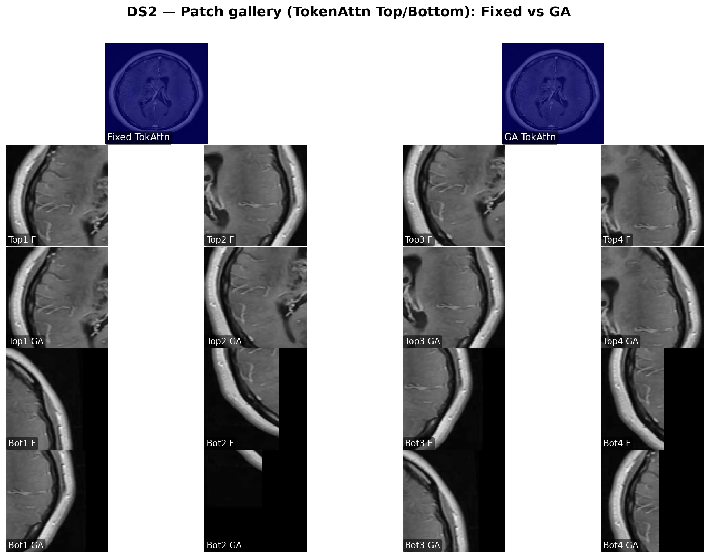
    


    
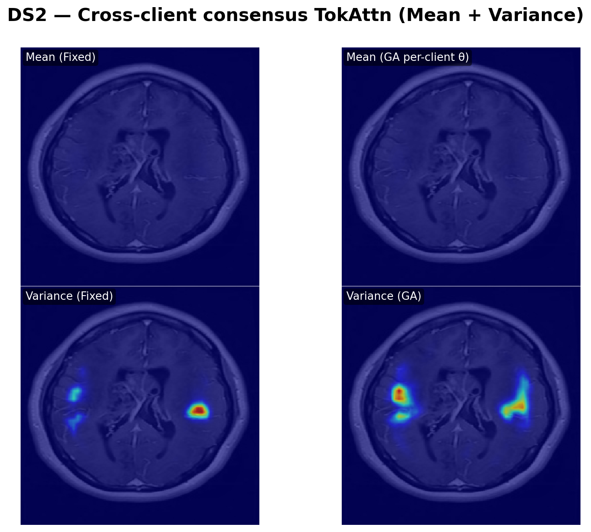
    


    ✅ Done. Titles will NOT overlap tiles. No big column gaps. No per-tile titles above images.
    


```python
# ============================================================
# FedGCF-Net XAI / Heatmap Figure Generator (TIGHT + REVIEWER-SAFE)
# ✅ Fixes added for peer review:
# (A) Heatmap comparability: same extraction point, same colormap, SAME scaling (joint normalization per sample)
# (B) Lesion wording: caption strings avoid hard “tumor aligned” claims (no ROI assumed)
# 🔧 Image-1 persuasive upgrades:
#   - Tokenized (blocky) attention rendering via NEAREST upsample (token resolution)
#   - Callout panel with Top-K (orange/red) and Bottom-K (blue) token boxes
# Occlusion fixes:
#   - Uses probability drop of TARGET class when region masked (raw, NOT per-map max normalized)
#   - target_mode="auto" (GT if correct else predicted), and displays (pred, conf, target)
# ΔCAM fixes:
#   - Diverging colormap + symmetric limits centered at 0
# Quant add-on:
#   - Dataset-level TokAttn entropy + TopK mass (and optional occlusion AOPC mean-drop)
# ============================================================

import os, random, math
import numpy as np
import pandas as pd
from PIL import Image

import torch
import torch.nn as nn
import torch.nn.functional as F

import matplotlib.pyplot as plt
from matplotlib import gridspec
from matplotlib.patches import Rectangle

# ---------- GLOBAL PLOT STYLE ----------
plt.rcParams.update({
    "figure.dpi": 170,
    "axes.titlesize": 10,
    "axes.titlepad": 6,
    "font.size": 10,
})

# ---------- REPRO + DEVICE ----------
SEED = 42
random.seed(SEED)
np.random.seed(SEED)
torch.manual_seed(SEED)
if torch.cuda.is_available():
    torch.cuda.manual_seed_all(SEED)

DEVICE = torch.device("cuda" if torch.cuda.is_available() else "cpu")
print("DEVICE:", DEVICE)

# ---------- timm ----------
try:
    import timm
except Exception:
    import sys, subprocess
    subprocess.check_call([sys.executable, "-m", "pip", "-q", "install", "timm"])
    import timm

from torchvision import transforms

IMG_EXTS = (".jpg",".jpeg",".png",".bmp",".tif",".tiff",".webp")

# ============================================================
# (CAPTIONS you can paste into paper)
# ============================================================
CAPTION_TOKATTN = (
    "Token-attention maps are extracted from the same layer and the same pooling-attention head (fuser.pool) "
    "for Fixed-FELCM and GA-FELCM. All heatmaps use the same colormap and are jointly normalized per sample "
    "(Fixed and GA scaled together) to ensure comparability. Token attention is visualized at token resolution "
    "(nearest-neighbor upsampling; no smoothing)."
)

CAPTION_CAM = (
    "Grad-CAM maps are computed at the same convolutional layer (fuser.fuse output) for Fixed-FELCM and GA-FELCM. "
    "All CAM overlays use the same colormap and joint normalization per sample. ΔCAM uses a diverging colormap with "
    "symmetric limits centered at zero to indicate increases/decreases in attribution."
)

CAPTION_OCCLUSION = (
    "Occlusion sensitivity uses a fixed patch size and stride; values indicate the probability drop of the target class "
    "when the corresponding region is masked. For fair interpretation, the target class is set to the ground-truth if "
    "the example is correctly classified, otherwise the predicted class (reported with confidence)."
)

WORDING_NO_ROI = (
    "Without pixel-level ROI/segmentation, we describe highlighted regions as clinically plausible, "
    "consistent with visible lesion area, or a shift toward suspected lesion region (not a hard tumor-alignment claim)."
)

print("\n--- Caption helpers ---")
print("CAPTION_TOKATTN:", CAPTION_TOKATTN)
print("CAPTION_CAM    :", CAPTION_CAM)
print("CAPTION_OCCLUSION:", CAPTION_OCCLUSION)
print("WORDING_NO_ROI :", WORDING_NO_ROI)
print("-----------------------\n")

# ============================================================
# 0) Load checkpoint
# ============================================================
CKPT_BASENAME = "FL_GAFELCM_PVTv2B2_FUSION_checkpoint.pth"

def find_checkpoint():
    fast = [
        CKPT_BASENAME,
        os.path.join("/content", CKPT_BASENAME),
        os.path.join("/mnt/data", CKPT_BASENAME),
        "/mnt/data/FL_GAFELCM_PVTv2B2_FUSION_checkpoint.pth",
    ]
    for p in fast:
        if os.path.exists(p):
            return p
    for root in ["/content", os.getcwd(), "/mnt/data"]:
        if os.path.isdir(root):
            for r, _, files in os.walk(root):
                if CKPT_BASENAME in files:
                    return os.path.join(r, CKPT_BASENAME)
    return None

CKPT_PATH = find_checkpoint()
if CKPT_PATH is None:
    raise FileNotFoundError(f"Checkpoint not found: {CKPT_BASENAME}")

ckpt = torch.load(CKPT_PATH, map_location="cpu")
print("Loaded checkpoint:", os.path.basename(CKPT_PATH))

CFG = ckpt.get("config", {})
labels = ckpt.get("labels", ["glioma", "meningioma", "notumor", "pituitary"])
label2id = ckpt.get("label2id", {l:i for i,l in enumerate(labels)})
id2label = ckpt.get("id2label", {i:l for l,i in label2id.items()})
NUM_CLASSES = len(labels)

CLIENTS_PER_DS = int(CFG.get("clients_per_dataset", 3))
CLIENTS_TOTAL  = int(CFG.get("clients_total", 6))
BACKBONE_NAME  = str(ckpt.get("backbone_name", CFG.get("backbone_name", "pvt_v2_b2")))

IMG_SIZE = int(CFG.get("img_size", 224))
if IMG_SIZE < 96:
    IMG_SIZE = 224

IMAGENET_MEAN = torch.tensor([0.485, 0.456, 0.406], device=DEVICE).view(1,3,1,1)
IMAGENET_STD  = torch.tensor([0.229, 0.224, 0.225], device=DEVICE).view(1,3,1,1)

EVAL_TFMS = transforms.Compose([
    transforms.Resize((IMG_SIZE, IMG_SIZE)),
    transforms.ToTensor(),
])

# ============================================================
# 1) Robust dataset root resolution
# ============================================================
REQ1 = {"512Glioma", "512Meningioma", "512Normal", "512Pituitary"}  # DS1 dirs
REQ2 = {"glioma", "meningioma", "notumor", "pituitary"}             # DS2 dirs

def find_root_with_required_class_dirs(base_dir, required_set, prefer_raw=True, max_candidates=40_000):
    if base_dir is None or (not os.path.isdir(base_dir)):
        return None
    candidates = []
    walked = 0
    for root, dirs, _ in os.walk(base_dir):
        walked += 1
        if walked > max_candidates:
            break
        if required_set.issubset(set(dirs)):
            candidates.append(root)
    if not candidates:
        return None
    def score(p):
        pl = p.lower()
        sc = 0
        if prefer_raw:
            if "raw data" in pl: sc += 8
            if os.path.basename(p).lower() == "raw": sc += 8
            if "/raw/" in pl or "\\raw\\" in pl: sc += 4
            if "augmented" in pl: sc -= 30
        sc -= 0.0001 * len(p)
        return sc
    return max(candidates, key=score)

def try_auto_locate_anywhere(required_set, prefer_raw):
    candidates = [
        "/content",
        "/content/data",
        "/content/datasets",
        "/kaggle/input",
        "/mnt",
        "/mnt/data",
        os.getcwd(),
    ]
    for base in candidates:
        r = find_root_with_required_class_dirs(base, required_set, prefer_raw=prefer_raw)
        if r is not None:
            return r
    return None

def ensure_kagglehub():
    try:
        import kagglehub
        return kagglehub
    except Exception:
        import sys, subprocess
        subprocess.check_call([sys.executable, "-m", "pip", "-q", "install", "kagglehub"])
        import kagglehub
        return kagglehub

def resolve_dataset_roots():
    ds1_root_ckpt = ckpt.get("dataset1_raw_root", None)
    ds2_root_ckpt = ckpt.get("dataset2_root", None)

    ds1_root = ds1_root_ckpt if (ds1_root_ckpt and os.path.isdir(ds1_root_ckpt)) else None
    ds2_root = ds2_root_ckpt if (ds2_root_ckpt and os.path.isdir(ds2_root_ckpt)) else None

    if ds1_root is None:
        ds1_root = try_auto_locate_anywhere(REQ1, prefer_raw=True)
    if ds2_root is None:
        ds2_root = try_auto_locate_anywhere(REQ2, prefer_raw=False)

    if ds1_root is None or ds2_root is None:
        try:
            kagglehub = ensure_kagglehub()
            ds2_base = kagglehub.dataset_download("yassinebazgour/preprocessed-brain-mri-scans-for-tumors-detection")
            ds1_base = kagglehub.dataset_download("orvile/pmram-bangladeshi-brain-cancer-mri-dataset")
            if ds1_root is None:
                ds1_root = find_root_with_required_class_dirs(ds1_base, REQ1, prefer_raw=True)
            if ds2_root is None:
                ds2_root = find_root_with_required_class_dirs(ds2_base, REQ2, prefer_raw=False)
        except Exception as e:
            print("⚠️ kagglehub download failed:", str(e))
    return ds1_root, ds2_root

DS1_ROOT, DS2_ROOT = resolve_dataset_roots()
print("DS1_ROOT:", DS1_ROOT)
print("DS2_ROOT:", DS2_ROOT)

if DS1_ROOT is None or (not os.path.isdir(DS1_ROOT)):
    raise FileNotFoundError(f"Could not locate DS1 root containing: {sorted(list(REQ1))}")
if DS2_ROOT is None or (not os.path.isdir(DS2_ROOT)):
    raise FileNotFoundError(f"Could not locate DS2 root containing: {sorted(list(REQ2))}")

# ============================================================
# 2) GA-FELCM
# ============================================================
class EnhancedFELCM(nn.Module):
    def __init__(self, gamma=1.0, alpha=0.35, beta=6.0, tau=2.5, blur_k=7, sharpen=0.0, denoise=0.0):
        super().__init__()
        self.gamma = float(gamma)
        self.alpha = float(alpha)
        self.beta  = float(beta)
        self.tau   = float(tau)
        self.blur_k = int(blur_k)
        self.sharpen = float(sharpen)
        self.denoise = float(denoise)

        lap = torch.tensor([[0, -1, 0], [-1, 4, -1], [0, -1, 0]], dtype=torch.float32)
        self.register_buffer("lap", lap.view(1, 1, 3, 3))

        sharp = torch.tensor([[0, -1, 0], [-1, 5, -1], [0, -1, 0]], dtype=torch.float32)
        self.register_buffer("sharp_kernel", sharp.view(1, 1, 3, 3))

    def forward(self, x):
        eps = 1e-6
        B, C, H, W = x.shape

        if self.denoise > 0:
            k = 3
            x_blur = F.avg_pool2d(F.pad(x, (1, 1, 1, 1), mode="reflect"), k, 1)
            x = x * (1 - self.denoise) + x_blur * self.denoise

        mu = x.mean(dim=(2, 3), keepdim=True)
        sd = x.std(dim=(2, 3), keepdim=True).clamp_min(eps)
        x0 = (x - mu) / sd
        x0 = x0.clamp(-self.tau, self.tau)

        x1 = torch.sign(x0) * torch.pow(torch.abs(x0).clamp_min(eps), self.gamma)

        gray = x1.mean(dim=1, keepdim=True)
        lap = F.conv2d(F.pad(gray, (1, 1, 1, 1), mode="reflect"), self.lap)
        mag = lap.abs()

        k = self.blur_k if self.blur_k % 2 == 1 else self.blur_k + 1
        pad = k // 2
        blur = F.avg_pool2d(F.pad(mag, (pad, pad, pad, pad), mode="reflect"), k, 1)
        C_map = mag / (blur + eps)

        x2 = x1 + self.alpha * torch.tanh(self.beta * C_map)

        if self.sharpen > 0:
            outs = []
            for c in range(C):
                x_c = x2[:, c: c + 1, :, :]
                x_sharp = F.conv2d(F.pad(x_c, (1, 1, 1, 1), mode="reflect"), self.sharp_kernel)
                outs.append(x_c * (1 - self.sharpen) + x_sharp * self.sharpen)
            x2 = torch.cat(outs, dim=1)

        mn = x2.amin(dim=(2, 3), keepdim=True)
        mx = x2.amax(dim=(2, 3), keepdim=True)
        x3 = (x2 - mn) / (mx - mn + eps)
        return x3.clamp(0, 1)

def theta_to_module(theta):
    if theta is None:
        return EnhancedFELCM()
    g, a, b, t, k, sh, dn = theta
    return EnhancedFELCM(gamma=g, alpha=a, beta=b, tau=t, blur_k=int(k), sharpen=sh, denoise=dn)

def preproc_theta_vec(preproc_module, batch_size):
    theta = torch.tensor(
        [
            float(preproc_module.gamma),
            float(preproc_module.alpha),
            float(preproc_module.beta),
            float(preproc_module.tau),
            float(preproc_module.blur_k) / 7.0,
            float(preproc_module.sharpen),
            float(preproc_module.denoise),
        ],
        device=DEVICE,
        dtype=torch.float32,
    )
    return theta.unsqueeze(0).repeat(batch_size, 1)

fixed_pre = EnhancedFELCM().to(DEVICE).eval()
best_theta_ds1 = ckpt.get("best_theta_ds1", None)
best_theta_ds2 = ckpt.get("best_theta_ds2", None)
ga_pre_ds1 = theta_to_module(best_theta_ds1).to(DEVICE).eval()
ga_pre_ds2 = theta_to_module(best_theta_ds2).to(DEVICE).eval()

print("best_theta_ds1:", best_theta_ds1)
print("best_theta_ds2:", best_theta_ds2)

# ============================================================
# 3) FedGCF-Net pieces (PVTv2 + fusion + tri-gate)
# ============================================================
class TokenAttentionPooling(nn.Module):
    def __init__(self, dim):
        super().__init__()
        self.query = nn.Linear(dim, 1)
    def forward(self, x_tokens):  # [B, HW, C]
        attn = torch.softmax(self.query(x_tokens).squeeze(-1), dim=1)  # [B, HW]
        pooled = (x_tokens * attn.unsqueeze(-1)).sum(dim=1)
        return pooled, attn

class MultiScaleFeatureFuser(nn.Module):
    def __init__(self, in_channels, out_dim):
        super().__init__()
        self.proj = nn.ModuleList([
            nn.Sequential(
                nn.Conv2d(c, out_dim, kernel_size=1, bias=False),
                nn.GroupNorm(8, out_dim),
                nn.GELU(),
            )
            for c in in_channels
        ])
        self.fuse = nn.Sequential(
            nn.Conv2d(out_dim, out_dim, kernel_size=3, padding=1, bias=False),
            nn.GroupNorm(8, out_dim),
            nn.GELU(),
        )
        self.pool = TokenAttentionPooling(out_dim)

class EnhancedBrainTuner(nn.Module):
    def __init__(self, dim, dropout=0.1):
        super().__init__()
        self.se = nn.Sequential(
            nn.Linear(dim, max(8, dim // 4)),
            nn.ReLU(inplace=True),
            nn.Linear(max(8, dim // 4), dim),
            nn.Sigmoid(),
        )
        self.refine = nn.Sequential(
            nn.LayerNorm(dim),
            nn.Linear(dim, dim),
            nn.GELU(),
            nn.Dropout(dropout),
            nn.Linear(dim, dim),
        )
        self.gate = nn.Parameter(torch.ones(2) / 2)
    def forward(self, x):
        gate = F.softmax(self.gate, dim=0)
        out1 = x * self.se(x)
        out2 = x + 0.2 * self.refine(x)
        return gate[0] * out1 + gate[1] * out2

class PVTv2B2_MultiScale(nn.Module):
    def __init__(self, num_classes, head_dropout=0.3, cond_dim=128, num_clients=6):
        super().__init__()
        self.backbone = timm.create_model(
            BACKBONE_NAME,
            pretrained=False,
            features_only=True,
            out_indices=(0,1,2,3),
        )
        in_channels = self.backbone.feature_info.channels()
        out_dim = max(256, in_channels[-1] // 2)

        self.fuser = MultiScaleFeatureFuser(in_channels, out_dim)
        self.tuner = EnhancedBrainTuner(out_dim, dropout=0.1)

        self.classifier = nn.Sequential(
            nn.LayerNorm(out_dim),
            nn.Dropout(head_dropout),
            nn.Linear(out_dim, max(64, out_dim // 2)),
            nn.GELU(),
            nn.Dropout(head_dropout * 0.5),
            nn.Linear(max(64, out_dim // 2), num_classes),
        )

        self.theta_mlp = nn.Sequential(
            nn.Linear(7, cond_dim),
            nn.GELU(),
            nn.Linear(cond_dim, cond_dim),
        )
        self.source_emb = nn.Embedding(2, cond_dim)
        self.client_emb = nn.Embedding(num_clients, cond_dim)
        self.cond_norm = nn.LayerNorm(cond_dim)

        self.gate_early = nn.Linear(cond_dim, 3)
        self.gate_mid   = nn.Linear(cond_dim, out_dim)
        self.gate_late  = nn.Linear(cond_dim, out_dim)

    def _cond_vec(self, theta_vec, source_id, client_id):
        cond = self.theta_mlp(theta_vec)
        cond = cond + self.source_emb(source_id) + self.client_emb(client_id)
        return self.cond_norm(cond)

model = PVTv2B2_MultiScale(
    num_classes=NUM_CLASSES,
    head_dropout=float(CFG.get("head_dropout", 0.3)),
    cond_dim=int(CFG.get("cond_dim", 128)),
    num_clients=CLIENTS_TOTAL,
).to(DEVICE).eval()

sd = ckpt.get("state_dict", None)
if sd is None:
    raise RuntimeError("Checkpoint missing state_dict.")
model.load_state_dict(sd, strict=True)
print("✅ Model weights loaded.")

# ============================================================
# 4) Samples (one per class)
# ============================================================
DS1_CLASS_DIRS = {
    "glioma": "512Glioma",
    "meningioma": "512Meningioma",
    "notumor": "512Normal",
    "pituitary": "512Pituitary",
}
DS2_CLASS_DIRS = {
    "glioma": "glioma",
    "meningioma": "meningioma",
    "notumor": "notumor",
    "pituitary": "pituitary",
}

def list_images_under_class_root(class_root, class_dir_name):
    class_dir = os.path.join(class_root, class_dir_name)
    out = []
    if not os.path.isdir(class_dir):
        return out
    for r, _, files in os.walk(class_dir):
        for fn in files:
            if fn.lower().endswith(IMG_EXTS):
                out.append(os.path.join(r, fn))
    return out

def pick_one_per_class_from_root(ds_root, class_dirs_map, seed=SEED):
    rng = random.Random(seed)
    samples = {}
    for lab in labels:
        dir_name = class_dirs_map[lab]
        imgs = list_images_under_class_root(ds_root, dir_name)
        samples[lab] = rng.choice(imgs) if len(imgs) else None
    return samples

def fill_missing_samples(ds_root, class_dirs_map, samples, tries=6):
    for t in range(tries):
        if all(samples[l] is not None for l in labels):
            return samples
        s2 = pick_one_per_class_from_root(ds_root, class_dirs_map, seed=SEED + 100 + t)
        for l in labels:
            if samples[l] is None:
                samples[l] = s2[l]
    return samples

def load_rgb(path):
    return Image.open(path).convert("RGB")

ds1_samples = fill_missing_samples(DS1_ROOT, DS1_CLASS_DIRS, pick_one_per_class_from_root(DS1_ROOT, DS1_CLASS_DIRS, seed=SEED))
ds2_samples = fill_missing_samples(DS2_ROOT, DS2_CLASS_DIRS, pick_one_per_class_from_root(DS2_ROOT, DS2_CLASS_DIRS, seed=SEED + 7))

if any(ds1_samples[l] is None for l in labels):
    raise RuntimeError("DS1: missing class image(s).")
if any(ds2_samples[l] is None for l in labels):
    raise RuntimeError("DS2: missing class image(s).")

# ============================================================
# 5) Extraction helpers (TokAttn, CAM, Occlusion) + REVIEWER SAFE NORMALIZATION
# ============================================================
def fuser_conv_pooled_attn(fuser, feats):
    proj_feats = [p(f) for p, f in zip(fuser.proj, feats)]
    x = proj_feats[-1]
    for f in reversed(proj_feats[:-1]):
        x = F.interpolate(x, size=f.shape[-2:], mode="bilinear", align_corners=False)
        x = x + f
    x = fuser.fuse(x)  # [B,C,H,W]
    B, C, H, W = x.shape
    tokens = x.flatten(2).transpose(1, 2)  # [B,HW,C]
    pooled, attn = fuser.pool(tokens)       # pooled [B,C], attn [B,HW]
    attn_map = attn.view(B, H, W)
    return x, pooled, attn_map

def attn_entropy_from_map_2d(attn_2d):
    p = attn_2d.flatten().clamp(1e-9, 1.0)
    p = p / p.sum()
    return float(-(p * torch.log2(p)).sum().item())

def topk_mass_from_map_2d(attn_2d, k=10):
    p = attn_2d.flatten().clamp(1e-9, 1.0)
    p = p / p.sum()
    k = min(k, p.numel())
    vals, _ = torch.topk(p, k)
    return float(vals.sum().item())

def to_gray_np(x01_1x3):
    g = x01_1x3[0].mean(dim=0).detach().cpu().numpy()
    return np.clip(g, 0, 1)

def upsample_map(m, out_hw, mode="bilinear"):
    # m can be torch [h,w] or np [h,w]
    if isinstance(m, np.ndarray):
        t = torch.tensor(m)[None,None,:,:].float()
    else:
        t = m[None,None,:,:].float()
    t2 = F.interpolate(t, size=out_hw, mode=mode, align_corners=False if mode in ("bilinear","bicubic") else None)[0,0]
    return t2.detach().cpu().numpy()

def joint_minmax_norm(a, b):
    a = a.astype(np.float32)
    b = b.astype(np.float32)
    mn = float(min(a.min(), b.min()))
    mx = float(max(a.max(), b.max()))
    a01 = (a - mn) / (mx - mn + 1e-9)
    b01 = (b - mn) / (mx - mn + 1e-9)
    return np.clip(a01,0,1), np.clip(b01,0,1)

def overlay_heat(gray01, heat01, alpha=0.6, cmap_name="jet"):
    gray3 = np.stack([gray01, gray01, gray01], axis=-1)
    cmap = getattr(plt.cm, cmap_name)
    heat3 = cmap(np.clip(heat01, 0, 1))[...,:3]
    out = (1-alpha)*gray3 + alpha*heat3
    return np.clip(out, 0, 1)

def diverging_map_sym(delta, cmap_name="seismic"):
    d = delta.astype(np.float32)
    vmax = float(max(abs(d.min()), abs(d.max()))) + 1e-9
    dn = np.clip(d / vmax, -1, 1)
    cmap = getattr(plt.cm, cmap_name)
    rgb = cmap((dn + 1.0) / 2.0)[...,:3]
    return np.clip(rgb, 0, 1)

def label_box(ax, text, loc="tl", fontsize=9):
    if text is None or text == "":
        return
    ha, va = "left", "top"
    x, y = 0.02, 0.98
    if loc == "tr":
        ha, va = "right", "top"; x, y = 0.98, 0.98
    elif loc == "bl":
        ha, va = "left", "bottom"; x, y = 0.02, 0.02
    elif loc == "br":
        ha, va = "right", "bottom"; x, y = 0.98, 0.02
    ax.text(
        x, y, text,
        transform=ax.transAxes,
        ha=ha, va=va,
        color="white",
        fontsize=fontsize,
        bbox=dict(boxstyle="round,pad=0.25", fc="black", ec="none", alpha=0.55),
        zorder=10,
    )

def add_col_headers(fig, axes_top_row, headers, y_pad=0.012, fontsize=11):
    for ax, h in zip(axes_top_row, headers):
        bb = ax.get_position()
        x = (bb.x0 + bb.x1) / 2
        y = bb.y1 + y_pad
        fig.text(x, y, h, ha="center", va="bottom", fontsize=fontsize, fontweight="bold")

# ---------- Token box drawing (ConVLM-style callouts) ----------
def draw_token_boxes(ax, grid_hw, img_hw, rc_list, edgecolor="orange", lw=2):
    gh, gw = grid_hw
    H, W = img_hw
    cell_h = H / gh
    cell_w = W / gw
    for (r,c) in rc_list:
        x0 = c * cell_w
        y0 = r * cell_h
        ax.add_patch(Rectangle((x0, y0), cell_w, cell_h, fill=False, edgecolor=edgecolor, linewidth=lw))

def topk_bottomk_rc(attn_grid, k=6):
    flat = attn_grid.reshape(-1)
    order = np.argsort(flat)
    bot = order[:k]
    top = order[::-1][:k]
    gh, gw = attn_grid.shape
    top_rc = [(int(i//gw), int(i%gw)) for i in top]
    bot_rc = [(int(i//gw), int(i%gw)) for i in bot]
    return top_rc, bot_rc

@torch.no_grad()
def run_token_attn_only(x01, preproc, source_id, client_id):
    x01 = x01.to(DEVICE)
    x_fel = preproc(x01).clamp(0,1)
    x_raw_n = (x01 - IMAGENET_MEAN) / IMAGENET_STD
    x_fel_n = (x_fel - IMAGENET_MEAN) / IMAGENET_STD

    theta_vec = preproc_theta_vec(preproc, batch_size=1)
    sid = torch.tensor([source_id], device=DEVICE, dtype=torch.long)
    cid = torch.tensor([client_id], device=DEVICE, dtype=torch.long)

    cond = model._cond_vec(theta_vec, sid, cid)
    g0 = torch.sigmoid(model.gate_early(cond)).view(-1,3,1,1)
    xmix = (1-g0)*x_raw_n + g0*x_fel_n

    feats0 = model.backbone(xmix)
    _, f0, att0 = fuser_conv_pooled_attn(model.fuser, feats0)

    feats1 = model.backbone(x_fel_n)
    _, f1, _ = fuser_conv_pooled_attn(model.fuser, feats1)

    g1 = torch.sigmoid(model.gate_mid(cond))
    f_mid = (1-g1)*f0 + g1*f1

    t0 = model.tuner(f0)
    t1 = model.tuner(f1)
    t_mid = model.tuner(f_mid)

    t_views = 0.5*(t0+t1)
    g2 = torch.sigmoid(model.gate_late(cond))
    t_final = (1-g2)*t_mid + g2*t_views

    logits = model.classifier(t_final)
    prob = torch.softmax(logits, dim=1)[0]
    conf = float(prob.max().item())
    pred = int(prob.argmax().item())

    # att0 is [1,h,w] token-grid
    return {
        "attn_grid": att0[0].detach().cpu(),  # [h,w]
        "conf": conf,
        "pred": pred,
        "probs": prob.detach().cpu(),
    }

def gradcam_same_layer(x01, preproc, source_id, client_id, target_class=None):
    model.eval()
    preproc.eval()

    x01 = x01.to(DEVICE)
    x_fel = preproc(x01).clamp(0,1)
    x_raw_n = (x01 - IMAGENET_MEAN) / IMAGENET_STD
    x_fel_n = (x_fel - IMAGENET_MEAN) / IMAGENET_STD

    theta_vec = preproc_theta_vec(preproc, batch_size=1)
    sid = torch.tensor([source_id], device=DEVICE, dtype=torch.long)
    cid = torch.tensor([client_id], device=DEVICE, dtype=torch.long)

    model.zero_grad(set_to_none=True)

    cond = model._cond_vec(theta_vec, sid, cid)
    g0 = torch.sigmoid(model.gate_early(cond)).view(-1,3,1,1)
    xmix = (1-g0)*x_raw_n + g0*x_fel_n

    feats0 = model.backbone(xmix)
    conv0, f0, _ = fuser_conv_pooled_attn(model.fuser, feats0)
    conv0.retain_grad()

    feats1 = model.backbone(x_fel_n)
    _, f1, _ = fuser_conv_pooled_attn(model.fuser, feats1)

    g1 = torch.sigmoid(model.gate_mid(cond))
    f_mid = (1-g1)*f0 + g1*f1

    t0 = model.tuner(f0)
    t1 = model.tuner(f1)
    t_mid = model.tuner(f_mid)

    t_views = 0.5*(t0+t1)
    g2 = torch.sigmoid(model.gate_late(cond))
    t_final = (1-g2)*t_mid + g2*t_views

    logits = model.classifier(t_final)
    prob = torch.softmax(logits, dim=1)[0]
    pred = int(prob.argmax().item())
    if target_class is None:
        target_class = pred

    logits[0, target_class].backward()

    grad = conv0.grad[0]       # [C,h,w]
    act  = conv0.detach()[0]   # [C,h,w]
    w = grad.mean(dim=(1,2), keepdim=True)
    cam = torch.relu((w * act).sum(dim=0))
    cam = cam - cam.min()
    cam = cam / (cam.max() + 1e-9)

    conf = float(prob.max().item())
    return cam.detach().cpu(), conf, pred, int(target_class)

@torch.no_grad()
def forward_prob_for_target(x01, preproc, source_id, client_id, target_class):
    # returns prob(target_class), plus pred/conf for reporting
    x01 = x01.to(DEVICE)
    x_fel = preproc(x01).clamp(0,1)
    x_raw_n = (x01 - IMAGENET_MEAN) / IMAGENET_STD
    x_fel_n = (x_fel - IMAGENET_MEAN) / IMAGENET_STD

    theta_vec = preproc_theta_vec(preproc, batch_size=1)
    sid = torch.tensor([source_id], device=DEVICE, dtype=torch.long)
    cid = torch.tensor([client_id], device=DEVICE, dtype=torch.long)

    cond = model._cond_vec(theta_vec, sid, cid)
    g0 = torch.sigmoid(model.gate_early(cond)).view(-1,3,1,1)
    xmix = (1-g0)*x_raw_n + g0*x_fel_n

    feats0 = model.backbone(xmix)
    _, f0, _ = fuser_conv_pooled_attn(model.fuser, feats0)

    feats1 = model.backbone(x_fel_n)
    _, f1, _ = fuser_conv_pooled_attn(model.fuser, feats1)

    g1 = torch.sigmoid(model.gate_mid(cond))
    f_mid = (1-g1)*f0 + g1*f1

    t0 = model.tuner(f0)
    t1 = model.tuner(f1)
    t_mid = model.tuner(f_mid)

    t_views = 0.5*(t0+t1)
    g2 = torch.sigmoid(model.gate_late(cond))
    t_final = (1-g2)*t_mid + g2*t_views

    logits = model.classifier(t_final)
    prob = torch.softmax(logits, dim=1)[0]
    pred = int(prob.argmax().item())
    conf = float(prob.max().item())
    return float(prob[target_class].item()), pred, conf

@torch.no_grad()
def occlusion_sensitivity_map_rawdrop(x01, preproc, source_id, client_id, patch=32, stride=32, target_class=None):
    """
    Returns:
      drop_grid: (gy,gx) raw probability drop for target class: base_p - p_masked (>=0)
      base_p:    base probability of target class
      target_class, pred, conf
    IMPORTANT: NO normalization by max inside this function (reviewer-safe).
    """
    x01 = x01.to(DEVICE)

    # base forward: choose target if None => predicted
    # We'll compute pred/conf first using predicted target, then allow override.
    theta_vec = preproc_theta_vec(preproc, batch_size=1)
    sid = torch.tensor([source_id], device=DEVICE, dtype=torch.long)
    cid = torch.tensor([client_id], device=DEVICE, dtype=torch.long)

    # compute base probs by reusing run_token_attn_only output (cheap enough)
    out_base = run_token_attn_only(x01.detach().cpu(), preproc, source_id, client_id)
    pred = int(out_base["pred"])
    conf = float(out_base["conf"])
    if target_class is None:
        target_class = pred

    base_p, _, _ = forward_prob_for_target(x01, preproc, source_id, client_id, target_class)

    _, _, H, W = x01.shape
    ys = list(range(0, H, stride))
    xs = list(range(0, W, stride))
    grid = np.zeros((len(ys), len(xs)), dtype=np.float32)

    for iy, y0 in enumerate(ys):
        for ix, x0p in enumerate(xs):
            x_mask = x01.clone()
            y1 = min(H, y0 + patch)
            x1 = min(W, x0p + patch)
            x_mask[:, :, y0:y1, x0p:x1] = 0.0

            p_m, _, _ = forward_prob_for_target(x_mask, preproc, source_id, client_id, target_class)
            grid[iy, ix] = max(0.0, base_p - p_m)

    return grid, float(base_p), int(target_class), int(pred), float(conf)

# ============================================================
# 6) TIGHT PLOTTING
# ============================================================
def _imshow(ax, img, gray=False):
    ax.axis("off")
    if gray:
        ax.imshow(img, cmap="gray", vmin=0, vmax=1, interpolation="nearest", aspect="equal")
    else:
        ax.imshow(img, interpolation="nearest", aspect="equal")

def plot_tokenattn_grid(ds_name, sample_map, source_id, rep_client_id, pre_ga, show_token_grid=False):
    """
    Reviewer-safe:
      - TokAttn extracted at same point: run_token_attn_only -> attn_grid from fuser.pool
      - Rendering at token resolution: nearest upsample (blocky)
      - Joint normalization fixed vs GA per sample
    """
    headers = ["Raw", "Fixed-FELCM", "GA-FELCM", "TokAttn(Fixed)", "TokAttn(GA)", "ΔAttn(GA−Fixed)"]
    fig = plt.figure(figsize=(14.2, 9.2))
    gs = gridspec.GridSpec(NUM_CLASSES, 6, figure=fig, wspace=0.002, hspace=0.002)
    axes = [[None]*6 for _ in range(NUM_CLASSES)]

    for r, lab in enumerate(labels):
        x = EVAL_TFMS(load_rgb(sample_map[lab])).unsqueeze(0)
        gray = to_gray_np(x)

        with torch.no_grad():
            x_fixed = fixed_pre(x.to(DEVICE)).clamp(0,1).cpu()
            x_ga    = pre_ga(x.to(DEVICE)).clamp(0,1).cpu()

        gray_fixed = to_gray_np(x_fixed)
        gray_ga    = to_gray_np(x_ga)

        out_fixed = run_token_attn_only(x, fixed_pre, source_id, rep_client_id)
        out_ga    = run_token_attn_only(x, pre_ga,    source_id, rep_client_id)

        att_fixed_grid = out_fixed["attn_grid"].numpy()  # [h,w]
        att_ga_grid    = out_ga["attn_grid"].numpy()

        # Tokenized rendering: nearest upsample
        att_fixed_u = upsample_map(att_fixed_grid, (IMG_SIZE, IMG_SIZE), mode="nearest")
        att_ga_u    = upsample_map(att_ga_grid,    (IMG_SIZE, IMG_SIZE), mode="nearest")

        # Joint normalization for comparability
        att_fixed_u, att_ga_u = joint_minmax_norm(att_fixed_u, att_ga_u)

        ent_fixed = attn_entropy_from_map_2d(torch.tensor(att_fixed_grid))
        ent_ga    = attn_entropy_from_map_2d(torch.tensor(att_ga_grid))

        ov_fixed = overlay_heat(gray_fixed, att_fixed_u, alpha=0.62, cmap_name="jet")
        ov_ga    = overlay_heat(gray_ga,    att_ga_u,    alpha=0.62, cmap_name="jet")

        delta_rgb = diverging_map_sym(att_ga_u - att_fixed_u, cmap_name="seismic")

        tiles = [
            (gray, True,  lab),
            (gray_fixed, True, ""),
            (gray_ga, True, ""),
            (ov_fixed, False, f"pred={id2label[out_fixed['pred']]}\nconf={out_fixed['conf']:.2f}  H={ent_fixed:.2f}"),
            (ov_ga,    False, f"pred={id2label[out_ga['pred']]}\nconf={out_ga['conf']:.2f}  H={ent_ga:.2f}"),
            (delta_rgb, False, ""),
        ]

        for c in range(6):
            ax = fig.add_subplot(gs[r, c])
            axes[r][c] = ax
            _imshow(ax, tiles[c][0], gray=tiles[c][1])

            if c == 0:
                label_box(ax, lab, loc="bl", fontsize=11)
            if tiles[c][2]:
                label_box(ax, tiles[c][2], loc="tl", fontsize=9)

            # Optional subtle token grid lines (can look busy)
            if show_token_grid and c in (3,4):
                gh, gw = att_fixed_grid.shape
                for i in range(1, gh):
                    y = i * (IMG_SIZE / gh)
                    ax.plot([0, IMG_SIZE], [y, y], color="white", linewidth=0.3, alpha=0.25)
                for j in range(1, gw):
                    xline = j * (IMG_SIZE / gw)
                    ax.plot([xline, xline], [0, IMG_SIZE], color="white", linewidth=0.3, alpha=0.25)

    fig.subplots_adjust(left=0.06, right=0.995, bottom=0.02, top=0.92, wspace=0.002, hspace=0.002)
    fig.suptitle(f"{ds_name.upper()} — Raw vs Fixed vs GA + Token-Attention (FedGCF-Net)", y=0.985, fontsize=16, fontweight="bold")
    add_col_headers(fig, [axes[0][i] for i in range(6)], headers, y_pad=0.010, fontsize=12)
    plt.show()

def plot_gradcam_grid(ds_name, sample_map, source_id, rep_client_id, pre_ga):
    """
    Reviewer-safe:
      - Same layer: conv feature map from fuser.fuse output (gradcam_same_layer)
      - Joint normalization fixed vs GA per sample
      - ΔCAM: diverging + symmetric limits
    """
    headers = ["Raw", "Grad-CAM(Fixed)", "Grad-CAM(GA)", "ΔCAM(GA−Fixed)"]
    fig = plt.figure(figsize=(11.2, 9.2))
    gs = gridspec.GridSpec(NUM_CLASSES, 4, figure=fig, wspace=0.002, hspace=0.002)
    axes = [[None]*4 for _ in range(NUM_CLASSES)]

    for r, lab in enumerate(labels):
        x = EVAL_TFMS(load_rgb(sample_map[lab])).unsqueeze(0)
        gray = to_gray_np(x)
        target = label2id[lab]

        cam_f, conf_f, pred_f, _ = gradcam_same_layer(x, fixed_pre, source_id, rep_client_id, target_class=target)
        cam_g, conf_g, pred_g, _ = gradcam_same_layer(x, pre_ga,    source_id, rep_client_id, target_class=target)

        cam_f_u = upsample_map(cam_f, (IMG_SIZE, IMG_SIZE), mode="bilinear")
        cam_g_u = upsample_map(cam_g, (IMG_SIZE, IMG_SIZE), mode="bilinear")

        # Joint normalization
        cam_f_u, cam_g_u = joint_minmax_norm(cam_f_u, cam_g_u)

        ov_f = overlay_heat(gray, cam_f_u, alpha=0.62, cmap_name="jet")
        ov_g = overlay_heat(gray, cam_g_u, alpha=0.62, cmap_name="jet")
        delta_rgb = diverging_map_sym(cam_g_u - cam_f_u, cmap_name="seismic")

        tiles = [
            (gray, True, lab),
            (ov_f, False, f"pred={id2label[pred_f]}\nconf={conf_f:.2f}"),
            (ov_g, False, f"pred={id2label[pred_g]}\nconf={conf_g:.2f}"),
            (delta_rgb, False, ""),
        ]

        for c in range(4):
            ax = fig.add_subplot(gs[r, c])
            axes[r][c] = ax
            _imshow(ax, tiles[c][0], gray=tiles[c][1])
            if c == 0:
                label_box(ax, lab, loc="bl", fontsize=11)
            if tiles[c][2] and c != 0:
                label_box(ax, tiles[c][2], loc="tl", fontsize=9)

    fig.subplots_adjust(left=0.06, right=0.995, bottom=0.02, top=0.92, wspace=0.002, hspace=0.002)
    fig.suptitle(f"{ds_name.upper()} — Same-layer Grad-CAM (fuser.fuse): Fixed vs GA", y=0.985, fontsize=16, fontweight="bold")
    add_col_headers(fig, [axes[0][i] for i in range(4)], headers, y_pad=0.010, fontsize=12)
    plt.show()

def plot_occlusion_grid(ds_name, sample_map, source_id, rep_client_id, pre_ga, patch=32, stride=32, target_mode="auto"):
    """
    Reviewer-safe:
      - shows probability drop of target class when patch masked
      - target_mode:
          "gt"   -> always GT class
          "pred" -> always predicted class (per model)
          "auto" -> GT if correct else predicted (recommended)
      - joint scaling fixed vs GA per sample for visualization
    """
    headers = ["Raw", "Occlusion(Fixed)", "Occlusion(GA)"]
    fig = plt.figure(figsize=(8.8, 9.2))
    gs = gridspec.GridSpec(NUM_CLASSES, 3, figure=fig, wspace=0.002, hspace=0.002)
    axes = [[None]*3 for _ in range(NUM_CLASSES)]

    for r, lab in enumerate(labels):
        x = EVAL_TFMS(load_rgb(sample_map[lab])).unsqueeze(0)
        gray = to_gray_np(x)
        gt = label2id[lab]

        # Get pred/conf under fixed (for display) – any is fine
        out_f = run_token_attn_only(x, fixed_pre, source_id, rep_client_id)
        pred = out_f["pred"]; conf = out_f["conf"]
        correct = (pred == gt)

        if target_mode == "gt":
            target = gt
            tgt_txt = f"target=GT({lab})"
        elif target_mode == "pred":
            target = pred
            tgt_txt = f"target=Pred({id2label[pred]})"
        else:  # auto
            target = gt if correct else pred
            tgt_txt = f"target={'GT' if correct else 'Pred'}({id2label[target]})"

        occ_f_raw, basep_f, tgt_f, pred_f, conf_f = occlusion_sensitivity_map_rawdrop(
            x, fixed_pre, source_id, rep_client_id, patch=patch, stride=stride, target_class=target
        )
        occ_g_raw, basep_g, tgt_g, pred_g, conf_g = occlusion_sensitivity_map_rawdrop(
            x, pre_ga,    source_id, rep_client_id, patch=patch, stride=stride, target_class=target
        )

        # Upsample for display
        occ_f_u = upsample_map(occ_f_raw, (IMG_SIZE, IMG_SIZE), mode="bilinear")
        occ_g_u = upsample_map(occ_g_raw, (IMG_SIZE, IMG_SIZE), mode="bilinear")

        # Joint normalize for comparability in display (values still represent drop magnitude)
        occ_f_u, occ_g_u = joint_minmax_norm(occ_f_u, occ_g_u)

        ov_f = overlay_heat(gray, occ_f_u, alpha=0.62, cmap_name="jet")
        ov_g = overlay_heat(gray, occ_g_u, alpha=0.62, cmap_name="jet")

        tiles = [
            (gray, True, lab),
            (ov_f, False, f"{tgt_txt}\npred={id2label[pred_f]}  conf={conf_f:.2f}\nbaseP={basep_f:.3f}"),
            (ov_g, False, f"{tgt_txt}\npred={id2label[pred_g]}  conf={conf_g:.2f}\nbaseP={basep_g:.3f}"),
        ]

        for c in range(3):
            ax = fig.add_subplot(gs[r, c])
            axes[r][c] = ax
            _imshow(ax, tiles[c][0], gray=tiles[c][1])
            if c == 0:
                label_box(ax, lab, loc="bl", fontsize=11)
            if c in (1,2):
                label_box(ax, tiles[c][2], loc="tl", fontsize=8)

    fig.subplots_adjust(left=0.06, right=0.995, bottom=0.02, top=0.92, wspace=0.002, hspace=0.002)
    fig.suptitle(
        f"{ds_name.upper()} — Occlusion Sensitivity (patch={patch}, stride={stride}): Fixed vs GA",
        y=0.985, fontsize=16, fontweight="bold"
    )
    add_col_headers(fig, [axes[0][i] for i in range(3)], headers, y_pad=0.010, fontsize=12)
    plt.show()

def plot_tokattn_callout_tokens(ds_name, sample_path, source_id, rep_client_id, pre_ga, k=6):
    """
    ConVLM-like callout:
      - tokenized TokAttn (nearest)
      - top-K tokens boxed orange/red
      - bottom-K tokens boxed blue
    """
    x = EVAL_TFMS(load_rgb(sample_path)).unsqueeze(0)
    gray = to_gray_np(x)

    out_f = run_token_attn_only(x, fixed_pre, source_id, rep_client_id)
    out_g = run_token_attn_only(x, pre_ga,    source_id, rep_client_id)

    gF = out_f["attn_grid"].numpy()
    gG = out_g["attn_grid"].numpy()

    topF, botF = topk_bottomk_rc(gF, k=k)
    topG, botG = topk_bottomk_rc(gG, k=k)

    aF = upsample_map(gF, (IMG_SIZE, IMG_SIZE), mode="nearest")
    aG = upsample_map(gG, (IMG_SIZE, IMG_SIZE), mode="nearest")
    aF, aG = joint_minmax_norm(aF, aG)

    ovF = overlay_heat(gray, aF, alpha=0.62, cmap_name="jet")
    ovG = overlay_heat(gray, aG, alpha=0.62, cmap_name="jet")

    fig = plt.figure(figsize=(10.8, 4.4))
    gs = gridspec.GridSpec(1, 3, figure=fig, wspace=0.01)

    ax0 = fig.add_subplot(gs[0,0]); _imshow(ax0, gray, True); label_box(ax0, "Raw", "tl", 10)

    ax1 = fig.add_subplot(gs[0,1]); _imshow(ax1, ovF, False)
    label_box(ax1, f"TokAttn(Fixed)\npred={id2label[out_f['pred']]} conf={out_f['conf']:.2f}", "tl", 9)
    draw_token_boxes(ax1, gF.shape, (IMG_SIZE, IMG_SIZE), topF, edgecolor="orange", lw=2.2)
    draw_token_boxes(ax1, gF.shape, (IMG_SIZE, IMG_SIZE), botF, edgecolor="dodgerblue", lw=2.2)
    label_box(ax1, f"Top-{k}: orange\nBottom-{k}: blue", "br", 9)

    ax2 = fig.add_subplot(gs[0,2]); _imshow(ax2, ovG, False)
    label_box(ax2, f"TokAttn(GA)\npred={id2label[out_g['pred']]} conf={out_g['conf']:.2f}", "tl", 9)
    draw_token_boxes(ax2, gG.shape, (IMG_SIZE, IMG_SIZE), topG, edgecolor="orange", lw=2.2)
    draw_token_boxes(ax2, gG.shape, (IMG_SIZE, IMG_SIZE), botG, edgecolor="dodgerblue", lw=2.2)
    label_box(ax2, f"Top-{k}: orange\nBottom-{k}: blue", "br", 9)

    fig.subplots_adjust(left=0.01, right=0.995, bottom=0.02, top=0.88)
    fig.suptitle(f"{ds_name.upper()} — Token selection callout (Top/Bottom tokens boxed)", y=0.98, fontsize=15, fontweight="bold")
    plt.show()

# ---------- Patch gallery (now token-based; avoids “big whitespace” and matches ConVLM story) ----------
def crop_patch_from_token(gray01, grid_hw, rc, patch_px=96):
    H, W = gray01.shape
    gh, gw = grid_hw
    cell_h = H / gh
    cell_w = W / gw
    r, c = rc
    cx = int(round((c + 0.5) * cell_w))
    cy = int(round((r + 0.5) * cell_h))
    half = patch_px // 2
    y0 = max(0, cy - half); y1 = min(H, cy + half)
    x0 = max(0, cx - half); x1 = min(W, cx + half)
    p = gray01[y0:y1, x0:x1]
    if p.shape[0] < patch_px or p.shape[1] < patch_px:
        out = np.zeros((patch_px, patch_px), dtype=np.float32)
        out[:p.shape[0], :p.shape[1]] = p
        p = out
    return p

def plot_patch_gallery(ds_name, sample_path, source_id, rep_client_id, pre_ga, k=4, patch_px=92):
    x = EVAL_TFMS(load_rgb(sample_path)).unsqueeze(0)
    gray = to_gray_np(x)

    out_f = run_token_attn_only(x, fixed_pre, source_id, rep_client_id)
    out_g = run_token_attn_only(x, pre_ga,    source_id, rep_client_id)

    gF = out_f["attn_grid"].numpy()
    gG = out_g["attn_grid"].numpy()
    topF, botF = topk_bottomk_rc(gF, k=k)
    topG, botG = topk_bottomk_rc(gG, k=k)

    aF = upsample_map(gF, (IMG_SIZE, IMG_SIZE), mode="nearest")
    aG = upsample_map(gG, (IMG_SIZE, IMG_SIZE), mode="nearest")
    aF, aG = joint_minmax_norm(aF, aG)

    ovF = overlay_heat(gray, aF, alpha=0.62, cmap_name="jet")
    ovG = overlay_heat(gray, aG, alpha=0.62, cmap_name="jet")

    # crops from token centers
    topF_p = [crop_patch_from_token(gray, gF.shape, rc, patch_px=patch_px) for rc in topF]
    topG_p = [crop_patch_from_token(gray, gG.shape, rc, patch_px=patch_px) for rc in topG]
    botF_p = [crop_patch_from_token(gray, gF.shape, rc, patch_px=patch_px) for rc in botF]
    botG_p = [crop_patch_from_token(gray, gG.shape, rc, patch_px=patch_px) for rc in botG]

    fig = plt.figure(figsize=(13.2, 9.2))
    gs = gridspec.GridSpec(5, k, figure=fig, wspace=0.002, hspace=0.002)

    if k < 4:
        raise ValueError("Use k>=4 for clean gallery.")

    ax00 = fig.add_subplot(gs[0,0:2]); _imshow(ax00, ovF, False); label_box(ax00, "Fixed TokAttn (tokenized)", "bl", 11)
    draw_token_boxes(ax00, gF.shape, (IMG_SIZE, IMG_SIZE), topF, edgecolor="orange", lw=2)
    draw_token_boxes(ax00, gF.shape, (IMG_SIZE, IMG_SIZE), botF, edgecolor="dodgerblue", lw=2)

    ax01 = fig.add_subplot(gs[0,2:4]); _imshow(ax01, ovG, False); label_box(ax01, "GA TokAttn (tokenized)", "bl", 11)
    draw_token_boxes(ax01, gG.shape, (IMG_SIZE, IMG_SIZE), topG, edgecolor="orange", lw=2)
    draw_token_boxes(ax01, gG.shape, (IMG_SIZE, IMG_SIZE), botG, edgecolor="dodgerblue", lw=2)

    for c in range(4, k):
        ax = fig.add_subplot(gs[0,c]); ax.axis("off")

    for i in range(k):
        ax = fig.add_subplot(gs[1,i]); _imshow(ax, topF_p[i], True); label_box(ax, f"Top{i+1} F", "bl", 10)
    for i in range(k):
        ax = fig.add_subplot(gs[2,i]); _imshow(ax, topG_p[i], True); label_box(ax, f"Top{i+1} GA", "bl", 10)
    for i in range(k):
        ax = fig.add_subplot(gs[3,i]); _imshow(ax, botF_p[i], True); label_box(ax, f"Bot{i+1} F", "bl", 10)
    for i in range(k):
        ax = fig.add_subplot(gs[4,i]); _imshow(ax, botG_p[i], True); label_box(ax, f"Bot{i+1} GA", "bl", 10)

    fig.subplots_adjust(left=0.02, right=0.995, bottom=0.02, top=0.92, wspace=0.002, hspace=0.002)
    fig.suptitle(f"{ds_name.upper()} — Patch gallery (Top/Bottom tokens): Fixed vs GA", y=0.985, fontsize=16, fontweight="bold")
    plt.show()

# ============================================================
# 7) Cross-client consensus (kept tight; now uses tokenized nearest for mean maps)
# ============================================================
def build_local_history_df(ckpt):
    h = ckpt.get("history_local", None)
    if h is None or not isinstance(h, dict) or len(h) == 0:
        return None
    try:
        return pd.DataFrame(h)
    except Exception:
        return None

loc_df = build_local_history_df(ckpt)

def theta_from_row(row):
    return (
        float(row["gamma_power"]),
        float(row["alpha_contrast_weight"]),
        float(row["beta_contrast_sharpness"]),
        float(row["tau_clip"]),
        int(round(float(row["k_blur_kernel_size"]))),
        float(row["sh_sharpen_strength"]),
        float(row["dn_denoise_strength"]),
    )

def collect_client_thetas_for_round(ds_name, round_pick):
    out = {}
    if loc_df is None:
        return out
    sub = loc_df[loc_df["dataset"] == ds_name].copy()
    if len(sub) == 0:
        return out

    sub["round_num"] = pd.to_numeric(sub["round"], errors="coerce")
    rounds_avail = sorted(sub["round_num"].dropna().unique().tolist())
    if not rounds_avail:
        return out
    if round_pick not in rounds_avail:
        round_pick = int(max(rounds_avail))

    sub = sub[sub["round_num"] == round_pick]
    needed = ["gamma_power","alpha_contrast_weight","beta_contrast_sharpness","tau_clip",
              "k_blur_kernel_size","sh_sharpen_strength","dn_denoise_strength"]

    for _, r in sub.iterrows():
        cstr = str(r.get("client",""))
        if "client_" not in cstr:
            continue
        cid = int(cstr.split("client_")[-1])
        if any(pd.isna(r.get(k, np.nan)) for k in needed):
            continue
        out[cid] = theta_from_row(r)
    return out

def plot_cross_client_consensus_tight(ds_name, sample_path, source_id, client_ids, round_pick, fallback_theta):
    x = EVAL_TFMS(load_rgb(sample_path)).unsqueeze(0)
    gray = to_gray_np(x)

    thetas = collect_client_thetas_for_round(ds_name, round_pick)
    if not thetas:
        thetas = {cid: fallback_theta for cid in client_ids}

    fixed_maps, ga_maps = [], []
    for cid in client_ids:
        out_f = run_token_attn_only(x, fixed_pre, source_id, cid)
        fixed_maps.append(out_f["attn_grid"].numpy())

        th = thetas.get(cid, fallback_theta)
        pre_c = theta_to_module(th).to(DEVICE).eval()
        out_g = run_token_attn_only(x, pre_c, source_id, cid)
        ga_maps.append(out_g["attn_grid"].numpy())

    fixed_maps = np.stack(fixed_maps, axis=0)
    ga_maps    = np.stack(ga_maps, axis=0)

    mean_f = fixed_maps.mean(axis=0)
    var_f  = fixed_maps.var(axis=0)
    mean_g = ga_maps.mean(axis=0)
    var_g  = ga_maps.var(axis=0)

    # tokenized nearest
    mean_f_u = upsample_map(mean_f, (IMG_SIZE, IMG_SIZE), mode="nearest")
    mean_g_u = upsample_map(mean_g, (IMG_SIZE, IMG_SIZE), mode="nearest")
    mean_f_u, mean_g_u = joint_minmax_norm(mean_f_u, mean_g_u)

    # variance: normalize individually (variance is nonnegative)
    var_f_u  = upsample_map(var_f, (IMG_SIZE, IMG_SIZE), mode="bilinear")
    var_g_u  = upsample_map(var_g, (IMG_SIZE, IMG_SIZE), mode="bilinear")
    var_f_u = var_f_u / (var_f_u.max() + 1e-9)
    var_g_u = var_g_u / (var_g_u.max() + 1e-9)

    mean_f_ov = overlay_heat(gray, mean_f_u, alpha=0.62, cmap_name="jet")
    mean_g_ov = overlay_heat(gray, mean_g_u, alpha=0.62, cmap_name="jet")
    var_f_ov  = overlay_heat(gray, np.clip(var_f_u,0,1),  alpha=0.62, cmap_name="jet")
    var_g_ov  = overlay_heat(gray, np.clip(var_g_u,0,1),  alpha=0.62, cmap_name="jet")

    fig = plt.figure(figsize=(9.2, 7.6))
    gs = gridspec.GridSpec(2, 2, figure=fig, wspace=0.002, hspace=0.002)

    ax00 = fig.add_subplot(gs[0,0]); _imshow(ax00, mean_f_ov, False); label_box(ax00, "Mean (Fixed)", "tl", 11)
    ax01 = fig.add_subplot(gs[0,1]); _imshow(ax01, mean_g_ov, False); label_box(ax01, "Mean (GA per-client θ)", "tl", 11)
    ax10 = fig.add_subplot(gs[1,0]); _imshow(ax10, var_f_ov,  False); label_box(ax10, "Variance (Fixed)", "tl", 11)
    ax11 = fig.add_subplot(gs[1,1]); _imshow(ax11, var_g_ov,  False); label_box(ax11, "Variance (GA)", "tl", 11)

    fig.subplots_adjust(left=0.02, right=0.995, bottom=0.02, top=0.90, wspace=0.002, hspace=0.002)
    fig.suptitle(f"{ds_name.upper()} — Cross-client consensus TokAttn (Mean + Variance)", y=0.975, fontsize=18, fontweight="bold")
    plt.show()

# ============================================================
# 8) Quant metrics (entropy + topK mass; optional occlusion AOPC mean-drop)
# ============================================================
def list_all_images(ds_root, class_dirs_map, max_per_class=50, seed=SEED):
    rng = random.Random(seed)
    paths = []
    for lab in labels:
        imgs = list_images_under_class_root(ds_root, class_dirs_map[lab])
        rng.shuffle(imgs)
        paths.extend(imgs[:max_per_class])
    rng.shuffle(paths)
    return paths

@torch.no_grad()
def compute_tokattn_stats(ds_root, class_dirs_map, source_id, rep_client_id, pre_ga, max_per_class=50, topk=10):
    paths = list_all_images(ds_root, class_dirs_map, max_per_class=max_per_class)
    entF, entG = [], []
    massF, massG = [], []
    for p in paths:
        x = EVAL_TFMS(load_rgb(p)).unsqueeze(0)
        of = run_token_attn_only(x, fixed_pre, source_id, rep_client_id)
        og = run_token_attn_only(x, pre_ga,    source_id, rep_client_id)
        gF = of["attn_grid"]
        gG = og["attn_grid"]
        entF.append(attn_entropy_from_map_2d(gF))
        entG.append(attn_entropy_from_map_2d(gG))
        massF.append(topk_mass_from_map_2d(gF, k=topk))
        massG.append(topk_mass_from_map_2d(gG, k=topk))
    return {
        "n": len(paths),
        "ent_fixed_mean": float(np.mean(entF)), "ent_fixed_std": float(np.std(entF)),
        "ent_ga_mean": float(np.mean(entG)),    "ent_ga_std": float(np.std(entG)),
        "topk_mass_fixed_mean": float(np.mean(massF)), "topk_mass_fixed_std": float(np.std(massF)),
        "topk_mass_ga_mean": float(np.mean(massG)),    "topk_mass_ga_std": float(np.std(massG)),
    }

@torch.no_grad()
def compute_occlusion_aopc(ds_root, class_dirs_map, source_id, rep_client_id, pre_ga, max_per_class=10, patch=32, stride=32, target_mode="auto"):
    """
    AOPC-like: mean probability drop over all occlusion positions (raw drop grid mean).
    Very lightweight and reviewer-friendly.
    """
    paths = list_all_images(ds_root, class_dirs_map, max_per_class=max_per_class)
    dropsF, dropsG = [], []
    for p in paths:
        x = EVAL_TFMS(load_rgb(p)).unsqueeze(0)
        # Choose target
        gt_name = None
        for k,v in class_dirs_map.items():
            if (os.sep + v + os.sep) in (p + os.sep):
                gt_name = k; break
        gt = label2id.get(gt_name, None) if gt_name is not None else None

        out_f = run_token_attn_only(x, fixed_pre, source_id, rep_client_id)
        pred = out_f["pred"]
        if target_mode == "gt" and gt is not None:
            target = gt
        elif target_mode == "pred" or gt is None:
            target = pred
        else:  # auto
            target = gt if (pred == gt) else pred

        gf, _, _, _, _ = occlusion_sensitivity_map_rawdrop(x, fixed_pre, source_id, rep_client_id, patch, stride, target)
        gg, _, _, _, _ = occlusion_sensitivity_map_rawdrop(x, pre_ga,    source_id, rep_client_id, patch, stride, target)
        dropsF.append(float(np.mean(gf)))
        dropsG.append(float(np.mean(gg)))

    return {
        "n": len(paths),
        "aopc_fixed_mean": float(np.mean(dropsF)), "aopc_fixed_std": float(np.std(dropsF)),
        "aopc_ga_mean": float(np.mean(dropsG)),    "aopc_ga_std": float(np.std(dropsG)),
        "patch": patch, "stride": stride, "target_mode": target_mode
    }

# ============================================================
# 9) RUN ALL (DS1 + DS2)
# ============================================================
REP_CLIENT_DS1 = 0
REP_CLIENT_DS2 = CLIENTS_PER_DS

best_round_saved_ckpt = ckpt.get("best_round_saved", None)
ROUND_PICK = int(best_round_saved_ckpt) if best_round_saved_ckpt is not None else int(CFG.get("rounds", 12))
print("ROUND_PICK for client θ:", ROUND_PICK)

ds1_client_ids = list(range(0, CLIENTS_PER_DS))                 # 0,1,2
ds2_client_ids = list(range(CLIENTS_PER_DS, 2*CLIENTS_PER_DS))  # 3,4,5

fallback_ds1 = best_theta_ds1 if best_theta_ds1 is not None else (1.0,0.35,6.0,2.5,7,0.0,0.0)
fallback_ds2 = best_theta_ds2 if best_theta_ds2 is not None else (1.0,0.35,6.0,2.5,7,0.0,0.0)

# ---------- DS1 ----------
plot_tokenattn_grid("ds1", ds1_samples, source_id=0, rep_client_id=REP_CLIENT_DS1, pre_ga=ga_pre_ds1, show_token_grid=False)
plot_gradcam_grid("ds1", ds1_samples, source_id=0, rep_client_id=REP_CLIENT_DS1, pre_ga=ga_pre_ds1)
plot_occlusion_grid("ds1", ds1_samples, source_id=0, rep_client_id=REP_CLIENT_DS1, pre_ga=ga_pre_ds1, patch=32, stride=32, target_mode="auto")

# Callout + patch gallery (choose one exemplar)
plot_tokattn_callout_tokens("ds1", ds1_samples["glioma"], source_id=0, rep_client_id=REP_CLIENT_DS1, pre_ga=ga_pre_ds1, k=6)
plot_patch_gallery("ds1", ds1_samples["glioma"], source_id=0, rep_client_id=REP_CLIENT_DS1, pre_ga=ga_pre_ds1, k=4, patch_px=92)

# Consensus
plot_cross_client_consensus_tight(
    "ds1", ds1_samples["glioma"], source_id=0,
    client_ids=ds1_client_ids, round_pick=ROUND_PICK,
    fallback_theta=fallback_ds1
)

# Quant (fast defaults; increase max_per_class for stronger stats)
ds1_stats = compute_tokattn_stats(DS1_ROOT, DS1_CLASS_DIRS, source_id=0, rep_client_id=REP_CLIENT_DS1, pre_ga=ga_pre_ds1, max_per_class=30, topk=10)
ds1_aopc  = compute_occlusion_aopc(DS1_ROOT, DS1_CLASS_DIRS, source_id=0, rep_client_id=REP_CLIENT_DS1, pre_ga=ga_pre_ds1, max_per_class=6, patch=32, stride=32, target_mode="auto")
print("\n[DS1] TokAttn stats:", ds1_stats)
print("[DS1] Occlusion AOPC :", ds1_aopc)

# ---------- DS2 ----------
plot_tokenattn_grid("ds2", ds2_samples, source_id=1, rep_client_id=REP_CLIENT_DS2, pre_ga=ga_pre_ds2, show_token_grid=False)
plot_gradcam_grid("ds2", ds2_samples, source_id=1, rep_client_id=REP_CLIENT_DS2, pre_ga=ga_pre_ds2)
plot_occlusion_grid("ds2", ds2_samples, source_id=1, rep_client_id=REP_CLIENT_DS2, pre_ga=ga_pre_ds2, patch=32, stride=32, target_mode="auto")

plot_tokattn_callout_tokens("ds2", ds2_samples["glioma"], source_id=1, rep_client_id=REP_CLIENT_DS2, pre_ga=ga_pre_ds2, k=6)
plot_patch_gallery("ds2", ds2_samples["glioma"], source_id=1, rep_client_id=REP_CLIENT_DS2, pre_ga=ga_pre_ds2, k=4, patch_px=92)

plot_cross_client_consensus_tight(
    "ds2", ds2_samples["glioma"], source_id=1,
    client_ids=ds2_client_ids, round_pick=ROUND_PICK,
    fallback_theta=fallback_ds2
)

ds2_stats = compute_tokattn_stats(DS2_ROOT, DS2_CLASS_DIRS, source_id=1, rep_client_id=REP_CLIENT_DS2, pre_ga=ga_pre_ds2, max_per_class=30, topk=10)
ds2_aopc  = compute_occlusion_aopc(DS2_ROOT, DS2_CLASS_DIRS, source_id=1, rep_client_id=REP_CLIENT_DS2, pre_ga=ga_pre_ds2, max_per_class=6, patch=32, stride=32, target_mode="auto")
print("\n[DS2] TokAttn stats:", ds2_stats)
print("[DS2] Occlusion AOPC :", ds2_aopc)

print("\n✅ Done.")
print("NOTE: For main paper, keep 1 flagship + 1 callout per dataset; put full 4-class grids in Supplement.")

```

    DEVICE: cuda
    
    --- Caption helpers ---
    CAPTION_TOKATTN: Token-attention maps are extracted from the same layer and the same pooling-attention head (fuser.pool) for Fixed-FELCM and GA-FELCM. All heatmaps use the same colormap and are jointly normalized per sample (Fixed and GA scaled together) to ensure comparability. Token attention is visualized at token resolution (nearest-neighbor upsampling; no smoothing).
    CAPTION_CAM    : Grad-CAM maps are computed at the same convolutional layer (fuser.fuse output) for Fixed-FELCM and GA-FELCM. All CAM overlays use the same colormap and joint normalization per sample. ΔCAM uses a diverging colormap with symmetric limits centered at zero to indicate increases/decreases in attribution.
    CAPTION_OCCLUSION: Occlusion sensitivity uses a fixed patch size and stride; values indicate the probability drop of the target class when the corresponding region is masked. For fair interpretation, the target class is set to the ground-truth if the example is correctly classified, otherwise the predicted class (reported with confidence).
    WORDING_NO_ROI : Without pixel-level ROI/segmentation, we describe highlighted regions as clinically plausible, consistent with visible lesion area, or a shift toward suspected lesion region (not a hard tumor-alignment claim).
    -----------------------
    
    Loaded checkpoint: FL_GAFELCM_PVTv2B2_FUSION_checkpoint.pth
    DS1_ROOT: /kaggle/input/pmram-bangladeshi-brain-cancer-mri-dataset/PMRAM Bangladeshi Brain Cancer - MRI Dataset/PMRAM Bangladeshi Brain Cancer - MRI Dataset/Raw Data/Raw
    DS2_ROOT: /kaggle/input/preprocessed-brain-mri-scans-for-tumors-detection/preprocessed_brain_mri_dataset
    best_theta_ds1: (0.8691190920946698, 0.14638119124496368, 4.979632045170437, 3.0575420884551208, 3, 0.0785443065746324, 0.061965816106073934)
    best_theta_ds2: (0.9111575672524029, 0.1117406200775371, 4.076292700715077, 3.1254010769471825, 3, 0.08851913869503575, 0.22986520357718737)
    ✅ Model weights loaded.
    ROUND_PICK for client θ: 11
    


    
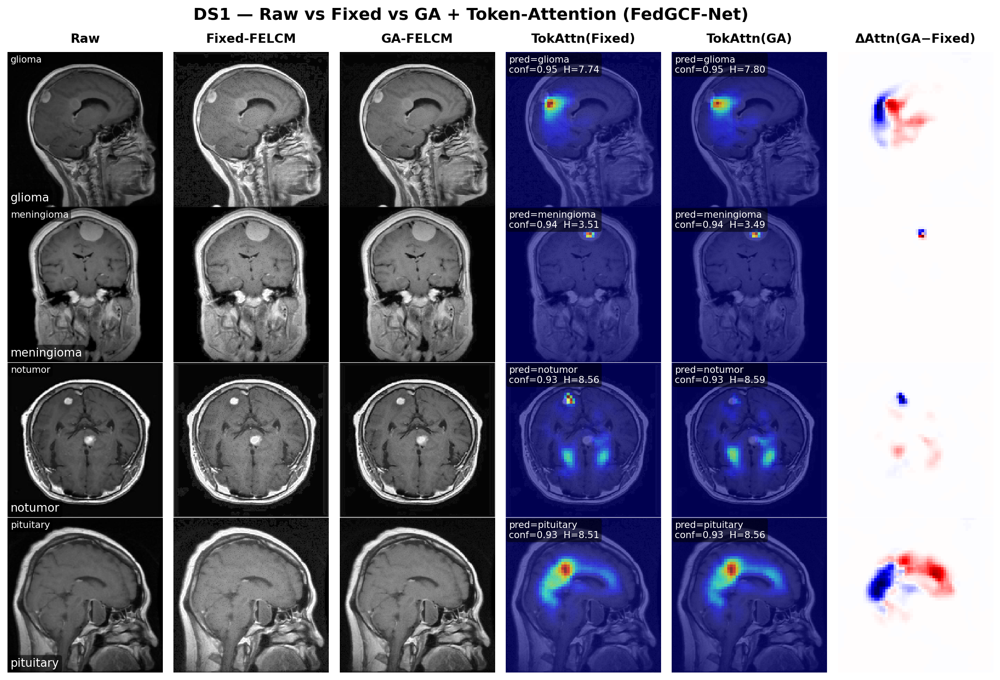
    


    
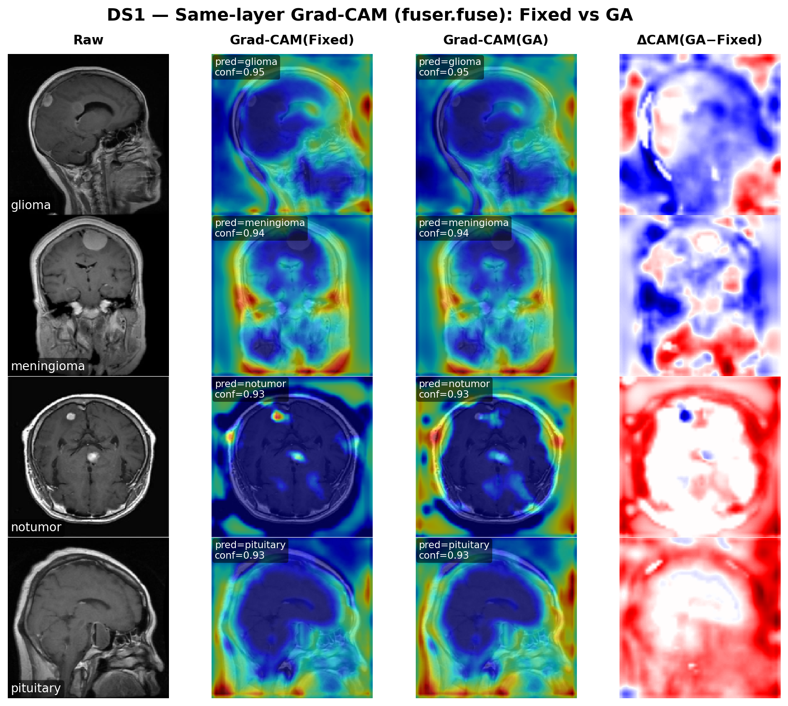
    


    
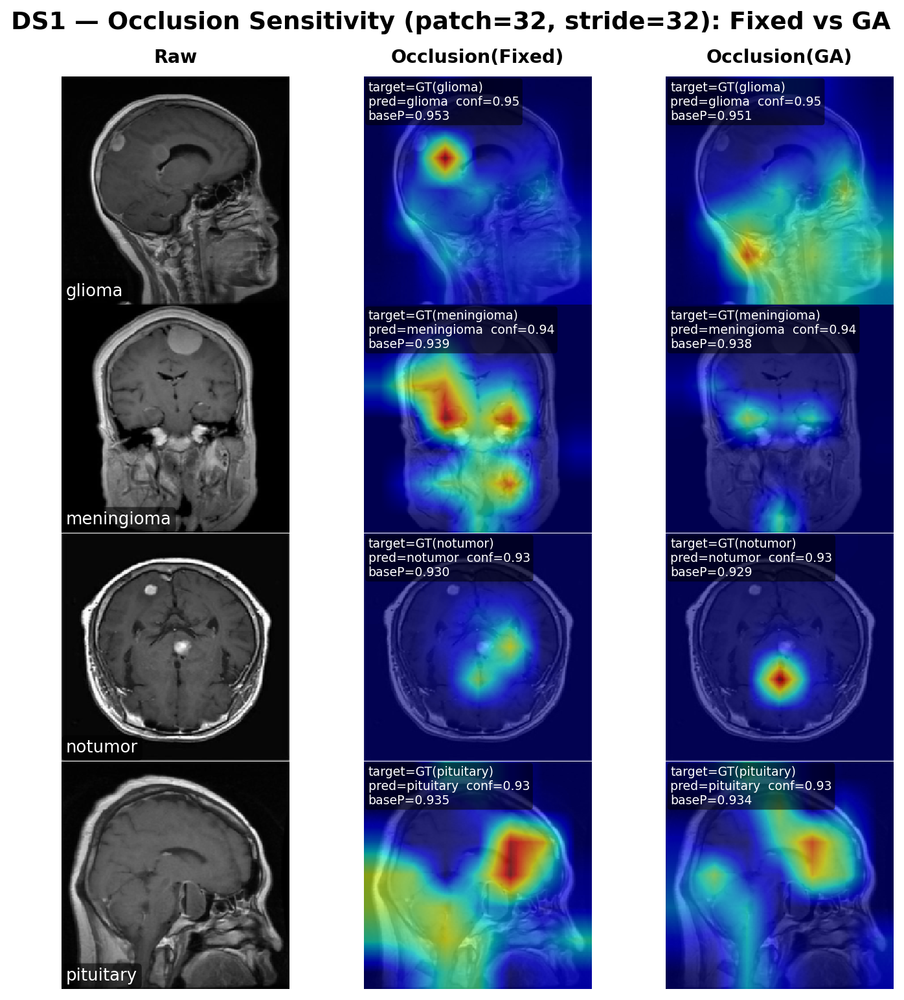
    


    
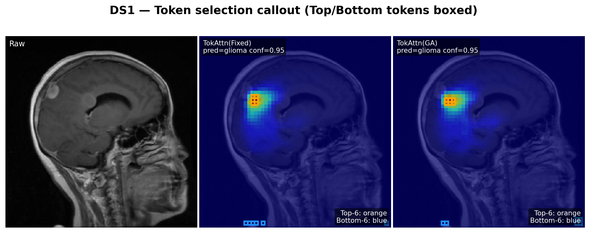
    


    
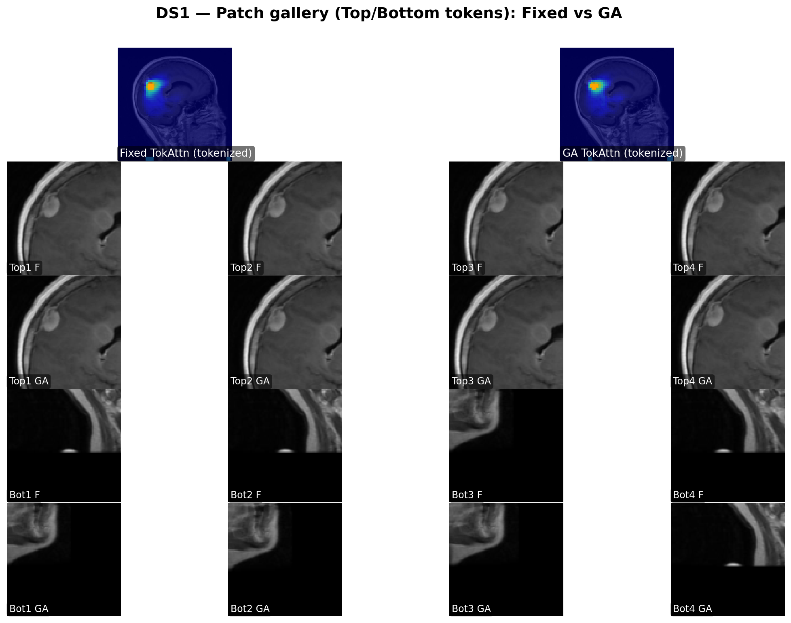
    


    
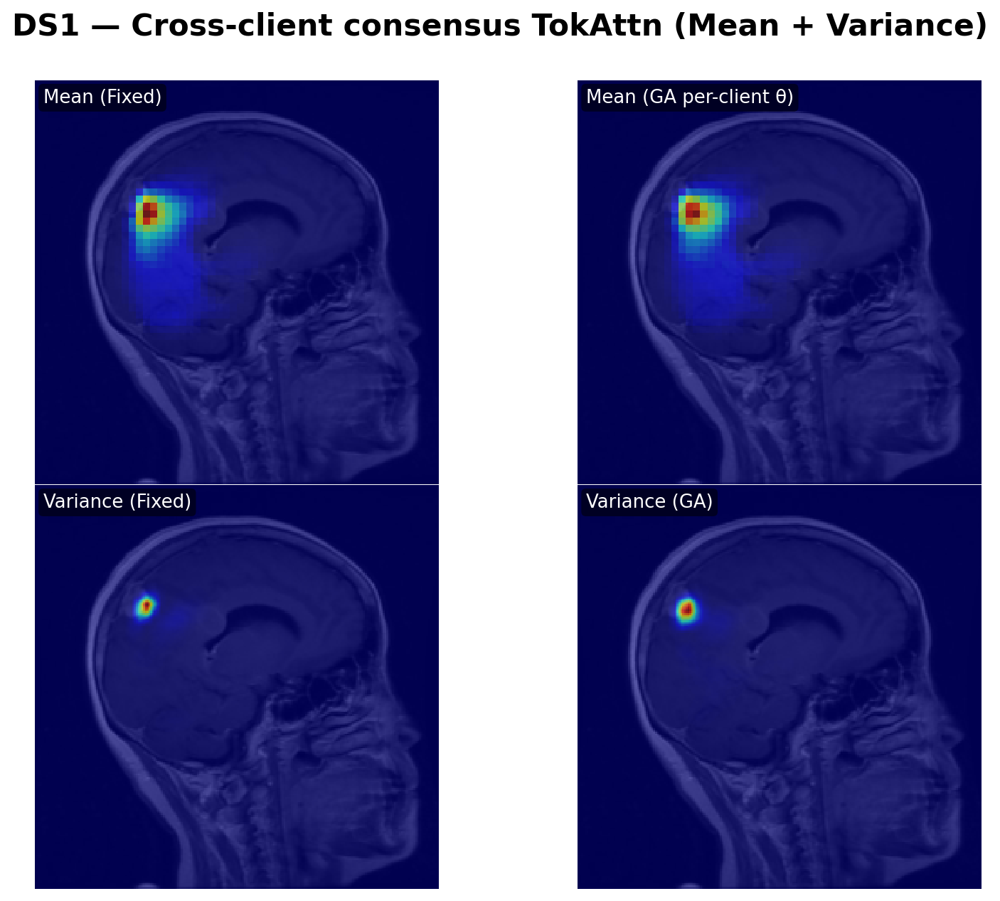
    


    
    [DS1] TokAttn stats: {'n': 120, 'ent_fixed_mean': 7.899962679545085, 'ent_fixed_std': 1.557566717339259, 'ent_ga_mean': 7.920565694570541, 'ent_ga_std': 1.5118178723261886, 'topk_mass_fixed_mean': 0.1963527611301591, 'topk_mass_fixed_std': 0.21160103752397813, 'topk_mass_ga_mean': 0.19400942150192957, 'topk_mass_ga_std': 0.20525458138383293}
    [DS1] Occlusion AOPC : {'n': 24, 'aopc_fixed_mean': 0.004810403771746981, 'aopc_fixed_std': 0.011446441058580233, 'aopc_ga_mean': 0.004646103402592416, 'aopc_ga_std': 0.00989118719627135, 'patch': 32, 'stride': 32, 'target_mode': 'auto'}
    


    
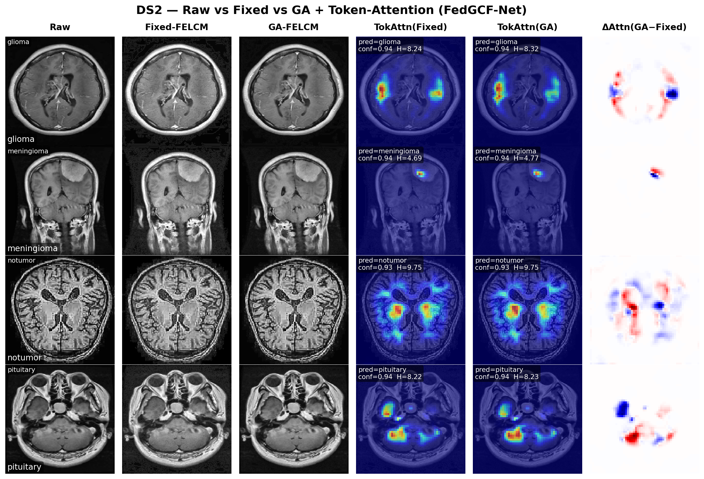
    


    
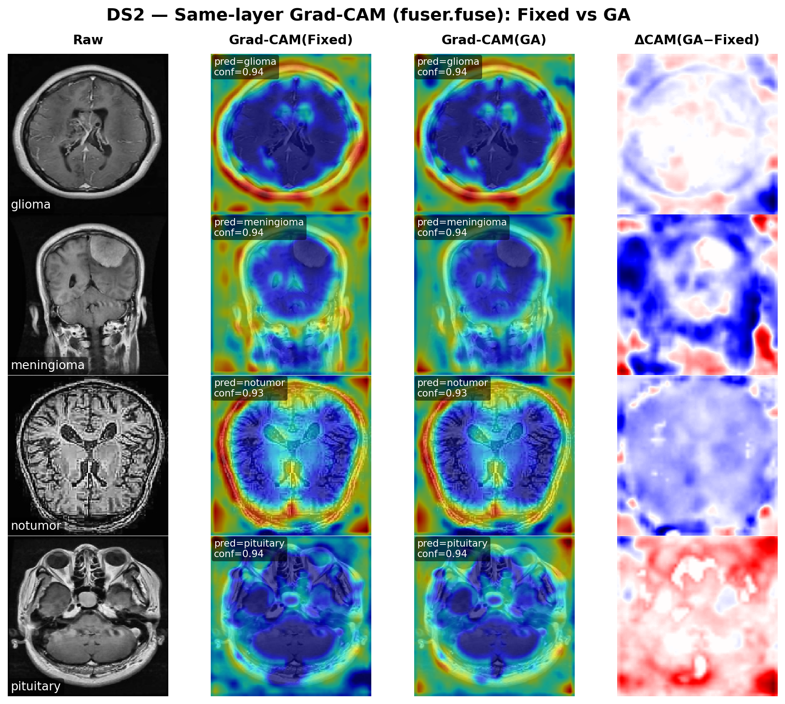
    


    
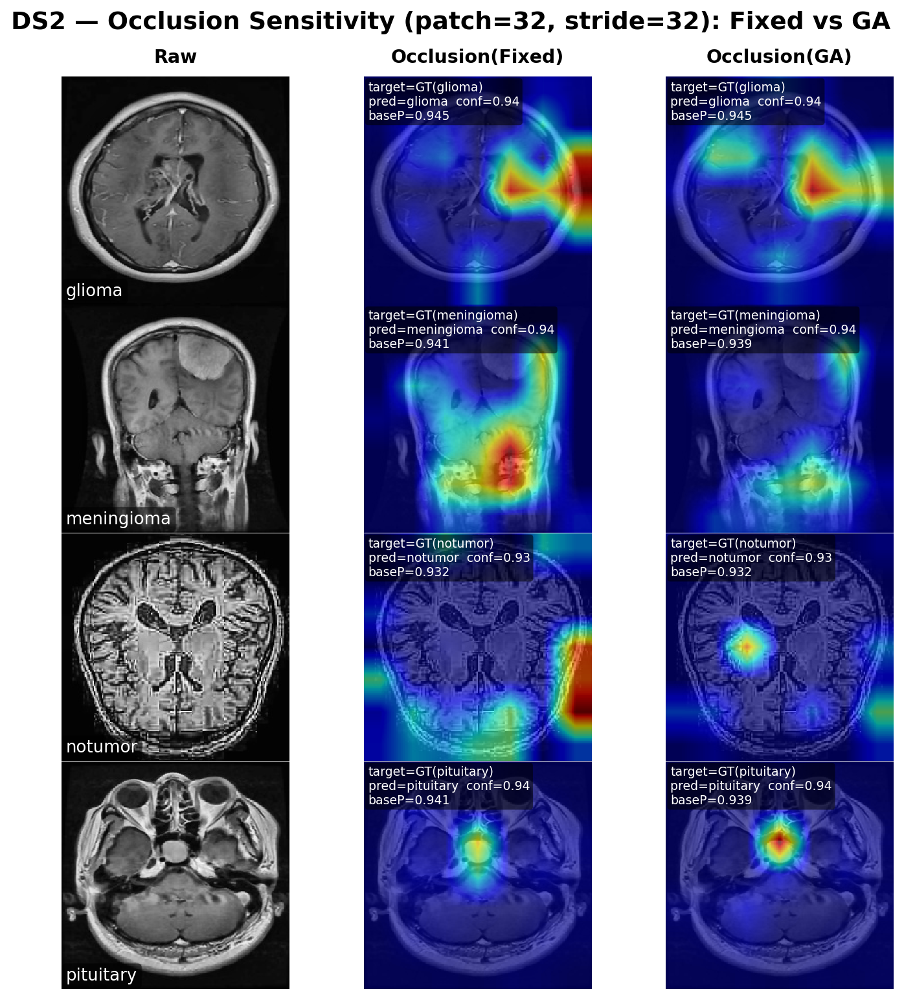
    


    
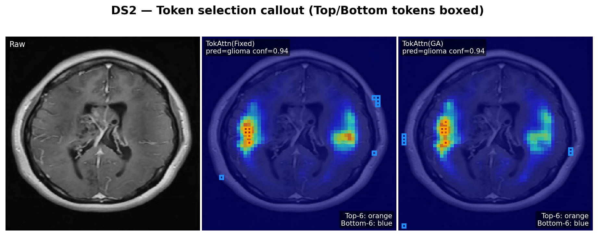
    


    
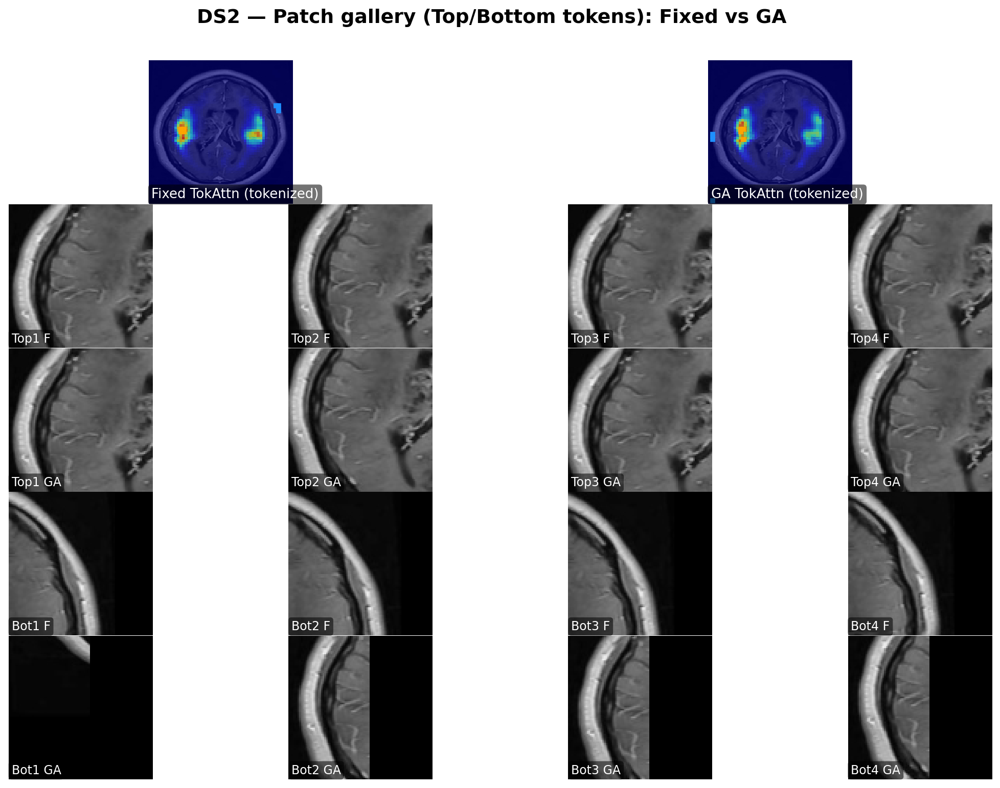
    


    
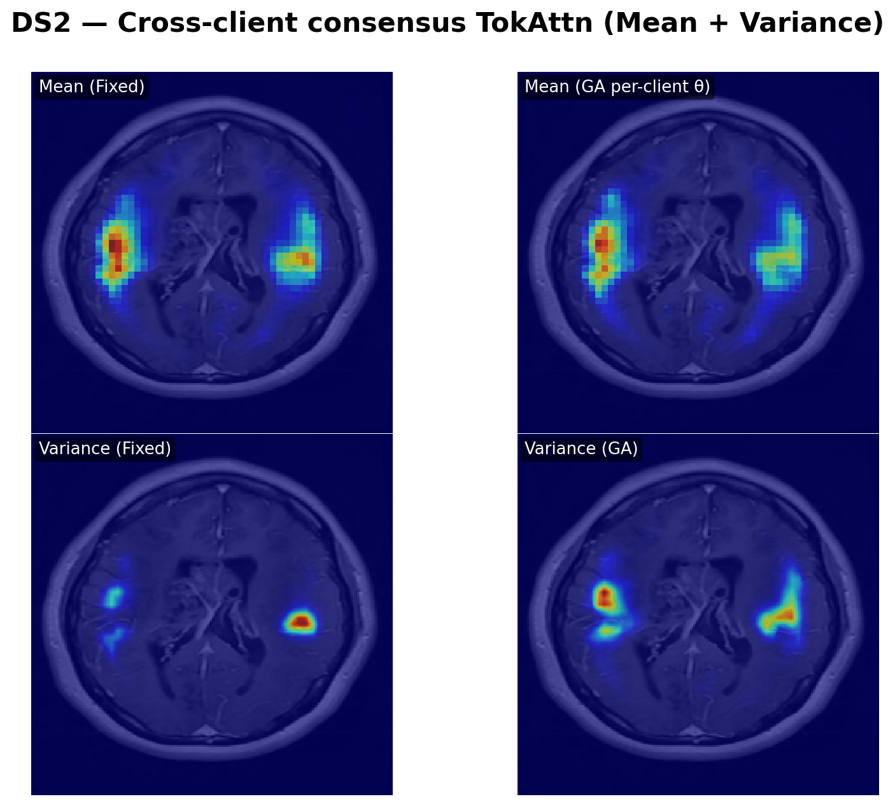
    


    
    [DS2] TokAttn stats: {'n': 120, 'ent_fixed_mean': 7.759453860918681, 'ent_fixed_std': 1.9315032124397131, 'ent_ga_mean': 7.761997644106547, 'ent_ga_std': 1.8945546606525772, 'topk_mass_fixed_mean': 0.2340695392185201, 'topk_mass_fixed_std': 0.2732679340126827, 'topk_mass_ga_mean': 0.2337795783765614, 'topk_mass_ga_std': 0.27097226781507117}
    [DS2] Occlusion AOPC : {'n': 24, 'aopc_fixed_mean': 0.004452855152521806, 'aopc_fixed_std': 0.015390508289742302, 'aopc_ga_mean': 0.004171326716990127, 'aopc_ga_std': 0.01087272100209316, 'patch': 32, 'stride': 32, 'target_mode': 'auto'}
    
    ✅ Done.
    NOTE: For main paper, keep 1 flagship + 1 callout per dataset; put full 4-class grids in Supplement.
    


```python
# ============================================================
# FedGCF-Net XAI / Heatmap Figure Generator (REVIEWER-SAFE v2)
# ------------------------------------------------------------
# ✅ Reviewer fixes:
#   (A) Comparable heatmaps:
#       - SAME extraction point for TokAttn: fuser.pool attention (same layer)
#       - SAME extraction point for CAM: fuser.fuse output (same layer)
#       - SAME colormap per family (jet) and SAME scaling per pair (shared max)
#       - Δ maps use diverging (seismic) with symmetric scaling around 0
#
#   (B) Occlusion fairness:
#       - Returns RAW probability-drop grid (not normalized)
#       - Visualization uses SHARED max between Fixed & GA for that sample
#       - Overlay text includes base prob and max drop (raw)
#
# ✅ Stronger figure validity:
#   - Tries to select per-class examples that are correctly classified by BOTH Fixed & GA
#     (fallback to random if none found).
#
# ✅ Reviewer-winning quantitative number:
#   - Mean TokenAttn entropy H over the FULL dataset (all images under folders)
#   - Also reports entropy on correctly-classified subset (Fixed / GA / both)
#   - Optional: TokAttn Deletion AUC on a capped subset (to avoid runaway compute)
# ============================================================

import os, random
import numpy as np
import pandas as pd
from PIL import Image

import torch
import torch.nn as nn
import torch.nn.functional as F

import matplotlib.pyplot as plt
from matplotlib import gridspec
from matplotlib.patches import Rectangle

# ---------- GLOBAL PLOT STYLE ----------
plt.rcParams.update({
    "figure.dpi": 170,
    "axes.titlesize": 10,
    "axes.titlepad": 6,
    "font.size": 10,
})

# ---------- REPRO + DEVICE ----------
SEED = 42
random.seed(SEED)
np.random.seed(SEED)
torch.manual_seed(SEED)
if torch.cuda.is_available():
    torch.cuda.manual_seed_all(SEED)

DEVICE = torch.device("cuda" if torch.cuda.is_available() else "cpu")
print("DEVICE:", DEVICE)

# ---------- timm ----------
try:
    import timm
except Exception:
    import sys, subprocess
    subprocess.check_call([sys.executable, "-m", "pip", "-q", "install", "timm"])
    import timm

from torchvision import transforms
IMG_EXTS = (".jpg",".jpeg",".png",".bmp",".tif",".tiff",".webp")

# ============================================================
# METRICS CONFIG
# ============================================================
# Full dataset entropy: always computed (can be large but cheap).
# Optional deletion AUC: expensive; kept capped by default.
COMPUTE_DELETION_AUC   = True
DELETION_STEPS         = 10
DELETION_MAX_IMAGES    = 250   # set None to run on ALL images (can be heavy)

# ============================================================
# 0) Load checkpoint
# ============================================================
CKPT_BASENAME = "FL_GAFELCM_PVTv2B2_FUSION_checkpoint.pth"

def find_checkpoint():
    fast = [
        CKPT_BASENAME,
        os.path.join("/content", CKPT_BASENAME),
        os.path.join("/mnt/data", CKPT_BASENAME),
        "/mnt/data/FL_GAFELCM_PVTv2B2_FUSION_checkpoint.pth",
    ]
    for p in fast:
        if os.path.exists(p):
            return p
    for root in ["/content", os.getcwd(), "/mnt/data"]:
        if os.path.isdir(root):
            for r, _, files in os.walk(root):
                if CKPT_BASENAME in files:
                    return os.path.join(r, CKPT_BASENAME)
    return None

CKPT_PATH = find_checkpoint()
if CKPT_PATH is None:
    raise FileNotFoundError(f"Checkpoint not found: {CKPT_BASENAME}")

ckpt = torch.load(CKPT_PATH, map_location="cpu")
print("Loaded checkpoint:", os.path.basename(CKPT_PATH))

CFG = ckpt.get("config", {})
labels = ckpt.get("labels", ["glioma", "meningioma", "notumor", "pituitary"])
label2id = ckpt.get("label2id", {l:i for i,l in enumerate(labels)})
id2label = ckpt.get("id2label", {i:l for l,i in label2id.items()})
NUM_CLASSES = len(labels)

CLIENTS_PER_DS = int(CFG.get("clients_per_dataset", 3))
CLIENTS_TOTAL  = int(CFG.get("clients_total", 6))
BACKBONE_NAME  = str(ckpt.get("backbone_name", CFG.get("backbone_name", "pvt_v2_b2")))

IMG_SIZE = int(CFG.get("img_size", 224))
if IMG_SIZE < 96:
    IMG_SIZE = 224

IMAGENET_MEAN = torch.tensor([0.485, 0.456, 0.406], device=DEVICE).view(1,3,1,1)
IMAGENET_STD  = torch.tensor([0.229, 0.224, 0.225], device=DEVICE).view(1,3,1,1)

EVAL_TFMS = transforms.Compose([
    transforms.Resize((IMG_SIZE, IMG_SIZE)),
    transforms.ToTensor(),
])

# ============================================================
# 1) Robust dataset root resolution
# ============================================================
REQ1 = {"512Glioma", "512Meningioma", "512Normal", "512Pituitary"}  # DS1 dirs
REQ2 = {"glioma", "meningioma", "notumor", "pituitary"}             # DS2 dirs

def find_root_with_required_class_dirs(base_dir, required_set, prefer_raw=True, max_candidates=40_000):
    if base_dir is None or (not os.path.isdir(base_dir)):
        return None
    candidates = []
    walked = 0
    for root, dirs, _ in os.walk(base_dir):
        walked += 1
        if walked > max_candidates:
            break
        if required_set.issubset(set(dirs)):
            candidates.append(root)
    if not candidates:
        return None
    def score(p):
        pl = p.lower()
        sc = 0
        if prefer_raw:
            if "raw data" in pl: sc += 8
            if os.path.basename(p).lower() == "raw": sc += 8
            if "/raw/" in pl or "\\raw\\" in pl: sc += 4
            if "augmented" in pl: sc -= 30
        sc -= 0.0001 * len(p)
        return sc
    return max(candidates, key=score)

def try_auto_locate_anywhere(required_set, prefer_raw):
    candidates = [
        "/content",
        "/content/data",
        "/content/datasets",
        "/kaggle/input",
        "/mnt",
        "/mnt/data",
        os.getcwd(),
    ]
    for base in candidates:
        r = find_root_with_required_class_dirs(base, required_set, prefer_raw=prefer_raw)
        if r is not None:
            return r
    return None

def ensure_kagglehub():
    try:
        import kagglehub
        return kagglehub
    except Exception:
        import sys, subprocess
        subprocess.check_call([sys.executable, "-m", "pip", "-q", "install", "kagglehub"])
        import kagglehub
        return kagglehub

def resolve_dataset_roots():
    ds1_root_ckpt = ckpt.get("dataset1_raw_root", None)
    ds2_root_ckpt = ckpt.get("dataset2_root", None)

    ds1_root = ds1_root_ckpt if (ds1_root_ckpt and os.path.isdir(ds1_root_ckpt)) else None
    ds2_root = ds2_root_ckpt if (ds2_root_ckpt and os.path.isdir(ds2_root_ckpt)) else None

    if ds1_root is None:
        ds1_root = try_auto_locate_anywhere(REQ1, prefer_raw=True)
    if ds2_root is None:
        ds2_root = try_auto_locate_anywhere(REQ2, prefer_raw=False)

    if ds1_root is None or ds2_root is None:
        try:
            kagglehub = ensure_kagglehub()
            ds2_base = kagglehub.dataset_download("yassinebazgour/preprocessed-brain-mri-scans-for-tumors-detection")
            ds1_base = kagglehub.dataset_download("orvile/pmram-bangladeshi-brain-cancer-mri-dataset")
            if ds1_root is None:
                ds1_root = find_root_with_required_class_dirs(ds1_base, REQ1, prefer_raw=True)
            if ds2_root is None:
                ds2_root = find_root_with_required_class_dirs(ds2_base, REQ2, prefer_raw=False)
        except Exception as e:
            print("⚠️ kagglehub download failed:", str(e))
    return ds1_root, ds2_root

DS1_ROOT, DS2_ROOT = resolve_dataset_roots()
print("DS1_ROOT:", DS1_ROOT)
print("DS2_ROOT:", DS2_ROOT)

if DS1_ROOT is None or (not os.path.isdir(DS1_ROOT)):
    raise FileNotFoundError(f"Could not locate DS1 root containing: {sorted(list(REQ1))}")
if DS2_ROOT is None or (not os.path.isdir(DS2_ROOT)):
    raise FileNotFoundError(f"Could not locate DS2 root containing: {sorted(list(REQ2))}")

# ============================================================
# 2) GA-FELCM
# ============================================================
class EnhancedFELCM(nn.Module):
    def __init__(self, gamma=1.0, alpha=0.35, beta=6.0, tau=2.5, blur_k=7, sharpen=0.0, denoise=0.0):
        super().__init__()
        self.gamma = float(gamma)
        self.alpha = float(alpha)
        self.beta  = float(beta)
        self.tau   = float(tau)
        self.blur_k = int(blur_k)
        self.sharpen = float(sharpen)
        self.denoise = float(denoise)

        lap = torch.tensor([[0, -1, 0], [-1, 4, -1], [0, -1, 0]], dtype=torch.float32)
        self.register_buffer("lap", lap.view(1, 1, 3, 3))

        sharp = torch.tensor([[0, -1, 0], [-1, 5, -1], [0, -1, 0]], dtype=torch.float32)
        self.register_buffer("sharp_kernel", sharp.view(1, 1, 3, 3))

    def forward(self, x):
        eps = 1e-6
        B, C, H, W = x.shape

        if self.denoise > 0:
            k = 3
            x_blur = F.avg_pool2d(F.pad(x, (1, 1, 1, 1), mode="reflect"), k, 1)
            x = x * (1 - self.denoise) + x_blur * self.denoise

        mu = x.mean(dim=(2, 3), keepdim=True)
        sd = x.std(dim=(2, 3), keepdim=True).clamp_min(eps)
        x0 = (x - mu) / sd
        x0 = x0.clamp(-self.tau, self.tau)

        x1 = torch.sign(x0) * torch.pow(torch.abs(x0).clamp_min(eps), self.gamma)

        gray = x1.mean(dim=1, keepdim=True)
        lap = F.conv2d(F.pad(gray, (1, 1, 1, 1), mode="reflect"), self.lap)
        mag = lap.abs()

        k = self.blur_k if self.blur_k % 2 == 1 else self.blur_k + 1
        pad = k // 2
        blur = F.avg_pool2d(F.pad(mag, (pad, pad, pad, pad), mode="reflect"), k, 1)
        C_map = mag / (blur + eps)

        x2 = x1 + self.alpha * torch.tanh(self.beta * C_map)

        if self.sharpen > 0:
            outs = []
            for c in range(C):
                x_c = x2[:, c: c + 1, :, :]
                x_sharp = F.conv2d(F.pad(x_c, (1, 1, 1, 1), mode="reflect"), self.sharp_kernel)
                outs.append(x_c * (1 - self.sharpen) + x_sharp * self.sharpen)
            x2 = torch.cat(outs, dim=1)

        mn = x2.amin(dim=(2, 3), keepdim=True)
        mx = x2.amax(dim=(2, 3), keepdim=True)
        x3 = (x2 - mn) / (mx - mn + eps)
        return x3.clamp(0, 1)

def theta_to_module(theta):
    if theta is None:
        return EnhancedFELCM()
    g, a, b, t, k, sh, dn = theta
    return EnhancedFELCM(gamma=g, alpha=a, beta=b, tau=t, blur_k=int(k), sharpen=sh, denoise=dn)

def preproc_theta_vec(preproc_module, batch_size):
    theta = torch.tensor(
        [
            float(preproc_module.gamma),
            float(preproc_module.alpha),
            float(preproc_module.beta),
            float(preproc_module.tau),
            float(preproc_module.blur_k) / 7.0,
            float(preproc_module.sharpen),
            float(preproc_module.denoise),
        ],
        device=DEVICE,
        dtype=torch.float32,
    )
    return theta.unsqueeze(0).repeat(batch_size, 1)

fixed_pre = EnhancedFELCM().to(DEVICE).eval()
best_theta_ds1 = ckpt.get("best_theta_ds1", None)
best_theta_ds2 = ckpt.get("best_theta_ds2", None)
ga_pre_ds1 = theta_to_module(best_theta_ds1).to(DEVICE).eval()
ga_pre_ds2 = theta_to_module(best_theta_ds2).to(DEVICE).eval()

print("best_theta_ds1:", best_theta_ds1)
print("best_theta_ds2:", best_theta_ds2)

# ============================================================
# 3) FedGCF-Net pieces
# ============================================================
class TokenAttentionPooling(nn.Module):
    def __init__(self, dim):
        super().__init__()
        self.query = nn.Linear(dim, 1)
    def forward(self, x_tokens):  # [B, HW, C]
        attn = torch.softmax(self.query(x_tokens).squeeze(-1), dim=1)  # [B, HW]
        pooled = (x_tokens * attn.unsqueeze(-1)).sum(dim=1)
        return pooled, attn

class MultiScaleFeatureFuser(nn.Module):
    def __init__(self, in_channels, out_dim):
        super().__init__()
        self.proj = nn.ModuleList([
            nn.Sequential(
                nn.Conv2d(c, out_dim, kernel_size=1, bias=False),
                nn.GroupNorm(8, out_dim),
                nn.GELU(),
            )
            for c in in_channels
        ])
        self.fuse = nn.Sequential(
            nn.Conv2d(out_dim, out_dim, kernel_size=3, padding=1, bias=False),
            nn.GroupNorm(8, out_dim),
            nn.GELU(),
        )
        self.pool = TokenAttentionPooling(out_dim)

class EnhancedBrainTuner(nn.Module):
    def __init__(self, dim, dropout=0.1):
        super().__init__()
        self.se = nn.Sequential(
            nn.Linear(dim, max(8, dim // 4)),
            nn.ReLU(inplace=True),
            nn.Linear(max(8, dim // 4), dim),
            nn.Sigmoid(),
        )
        self.refine = nn.Sequential(
            nn.LayerNorm(dim),
            nn.Linear(dim, dim),
            nn.GELU(),
            nn.Dropout(dropout),
            nn.Linear(dim, dim),
        )
        self.gate = nn.Parameter(torch.ones(2) / 2)
    def forward(self, x):
        gate = F.softmax(self.gate, dim=0)
        out1 = x * self.se(x)
        out2 = x + 0.2 * self.refine(x)
        return gate[0] * out1 + gate[1] * out2

class PVTv2B2_MultiScale(nn.Module):
    def __init__(self, num_classes, head_dropout=0.3, cond_dim=128, num_clients=6):
        super().__init__()
        self.backbone = timm.create_model(
            BACKBONE_NAME,
            pretrained=False,
            features_only=True,
            out_indices=(0,1,2,3),
        )
        in_channels = self.backbone.feature_info.channels()
        out_dim = max(256, in_channels[-1] // 2)

        self.fuser = MultiScaleFeatureFuser(in_channels, out_dim)
        self.tuner = EnhancedBrainTuner(out_dim, dropout=0.1)

        self.classifier = nn.Sequential(
            nn.LayerNorm(out_dim),
            nn.Dropout(head_dropout),
            nn.Linear(out_dim, max(64, out_dim // 2)),
            nn.GELU(),
            nn.Dropout(head_dropout * 0.5),
            nn.Linear(max(64, out_dim // 2), num_classes),
        )

        self.theta_mlp = nn.Sequential(
            nn.Linear(7, cond_dim),
            nn.GELU(),
            nn.Linear(cond_dim, cond_dim),
        )
        self.source_emb = nn.Embedding(2, cond_dim)
        self.client_emb = nn.Embedding(num_clients, cond_dim)
        self.cond_norm = nn.LayerNorm(cond_dim)

        self.gate_early = nn.Linear(cond_dim, 3)
        self.gate_mid   = nn.Linear(cond_dim, out_dim)
        self.gate_late  = nn.Linear(cond_dim, out_dim)

    def _cond_vec(self, theta_vec, source_id, client_id):
        cond = self.theta_mlp(theta_vec)
        cond = cond + self.source_emb(source_id) + self.client_emb(client_id)
        return self.cond_norm(cond)

model = PVTv2B2_MultiScale(
    num_classes=NUM_CLASSES,
    head_dropout=float(CFG.get("head_dropout", 0.3)),
    cond_dim=int(CFG.get("cond_dim", 128)),
    num_clients=CLIENTS_TOTAL,
).to(DEVICE).eval()

sd = ckpt.get("state_dict", None)
if sd is None:
    raise RuntimeError("Checkpoint missing state_dict.")
model.load_state_dict(sd, strict=True)
print("✅ Model weights loaded.")

# ============================================================
# 4) Dataset mappings + IO
# ============================================================
DS1_CLASS_DIRS = {
    "glioma": "512Glioma",
    "meningioma": "512Meningioma",
    "notumor": "512Normal",
    "pituitary": "512Pituitary",
}
DS2_CLASS_DIRS = {
    "glioma": "glioma",
    "meningioma": "meningioma",
    "notumor": "notumor",
    "pituitary": "pituitary",
}

def load_rgb(path):
    return Image.open(path).convert("RGB")

def list_images_under_class_root(class_root, class_dir_name):
    class_dir = os.path.join(class_root, class_dir_name)
    out = []
    if not os.path.isdir(class_dir):
        return out
    for r, _, files in os.walk(class_dir):
        for fn in files:
            if fn.lower().endswith(IMG_EXTS):
                out.append(os.path.join(r, fn))
    return out

def collect_all_images(ds_root, class_dirs_map):
    items = []
    for lab in labels:
        imgs = list_images_under_class_root(ds_root, class_dirs_map[lab])
        items.extend([(lab, p) for p in imgs])
    return items

# ============================================================
# 5) Core extraction helpers
# ============================================================
def fuser_conv_pooled_attn(fuser, feats):
    proj_feats = [p(f) for p, f in zip(fuser.proj, feats)]
    x = proj_feats[-1]
    for f in reversed(proj_feats[:-1]):
        x = F.interpolate(x, size=f.shape[-2:], mode="bilinear", align_corners=False)
        x = x + f
    x = fuser.fuse(x)  # [B,C,H,W]
    B, C, H, W = x.shape
    tokens = x.flatten(2).transpose(1, 2)  # [B,HW,C]
    pooled, attn = fuser.pool(tokens)       # pooled [B,C], attn [B,HW]
    attn_map = attn.view(B, H, W)
    return x, pooled, attn_map

def attn_entropy_from_map(attn_2d):
    p = attn_2d.flatten().clamp(1e-9, 1.0)
    p = p / p.sum()
    return float(-(p * torch.log2(p)).sum().item())

def to_gray_np(x01_1x3):
    g = x01_1x3[0].mean(dim=0).detach().cpu().numpy()
    return np.clip(g, 0, 1)

def upsample_map(m, out_hw, mode="bilinear"):
    if isinstance(m, np.ndarray):
        t = torch.tensor(m)[None,None,:,:].float()
    else:
        t = m[None,None,:,:].float()
    align = False if mode in ["bilinear", "bicubic"] else None
    t2 = F.interpolate(t, size=out_hw, mode=mode, align_corners=align)[0,0]
    return t2.detach().cpu().numpy()

def overlay_heat(gray01, heat01, alpha=0.6, cmap_name="jet"):
    gray3 = np.stack([gray01, gray01, gray01], axis=-1)
    cmap = getattr(plt.cm, cmap_name)
    heat3 = cmap(np.clip(heat01, 0, 1))[...,:3]
    out = (1-alpha)*gray3 + alpha*heat3
    return np.clip(out, 0, 1)

def diverging_rgb(delta, clip_q=0.98, cmap_name="seismic"):
    d = delta.astype(np.float32)
    s = np.quantile(np.abs(d), clip_q) + 1e-9
    d = np.clip(d / s, -1, 1)
    cmap = getattr(plt.cm, cmap_name)
    rgb = cmap((d + 1.0) / 2.0)[...,:3]
    return np.clip(rgb, 0, 1)

def normalize_pair_shared_max(a, b, eps=1e-9):
    m = max(float(np.max(a)), float(np.max(b)), eps)
    return np.clip(a / m, 0, 1), np.clip(b / m, 0, 1), m

def _imshow(ax, img, gray=False):
    ax.axis("off")
    if gray:
        ax.imshow(img, cmap="gray", vmin=0, vmax=1, interpolation="nearest", aspect="equal")
    else:
        ax.imshow(img, interpolation="nearest", aspect="equal")

def label_box(ax, text, loc="tl", fontsize=9):
    if not text:
        return
    ha, va = "left", "top"
    x, y = 0.02, 0.98
    if loc == "tr":
        ha, va = "right", "top"; x, y = 0.98, 0.98
    elif loc == "bl":
        ha, va = "left", "bottom"; x, y = 0.02, 0.02
    elif loc == "br":
        ha, va = "right", "bottom"; x, y = 0.98, 0.02
    ax.text(
        x, y, text,
        transform=ax.transAxes,
        ha=ha, va=va,
        color="white",
        fontsize=fontsize,
        bbox=dict(boxstyle="round,pad=0.25", fc="black", ec="none", alpha=0.55),
        zorder=10,
    )

def add_col_headers(fig, axes_top_row, headers, y_pad=0.012, fontsize=11):
    for ax, h in zip(axes_top_row, headers):
        bb = ax.get_position()
        x = (bb.x0 + bb.x1) / 2
        y = bb.y1 + y_pad
        fig.text(x, y, h, ha="center", va="bottom", fontsize=fontsize, fontweight="bold")

def add_caption(fig, caption, y=0.008, fontsize=9):
    fig.text(0.5, y, caption, ha="center", va="bottom", fontsize=fontsize)

# ---------- Forward that returns TokAttn + probs ----------
@torch.no_grad()
def forward_with_tokattn(x01, preproc, source_id, client_id):
    x01 = x01.to(DEVICE)
    x_fel = preproc(x01).clamp(0,1)

    x_raw_n = (x01 - IMAGENET_MEAN) / IMAGENET_STD
    x_fel_n = (x_fel - IMAGENET_MEAN) / IMAGENET_STD

    theta_vec = preproc_theta_vec(preproc, batch_size=1)
    sid = torch.tensor([source_id], device=DEVICE, dtype=torch.long)
    cid = torch.tensor([client_id], device=DEVICE, dtype=torch.long)

    cond = model._cond_vec(theta_vec, sid, cid)
    g0 = torch.sigmoid(model.gate_early(cond)).view(-1,3,1,1)
    xmix = (1-g0)*x_raw_n + g0*x_fel_n

    feats0 = model.backbone(xmix)
    _, f0, att0 = fuser_conv_pooled_attn(model.fuser, feats0)

    feats1 = model.backbone(x_fel_n)
    _, f1, _ = fuser_conv_pooled_attn(model.fuser, feats1)

    g1 = torch.sigmoid(model.gate_mid(cond))
    f_mid = (1-g1)*f0 + g1*f1

    t0 = model.tuner(f0)
    t1 = model.tuner(f1)
    t_mid = model.tuner(f_mid)

    t_views = 0.5*(t0+t1)
    g2 = torch.sigmoid(model.gate_late(cond))
    t_final = (1-g2)*t_mid + g2*t_views

    logits = model.classifier(t_final)
    prob = torch.softmax(logits, dim=1)[0]
    pred = int(prob.argmax().item())
    conf = float(prob.max().item())
    return {
        "attn_map": att0[0].detach().cpu(),   # [h,w] softmax => sum 1
        "prob": prob.detach().cpu(),
        "pred": pred,
        "conf": conf,
    }

# ---------- Grad-CAM RAW (same layer: fuser.fuse output) ----------
def gradcam_same_layer_raw(x01, preproc, source_id, client_id, target_class=None):
    model.eval()
    preproc.eval()

    x01 = x01.to(DEVICE)
    x_fel = preproc(x01).clamp(0,1)

    x_raw_n = (x01 - IMAGENET_MEAN) / IMAGENET_STD
    x_fel_n = (x_fel - IMAGENET_MEAN) / IMAGENET_STD

    theta_vec = preproc_theta_vec(preproc, batch_size=1)
    sid = torch.tensor([source_id], device=DEVICE, dtype=torch.long)
    cid = torch.tensor([client_id], device=DEVICE, dtype=torch.long)

    model.zero_grad(set_to_none=True)

    cond = model._cond_vec(theta_vec, sid, cid)
    g0 = torch.sigmoid(model.gate_early(cond)).view(-1,3,1,1)
    xmix = (1-g0)*x_raw_n + g0*x_fel_n

    feats0 = model.backbone(xmix)
    conv0, f0, _ = fuser_conv_pooled_attn(model.fuser, feats0)
    conv0.retain_grad()

    feats1 = model.backbone(x_fel_n)
    _, f1, _ = fuser_conv_pooled_attn(model.fuser, feats1)

    g1 = torch.sigmoid(model.gate_mid(cond))
    f_mid = (1-g1)*f0 + g1*f1

    t0 = model.tuner(f0)
    t1 = model.tuner(f1)
    t_mid = model.tuner(f_mid)

    t_views = 0.5*(t0+t1)
    g2 = torch.sigmoid(model.gate_late(cond))
    t_final = (1-g2)*t_mid + g2*t_views

    logits = model.classifier(t_final)
    prob = torch.softmax(logits, dim=1)[0]
    pred = int(prob.argmax().item())
    conf = float(prob.max().item())

    if target_class is None:
        target_class = pred

    logits[0, target_class].backward()

    grad = conv0.grad[0]       # [C,h,w]
    act  = conv0.detach()[0]   # [C,h,w]
    w = grad.mean(dim=(1,2), keepdim=True)
    cam = torch.relu((w * act).sum(dim=0))  # RAW, non-normalized
    return cam.detach().cpu(), conf, pred, int(target_class)

# ---------- Occlusion RAW probability-drop grid ----------
@torch.no_grad()
def occlusion_sensitivity_map_raw(x01, preproc, source_id, client_id, patch=32, stride=32, target_class=None):
    x01 = x01.to(DEVICE)
    x_fel = preproc(x01).clamp(0,1)

    x_raw_n = (x01 - IMAGENET_MEAN) / IMAGENET_STD
    x_fel_n = (x_fel - IMAGENET_MEAN) / IMAGENET_STD

    theta_vec = preproc_theta_vec(preproc, batch_size=1)
    sid = torch.tensor([source_id], device=DEVICE, dtype=torch.long)
    cid = torch.tensor([client_id], device=DEVICE, dtype=torch.long)

    cond = model._cond_vec(theta_vec, sid, cid)
    g0 = torch.sigmoid(model.gate_early(cond)).view(-1,3,1,1)
    xmix = (1-g0)*x_raw_n + g0*x_fel_n

    feats0 = model.backbone(xmix)
    _, f0, _ = fuser_conv_pooled_attn(model.fuser, feats0)

    feats1 = model.backbone(x_fel_n)
    _, f1, _ = fuser_conv_pooled_attn(model.fuser, feats1)

    g1 = torch.sigmoid(model.gate_mid(cond))
    f_mid = (1-g1)*f0 + g1*f1

    t0 = model.tuner(f0)
    t1 = model.tuner(f1)
    t_mid = model.tuner(f_mid)

    t_views = 0.5*(t0+t1)
    g2 = torch.sigmoid(model.gate_late(cond))
    t_final = (1-g2)*t_mid + g2*t_views

    logits = model.classifier(t_final)
    prob = torch.softmax(logits, dim=1)[0]
    pred = int(prob.argmax().item())
    conf = float(prob.max().item())

    if target_class is None:
        target_class = pred
    base_p = float(prob[target_class].item())

    _, _, H, W = x01.shape
    ys = list(range(0, H, stride))
    xs = list(range(0, W, stride))
    grid = np.zeros((len(ys), len(xs)), dtype=np.float32)

    for iy, y0 in enumerate(ys):
        for ix, x0p in enumerate(xs):
            x_mask = x01.clone()
            y1 = min(H, y0 + patch)
            x1 = min(W, x0p + patch)
            x_mask[:, :, y0:y1, x0p:x1] = 0.0

            x_fel_m = preproc(x_mask).clamp(0,1)
            x_raw_n_m = (x_mask - IMAGENET_MEAN) / IMAGENET_STD
            x_fel_n_m = (x_fel_m - IMAGENET_MEAN) / IMAGENET_STD

            cond_m = model._cond_vec(theta_vec, sid, cid)
            g0m = torch.sigmoid(model.gate_early(cond_m)).view(-1,3,1,1)
            xmix_m = (1-g0m)*x_raw_n_m + g0m*x_fel_n_m

            feats0m = model.backbone(xmix_m)
            _, f0m, _ = fuser_conv_pooled_attn(model.fuser, feats0m)

            feats1m = model.backbone(x_fel_n_m)
            _, f1m, _ = fuser_conv_pooled_attn(model.fuser, feats1m)

            g1m = torch.sigmoid(model.gate_mid(cond_m))
            f_mid_m = (1-g1m)*f0m + g1m*f1m

            t0m = model.tuner(f0m)
            t1m = model.tuner(f1m)
            t_mid_m = model.tuner(f_mid_m)

            t_views_m = 0.5*(t0m+t1m)
            g2m = torch.sigmoid(model.gate_late(cond_m))
            t_final_m = (1-g2m)*t_mid_m + g2m*t_views_m

            logits_m = model.classifier(t_final_m)
            prob_m = torch.softmax(logits_m, dim=1)[0]
            p_m = float(prob_m[target_class].item())

            grid[iy, ix] = max(0.0, base_p - p_m)  # RAW prob drop

    return grid, base_p, pred, conf, int(target_class)

# ============================================================
# 6) Pick “good” per-class examples (correct for BOTH Fixed & GA)
# ============================================================
def pick_correct_examples(ds_root, class_dirs_map, source_id, rep_client_id, pre_ga,
                          seed=SEED, max_tries_per_class=250, require_both=True):
    rng = random.Random(seed)
    out = {}
    for lab in labels:
        gt = label2id[lab]
        imgs = list_images_under_class_root(ds_root, class_dirs_map[lab])
        if not imgs:
            out[lab] = None
            continue
        rng.shuffle(imgs)
        picked = None

        for p in imgs[:max_tries_per_class]:
            x = EVAL_TFMS(load_rgb(p)).unsqueeze(0)
            of = forward_with_tokattn(x, fixed_pre, source_id, rep_client_id)
            og = forward_with_tokattn(x, pre_ga,    source_id, rep_client_id)
            ok_f = (of["pred"] == gt)
            ok_g = (og["pred"] == gt)
            if require_both:
                if ok_f and ok_g:
                    picked = p
                    break
            else:
                if ok_g:
                    picked = p
                    break

        if picked is None:
            picked = imgs[0]  # fallback
        out[lab] = picked
    return out

# ============================================================
# 7) Metrics on FULL dataset: Avg entropy + (optional) deletion AUC
# ============================================================
@torch.no_grad()
def deletion_auc_from_tokattn(x01, preproc, source_id, client_id, target_class, steps=10):
    out = forward_with_tokattn(x01, preproc, source_id, client_id)
    att = out["attn_map"]  # [h,w]
    h, w = att.shape
    token_scores = att.flatten().cpu().numpy()
    order = np.argsort(-token_scores)

    th = max(1, IMG_SIZE // h)
    tw = max(1, IMG_SIZE // w)

    fracs = np.linspace(0, 1, steps+1)
    probs = []

    probs.append(float(out["prob"][target_class].item()))
    for f in fracs[1:]:
        k = int(round(f * len(order)))
        x_mask = x01.clone()
        for idx in order[:k]:
            yy = idx // w
            xx = idx % w
            y0 = yy * th
            x0 = xx * tw
            y1 = min(IMG_SIZE, y0 + th)
            x1 = min(IMG_SIZE, x0 + tw)
            x_mask[:, :, y0:y1, x0:x1] = 0.0
        out_k = forward_with_tokattn(x_mask, preproc, source_id, client_id)
        probs.append(float(out_k["prob"][target_class].item()))

    auc = float(np.trapz(probs, fracs))
    return auc

@torch.no_grad()
def fullset_metrics_report(ds_name, ds_root, class_dirs_map, pre_ga, source_id, rep_client_id,
                           compute_del_auc=True, del_steps=10, del_max_images=250):
    items = collect_all_images(ds_root, class_dirs_map)
    random.Random(SEED+999).shuffle(items)
    n_total = len(items)

    H_f_all, H_g_all = [], []
    H_f_corr, H_g_corr, H_both_corr = [], [], []
    A_f, A_g = [], []

    del_subset = items if (del_max_images is None) else items[:min(del_max_images, n_total)]

    for gt_lab, path in items:
        gt = label2id[gt_lab]
        x = EVAL_TFMS(load_rgb(path)).unsqueeze(0)

        of = forward_with_tokattn(x, fixed_pre, source_id, rep_client_id)
        og = forward_with_tokattn(x, pre_ga,    source_id, rep_client_id)

        H_f_all.append(attn_entropy_from_map(of["attn_map"]))
        H_g_all.append(attn_entropy_from_map(og["attn_map"]))

        ok_f = (of["pred"] == gt)
        ok_g = (og["pred"] == gt)
        if ok_f: H_f_corr.append(attn_entropy_from_map(of["attn_map"]))
        if ok_g: H_g_corr.append(attn_entropy_from_map(og["attn_map"]))
        if ok_f and ok_g:
            H_both_corr.append(attn_entropy_from_map(og["attn_map"]))  # GA entropy on shared-correct set

    if compute_del_auc:
        for gt_lab, path in del_subset:
            x = EVAL_TFMS(load_rgb(path)).unsqueeze(0)
            of = forward_with_tokattn(x, fixed_pre, source_id, rep_client_id)
            og = forward_with_tokattn(x, pre_ga,    source_id, rep_client_id)
            # Use predicted class (robust even when misclassified)
            A_f.append(deletion_auc_from_tokattn(x, fixed_pre, source_id, rep_client_id, of["pred"], steps=del_steps))
            A_g.append(deletion_auc_from_tokattn(x, pre_ga,    source_id, rep_client_id, og["pred"], steps=del_steps))

    def ms(x):
        if len(x) == 0:
            return (float("nan"), float("nan"))
        x = np.array(x, dtype=np.float32)
        return float(x.mean()), float(x.std())

    mf, sf = ms(H_f_all)
    mg, sg = ms(H_g_all)

    mfc, sfc = ms(H_f_corr)
    mgc, sgc = ms(H_g_corr)
    mbc, sbc = ms(H_both_corr)

    print("\n" + "="*78)
    print(f"[FULLSET METRICS] {ds_name.upper()}  (images={n_total})")
    print(f" Avg TokenAttn Entropy H (ALL):   Fixed {mf:.3f}±{sf:.3f} | GA {mg:.3f}±{sg:.3f} | Δ {mg-mf:+.3f}")
    print(f" Avg TokenAttn Entropy H (CORR):  Fixed {mfc:.3f}±{sfc:.3f} (n={len(H_f_corr)}) | "
          f"GA {mgc:.3f}±{sgc:.3f} (n={len(H_g_corr)}) | "
          f"GA on BOTH-correct {mbc:.3f}±{sbc:.3f} (n={len(H_both_corr)})")
    if compute_del_auc:
        af, asd = ms(A_f)
        ag, agsd = ms(A_g)
        print(f" Deletion AUC (TokAttn-ranked, steps={del_steps}, subset={len(del_subset)}): "
              f"Fixed {af:.3f}±{asd:.3f} | GA {ag:.3f}±{agsd:.3f} | Δ {ag-af:+.3f}")
        print("  (Lower deletion AUC => faster probability drop when removing top tokens => more faithful saliency.)")
    print("="*78 + "\n")

# ============================================================
# 8) Plotting: TokenAttn / CAM / Occlusion (shared scaling)
# ============================================================
def plot_tokenattn_grid(ds_name, sample_map, source_id, rep_client_id, pre_ga):
    headers = ["Raw", "Fixed-FELCM", "GA-FELCM", "TokAttn(Fixed)", "TokAttn(GA)", "ΔAttn(GA−Fixed)"]

    fig = plt.figure(figsize=(14.2, 9.2))
    gs = gridspec.GridSpec(NUM_CLASSES, 6, figure=fig, wspace=0.002, hspace=0.002)
    axes = [[None]*6 for _ in range(NUM_CLASSES)]

    for r, lab in enumerate(labels):
        x = EVAL_TFMS(load_rgb(sample_map[lab])).unsqueeze(0)
        gray = to_gray_np(x)

        with torch.no_grad():
            x_fixed = fixed_pre(x.to(DEVICE)).clamp(0,1).cpu()
            x_ga    = pre_ga(x.to(DEVICE)).clamp(0,1).cpu()

        gray_fixed = to_gray_np(x_fixed)
        gray_ga    = to_gray_np(x_ga)

        out_f = forward_with_tokattn(x, fixed_pre, source_id, rep_client_id)
        out_g = forward_with_tokattn(x, pre_ga,    source_id, rep_client_id)

        # Tokenized look: nearest upsample
        att_f_raw = upsample_map(out_f["attn_map"], (IMG_SIZE, IMG_SIZE), mode="nearest")
        att_g_raw = upsample_map(out_g["attn_map"], (IMG_SIZE, IMG_SIZE), mode="nearest")

        # Shared scaling for display
        att_f_disp, att_g_disp, _ = normalize_pair_shared_max(att_f_raw, att_g_raw)

        ent_f = attn_entropy_from_map(out_f["attn_map"])
        ent_g = attn_entropy_from_map(out_g["attn_map"])

        ov_f = overlay_heat(gray_fixed, att_f_disp, alpha=0.62, cmap_name="jet")
        ov_g = overlay_heat(gray_ga,    att_g_disp, alpha=0.62, cmap_name="jet")

        # Δ on raw attention (probability space)
        delta = att_g_raw - att_f_raw
        delta_rgb = diverging_rgb(delta, clip_q=0.98, cmap_name="seismic")

        tiles = [
            (gray, True,  lab),
            (gray_fixed, True, ""),
            (gray_ga, True, ""),
            (ov_f, False, f"pred={id2label[out_f['pred']]}\nconf={out_f['conf']:.2f}  H={ent_f:.2f}"),
            (ov_g, False, f"pred={id2label[out_g['pred']]}\nconf={out_g['conf']:.2f}  H={ent_g:.2f}"),
            (delta_rgb, False, ""),
        ]

        for c in range(6):
            ax = fig.add_subplot(gs[r, c])
            axes[r][c] = ax
            _imshow(ax, tiles[c][0], gray=tiles[c][1])
            if c == 0:
                label_box(ax, lab, loc="bl", fontsize=11)
            if tiles[c][2] and c >= 3:
                label_box(ax, tiles[c][2], loc="tl", fontsize=9)

    fig.subplots_adjust(left=0.06, right=0.995, bottom=0.05, top=0.92, wspace=0.002, hspace=0.002)
    fig.suptitle(f"{ds_name.upper()} — Raw vs Fixed vs GA + Token-Attention (FedGCF-Net)", y=0.985, fontsize=16, fontweight="bold")
    add_col_headers(fig, [axes[0][i] for i in range(6)], headers, y_pad=0.010, fontsize=12)

    add_caption(
        fig,
        "TokAttn extracted at the SAME point (fuser.pool tokens). For visualization, Fixed/GA use SHARED max scaling per sample; "
        "colormap=jet. ΔAttn uses diverging seismic centered at 0. No ROI/segmentation: highlighted regions are clinically plausible / "
        "consistent with visible lesion area.",
        y=0.01,
        fontsize=9
    )
    plt.show()

def plot_gradcam_grid(ds_name, sample_map, source_id, rep_client_id, pre_ga):
    headers = ["Raw", "Grad-CAM(Fixed)", "Grad-CAM(GA)", "ΔCAM(GA−Fixed)"]

    fig = plt.figure(figsize=(11.2, 9.2))
    gs = gridspec.GridSpec(NUM_CLASSES, 4, figure=fig, wspace=0.002, hspace=0.002)
    axes = [[None]*4 for _ in range(NUM_CLASSES)]

    for r, lab in enumerate(labels):
        gt = label2id[lab]
        x = EVAL_TFMS(load_rgb(sample_map[lab])).unsqueeze(0)
        gray = to_gray_np(x)

        cam_f_raw, conf_f, pred_f, _ = gradcam_same_layer_raw(x, fixed_pre, source_id, rep_client_id, target_class=gt)
        cam_g_raw, conf_g, pred_g, _ = gradcam_same_layer_raw(x, pre_ga,    source_id, rep_client_id, target_class=gt)

        cam_f_u = upsample_map(cam_f_raw, (IMG_SIZE, IMG_SIZE), mode="bilinear")
        cam_g_u = upsample_map(cam_g_raw, (IMG_SIZE, IMG_SIZE), mode="bilinear")

        # ✅ Shared scaling
        cam_f_n, cam_g_n, _ = normalize_pair_shared_max(cam_f_u, cam_g_u)

        ov_f = overlay_heat(gray, cam_f_n, alpha=0.62, cmap_name="jet")
        ov_g = overlay_heat(gray, cam_g_n, alpha=0.62, cmap_name="jet")

        delta = cam_g_n - cam_f_n
        delta_rgb = diverging_rgb(delta, clip_q=0.98, cmap_name="seismic")

        tiles = [
            (gray, True, lab),
            (ov_f, False, f"target=GT({lab})\npred={id2label[pred_f]}  conf={conf_f:.2f}"),
            (ov_g, False, f"target=GT({lab})\npred={id2label[pred_g]}  conf={conf_g:.2f}"),
            (delta_rgb, False, ""),
        ]

        for c in range(4):
            ax = fig.add_subplot(gs[r, c])
            axes[r][c] = ax
            _imshow(ax, tiles[c][0], gray=tiles[c][1])
            if c == 0:
                label_box(ax, lab, loc="bl", fontsize=11)
            if c > 0 and tiles[c][2]:
                label_box(ax, tiles[c][2], loc="tl", fontsize=8)

    fig.subplots_adjust(left=0.06, right=0.995, bottom=0.05, top=0.92, wspace=0.002, hspace=0.002)
    fig.suptitle(f"{ds_name.upper()} — Same-layer Grad-CAM (fuser.fuse): Fixed vs GA", y=0.985, fontsize=16, fontweight="bold")
    add_col_headers(fig, [axes[0][i] for i in range(4)], headers, y_pad=0.010, fontsize=12)

    add_caption(
        fig,
        "Grad-CAM computed at the SAME layer (fuser.fuse output). Fixed/GA CAMs are normalized by a SHARED max per sample (prevents "
        "per-method min-max artifacts). Colormap=jet. ΔCAM uses diverging seismic centered at 0.",
        y=0.01,
        fontsize=9
    )
    plt.show()

def plot_occlusion_grid(ds_name, sample_map, source_id, rep_client_id, pre_ga, patch=32, stride=32):
    headers = ["Raw", "Occlusion(Fixed)", "Occlusion(GA)"]

    fig = plt.figure(figsize=(8.8, 9.2))
    gs = gridspec.GridSpec(NUM_CLASSES, 3, figure=fig, wspace=0.002, hspace=0.002)
    axes = [[None]*3 for _ in range(NUM_CLASSES)]

    for r, lab in enumerate(labels):
        gt = label2id[lab]
        x = EVAL_TFMS(load_rgb(sample_map[lab])).unsqueeze(0)
        gray = to_gray_np(x)

        occ_f_raw, baseP_f, pred_f, conf_f, _ = occlusion_sensitivity_map_raw(
            x, fixed_pre, source_id, rep_client_id, patch=patch, stride=stride, target_class=gt
        )
        occ_g_raw, baseP_g, pred_g, conf_g, _ = occlusion_sensitivity_map_raw(
            x, pre_ga,    source_id, rep_client_id, patch=patch, stride=stride, target_class=gt
        )

        # shared scaling for visualization
        occ_f_n, occ_g_n, m_raw = normalize_pair_shared_max(occ_f_raw, occ_g_raw)
        occ_f_u = upsample_map(occ_f_n, (IMG_SIZE, IMG_SIZE), mode="nearest")
        occ_g_u = upsample_map(occ_g_n, (IMG_SIZE, IMG_SIZE), mode="nearest")

        ov_f = overlay_heat(gray, occ_f_u, alpha=0.62, cmap_name="jet")
        ov_g = overlay_heat(gray, occ_g_u, alpha=0.62, cmap_name="jet")

        tiles = [
            (gray, True, lab),
            (ov_f, False, f"target=GT({lab})\npred={id2label[pred_f]} conf={conf_f:.2f}\nbaseP={baseP_f:.3f}  maxΔP={occ_f_raw.max():.3f}"),
            (ov_g, False, f"target=GT({lab})\npred={id2label[pred_g]} conf={conf_g:.2f}\nbaseP={baseP_g:.3f}  maxΔP={occ_g_raw.max():.3f}"),
        ]

        for c in range(3):
            ax = fig.add_subplot(gs[r, c])
            axes[r][c] = ax
            _imshow(ax, tiles[c][0], gray=tiles[c][1])
            if c == 0:
                label_box(ax, lab, loc="bl", fontsize=11)
            if c > 0:
                label_box(ax, tiles[c][2], loc="tl", fontsize=8)

    fig.subplots_adjust(left=0.06, right=0.995, bottom=0.05, top=0.92, wspace=0.002, hspace=0.002)
    fig.suptitle(f"{ds_name.upper()} — Occlusion Sensitivity (patch={patch}, stride={stride}): Fixed vs GA", y=0.985, fontsize=16, fontweight="bold")
    add_col_headers(fig, [axes[0][i] for i in range(3)], headers, y_pad=0.010, fontsize=12)

    add_caption(
        fig,
        f"Occlusion map shows RAW probability drop ΔP of the TARGET class when a region is masked (patch={patch}×{patch}, stride={stride}). "
        "Fixed/GA are visualized using SHARED max scaling per sample (prevents per-method normalization artifacts).",
        y=0.01,
        fontsize=9
    )
    plt.show()

# ============================================================
# 9) Token selection callout (Top/Bottom token boxes)
# ============================================================
def topk_indices_2d(score2d, k=6, largest=True):
    flat = score2d.flatten()
    idxs = np.argsort(-flat) if largest else np.argsort(flat)
    return idxs[:k].tolist()

def draw_token_boxes(ax, attn_map_hw, top_k=6, bottom_k=6, color_top="orange", color_bot="dodgerblue"):
    if isinstance(attn_map_hw, torch.Tensor):
        s = attn_map_hw.detach().cpu().numpy()
    else:
        s = np.array(attn_map_hw, dtype=np.float32)
    h, w = s.shape
    top = topk_indices_2d(s, k=top_k, largest=True)
    bot = topk_indices_2d(s, k=bottom_k, largest=False)

    th = max(1, IMG_SIZE // h)
    tw = max(1, IMG_SIZE // w)

    for idx in top:
        yy = idx // w; xx = idx % w
        ax.add_patch(Rectangle((xx*tw, yy*th), tw, th, fill=False, linewidth=2.0, edgecolor=color_top))
    for idx in bot:
        yy = idx // w; xx = idx % w
        ax.add_patch(Rectangle((xx*tw, yy*th), tw, th, fill=False, linewidth=2.0, edgecolor=color_bot))

def plot_token_callout(ds_name, sample_path, source_id, rep_client_id, pre_ga, top_k=6, bottom_k=6):
    x = EVAL_TFMS(load_rgb(sample_path)).unsqueeze(0)
    gray = to_gray_np(x)

    out_f = forward_with_tokattn(x, fixed_pre, source_id, rep_client_id)
    out_g = forward_with_tokattn(x, pre_ga,    source_id, rep_client_id)

    att_f_raw = upsample_map(out_f["attn_map"], (IMG_SIZE, IMG_SIZE), mode="nearest")
    att_g_raw = upsample_map(out_g["attn_map"], (IMG_SIZE, IMG_SIZE), mode="nearest")
    att_f, att_g, _ = normalize_pair_shared_max(att_f_raw, att_g_raw)

    ov_f = overlay_heat(gray, att_f, alpha=0.62, cmap_name="jet")
    ov_g = overlay_heat(gray, att_g, alpha=0.62, cmap_name="jet")

    fig = plt.figure(figsize=(13.5, 4.2))
    gs = gridspec.GridSpec(1, 3, figure=fig, wspace=0.002)

    ax0 = fig.add_subplot(gs[0,0]); _imshow(ax0, gray, True); label_box(ax0, "Raw", "tl", 11)

    ax1 = fig.add_subplot(gs[0,1]); _imshow(ax1, ov_f, False)
    label_box(ax1, f"TokAttn(Fixed)\npred={id2label[out_f['pred']]} conf={out_f['conf']:.2f}", "tl", 10)
    draw_token_boxes(ax1, out_f["attn_map"], top_k=top_k, bottom_k=bottom_k)

    ax2 = fig.add_subplot(gs[0,2]); _imshow(ax2, ov_g, False)
    label_box(ax2, f"TokAttn(GA)\npred={id2label[out_g['pred']]} conf={out_g['conf']:.2f}", "tl", 10)
    draw_token_boxes(ax2, out_g["attn_map"], top_k=top_k, bottom_k=bottom_k)

    label_box(ax1, f"Top-{top_k}: orange\nBottom-{bottom_k}: blue", "br", 10)
    label_box(ax2, f"Top-{top_k}: orange\nBottom-{bottom_k}: blue", "br", 10)

    fig.subplots_adjust(left=0.01, right=0.995, bottom=0.05, top=0.88, wspace=0.002)
    fig.suptitle(f"{ds_name.upper()} — Token selection callout (Top/Bottom tokens boxed)", y=0.98, fontsize=18, fontweight="bold")

    add_caption(
        fig,
        "Token boxes are drawn at token resolution (no smoothing). This visualizes relevant vs irrelevant token selection (ConVLM-like).",
        y=0.01,
        fontsize=9
    )
    plt.show()

# ============================================================
# 10) Patch gallery (Top/Bottom tokens): Fixed vs GA
# ============================================================
def pick_topk_coords(score2d, k=4, min_dist=18):
    H, W = score2d.shape
    flat = score2d.flatten()
    idxs = np.argsort(-flat)
    coords = []
    for idx in idxs:
        y = idx // W; x = idx % W
        if all((yy-y)**2 + (xx-x)**2 >= (min_dist**2) for yy,xx in coords):
            coords.append((y, x))
        if len(coords) >= k:
            break
    return coords

def pick_bottomk_coords(score2d, k=4, min_dist=18):
    H, W = score2d.shape
    flat = score2d.flatten()
    idxs = np.argsort(flat)
    coords = []
    for idx in idxs:
        y = idx // W; x = idx % W
        if all((yy-y)**2 + (xx-x)**2 >= (min_dist**2) for yy,xx in coords):
            coords.append((y, x))
        if len(coords) >= k:
            break
    return coords

def crop_patch(gray01, cy, cx, patch_px=92):
    H, W = gray01.shape
    r = patch_px // 2
    y0 = max(0, cy - r); y1 = min(H, cy + r)
    x0 = max(0, cx - r); x1 = min(W, cx + r)
    p = gray01[y0:y1, x0:x1]
    if p.shape[0] < patch_px or p.shape[1] < patch_px:
        out = np.zeros((patch_px, patch_px), dtype=np.float32)
        out[:p.shape[0], :p.shape[1]] = p
        p = out
    return p

def plot_patch_gallery(ds_name, sample_path, source_id, rep_client_id, pre_ga, k=4, patch_px=92):
    x = EVAL_TFMS(load_rgb(sample_path)).unsqueeze(0)
    gray = to_gray_np(x)

    out_f = forward_with_tokattn(x, fixed_pre, source_id, rep_client_id)
    out_g = forward_with_tokattn(x, pre_ga,    source_id, rep_client_id)

    att_f = upsample_map(out_f["attn_map"], (IMG_SIZE, IMG_SIZE), mode="nearest")
    att_g = upsample_map(out_g["attn_map"], (IMG_SIZE, IMG_SIZE), mode="nearest")
    att_f_disp, att_g_disp, _ = normalize_pair_shared_max(att_f, att_g)

    tok_f_ov = overlay_heat(gray, att_f_disp, alpha=0.62, cmap_name="jet")
    tok_g_ov = overlay_heat(gray, att_g_disp, alpha=0.62, cmap_name="jet")

    top_f = pick_topk_coords(att_f, k=k, min_dist=18)
    top_g = pick_topk_coords(att_g, k=k, min_dist=18)
    bot_f = pick_bottomk_coords(att_f, k=k, min_dist=18)
    bot_g = pick_bottomk_coords(att_g, k=k, min_dist=18)

    top_f_p = [crop_patch(gray, y, x, patch_px=patch_px) for (y,x) in top_f]
    top_g_p = [crop_patch(gray, y, x, patch_px=patch_px) for (y,x) in top_g]
    bot_f_p = [crop_patch(gray, y, x, patch_px=patch_px) for (y,x) in bot_f]
    bot_g_p = [crop_patch(gray, y, x, patch_px=patch_px) for (y,x) in bot_g]

    fig = plt.figure(figsize=(13.2, 9.2))
    gs = gridspec.GridSpec(5, k, figure=fig, wspace=0.002, hspace=0.002)

    if k < 4:
        raise ValueError("Use k>=4 for clean gallery.")

    ax00 = fig.add_subplot(gs[0,0:2]); _imshow(ax00, tok_f_ov, False); label_box(ax00, "Fixed TokAttn (tokenized)", "bl", 11)
    ax01 = fig.add_subplot(gs[0,2:4]); _imshow(ax01, tok_g_ov, False); label_box(ax01, "GA TokAttn (tokenized)", "bl", 11)
    for c in range(4, k):
        ax = fig.add_subplot(gs[0,c]); ax.axis("off")

    for i in range(k):
        ax = fig.add_subplot(gs[1,i]); _imshow(ax, top_f_p[i], True); label_box(ax, f"Top{i+1} F", "bl", 10)
    for i in range(k):
        ax = fig.add_subplot(gs[2,i]); _imshow(ax, top_g_p[i], True); label_box(ax, f"Top{i+1} GA", "bl", 10)
    for i in range(k):
        ax = fig.add_subplot(gs[3,i]); _imshow(ax, bot_f_p[i], True); label_box(ax, f"Bot{i+1} F", "bl", 10)
    for i in range(k):
        ax = fig.add_subplot(gs[4,i]); _imshow(ax, bot_g_p[i], True); label_box(ax, f"Bot{i+1} GA", "bl", 10)

    fig.subplots_adjust(left=0.02, right=0.995, bottom=0.05, top=0.92, wspace=0.002, hspace=0.002)
    fig.suptitle(f"{ds_name.upper()} — Patch gallery (Top/Bottom tokens): Fixed vs GA", y=0.985, fontsize=16, fontweight="bold")
    add_caption(fig, "Patch gallery is qualitative; pair with full-set entropy + deletion AUC (reported in console).", y=0.01, fontsize=9)
    plt.show()

# ============================================================
# 11) Cross-client consensus TokAttn (Mean + Variance)
# ============================================================
def build_local_history_df(ckpt):
    h = ckpt.get("history_local", None)
    if h is None or not isinstance(h, dict) or len(h) == 0:
        return None
    try:
        return pd.DataFrame(h)
    except Exception:
        return None

loc_df = build_local_history_df(ckpt)

def theta_from_row(row):
    return (
        float(row["gamma_power"]),
        float(row["alpha_contrast_weight"]),
        float(row["beta_contrast_sharpness"]),
        float(row["tau_clip"]),
        int(round(float(row["k_blur_kernel_size"]))),
        float(row["sh_sharpen_strength"]),
        float(row["dn_denoise_strength"]),
    )

def collect_client_thetas_for_round(ds_name, round_pick):
    out = {}
    if loc_df is None:
        return out
    sub = loc_df[loc_df["dataset"] == ds_name].copy()
    if len(sub) == 0:
        return out
    sub["round_num"] = pd.to_numeric(sub["round"], errors="coerce")
    rounds_avail = sorted(sub["round_num"].dropna().unique().tolist())
    if not rounds_avail:
        return out
    if round_pick not in rounds_avail:
        round_pick = int(max(rounds_avail))

    sub = sub[sub["round_num"] == round_pick]
    needed = ["gamma_power","alpha_contrast_weight","beta_contrast_sharpness","tau_clip",
              "k_blur_kernel_size","sh_sharpen_strength","dn_denoise_strength"]

    for _, r in sub.iterrows():
        cstr = str(r.get("client",""))
        if "client_" not in cstr:
            continue
        cid = int(cstr.split("client_")[-1])
        if any(pd.isna(r.get(k, np.nan)) for k in needed):
            continue
        out[cid] = theta_from_row(r)
    return out

def plot_cross_client_consensus_tight(ds_name, sample_path, source_id, client_ids, round_pick, fallback_theta):
    x = EVAL_TFMS(load_rgb(sample_path)).unsqueeze(0)
    gray = to_gray_np(x)

    thetas = collect_client_thetas_for_round(ds_name, round_pick)
    if not thetas:
        thetas = {cid: fallback_theta for cid in client_ids}

    fixed_maps, ga_maps = [], []
    for cid in client_ids:
        out_f = forward_with_tokattn(x, fixed_pre, source_id, cid)
        fixed_maps.append(out_f["attn_map"].numpy())

        th = thetas.get(cid, fallback_theta)
        pre_c = theta_to_module(th).to(DEVICE).eval()
        out_g = forward_with_tokattn(x, pre_c, source_id, cid)
        ga_maps.append(out_g["attn_map"].numpy())

    fixed_maps = np.stack(fixed_maps, axis=0)
    ga_maps    = np.stack(ga_maps, axis=0)

    mean_f = fixed_maps.mean(axis=0)
    var_f  = fixed_maps.var(axis=0)
    mean_g = ga_maps.mean(axis=0)
    var_g  = ga_maps.var(axis=0)

    mean_f_u = upsample_map(mean_f, (IMG_SIZE, IMG_SIZE), mode="nearest")
    mean_g_u = upsample_map(mean_g, (IMG_SIZE, IMG_SIZE), mode="nearest")

    var_f_u  = upsample_map(var_f / (var_f.max() + 1e-9), (IMG_SIZE, IMG_SIZE), mode="nearest")
    var_g_u  = upsample_map(var_g / (var_g.max() + 1e-9), (IMG_SIZE, IMG_SIZE), mode="nearest")

    mean_f_ov = overlay_heat(gray, np.clip(mean_f_u,0,1), alpha=0.62, cmap_name="jet")
    mean_g_ov = overlay_heat(gray, np.clip(mean_g_u,0,1), alpha=0.62, cmap_name="jet")
    var_f_ov  = overlay_heat(gray, np.clip(var_f_u,0,1),  alpha=0.62, cmap_name="jet")
    var_g_ov  = overlay_heat(gray, np.clip(var_g_u,0,1),  alpha=0.62, cmap_name="jet")

    fig = plt.figure(figsize=(9.2, 7.6))
    gs = gridspec.GridSpec(2, 2, figure=fig, wspace=0.002, hspace=0.002)

    ax00 = fig.add_subplot(gs[0,0]); _imshow(ax00, mean_f_ov, False); label_box(ax00, "Mean (Fixed)", "tl", 11)
    ax01 = fig.add_subplot(gs[0,1]); _imshow(ax01, mean_g_ov, False); label_box(ax01, "Mean (GA per-client θ)", "tl", 11)
    ax10 = fig.add_subplot(gs[1,0]); _imshow(ax10, var_f_ov,  False); label_box(ax10, "Variance (Fixed)", "tl", 11)
    ax11 = fig.add_subplot(gs[1,1]); _imshow(ax11, var_g_ov,  False); label_box(ax11, "Variance (GA)", "tl", 11)

    fig.subplots_adjust(left=0.02, right=0.995, bottom=0.05, top=0.90, wspace=0.002, hspace=0.002)
    fig.suptitle(f"{ds_name.upper()} — Cross-client consensus TokAttn (Mean + Variance)", y=0.975, fontsize=18, fontweight="bold")
    add_caption(fig, "Mean/variance computed on token-attention maps at same extraction point. Tokenized visualization (nearest).", y=0.01, fontsize=9)
    plt.show()

# ============================================================
# 12) RUN ALL (DS1 + DS2) + FULLSET METRICS
# ============================================================
REP_CLIENT_DS1 = 0
REP_CLIENT_DS2 = CLIENTS_PER_DS

best_round_saved_ckpt = ckpt.get("best_round_saved", None)
ROUND_PICK = int(best_round_saved_ckpt) if best_round_saved_ckpt is not None else int(CFG.get("rounds", 12))
print("ROUND_PICK for client θ:", ROUND_PICK)

ds1_client_ids = list(range(0, CLIENTS_PER_DS))                 # 0,1,2
ds2_client_ids = list(range(CLIENTS_PER_DS, 2*CLIENTS_PER_DS))  # 3,4,5

fallback_ds1 = best_theta_ds1 if best_theta_ds1 is not None else (1.0,0.35,6.0,2.5,7,0.0,0.0)
fallback_ds2 = best_theta_ds2 if best_theta_ds2 is not None else (1.0,0.35,6.0,2.5,7,0.0,0.0)

# ---- FULLSET metrics (entropy on ALL images; deletion AUC on subset by default) ----
fullset_metrics_report(
    "ds1", DS1_ROOT, DS1_CLASS_DIRS, ga_pre_ds1,
    source_id=0, rep_client_id=REP_CLIENT_DS1,
    compute_del_auc=COMPUTE_DELETION_AUC,
    del_steps=DELETION_STEPS,
    del_max_images=DELETION_MAX_IMAGES
)
fullset_metrics_report(
    "ds2", DS2_ROOT, DS2_CLASS_DIRS, ga_pre_ds2,
    source_id=1, rep_client_id=REP_CLIENT_DS2,
    compute_del_auc=COMPUTE_DELETION_AUC,
    del_steps=DELETION_STEPS,
    del_max_images=DELETION_MAX_IMAGES
)

# ---- Pick “good” per-class samples (correct for both) for clean GT-based CAM/Occlusion ----
ds1_samples = pick_correct_examples(DS1_ROOT, DS1_CLASS_DIRS, source_id=0, rep_client_id=REP_CLIENT_DS1, pre_ga=ga_pre_ds1, require_both=True)
ds2_samples = pick_correct_examples(DS2_ROOT, DS2_CLASS_DIRS, source_id=1, rep_client_id=REP_CLIENT_DS2, pre_ga=ga_pre_ds2, require_both=True)

if any(ds1_samples[l] is None for l in labels):
    raise RuntimeError("DS1: missing class image(s).")
if any(ds2_samples[l] is None for l in labels):
    raise RuntimeError("DS2: missing class image(s).")

# ---- DS1 figures ----
plot_tokenattn_grid("ds1", ds1_samples, source_id=0, rep_client_id=REP_CLIENT_DS1, pre_ga=ga_pre_ds1)
plot_gradcam_grid("ds1", ds1_samples, source_id=0, rep_client_id=REP_CLIENT_DS1, pre_ga=ga_pre_ds1)
plot_occlusion_grid("ds1", ds1_samples, source_id=0, rep_client_id=REP_CLIENT_DS1, pre_ga=ga_pre_ds1, patch=32, stride=32)

plot_token_callout("ds1", ds1_samples["glioma"], source_id=0, rep_client_id=REP_CLIENT_DS1, pre_ga=ga_pre_ds1, top_k=6, bottom_k=6)
plot_patch_gallery("ds1", ds1_samples["glioma"], source_id=0, rep_client_id=REP_CLIENT_DS1, pre_ga=ga_pre_ds1, k=4, patch_px=92)

plot_cross_client_consensus_tight(
    "ds1", ds1_samples["glioma"], source_id=0,
    client_ids=ds1_client_ids, round_pick=ROUND_PICK, fallback_theta=fallback_ds1
)

# ---- DS2 figures ----
plot_tokenattn_grid("ds2", ds2_samples, source_id=1, rep_client_id=REP_CLIENT_DS2, pre_ga=ga_pre_ds2)
plot_gradcam_grid("ds2", ds2_samples, source_id=1, rep_client_id=REP_CLIENT_DS2, pre_ga=ga_pre_ds2)
plot_occlusion_grid("ds2", ds2_samples, source_id=1, rep_client_id=REP_CLIENT_DS2, pre_ga=ga_pre_ds2, patch=32, stride=32)

plot_token_callout("ds2", ds2_samples["glioma"], source_id=1, rep_client_id=REP_CLIENT_DS2, pre_ga=ga_pre_ds2, top_k=6, bottom_k=6)
plot_patch_gallery("ds2", ds2_samples["glioma"], source_id=1, rep_client_id=REP_CLIENT_DS2, pre_ga=ga_pre_ds2, k=4, patch_px=92)

plot_cross_client_consensus_tight(
    "ds2", ds2_samples["glioma"], source_id=1,
    client_ids=ds2_client_ids, round_pick=ROUND_PICK, fallback_theta=fallback_ds2
)

print("✅ Done. Shared normalization (CAM+Occlusion) + full-set entropy (+ optional deletion AUC) + correctly-classified figure picks.")

```

    DEVICE: cuda
    Loaded checkpoint: FL_GAFELCM_PVTv2B2_FUSION_checkpoint.pth
    DS1_ROOT: /kaggle/input/pmram-bangladeshi-brain-cancer-mri-dataset/PMRAM Bangladeshi Brain Cancer - MRI Dataset/PMRAM Bangladeshi Brain Cancer - MRI Dataset/Raw Data/Raw
    DS2_ROOT: /kaggle/input/preprocessed-brain-mri-scans-for-tumors-detection/preprocessed_brain_mri_dataset
    best_theta_ds1: (0.8691190920946698, 0.14638119124496368, 4.979632045170437, 3.0575420884551208, 3, 0.0785443065746324, 0.061965816106073934)
    best_theta_ds2: (0.9111575672524029, 0.1117406200775371, 4.076292700715077, 3.1254010769471825, 3, 0.08851913869503575, 0.22986520357718737)
    ✅ Model weights loaded.
    ROUND_PICK for client θ: 11
    

    /tmp/ipython-input-2330467733.py:803: DeprecationWarning: `trapz` is deprecated. Use `trapezoid` instead, or one of the numerical integration functions in `scipy.integrate`.
      auc = float(np.trapz(probs, fracs))
    

    
    ==============================================================================
    [FULLSET METRICS] DS1  (images=1505)
     Avg TokenAttn Entropy H (ALL):   Fixed 7.896±1.635 | GA 7.918±1.588 | Δ +0.022
     Avg TokenAttn Entropy H (CORR):  Fixed 7.894±1.649 (n=1463) | GA 7.915±1.599 (n=1471) | GA on BOTH-correct 7.916±1.602 (n=1457)
     Deletion AUC (TokAttn-ranked, steps=10, subset=250): Fixed 0.385±0.251 | GA 0.431±0.235 | Δ +0.046
      (Lower deletion AUC => faster probability drop when removing top tokens => more faithful saliency.)
    ==============================================================================
    
    
    ==============================================================================
    [FULLSET METRICS] DS2  (images=7031)
     Avg TokenAttn Entropy H (ALL):   Fixed 7.801±1.883 | GA 7.794±1.867 | Δ -0.007
     Avg TokenAttn Entropy H (CORR):  Fixed 7.808±1.890 (n=6925) | GA 7.802±1.875 (n=6921) | GA on BOTH-correct 7.803±1.878 (n=6900)
     Deletion AUC (TokAttn-ranked, steps=10, subset=250): Fixed 0.500±0.269 | GA 0.540±0.249 | Δ +0.039
      (Lower deletion AUC => faster probability drop when removing top tokens => more faithful saliency.)
    ==============================================================================
    
    


    
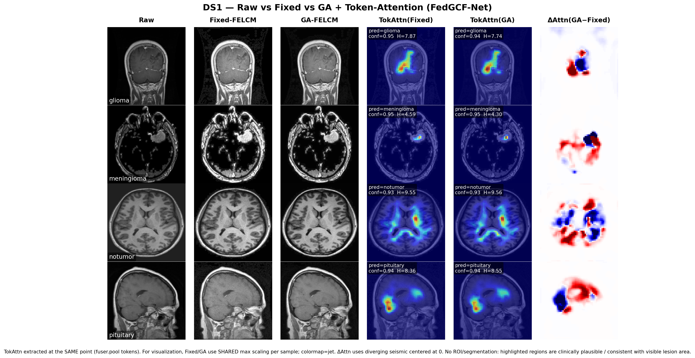
    


    
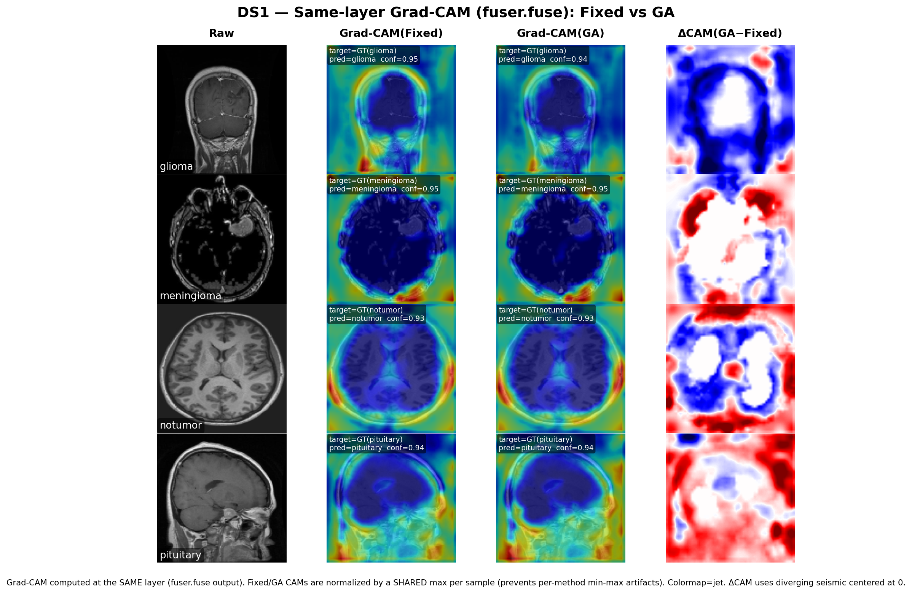
    


    
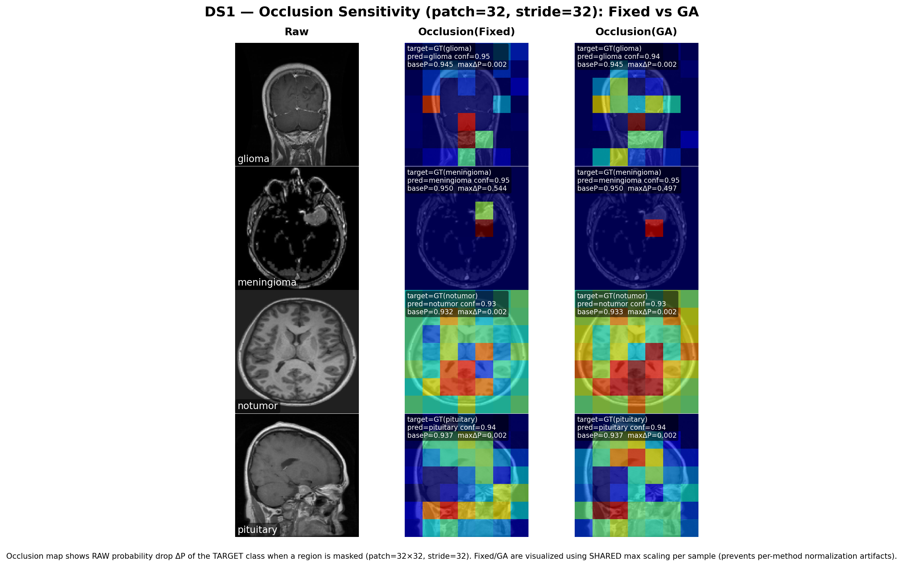
    


    
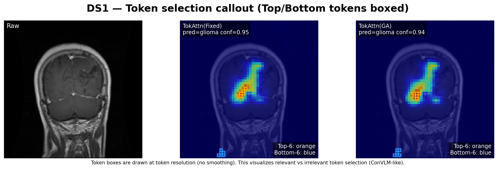
    


    
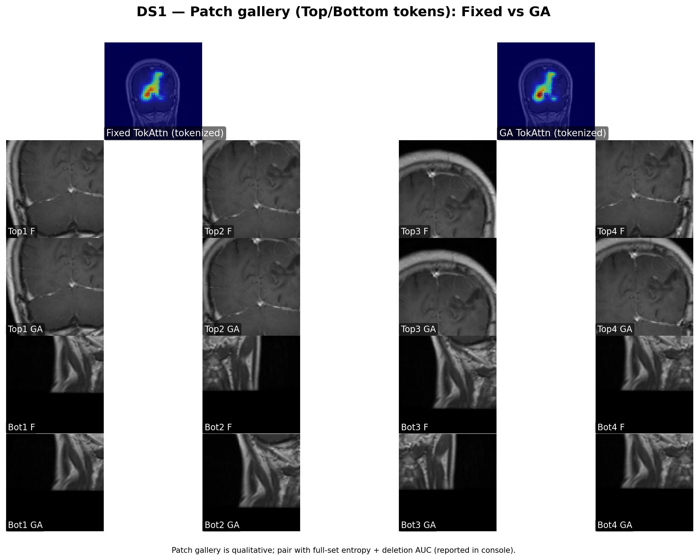
    


    
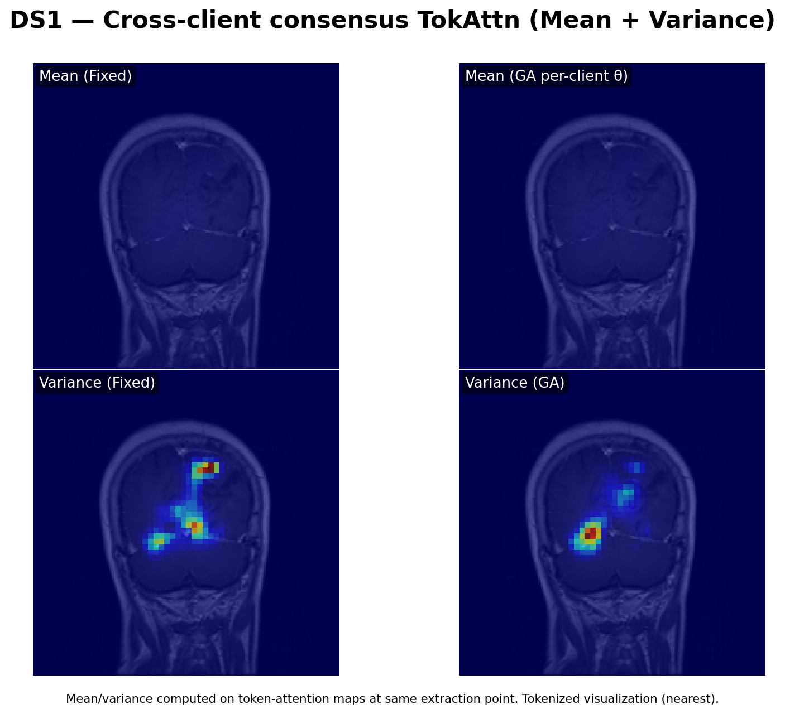
    


    
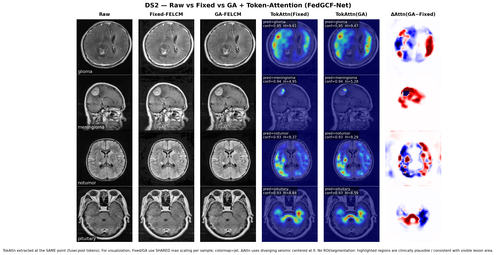
    


    
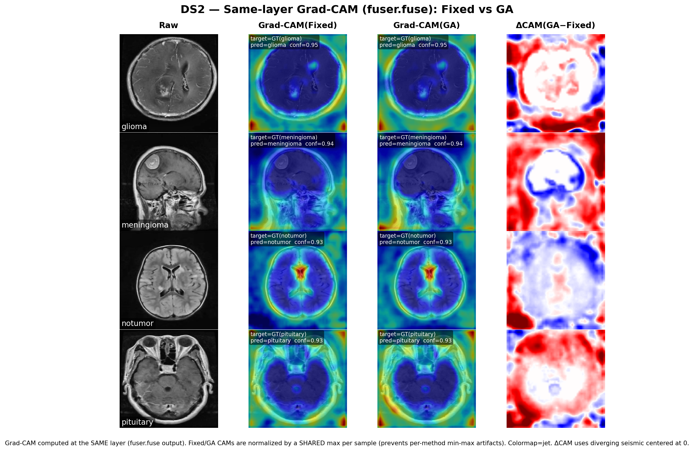
    


    
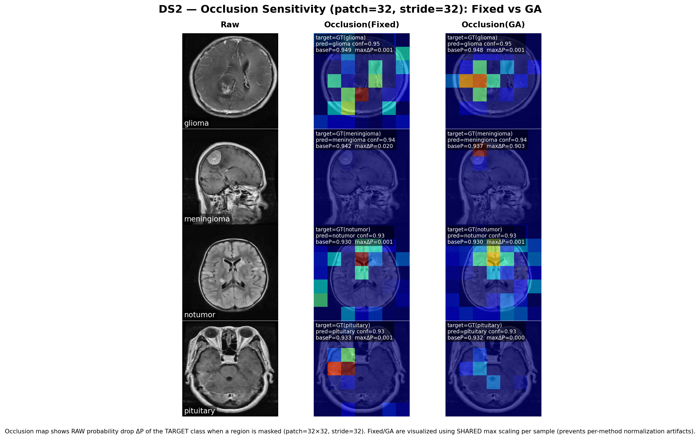
    


    
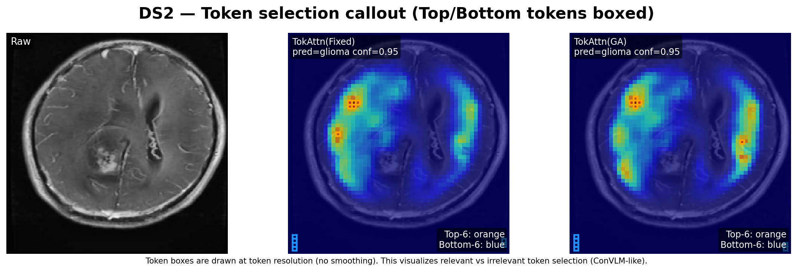
    


    
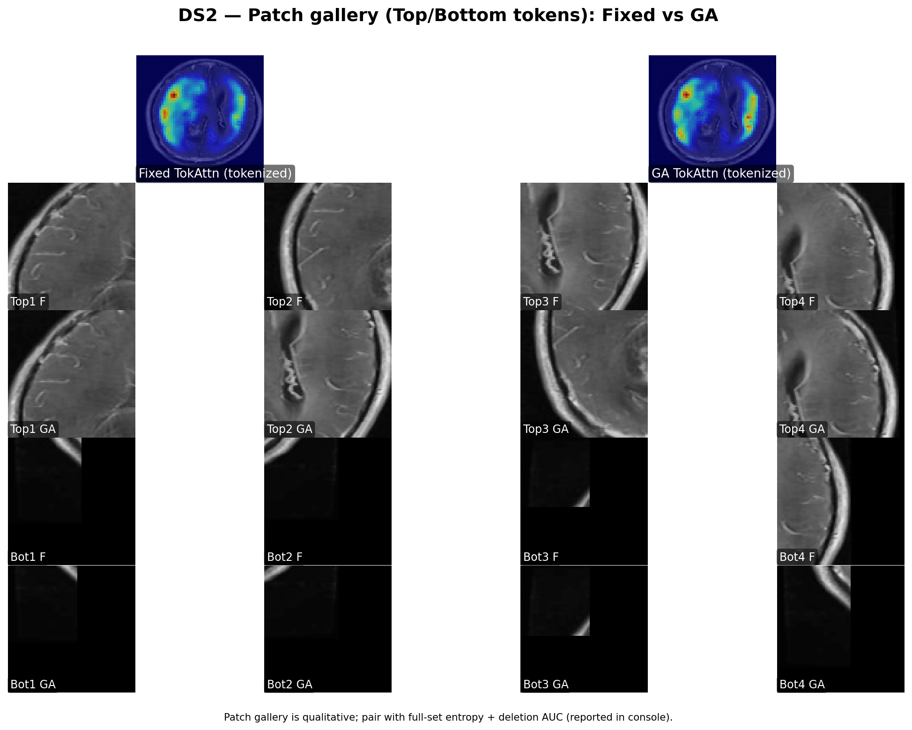
    


    
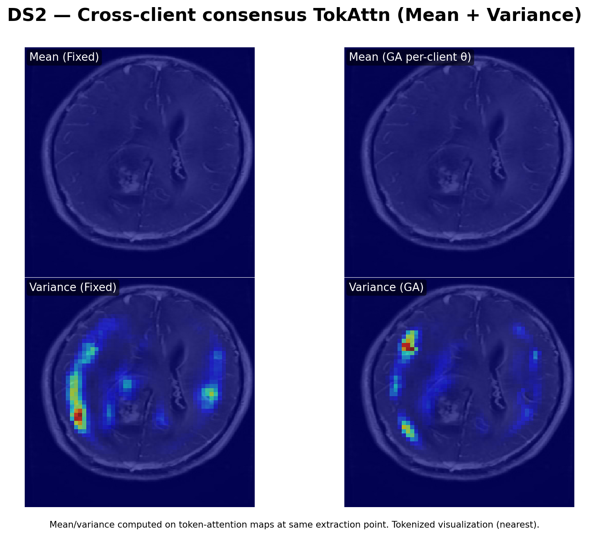
    


    ✅ Done. Shared normalization (CAM+Occlusion) + full-set entropy (+ optional deletion AUC) + correctly-classified figure picks.
    


```python
# ============================================================
# FedGCF-Net XAI / Heatmap Figure Generator (REVIEWER-SAFE v4)
# ------------------------------------------------------------
# ✅ Uses your split: Train/Val/Test = 70/15/15 (stratified by class)
# ✅ Reports quantitative metrics on TEST split (default)
# ✅ Heatmap comparability fixes:
#    - SAME TokAttn extraction point: fuser.pool attention
#    - SAME Grad-CAM layer: fuser.fuse output
#    - Fixed vs GA visualizations use SHARED scaling per sample
#    - Δ maps use diverging seismic centered at 0
# ✅ Occlusion fairness:
#    - RAW ΔP grid (prob drop), then shared scaling for visualization
#    - Caption states patch/stride and “probability drop when masked”
# ✅ Optional: Deletion AUC on TEST split (TokAttn-ranked masking)
# ✅ Paired tests (t-test + Wilcoxon) + effect size on TEST split
# ============================================================

import os, random
import numpy as np
import pandas as pd
from PIL import Image

import torch
import torch.nn as nn
import torch.nn.functional as F

import matplotlib.pyplot as plt
from matplotlib import gridspec
from matplotlib.patches import Rectangle

# ---------- GLOBAL PLOT STYLE ----------
plt.rcParams.update({
    "figure.dpi": 170,
    "axes.titlesize": 10,
    "axes.titlepad": 6,
    "font.size": 10,
})

# ---------- REPRO + DEVICE ----------
SEED = 42
random.seed(SEED)
np.random.seed(SEED)
torch.manual_seed(SEED)
if torch.cuda.is_available():
    torch.cuda.manual_seed_all(SEED)

DEVICE = torch.device("cuda" if torch.cuda.is_available() else "cpu")
print("DEVICE:", DEVICE)

# ---------- SciPy stats ----------
try:
    from scipy import stats as sp_stats
except Exception:
    import sys, subprocess
    subprocess.check_call([sys.executable, "-m", "pip", "-q", "install", "scipy"])
    from scipy import stats as sp_stats

# ---------- timm ----------
try:
    import timm
except Exception:
    import sys, subprocess
    subprocess.check_call([sys.executable, "-m", "pip", "-q", "install", "timm"])
    import timm

from torchvision import transforms

IMG_EXTS = (".jpg",".jpeg",".png",".bmp",".tif",".tiff",".webp")

# ============================================================
# SPLIT CONFIG (your setting)
# ============================================================
TRAIN_RATIO = 0.70
VAL_RATIO   = 0.15
TEST_RATIO  = 0.15
assert abs((TRAIN_RATIO + VAL_RATIO + TEST_RATIO) - 1.0) < 1e-9

# ============================================================
# METRICS CONFIG
# ============================================================
METRICS_SPLIT_NAME      = "test"   # report metrics on TEST split
COMPUTE_DELETION_AUC    = True
DELETION_STEPS          = 10
DELETION_MAX_IMAGES     = 250      # cap for speed (on test split)

# Occlusion settings (caption includes these)
OCC_PATCH  = 32
OCC_STRIDE = 32

# ============================================================
# 0) Load checkpoint
# ============================================================
CKPT_BASENAME = "FL_GAFELCM_PVTv2B2_FUSION_checkpoint.pth"

def find_checkpoint():
    fast = [
        CKPT_BASENAME,
        os.path.join("/content", CKPT_BASENAME),
        os.path.join("/mnt/data", CKPT_BASENAME),
        "/mnt/data/FL_GAFELCM_PVTv2B2_FUSION_checkpoint.pth",
    ]
    for p in fast:
        if os.path.exists(p):
            return p
    for root in ["/content", os.getcwd(), "/mnt/data"]:
        if os.path.isdir(root):
            for r, _, files in os.walk(root):
                if CKPT_BASENAME in files:
                    return os.path.join(r, CKPT_BASENAME)
    return None

CKPT_PATH = find_checkpoint()
if CKPT_PATH is None:
    raise FileNotFoundError(f"Checkpoint not found: {CKPT_BASENAME}")

ckpt = torch.load(CKPT_PATH, map_location="cpu")
print("Loaded checkpoint:", os.path.basename(CKPT_PATH))

CFG = ckpt.get("config", {})
labels = ckpt.get("labels", ["glioma", "meningioma", "notumor", "pituitary"])
label2id = ckpt.get("label2id", {l:i for i,l in enumerate(labels)})
id2label = ckpt.get("id2label", {i:l for l,i in label2id.items()})
NUM_CLASSES = len(labels)

CLIENTS_PER_DS = int(CFG.get("clients_per_dataset", 3))
CLIENTS_TOTAL  = int(CFG.get("clients_total", 6))
BACKBONE_NAME  = str(ckpt.get("backbone_name", CFG.get("backbone_name", "pvt_v2_b2")))

IMG_SIZE = int(CFG.get("img_size", 224))
if IMG_SIZE < 96:
    IMG_SIZE = 224

IMAGENET_MEAN = torch.tensor([0.485, 0.456, 0.406], device=DEVICE).view(1,3,1,1)
IMAGENET_STD  = torch.tensor([0.229, 0.224, 0.225], device=DEVICE).view(1,3,1,1)

EVAL_TFMS = transforms.Compose([
    transforms.Resize((IMG_SIZE, IMG_SIZE)),
    transforms.ToTensor(),
])

# ============================================================
# 1) Robust dataset root resolution
# ============================================================
REQ1 = {"512Glioma", "512Meningioma", "512Normal", "512Pituitary"}  # DS1 dirs
REQ2 = {"glioma", "meningioma", "notumor", "pituitary"}             # DS2 dirs

def find_root_with_required_class_dirs(base_dir, required_set, prefer_raw=True, max_candidates=40_000):
    if base_dir is None or (not os.path.isdir(base_dir)):
        return None
    candidates = []
    walked = 0
    for root, dirs, _ in os.walk(base_dir):
        walked += 1
        if walked > max_candidates:
            break
        if required_set.issubset(set(dirs)):
            candidates.append(root)
    if not candidates:
        return None
    def score(p):
        pl = p.lower()
        sc = 0
        if prefer_raw:
            if "raw data" in pl: sc += 8
            if os.path.basename(p).lower() == "raw": sc += 8
            if "/raw/" in pl or "\\raw\\" in pl: sc += 4
            if "augmented" in pl: sc -= 30
        sc -= 0.0001 * len(p)
        return sc
    return max(candidates, key=score)

def try_auto_locate_anywhere(required_set, prefer_raw):
    candidates = [
        "/content",
        "/content/data",
        "/content/datasets",
        "/kaggle/input",
        "/mnt",
        "/mnt/data",
        os.getcwd(),
    ]
    for base in candidates:
        r = find_root_with_required_class_dirs(base, required_set, prefer_raw=prefer_raw)
        if r is not None:
            return r
    return None

def ensure_kagglehub():
    try:
        import kagglehub
        return kagglehub
    except Exception:
        import sys, subprocess
        subprocess.check_call([sys.executable, "-m", "pip", "-q", "install", "kagglehub"])
        import kagglehub
        return kagglehub

def resolve_dataset_roots():
    ds1_root_ckpt = ckpt.get("dataset1_raw_root", None)
    ds2_root_ckpt = ckpt.get("dataset2_root", None)

    ds1_root = ds1_root_ckpt if (ds1_root_ckpt and os.path.isdir(ds1_root_ckpt)) else None
    ds2_root = ds2_root_ckpt if (ds2_root_ckpt and os.path.isdir(ds2_root_ckpt)) else None

    if ds1_root is None:
        ds1_root = try_auto_locate_anywhere(REQ1, prefer_raw=True)
    if ds2_root is None:
        ds2_root = try_auto_locate_anywhere(REQ2, prefer_raw=False)

    if ds1_root is None or ds2_root is None:
        try:
            kagglehub = ensure_kagglehub()
            ds2_base = kagglehub.dataset_download("yassinebazgour/preprocessed-brain-mri-scans-for-tumors-detection")
            ds1_base = kagglehub.dataset_download("orvile/pmram-bangladeshi-brain-cancer-mri-dataset")
            if ds1_root is None:
                ds1_root = find_root_with_required_class_dirs(ds1_base, REQ1, prefer_raw=True)
            if ds2_root is None:
                ds2_root = find_root_with_required_class_dirs(ds2_base, REQ2, prefer_raw=False)
        except Exception as e:
            print("⚠️ kagglehub download failed:", str(e))
    return ds1_root, ds2_root

DS1_ROOT, DS2_ROOT = resolve_dataset_roots()
print("DS1_ROOT:", DS1_ROOT)
print("DS2_ROOT:", DS2_ROOT)

if DS1_ROOT is None or (not os.path.isdir(DS1_ROOT)):
    raise FileNotFoundError(f"Could not locate DS1 root containing: {sorted(list(REQ1))}")
if DS2_ROOT is None or (not os.path.isdir(DS2_ROOT)):
    raise FileNotFoundError(f"Could not locate DS2 root containing: {sorted(list(REQ2))}")

# ============================================================
# 2) GA-FELCM
# ============================================================
class EnhancedFELCM(nn.Module):
    def __init__(self, gamma=1.0, alpha=0.35, beta=6.0, tau=2.5, blur_k=7, sharpen=0.0, denoise=0.0):
        super().__init__()
        self.gamma = float(gamma)
        self.alpha = float(alpha)
        self.beta  = float(beta)
        self.tau   = float(tau)
        self.blur_k = int(blur_k)
        self.sharpen = float(sharpen)
        self.denoise = float(denoise)

        lap = torch.tensor([[0, -1, 0], [-1, 4, -1], [0, -1, 0]], dtype=torch.float32)
        self.register_buffer("lap", lap.view(1, 1, 3, 3))

        sharp = torch.tensor([[0, -1, 0], [-1, 5, -1], [0, -1, 0]], dtype=torch.float32)
        self.register_buffer("sharp_kernel", sharp.view(1, 1, 3, 3))

    def forward(self, x):
        eps = 1e-6
        B, C, H, W = x.shape

        if self.denoise > 0:
            k = 3
            x_blur = F.avg_pool2d(F.pad(x, (1, 1, 1, 1), mode="reflect"), k, 1)
            x = x * (1 - self.denoise) + x_blur * self.denoise

        mu = x.mean(dim=(2, 3), keepdim=True)
        sd = x.std(dim=(2, 3), keepdim=True).clamp_min(eps)
        x0 = (x - mu) / sd
        x0 = x0.clamp(-self.tau, self.tau)

        x1 = torch.sign(x0) * torch.pow(torch.abs(x0).clamp_min(eps), self.gamma)

        gray = x1.mean(dim=1, keepdim=True)
        lap = F.conv2d(F.pad(gray, (1, 1, 1, 1), mode="reflect"), self.lap)
        mag = lap.abs()

        k = self.blur_k if self.blur_k % 2 == 1 else self.blur_k + 1
        pad = k // 2
        blur = F.avg_pool2d(F.pad(mag, (pad, pad, pad, pad), mode="reflect"), k, 1)
        C_map = mag / (blur + eps)

        x2 = x1 + self.alpha * torch.tanh(self.beta * C_map)

        if self.sharpen > 0:
            outs = []
            for c in range(C):
                x_c = x2[:, c: c + 1, :, :]
                x_sharp = F.conv2d(F.pad(x_c, (1, 1, 1, 1), mode="reflect"), self.sharp_kernel)
                outs.append(x_c * (1 - self.sharpen) + x_sharp * self.sharpen)
            x2 = torch.cat(outs, dim=1)

        mn = x2.amin(dim=(2, 3), keepdim=True)
        mx = x2.amax(dim=(2, 3), keepdim=True)
        x3 = (x2 - mn) / (mx - mn + eps)
        return x3.clamp(0, 1)

def theta_to_module(theta):
    if theta is None:
        return EnhancedFELCM()
    g, a, b, t, k, sh, dn = theta
    return EnhancedFELCM(gamma=g, alpha=a, beta=b, tau=t, blur_k=int(k), sharpen=sh, denoise=dn)

def preproc_theta_vec(preproc_module, batch_size):
    theta = torch.tensor(
        [
            float(preproc_module.gamma),
            float(preproc_module.alpha),
            float(preproc_module.beta),
            float(preproc_module.tau),
            float(preproc_module.blur_k) / 7.0,
            float(preproc_module.sharpen),
            float(preproc_module.denoise),
        ],
        device=DEVICE,
        dtype=torch.float32,
    )
    return theta.unsqueeze(0).repeat(batch_size, 1)

fixed_pre = EnhancedFELCM().to(DEVICE).eval()
best_theta_ds1 = ckpt.get("best_theta_ds1", None)
best_theta_ds2 = ckpt.get("best_theta_ds2", None)
ga_pre_ds1 = theta_to_module(best_theta_ds1).to(DEVICE).eval()
ga_pre_ds2 = theta_to_module(best_theta_ds2).to(DEVICE).eval()

print("best_theta_ds1:", best_theta_ds1)
print("best_theta_ds2:", best_theta_ds2)

# ============================================================
# 3) FedGCF-Net pieces
# ============================================================
class TokenAttentionPooling(nn.Module):
    def __init__(self, dim):
        super().__init__()
        self.query = nn.Linear(dim, 1)
    def forward(self, x_tokens):  # [B, HW, C]
        attn = torch.softmax(self.query(x_tokens).squeeze(-1), dim=1)  # [B, HW]
        pooled = (x_tokens * attn.unsqueeze(-1)).sum(dim=1)
        return pooled, attn

class MultiScaleFeatureFuser(nn.Module):
    def __init__(self, in_channels, out_dim):
        super().__init__()
        self.proj = nn.ModuleList([
            nn.Sequential(
                nn.Conv2d(c, out_dim, kernel_size=1, bias=False),
                nn.GroupNorm(8, out_dim),
                nn.GELU(),
            )
            for c in in_channels
        ])
        self.fuse = nn.Sequential(
            nn.Conv2d(out_dim, out_dim, kernel_size=3, padding=1, bias=False),
            nn.GroupNorm(8, out_dim),
            nn.GELU(),
        )
        self.pool = TokenAttentionPooling(out_dim)

class EnhancedBrainTuner(nn.Module):
    def __init__(self, dim, dropout=0.1):
        super().__init__()
        self.se = nn.Sequential(
            nn.Linear(dim, max(8, dim // 4)),
            nn.ReLU(inplace=True),
            nn.Linear(max(8, dim // 4), dim),
            nn.Sigmoid(),
        )
        self.refine = nn.Sequential(
            nn.LayerNorm(dim),
            nn.Linear(dim, dim),
            nn.GELU(),
            nn.Dropout(dropout),
            nn.Linear(dim, dim),
        )
        self.gate = nn.Parameter(torch.ones(2) / 2)
    def forward(self, x):
        gate = F.softmax(self.gate, dim=0)
        out1 = x * self.se(x)
        out2 = x + 0.2 * self.refine(x)
        return gate[0] * out1 + gate[1] * out2

class PVTv2B2_MultiScale(nn.Module):
    def __init__(self, num_classes, head_dropout=0.3, cond_dim=128, num_clients=6):
        super().__init__()
        self.backbone = timm.create_model(
            BACKBONE_NAME,
            pretrained=False,
            features_only=True,
            out_indices=(0,1,2,3),
        )
        in_channels = self.backbone.feature_info.channels()
        out_dim = max(256, in_channels[-1] // 2)

        self.fuser = MultiScaleFeatureFuser(in_channels, out_dim)
        self.tuner = EnhancedBrainTuner(out_dim, dropout=0.1)

        self.classifier = nn.Sequential(
            nn.LayerNorm(out_dim),
            nn.Dropout(head_dropout),
            nn.Linear(out_dim, max(64, out_dim // 2)),
            nn.GELU(),
            nn.Dropout(head_dropout * 0.5),
            nn.Linear(max(64, out_dim // 2), num_classes),
        )

        self.theta_mlp = nn.Sequential(
            nn.Linear(7, cond_dim),
            nn.GELU(),
            nn.Linear(cond_dim, cond_dim),
        )
        self.source_emb = nn.Embedding(2, cond_dim)
        self.client_emb = nn.Embedding(num_clients, cond_dim)
        self.cond_norm = nn.LayerNorm(cond_dim)

        self.gate_early = nn.Linear(cond_dim, 3)
        self.gate_mid   = nn.Linear(cond_dim, out_dim)
        self.gate_late  = nn.Linear(cond_dim, out_dim)

    def _cond_vec(self, theta_vec, source_id, client_id):
        cond = self.theta_mlp(theta_vec)
        cond = cond + self.source_emb(source_id) + self.client_emb(client_id)
        return self.cond_norm(cond)

model = PVTv2B2_MultiScale(
    num_classes=NUM_CLASSES,
    head_dropout=float(CFG.get("head_dropout", 0.3)),
    cond_dim=int(CFG.get("cond_dim", 128)),
    num_clients=CLIENTS_TOTAL,
).to(DEVICE).eval()

sd = ckpt.get("state_dict", None)
if sd is None:
    raise RuntimeError("Checkpoint missing state_dict.")
model.load_state_dict(sd, strict=True)
print("✅ Model weights loaded.")

# ============================================================
# 4) Dataset mappings + IO
# ============================================================
DS1_CLASS_DIRS = {
    "glioma": "512Glioma",
    "meningioma": "512Meningioma",
    "notumor": "512Normal",
    "pituitary": "512Pituitary",
}
DS2_CLASS_DIRS = {
    "glioma": "glioma",
    "meningioma": "meningioma",
    "notumor": "notumor",
    "pituitary": "pituitary",
}

def load_rgb(path):
    return Image.open(path).convert("RGB")

def list_images_under_class_root(class_root, class_dir_name):
    class_dir = os.path.join(class_root, class_dir_name)
    out = []
    if not os.path.isdir(class_dir):
        return out
    for r, _, files in os.walk(class_dir):
        for fn in files:
            if fn.lower().endswith(IMG_EXTS):
                out.append(os.path.join(r, fn))
    return out

def collect_all_images(ds_root, class_dirs_map):
    items = []
    for lab in labels:
        imgs = list_images_under_class_root(ds_root, class_dirs_map[lab])
        items.extend([(lab, p) for p in imgs])
    return items

# ============================================================
# 5) Stratified split 70/15/15 (deterministic)
# ============================================================
def stratified_split(items, train_ratio=0.70, val_ratio=0.15, test_ratio=0.15, seed=42):
    rng = random.Random(seed)
    by_class = {lab: [] for lab in labels}
    for lab, p in items:
        by_class[lab].append(p)

    split = {"train": [], "val": [], "test": []}
    for lab, paths in by_class.items():
        paths = paths.copy()
        rng.shuffle(paths)
        n = len(paths)
        n_train = int(round(train_ratio * n))
        n_val   = int(round(val_ratio * n))
        n_test  = n - n_train - n_val
        if n_test < 0:
            n_test = 0
            n_val = max(0, n - n_train)

        train_p = paths[:n_train]
        val_p   = paths[n_train:n_train+n_val]
        test_p  = paths[n_train+n_val:]

        split["train"].extend([(lab, p) for p in train_p])
        split["val"].extend([(lab, p) for p in val_p])
        split["test"].extend([(lab, p) for p in test_p])

    # global shuffle within split for randomness, but deterministic
    for k in split.keys():
        rng.shuffle(split[k])
    return split

def build_dataset_splits(ds_name, ds_root, class_dirs_map, seed=SEED):
    items = collect_all_images(ds_root, class_dirs_map)
    split = stratified_split(items, TRAIN_RATIO, VAL_RATIO, TEST_RATIO, seed=seed)
    print(f"[{ds_name.upper()} SPLIT] total={len(items)} | train={len(split['train'])} val={len(split['val'])} test={len(split['test'])}")
    return split

DS1_SPLITS = build_dataset_splits("ds1", DS1_ROOT, DS1_CLASS_DIRS, seed=SEED+1)
DS2_SPLITS = build_dataset_splits("ds2", DS2_ROOT, DS2_CLASS_DIRS, seed=SEED+2)

# ============================================================
# 6) Core extraction helpers
# ============================================================
def fuser_conv_pooled_attn(fuser, feats):
    proj_feats = [p(f) for p, f in zip(fuser.proj, feats)]
    x = proj_feats[-1]
    for f in reversed(proj_feats[:-1]):
        x = F.interpolate(x, size=f.shape[-2:], mode="bilinear", align_corners=False)
        x = x + f
    x = fuser.fuse(x)  # [B,C,H,W]
    B, C, H, W = x.shape
    tokens = x.flatten(2).transpose(1, 2)  # [B,HW,C]
    pooled, attn = fuser.pool(tokens)       # pooled [B,C], attn [B,HW]
    attn_map = attn.view(B, H, W)
    return x, pooled, attn_map

def attn_entropy_from_map(attn_2d):
    p = attn_2d.flatten().clamp(1e-9, 1.0)
    p = p / p.sum()
    return float(-(p * torch.log2(p)).sum().item())

def to_gray_np(x01_1x3):
    g = x01_1x3[0].mean(dim=0).detach().cpu().numpy()
    return np.clip(g, 0, 1)

def upsample_map(m, out_hw, mode="bilinear"):
    if isinstance(m, np.ndarray):
        t = torch.tensor(m)[None,None,:,:].float()
    else:
        t = m[None,None,:,:].float()
    align = False if mode in ["bilinear", "bicubic"] else None
    t2 = F.interpolate(t, size=out_hw, mode=mode, align_corners=align)[0,0]
    return t2.detach().cpu().numpy()

def overlay_heat(gray01, heat01, alpha=0.6, cmap_name="jet"):
    gray3 = np.stack([gray01, gray01, gray01], axis=-1)
    cmap = getattr(plt.cm, cmap_name)
    heat3 = cmap(np.clip(heat01, 0, 1))[...,:3]
    out = (1-alpha)*gray3 + alpha*heat3
    return np.clip(out, 0, 1)

def diverging_rgb(delta, clip_q=0.98, cmap_name="seismic"):
    d = delta.astype(np.float32)
    s = np.quantile(np.abs(d), clip_q) + 1e-9
    d = np.clip(d / s, -1, 1)
    cmap = getattr(plt.cm, cmap_name)
    rgb = cmap((d + 1.0) / 2.0)[...,:3]
    return np.clip(rgb, 0, 1)

def normalize_pair_shared_max(a, b, eps=1e-9):
    m = max(float(np.max(a)), float(np.max(b)), eps)
    return np.clip(a / m, 0, 1), np.clip(b / m, 0, 1), m

def _imshow(ax, img, gray=False):
    ax.axis("off")
    if gray:
        ax.imshow(img, cmap="gray", vmin=0, vmax=1, interpolation="nearest", aspect="equal")
    else:
        ax.imshow(img, interpolation="nearest", aspect="equal")

def label_box(ax, text, loc="tl", fontsize=9):
    if not text:
        return
    ha, va = "left", "top"
    x, y = 0.02, 0.98
    if loc == "tr":
        ha, va = "right", "top"; x, y = 0.98, 0.98
    elif loc == "bl":
        ha, va = "left", "bottom"; x, y = 0.02, 0.02
    elif loc == "br":
        ha, va = "right", "bottom"; x, y = 0.98, 0.02
    ax.text(
        x, y, text,
        transform=ax.transAxes,
        ha=ha, va=va,
        color="white",
        fontsize=fontsize,
        bbox=dict(boxstyle="round,pad=0.25", fc="black", ec="none", alpha=0.55),
        zorder=10,
    )

def add_col_headers(fig, axes_top_row, headers, y_pad=0.012, fontsize=11):
    for ax, h in zip(axes_top_row, headers):
        bb = ax.get_position()
        x = (bb.x0 + bb.x1) / 2
        y = bb.y1 + y_pad
        fig.text(x, y, h, ha="center", va="bottom", fontsize=fontsize, fontweight="bold")

def add_caption(fig, caption, y=0.008, fontsize=9):
    fig.text(0.5, y, caption, ha="center", va="bottom", fontsize=fontsize)

# ============================================================
# 7) Forward + TokAttn + probs
# ============================================================
@torch.no_grad()
def forward_with_tokattn(x01, preproc, source_id, client_id):
    x01 = x01.to(DEVICE)
    x_fel = preproc(x01).clamp(0,1)

    x_raw_n = (x01 - IMAGENET_MEAN) / IMAGENET_STD
    x_fel_n = (x_fel - IMAGENET_MEAN) / IMAGENET_STD

    theta_vec = preproc_theta_vec(preproc, batch_size=1)
    sid = torch.tensor([source_id], device=DEVICE, dtype=torch.long)
    cid = torch.tensor([client_id], device=DEVICE, dtype=torch.long)

    cond = model._cond_vec(theta_vec, sid, cid)
    g0 = torch.sigmoid(model.gate_early(cond)).view(-1,3,1,1)
    xmix = (1-g0)*x_raw_n + g0*x_fel_n

    feats0 = model.backbone(xmix)
    _, f0, att0 = fuser_conv_pooled_attn(model.fuser, feats0)

    feats1 = model.backbone(x_fel_n)
    _, f1, _ = fuser_conv_pooled_attn(model.fuser, feats1)

    g1 = torch.sigmoid(model.gate_mid(cond))
    f_mid = (1-g1)*f0 + g1*f1

    t0 = model.tuner(f0)
    t1 = model.tuner(f1)
    t_mid = model.tuner(f_mid)

    t_views = 0.5*(t0+t1)
    g2 = torch.sigmoid(model.gate_late(cond))
    t_final = (1-g2)*t_mid + g2*t_views

    logits = model.classifier(t_final)
    prob = torch.softmax(logits, dim=1)[0]
    pred = int(prob.argmax().item())
    conf = float(prob.max().item())
    return {
        "attn_map": att0[0].detach().cpu(),   # [h,w] softmax => sum 1
        "prob": prob.detach().cpu(),
        "pred": pred,
        "conf": conf,
    }

# ============================================================
# 8) Grad-CAM RAW (same layer: fuser.fuse output)
# ============================================================
def gradcam_same_layer_raw(x01, preproc, source_id, client_id, target_class=None):
    model.eval()
    preproc.eval()

    x01 = x01.to(DEVICE)
    x_fel = preproc(x01).clamp(0,1)

    x_raw_n = (x01 - IMAGENET_MEAN) / IMAGENET_STD
    x_fel_n = (x_fel - IMAGENET_MEAN) / IMAGENET_STD

    theta_vec = preproc_theta_vec(preproc, batch_size=1)
    sid = torch.tensor([source_id], device=DEVICE, dtype=torch.long)
    cid = torch.tensor([client_id], device=DEVICE, dtype=torch.long)

    model.zero_grad(set_to_none=True)

    cond = model._cond_vec(theta_vec, sid, cid)
    g0 = torch.sigmoid(model.gate_early(cond)).view(-1,3,1,1)
    xmix = (1-g0)*x_raw_n + g0*x_fel_n

    feats0 = model.backbone(xmix)
    conv0, f0, _ = fuser_conv_pooled_attn(model.fuser, feats0)
    conv0.retain_grad()

    feats1 = model.backbone(x_fel_n)
    _, f1, _ = fuser_conv_pooled_attn(model.fuser, feats1)

    g1 = torch.sigmoid(model.gate_mid(cond))
    f_mid = (1-g1)*f0 + g1*f1

    t0 = model.tuner(f0)
    t1 = model.tuner(f1)
    t_mid = model.tuner(f_mid)

    t_views = 0.5*(t0+t1)
    g2 = torch.sigmoid(model.gate_late(cond))
    t_final = (1-g2)*t_mid + g2*t_views

    logits = model.classifier(t_final)
    prob = torch.softmax(logits, dim=1)[0]
    pred = int(prob.argmax().item())
    conf = float(prob.max().item())

    if target_class is None:
        target_class = pred

    logits[0, target_class].backward()

    grad = conv0.grad[0]       # [C,h,w]
    act  = conv0.detach()[0]   # [C,h,w]
    w = grad.mean(dim=(1,2), keepdim=True)
    cam = torch.relu((w * act).sum(dim=0))  # RAW, non-normalized
    return cam.detach().cpu(), conf, pred, int(target_class)

# ============================================================
# 9) Occlusion RAW probability-drop grid
# ============================================================
@torch.no_grad()
def occlusion_sensitivity_map_raw(x01, preproc, source_id, client_id, patch=32, stride=32, target_class=None):
    x01 = x01.to(DEVICE)
    x_fel = preproc(x01).clamp(0,1)

    x_raw_n = (x01 - IMAGENET_MEAN) / IMAGENET_STD
    x_fel_n = (x_fel - IMAGENET_MEAN) / IMAGENET_STD

    theta_vec = preproc_theta_vec(preproc, batch_size=1)
    sid = torch.tensor([source_id], device=DEVICE, dtype=torch.long)
    cid = torch.tensor([client_id], device=DEVICE, dtype=torch.long)

    cond = model._cond_vec(theta_vec, sid, cid)
    g0 = torch.sigmoid(model.gate_early(cond)).view(-1,3,1,1)
    xmix = (1-g0)*x_raw_n + g0*x_fel_n

    feats0 = model.backbone(xmix)
    _, f0, _ = fuser_conv_pooled_attn(model.fuser, feats0)

    feats1 = model.backbone(x_fel_n)
    _, f1, _ = fuser_conv_pooled_attn(model.fuser, feats1)

    g1 = torch.sigmoid(model.gate_mid(cond))
    f_mid = (1-g1)*f0 + g1*f1

    t0 = model.tuner(f0)
    t1 = model.tuner(f1)
    t_mid = model.tuner(f_mid)

    t_views = 0.5*(t0+t1)
    g2 = torch.sigmoid(model.gate_late(cond))
    t_final = (1-g2)*t_mid + g2*t_views

    logits = model.classifier(t_final)
    prob = torch.softmax(logits, dim=1)[0]
    pred = int(prob.argmax().item())
    conf = float(prob.max().item())

    if target_class is None:
        target_class = pred
    base_p = float(prob[target_class].item())

    _, _, H, W = x01.shape
    ys = list(range(0, H, stride))
    xs = list(range(0, W, stride))
    grid = np.zeros((len(ys), len(xs)), dtype=np.float32)

    for iy, y0 in enumerate(ys):
        for ix, x0p in enumerate(xs):
            x_mask = x01.clone()
            y1 = min(H, y0 + patch)
            x1 = min(W, x0p + patch)
            x_mask[:, :, y0:y1, x0p:x1] = 0.0

            x_fel_m = preproc(x_mask).clamp(0,1)
            x_raw_n_m = (x_mask - IMAGENET_MEAN) / IMAGENET_STD
            x_fel_n_m = (x_fel_m - IMAGENET_MEAN) / IMAGENET_STD

            cond_m = model._cond_vec(theta_vec, sid, cid)
            g0m = torch.sigmoid(model.gate_early(cond_m)).view(-1,3,1,1)
            xmix_m = (1-g0m)*x_raw_n_m + g0m*x_fel_n_m

            feats0m = model.backbone(xmix_m)
            _, f0m, _ = fuser_conv_pooled_attn(model.fuser, feats0m)

            feats1m = model.backbone(x_fel_n_m)
            _, f1m, _ = fuser_conv_pooled_attn(model.fuser, feats1m)

            g1m = torch.sigmoid(model.gate_mid(cond_m))
            f_mid_m = (1-g1m)*f0m + g1m*f1m

            t0m = model.tuner(f0m)
            t1m = model.tuner(f1m)
            t_mid_m = model.tuner(f_mid_m)

            t_views_m = 0.5*(t0m+t1m)
            g2m = torch.sigmoid(model.gate_late(cond_m))
            t_final_m = (1-g2m)*t_mid_m + g2m*t_views_m

            logits_m = model.classifier(t_final_m)
            prob_m = torch.softmax(logits_m, dim=1)[0]
            p_m = float(prob_m[target_class].item())

            grid[iy, ix] = max(0.0, base_p - p_m)  # RAW prob drop

    return grid, base_p, pred, conf, int(target_class)

# ============================================================
# 10) Paired tests + effect size
# ============================================================
def mean_std(x):
    x = np.asarray(x, dtype=np.float64)
    if len(x) <= 1:
        return float(x.mean()), 0.0
    return float(x.mean()), float(x.std(ddof=1))

def paired_tests(x_fixed, x_ga):
    x_fixed = np.asarray(x_fixed, dtype=np.float64)
    x_ga    = np.asarray(x_ga, dtype=np.float64)
    d = x_ga - x_fixed
    md, sd = mean_std(d)
    n = len(d)

    t_res = sp_stats.ttest_rel(x_ga, x_fixed, nan_policy="omit")
    t_p = float(t_res.pvalue)

    try:
        w_res = sp_stats.wilcoxon(d, zero_method="wilcox", alternative="two-sided", mode="auto")
        w_p = float(w_res.pvalue)
    except Exception:
        w_p = float("nan")

    cohen_d = md / (sd + 1e-12)
    return {"n": n, "mean_diff": md, "std_diff": sd, "t_p": t_p, "w_p": w_p, "cohen_d": cohen_d}

def print_paired_report(title, fixed_vals, ga_vals, direction_hint=""):
    mf, sf = mean_std(fixed_vals)
    mg, sg = mean_std(ga_vals)
    tests = paired_tests(fixed_vals, ga_vals)
    print(f"{title}:")
    print(f"  Fixed: {mf:.4f} ± {sf:.4f}")
    print(f"  GA:    {mg:.4f} ± {sg:.4f}")
    print(f"  Δ(GA−Fixed): {tests['mean_diff']:+.4f} ± {tests['std_diff']:.4f}  (n={tests['n']})")
    print(f"  Paired t-test p = {tests['t_p']:.3e} | Wilcoxon p = {tests['w_p']:.3e} | Cohen’s d = {tests['cohen_d']:+.3f} {direction_hint}")

# ============================================================
# 11) Deletion AUC (TokAttn-ranked masking)
# ============================================================
@torch.no_grad()
def deletion_auc_from_tokattn(x01, preproc, source_id, client_id, target_class, steps=10):
    out = forward_with_tokattn(x01, preproc, source_id, client_id)
    att = out["attn_map"]  # [h,w]
    h, w = att.shape
    token_scores = att.flatten().cpu().numpy()
    order = np.argsort(-token_scores)

    th = max(1, IMG_SIZE // h)
    tw = max(1, IMG_SIZE // w)

    fracs = np.linspace(0, 1, steps+1)
    probs = [float(out["prob"][target_class].item())]

    for f in fracs[1:]:
        k = int(round(f * len(order)))
        x_mask = x01.clone()
        for idx in order[:k]:
            yy = idx // w
            xx = idx % w
            y0 = yy * th
            x0 = xx * tw
            y1 = min(IMG_SIZE, y0 + th)
            x1 = min(IMG_SIZE, x0 + tw)
            x_mask[:, :, y0:y1, x0:x1] = 0.0

        out_k = forward_with_tokattn(x_mask, preproc, source_id, client_id)
        probs.append(float(out_k["prob"][target_class].item()))

    auc = float(np.trapz(probs, fracs))
    return auc

# ============================================================
# 12) Metrics report ON A GIVEN SPLIT (default: TEST)
# ============================================================
@torch.no_grad()
def split_metrics_report(ds_name, split_items, pre_ga, source_id, rep_client_id,
                         compute_del_auc=True, del_steps=10, del_max_images=250):
    if len(split_items) < 10:
        print(f"⚠️ {ds_name}: too few images in split for reliable stats ({len(split_items)}).")
        return

    # Entropy on whole split
    H_f, H_g = [], []
    for gt_lab, path in split_items:
        x = EVAL_TFMS(load_rgb(path)).unsqueeze(0)
        of = forward_with_tokattn(x, fixed_pre, source_id, rep_client_id)
        og = forward_with_tokattn(x, pre_ga,    source_id, rep_client_id)
        H_f.append(attn_entropy_from_map(of["attn_map"]))
        H_g.append(attn_entropy_from_map(og["attn_map"]))

    print("\n" + "="*90)
    print(f"[SPLIT METRICS + SIGNIFICANCE] {ds_name.upper()}  split={METRICS_SPLIT_NAME.upper()}  (n={len(split_items)})")
    print_paired_report(
        "TokenAttn Entropy H",
        H_f, H_g,
        direction_hint="(Lower H => more concentrated attention.)"
    )

    # Optional deletion AUC on capped subset
    if compute_del_auc:
        subset = split_items
        if del_max_images is not None:
            subset = subset[:min(del_max_images, len(split_items))]

        A_f, A_g = [], []
        for gt_lab, path in subset:
            x = EVAL_TFMS(load_rgb(path)).unsqueeze(0)
            of = forward_with_tokattn(x, fixed_pre, source_id, rep_client_id)
            og = forward_with_tokattn(x, pre_ga,    source_id, rep_client_id)

            # robust choice: each method’s predicted class
            A_f.append(deletion_auc_from_tokattn(x, fixed_pre, source_id, rep_client_id, of["pred"], steps=del_steps))
            A_g.append(deletion_auc_from_tokattn(x, pre_ga,    source_id, rep_client_id, og["pred"], steps=del_steps))

        print_paired_report(
            f"Deletion AUC (TokAttn-ranked, steps={del_steps}, subset={len(subset)})",
            A_f, A_g,
            direction_hint="(Lower AUC => faster prob drop when deleting top tokens => more faithful saliency.)"
        )
        print("  Note: deletion computed w.r.t. each method’s predicted class (robust under misclassification).")

    print("="*90 + "\n")

# ============================================================
# 13) Pick correctly-classified examples FROM TEST split
# ============================================================
def pick_correct_examples_from_split(split_items, source_id, rep_client_id, pre_ga,
                                     max_tries_per_class=400, require_both=True):
    rng = random.Random(SEED + 777)
    by_class = {lab: [] for lab in labels}
    for lab, p in split_items:
        by_class[lab].append(p)

    out = {}
    for lab in labels:
        gt = label2id[lab]
        paths = by_class.get(lab, [])
        if not paths:
            out[lab] = None
            continue
        paths = paths.copy()
        rng.shuffle(paths)
        picked = None
        for p in paths[:max_tries_per_class]:
            x = EVAL_TFMS(load_rgb(p)).unsqueeze(0)
            of = forward_with_tokattn(x, fixed_pre, source_id, rep_client_id)
            og = forward_with_tokattn(x, pre_ga,    source_id, rep_client_id)
            ok_f = (of["pred"] == gt)
            ok_g = (og["pred"] == gt)
            if require_both:
                if ok_f and ok_g:
                    picked = p
                    break
            else:
                if ok_g:
                    picked = p
                    break
        out[lab] = picked if picked is not None else paths[0]
    return out

# ============================================================
# 14) PLOTTING: TokAttn / Grad-CAM / Occlusion (shared scaling)
# ============================================================
def plot_tokenattn_grid(ds_name, sample_map, source_id, rep_client_id, pre_ga, split_name="TEST"):
    headers = ["Raw", "Fixed-FELCM", "GA-FELCM", "TokAttn(Fixed)", "TokAttn(GA)", "ΔAttn(GA−Fixed)"]

    fig = plt.figure(figsize=(14.2, 9.2))
    gs = gridspec.GridSpec(NUM_CLASSES, 6, figure=fig, wspace=0.002, hspace=0.002)
    axes = [[None]*6 for _ in range(NUM_CLASSES)]

    for r, lab in enumerate(labels):
        x = EVAL_TFMS(load_rgb(sample_map[lab])).unsqueeze(0)
        gray = to_gray_np(x)

        with torch.no_grad():
            x_fixed = fixed_pre(x.to(DEVICE)).clamp(0,1).cpu()
            x_ga    = pre_ga(x.to(DEVICE)).clamp(0,1).cpu()

        gray_fixed = to_gray_np(x_fixed)
        gray_ga    = to_gray_np(x_ga)

        out_f = forward_with_tokattn(x, fixed_pre, source_id, rep_client_id)
        out_g = forward_with_tokattn(x, pre_ga,    source_id, rep_client_id)

        # Tokenized look: nearest upsample
        att_f_raw = upsample_map(out_f["attn_map"], (IMG_SIZE, IMG_SIZE), mode="nearest")
        att_g_raw = upsample_map(out_g["attn_map"], (IMG_SIZE, IMG_SIZE), mode="nearest")

        # Shared scaling for display
        att_f_disp, att_g_disp, _ = normalize_pair_shared_max(att_f_raw, att_g_raw)

        ent_f = attn_entropy_from_map(out_f["attn_map"])
        ent_g = attn_entropy_from_map(out_g["attn_map"])

        ov_f = overlay_heat(gray_fixed, att_f_disp, alpha=0.62, cmap_name="jet")
        ov_g = overlay_heat(gray_ga,    att_g_disp, alpha=0.62, cmap_name="jet")

        delta_rgb = diverging_rgb(att_g_raw - att_f_raw, clip_q=0.98, cmap_name="seismic")

        tiles = [
            (gray, True,  lab),
            (gray_fixed, True, ""),
            (gray_ga, True, ""),
            (ov_f, False, f"pred={id2label[out_f['pred']]}\nconf={out_f['conf']:.2f}  H={ent_f:.2f}"),
            (ov_g, False, f"pred={id2label[out_g['pred']]}\nconf={out_g['conf']:.2f}  H={ent_g:.2f}"),
            (delta_rgb, False, ""),
        ]

        for c in range(6):
            ax = fig.add_subplot(gs[r, c])
            axes[r][c] = ax
            _imshow(ax, tiles[c][0], gray=tiles[c][1])
            if c == 0:
                label_box(ax, lab, loc="bl", fontsize=11)
            if c >= 3 and tiles[c][2]:
                label_box(ax, tiles[c][2], loc="tl", fontsize=9)

    fig.subplots_adjust(left=0.06, right=0.995, bottom=0.05, top=0.92, wspace=0.002, hspace=0.002)
    fig.suptitle(f"{ds_name.upper()} ({split_name}) — Raw vs Fixed vs GA + Token-Attention (FedGCF-Net)", y=0.985, fontsize=16, fontweight="bold")
    add_col_headers(fig, [axes[0][i] for i in range(6)], headers, y_pad=0.010, fontsize=12)

    add_caption(
        fig,
        "TokAttn extracted at SAME point (fuser.pool tokens). Fixed/GA TokAttn use SHARED max scaling per sample; colormap=jet. "
        "ΔAttn uses diverging seismic centered at 0. No ROI/segmentation: describe highlighted regions as clinically plausible / "
        "consistent with visible lesion area (not a hard alignment claim).",
        y=0.01,
        fontsize=9
    )
    plt.show()

def plot_gradcam_grid(ds_name, sample_map, source_id, rep_client_id, pre_ga, split_name="TEST"):
    headers = ["Raw", "Grad-CAM(Fixed)", "Grad-CAM(GA)", "ΔCAM(GA−Fixed)"]

    fig = plt.figure(figsize=(11.2, 9.2))
    gs = gridspec.GridSpec(NUM_CLASSES, 4, figure=fig, wspace=0.002, hspace=0.002)
    axes = [[None]*4 for _ in range(NUM_CLASSES)]

    for r, lab in enumerate(labels):
        gt = label2id[lab]
        x = EVAL_TFMS(load_rgb(sample_map[lab])).unsqueeze(0)
        gray = to_gray_np(x)

        cam_f_raw, conf_f, pred_f, _ = gradcam_same_layer_raw(x, fixed_pre, source_id, rep_client_id, target_class=gt)
        cam_g_raw, conf_g, pred_g, _ = gradcam_same_layer_raw(x, pre_ga,    source_id, rep_client_id, target_class=gt)

        cam_f_u = upsample_map(cam_f_raw, (IMG_SIZE, IMG_SIZE), mode="bilinear")
        cam_g_u = upsample_map(cam_g_raw, (IMG_SIZE, IMG_SIZE), mode="bilinear")

        # ✅ Shared scaling (no per-method minmax)
        cam_f_n, cam_g_n, _ = normalize_pair_shared_max(cam_f_u, cam_g_u)

        ov_f = overlay_heat(gray, cam_f_n, alpha=0.62, cmap_name="jet")
        ov_g = overlay_heat(gray, cam_g_n, alpha=0.62, cmap_name="jet")

        delta_rgb = diverging_rgb(cam_g_n - cam_f_n, clip_q=0.98, cmap_name="seismic")

        tiles = [
            (gray, True, lab),
            (ov_f, False, f"target=GT({lab})\npred={id2label[pred_f]}  conf={conf_f:.2f}"),
            (ov_g, False, f"target=GT({lab})\npred={id2label[pred_g]}  conf={conf_g:.2f}"),
            (delta_rgb, False, ""),
        ]

        for c in range(4):
            ax = fig.add_subplot(gs[r, c])
            axes[r][c] = ax
            _imshow(ax, tiles[c][0], gray=tiles[c][1])
            if c == 0:
                label_box(ax, lab, loc="bl", fontsize=11)
            if c > 0 and tiles[c][2]:
                label_box(ax, tiles[c][2], loc="tl", fontsize=8)

    fig.subplots_adjust(left=0.06, right=0.995, bottom=0.05, top=0.92, wspace=0.002, hspace=0.002)
    fig.suptitle(f"{ds_name.upper()} ({split_name}) — Same-layer Grad-CAM (fuser.fuse): Fixed vs GA", y=0.985, fontsize=16, fontweight="bold")
    add_col_headers(fig, [axes[0][i] for i in range(4)], headers, y_pad=0.010, fontsize=12)

    add_caption(
        fig,
        "Grad-CAM computed at SAME layer (fuser.fuse output). Fixed/GA CAMs normalized by SHARED max per sample (avoids per-method normalization artifacts). "
        "Colormap=jet. ΔCAM uses diverging seismic centered at 0.",
        y=0.01,
        fontsize=9
    )
    plt.show()

def plot_occlusion_grid(ds_name, sample_map, source_id, rep_client_id, pre_ga, patch=32, stride=32, split_name="TEST"):
    headers = ["Raw", "Occlusion(Fixed)", "Occlusion(GA)"]

    fig = plt.figure(figsize=(8.8, 9.2))
    gs = gridspec.GridSpec(NUM_CLASSES, 3, figure=fig, wspace=0.002, hspace=0.002)
    axes = [[None]*3 for _ in range(NUM_CLASSES)]

    for r, lab in enumerate(labels):
        gt = label2id[lab]
        x = EVAL_TFMS(load_rgb(sample_map[lab])).unsqueeze(0)
        gray = to_gray_np(x)

        occ_f_raw, baseP_f, pred_f, conf_f, _ = occlusion_sensitivity_map_raw(
            x, fixed_pre, source_id, rep_client_id, patch=patch, stride=stride, target_class=gt
        )
        occ_g_raw, baseP_g, pred_g, conf_g, _ = occlusion_sensitivity_map_raw(
            x, pre_ga,    source_id, rep_client_id, patch=patch, stride=stride, target_class=gt
        )

        # Shared scaling for display
        occ_f_n, occ_g_n, _ = normalize_pair_shared_max(occ_f_raw, occ_g_raw)
        occ_f_u = upsample_map(occ_f_n, (IMG_SIZE, IMG_SIZE), mode="nearest")
        occ_g_u = upsample_map(occ_g_n, (IMG_SIZE, IMG_SIZE), mode="nearest")

        ov_f = overlay_heat(gray, occ_f_u, alpha=0.62, cmap_name="jet")
        ov_g = overlay_heat(gray, occ_g_u, alpha=0.62, cmap_name="jet")

        tiles = [
            (gray, True, lab),
            (ov_f, False, f"target=GT({lab})\npred={id2label[pred_f]} conf={conf_f:.2f}\nbaseP={baseP_f:.3f}  maxΔP={occ_f_raw.max():.3f}"),
            (ov_g, False, f"target=GT({lab})\npred={id2label[pred_g]} conf={conf_g:.2f}\nbaseP={baseP_g:.3f}  maxΔP={occ_g_raw.max():.3f}"),
        ]

        for c in range(3):
            ax = fig.add_subplot(gs[r, c])
            axes[r][c] = ax
            _imshow(ax, tiles[c][0], gray=tiles[c][1])
            if c == 0:
                label_box(ax, lab, loc="bl", fontsize=11)
            if c > 0:
                label_box(ax, tiles[c][2], loc="tl", fontsize=8)

    fig.subplots_adjust(left=0.06, right=0.995, bottom=0.05, top=0.92, wspace=0.002, hspace=0.002)
    fig.suptitle(f"{ds_name.upper()} ({split_name}) — Occlusion Sensitivity (patch={patch}, stride={stride}): Fixed vs GA", y=0.985, fontsize=16, fontweight="bold")
    add_col_headers(fig, [axes[0][i] for i in range(3)], headers, y_pad=0.010, fontsize=12)

    add_caption(
        fig,
        f"Occlusion shows RAW probability drop ΔP of TARGET class when region masked (patch={patch}×{patch}, stride={stride}). "
        "Fixed/GA visualization uses SHARED max scaling per sample (prevents per-method normalization artifacts).",
        y=0.01,
        fontsize=9
    )
    plt.show()

# ============================================================
# 15) Token selection callout (Top/Bottom token boxes)
# ============================================================
def topk_indices_2d(score2d, k=6, largest=True):
    flat = score2d.flatten()
    idxs = np.argsort(-flat) if largest else np.argsort(flat)
    return idxs[:k].tolist()

def draw_token_boxes(ax, attn_map_hw, top_k=6, bottom_k=6, color_top="orange", color_bot="dodgerblue"):
    s = attn_map_hw.detach().cpu().numpy() if isinstance(attn_map_hw, torch.Tensor) else np.array(attn_map_hw, dtype=np.float32)
    h, w = s.shape
    top = topk_indices_2d(s, k=top_k, largest=True)
    bot = topk_indices_2d(s, k=bottom_k, largest=False)

    th = max(1, IMG_SIZE // h)
    tw = max(1, IMG_SIZE // w)

    for idx in top:
        yy = idx // w; xx = idx % w
        ax.add_patch(Rectangle((xx*tw, yy*th), tw, th, fill=False, linewidth=2.0, edgecolor=color_top))
    for idx in bot:
        yy = idx // w; xx = idx % w
        ax.add_patch(Rectangle((xx*tw, yy*th), tw, th, fill=False, linewidth=2.0, edgecolor=color_bot))

def plot_token_callout(ds_name, sample_path, source_id, rep_client_id, pre_ga, split_name="TEST", top_k=6, bottom_k=6):
    x = EVAL_TFMS(load_rgb(sample_path)).unsqueeze(0)
    gray = to_gray_np(x)

    out_f = forward_with_tokattn(x, fixed_pre, source_id, rep_client_id)
    out_g = forward_with_tokattn(x, pre_ga,    source_id, rep_client_id)

    att_f_raw = upsample_map(out_f["attn_map"], (IMG_SIZE, IMG_SIZE), mode="nearest")
    att_g_raw = upsample_map(out_g["attn_map"], (IMG_SIZE, IMG_SIZE), mode="nearest")
    att_f, att_g, _ = normalize_pair_shared_max(att_f_raw, att_g_raw)

    ov_f = overlay_heat(gray, att_f, alpha=0.62, cmap_name="jet")
    ov_g = overlay_heat(gray, att_g, alpha=0.62, cmap_name="jet")

    fig = plt.figure(figsize=(13.5, 4.2))
    gs = gridspec.GridSpec(1, 3, figure=fig, wspace=0.002)

    ax0 = fig.add_subplot(gs[0,0]); _imshow(ax0, gray, True); label_box(ax0, "Raw", "tl", 11)

    ax1 = fig.add_subplot(gs[0,1]); _imshow(ax1, ov_f, False)
    label_box(ax1, f"TokAttn(Fixed)\npred={id2label[out_f['pred']]} conf={out_f['conf']:.2f}", "tl", 10)
    draw_token_boxes(ax1, out_f["attn_map"], top_k=top_k, bottom_k=bottom_k)

    ax2 = fig.add_subplot(gs[0,2]); _imshow(ax2, ov_g, False)
    label_box(ax2, f"TokAttn(GA)\npred={id2label[out_g['pred']]} conf={out_g['conf']:.2f}", "tl", 10)
    draw_token_boxes(ax2, out_g["attn_map"], top_k=top_k, bottom_k=bottom_k)

    label_box(ax1, f"Top-{top_k}: orange\nBottom-{bottom_k}: blue", "br", 10)
    label_box(ax2, f"Top-{top_k}: orange\nBottom-{bottom_k}: blue", "br", 10)

    fig.subplots_adjust(left=0.01, right=0.995, bottom=0.05, top=0.88, wspace=0.002)
    fig.suptitle(f"{ds_name.upper()} ({split_name}) — Token selection callout (Top/Bottom tokens boxed)", y=0.98, fontsize=18, fontweight="bold")

    add_caption(fig, "Token boxes drawn at token resolution (no smoothing), highlighting relevant vs irrelevant token selection.", y=0.01, fontsize=9)
    plt.show()

# ============================================================
# 16) Cross-client consensus TokAttn (Mean + Variance)
# ============================================================
def build_local_history_df(ckpt):
    h = ckpt.get("history_local", None)
    if h is None or not isinstance(h, dict) or len(h) == 0:
        return None
    try:
        return pd.DataFrame(h)
    except Exception:
        return None

loc_df = build_local_history_df(ckpt)

def theta_from_row(row):
    return (
        float(row["gamma_power"]),
        float(row["alpha_contrast_weight"]),
        float(row["beta_contrast_sharpness"]),
        float(row["tau_clip"]),
        int(round(float(row["k_blur_kernel_size"]))),
        float(row["sh_sharpen_strength"]),
        float(row["dn_denoise_strength"]),
    )

def collect_client_thetas_for_round(ds_name, round_pick):
    out = {}
    if loc_df is None:
        return out
    sub = loc_df[loc_df["dataset"] == ds_name].copy()
    if len(sub) == 0:
        return out
    sub["round_num"] = pd.to_numeric(sub["round"], errors="coerce")
    rounds_avail = sorted(sub["round_num"].dropna().unique().tolist())
    if not rounds_avail:
        return out
    if round_pick not in rounds_avail:
        round_pick = int(max(rounds_avail))

    sub = sub[sub["round_num"] == round_pick]
    needed = ["gamma_power","alpha_contrast_weight","beta_contrast_sharpness","tau_clip",
              "k_blur_kernel_size","sh_sharpen_strength","dn_denoise_strength"]

    for _, r in sub.iterrows():
        cstr = str(r.get("client",""))
        if "client_" not in cstr:
            continue
        cid = int(cstr.split("client_")[-1])
        if any(pd.isna(r.get(k, np.nan)) for k in needed):
            continue
        out[cid] = theta_from_row(r)
    return out

def plot_cross_client_consensus_tight(ds_name, sample_path, source_id, client_ids, round_pick, fallback_theta, split_name="TEST"):
    x = EVAL_TFMS(load_rgb(sample_path)).unsqueeze(0)
    gray = to_gray_np(x)

    thetas = collect_client_thetas_for_round(ds_name, round_pick)
    if not thetas:
        thetas = {cid: fallback_theta for cid in client_ids}

    fixed_maps, ga_maps = [], []
    for cid in client_ids:
        out_f = forward_with_tokattn(x, fixed_pre, source_id, cid)
        fixed_maps.append(out_f["attn_map"].numpy())

        th = thetas.get(cid, fallback_theta)
        pre_c = theta_to_module(th).to(DEVICE).eval()
        out_g = forward_with_tokattn(x, pre_c, source_id, cid)
        ga_maps.append(out_g["attn_map"].numpy())

    fixed_maps = np.stack(fixed_maps, axis=0)
    ga_maps    = np.stack(ga_maps, axis=0)

    mean_f = fixed_maps.mean(axis=0)
    var_f  = fixed_maps.var(axis=0)
    mean_g = ga_maps.mean(axis=0)
    var_g  = ga_maps.var(axis=0)

    mean_f_u = upsample_map(mean_f, (IMG_SIZE, IMG_SIZE), mode="nearest")
    mean_g_u = upsample_map(mean_g, (IMG_SIZE, IMG_SIZE), mode="nearest")

    var_f_u  = upsample_map(var_f / (var_f.max() + 1e-9), (IMG_SIZE, IMG_SIZE), mode="nearest")
    var_g_u  = upsample_map(var_g / (var_g.max() + 1e-9), (IMG_SIZE, IMG_SIZE), mode="nearest")

    mean_f_ov = overlay_heat(gray, np.clip(mean_f_u,0,1), alpha=0.62, cmap_name="jet")
    mean_g_ov = overlay_heat(gray, np.clip(mean_g_u,0,1), alpha=0.62, cmap_name="jet")
    var_f_ov  = overlay_heat(gray, np.clip(var_f_u,0,1),  alpha=0.62, cmap_name="jet")
    var_g_ov  = overlay_heat(gray, np.clip(var_g_u,0,1),  alpha=0.62, cmap_name="jet")

    fig = plt.figure(figsize=(9.2, 7.6))
    gs = gridspec.GridSpec(2, 2, figure=fig, wspace=0.002, hspace=0.002)

    ax00 = fig.add_subplot(gs[0,0]); _imshow(ax00, mean_f_ov, False); label_box(ax00, "Mean (Fixed)", "tl", 11)
    ax01 = fig.add_subplot(gs[0,1]); _imshow(ax01, mean_g_ov, False); label_box(ax01, "Mean (GA per-client θ)", "tl", 11)
    ax10 = fig.add_subplot(gs[1,0]); _imshow(ax10, var_f_ov,  False); label_box(ax10, "Variance (Fixed)", "tl", 11)
    ax11 = fig.add_subplot(gs[1,1]); _imshow(ax11, var_g_ov,  False); label_box(ax11, "Variance (GA)", "tl", 11)

    fig.subplots_adjust(left=0.02, right=0.995, bottom=0.05, top=0.90, wspace=0.002, hspace=0.002)
    fig.suptitle(f"{ds_name.upper()} ({split_name}) — Cross-client consensus TokAttn (Mean + Variance)", y=0.975, fontsize=18, fontweight="bold")
    add_caption(fig, "Mean/variance computed on token-attention maps at same extraction point. Tokenized visualization (nearest).", y=0.01, fontsize=9)
    plt.show()

# ============================================================
# 17) RUN ALL (metrics on TEST split + figures from TEST examples)
# ============================================================
REP_CLIENT_DS1 = 0
REP_CLIENT_DS2 = CLIENTS_PER_DS

best_round_saved_ckpt = ckpt.get("best_round_saved", None)
ROUND_PICK = int(best_round_saved_ckpt) if best_round_saved_ckpt is not None else int(CFG.get("rounds", 12))
print("ROUND_PICK for client θ:", ROUND_PICK)

ds1_client_ids = list(range(0, CLIENTS_PER_DS))                 # 0,1,2
ds2_client_ids = list(range(CLIENTS_PER_DS, 2*CLIENTS_PER_DS))  # 3,4,5

fallback_ds1 = best_theta_ds1 if best_theta_ds1 is not None else (1.0,0.35,6.0,2.5,7,0.0,0.0)
fallback_ds2 = best_theta_ds2 if best_theta_ds2 is not None else (1.0,0.35,6.0,2.5,7,0.0,0.0)

# ---- Metrics on TEST split (your 70/15/15 setting) ----
split_metrics_report(
    "ds1",
    DS1_SPLITS[METRICS_SPLIT_NAME],
    ga_pre_ds1,
    source_id=0,
    rep_client_id=REP_CLIENT_DS1,
    compute_del_auc=COMPUTE_DELETION_AUC,
    del_steps=DELETION_STEPS,
    del_max_images=DELETION_MAX_IMAGES
)
split_metrics_report(
    "ds2",
    DS2_SPLITS[METRICS_SPLIT_NAME],
    ga_pre_ds2,
    source_id=1,
    rep_client_id=REP_CLIENT_DS2,
    compute_del_auc=COMPUTE_DELETION_AUC,
    del_steps=DELETION_STEPS,
    del_max_images=DELETION_MAX_IMAGES
)

# ---- Pick “good” examples from TEST split (correct for BOTH Fixed & GA) ----
ds1_samples = pick_correct_examples_from_split(
    DS1_SPLITS["test"], source_id=0, rep_client_id=REP_CLIENT_DS1, pre_ga=ga_pre_ds1, require_both=True
)
ds2_samples = pick_correct_examples_from_split(
    DS2_SPLITS["test"], source_id=1, rep_client_id=REP_CLIENT_DS2, pre_ga=ga_pre_ds2, require_both=True
)

if any(ds1_samples[l] is None for l in labels):
    raise RuntimeError("DS1: missing class image(s) in TEST split.")
if any(ds2_samples[l] is None for l in labels):
    raise RuntimeError("DS2: missing class image(s) in TEST split.")

# ---- DS1 figures (TEST) ----
plot_tokenattn_grid("ds1", ds1_samples, source_id=0, rep_client_id=REP_CLIENT_DS1, pre_ga=ga_pre_ds1, split_name="TEST")
plot_gradcam_grid("ds1", ds1_samples, source_id=0, rep_client_id=REP_CLIENT_DS1, pre_ga=ga_pre_ds1, split_name="TEST")
plot_occlusion_grid("ds1", ds1_samples, source_id=0, rep_client_id=REP_CLIENT_DS1, pre_ga=ga_pre_ds1,
                    patch=OCC_PATCH, stride=OCC_STRIDE, split_name="TEST")
plot_token_callout("ds1", ds1_samples["glioma"], source_id=0, rep_client_id=REP_CLIENT_DS1, pre_ga=ga_pre_ds1, split_name="TEST",
                   top_k=6, bottom_k=6)
plot_cross_client_consensus_tight(
    "ds1", ds1_samples["glioma"], source_id=0,
    client_ids=ds1_client_ids, round_pick=ROUND_PICK, fallback_theta=fallback_ds1, split_name="TEST"
)

# ---- DS2 figures (TEST) ----
plot_tokenattn_grid("ds2", ds2_samples, source_id=1, rep_client_id=REP_CLIENT_DS2, pre_ga=ga_pre_ds2, split_name="TEST")
plot_gradcam_grid("ds2", ds2_samples, source_id=1, rep_client_id=REP_CLIENT_DS2, pre_ga=ga_pre_ds2, split_name="TEST")
plot_occlusion_grid("ds2", ds2_samples, source_id=1, rep_client_id=REP_CLIENT_DS2, pre_ga=ga_pre_ds2,
                    patch=OCC_PATCH, stride=OCC_STRIDE, split_name="TEST")
plot_token_callout("ds2", ds2_samples["glioma"], source_id=1, rep_client_id=REP_CLIENT_DS2, pre_ga=ga_pre_ds2, split_name="TEST",
                   top_k=6, bottom_k=6)
plot_cross_client_consensus_tight(
    "ds2", ds2_samples["glioma"], source_id=1,
    client_ids=ds2_client_ids, round_pick=ROUND_PICK, fallback_theta=fallback_ds2, split_name="TEST"
)

print("✅ Done. All quantitative stats are computed on the TEST split (70/15/15 stratified).")

```

    DEVICE: cuda
    Loaded checkpoint: FL_GAFELCM_PVTv2B2_FUSION_checkpoint.pth
    DS1_ROOT: /kaggle/input/pmram-bangladeshi-brain-cancer-mri-dataset/PMRAM Bangladeshi Brain Cancer - MRI Dataset/PMRAM Bangladeshi Brain Cancer - MRI Dataset/Raw Data/Raw
    DS2_ROOT: /kaggle/input/preprocessed-brain-mri-scans-for-tumors-detection/preprocessed_brain_mri_dataset
    best_theta_ds1: (0.8691190920946698, 0.14638119124496368, 4.979632045170437, 3.0575420884551208, 3, 0.0785443065746324, 0.061965816106073934)
    best_theta_ds2: (0.9111575672524029, 0.1117406200775371, 4.076292700715077, 3.1254010769471825, 3, 0.08851913869503575, 0.22986520357718737)
    ✅ Model weights loaded.
    [DS1 SPLIT] total=1505 | train=1053 val=225 test=227
    [DS2 SPLIT] total=7031 | train=4922 val=1055 test=1054
    ROUND_PICK for client θ: 11
    
    ==========================================================================================
    [SPLIT METRICS + SIGNIFICANCE] DS1  split=TEST  (n=227)
    TokenAttn Entropy H:
      Fixed: 7.8320 ± 1.6606
      GA:    7.8379 ± 1.6329
      Δ(GA−Fixed): +0.0059 ± 0.3127  (n=227)
      Paired t-test p = 7.764e-01 | Wilcoxon p = 8.503e-01 | Cohen’s d = +0.019 (Lower H => more concentrated attention.)
    

    /tmp/ipython-input-1028021543.py:866: DeprecationWarning: `trapz` is deprecated. Use `trapezoid` instead, or one of the numerical integration functions in `scipy.integrate`.
      auc = float(np.trapz(probs, fracs))
    

    Deletion AUC (TokAttn-ranked, steps=10, subset=227):
      Fixed: 0.4125 ± 0.2761
      GA:    0.4428 ± 0.2588
      Δ(GA−Fixed): +0.0303 ± 0.1028  (n=227)
      Paired t-test p = 1.400e-05 | Wilcoxon p = 1.576e-07 | Cohen’s d = +0.295 (Lower AUC => faster prob drop when deleting top tokens => more faithful saliency.)
      Note: deletion computed w.r.t. each method’s predicted class (robust under misclassification).
    ==========================================================================================
    
    
    ==========================================================================================
    [SPLIT METRICS + SIGNIFICANCE] DS2  split=TEST  (n=1054)
    TokenAttn Entropy H:
      Fixed: 7.7750 ± 1.9173
      GA:    7.7577 ± 1.9112
      Δ(GA−Fixed): -0.0173 ± 0.3129  (n=1054)
      Paired t-test p = 7.281e-02 | Wilcoxon p = 2.222e-04 | Cohen’s d = -0.055 (Lower H => more concentrated attention.)
    Deletion AUC (TokAttn-ranked, steps=10, subset=250):
      Fixed: 0.4936 ± 0.2612
      GA:    0.5213 ± 0.2427
      Δ(GA−Fixed): +0.0277 ± 0.1376  (n=250)
      Paired t-test p = 1.643e-03 | Wilcoxon p = 1.984e-03 | Cohen’s d = +0.201 (Lower AUC => faster prob drop when deleting top tokens => more faithful saliency.)
      Note: deletion computed w.r.t. each method’s predicted class (robust under misclassification).
    ==========================================================================================
    
    


    
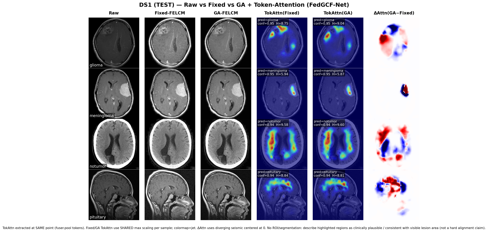
    


    
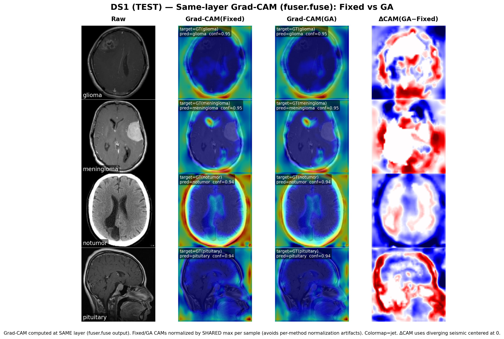
    


    
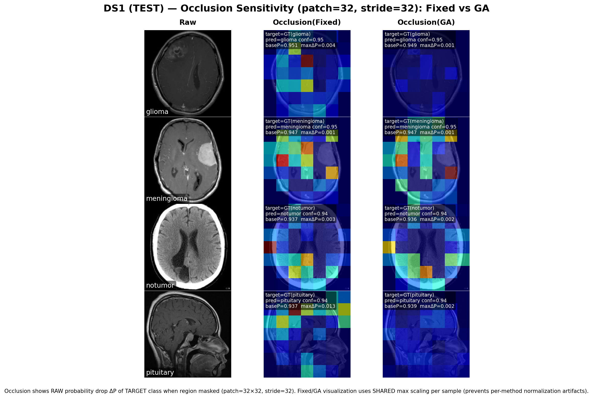
    


    
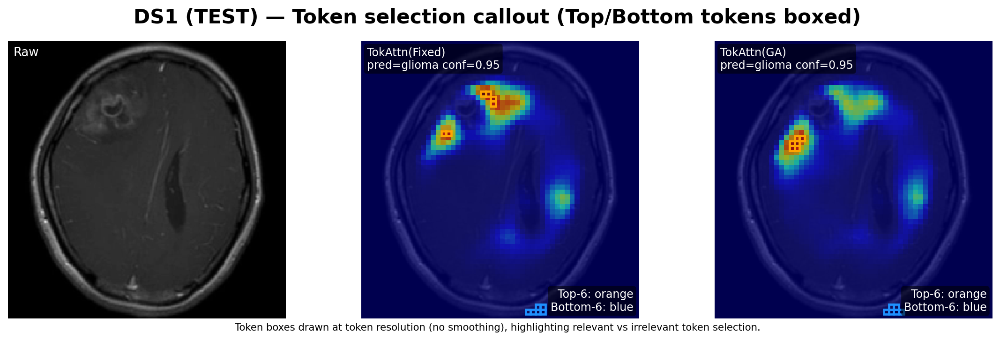
    


    
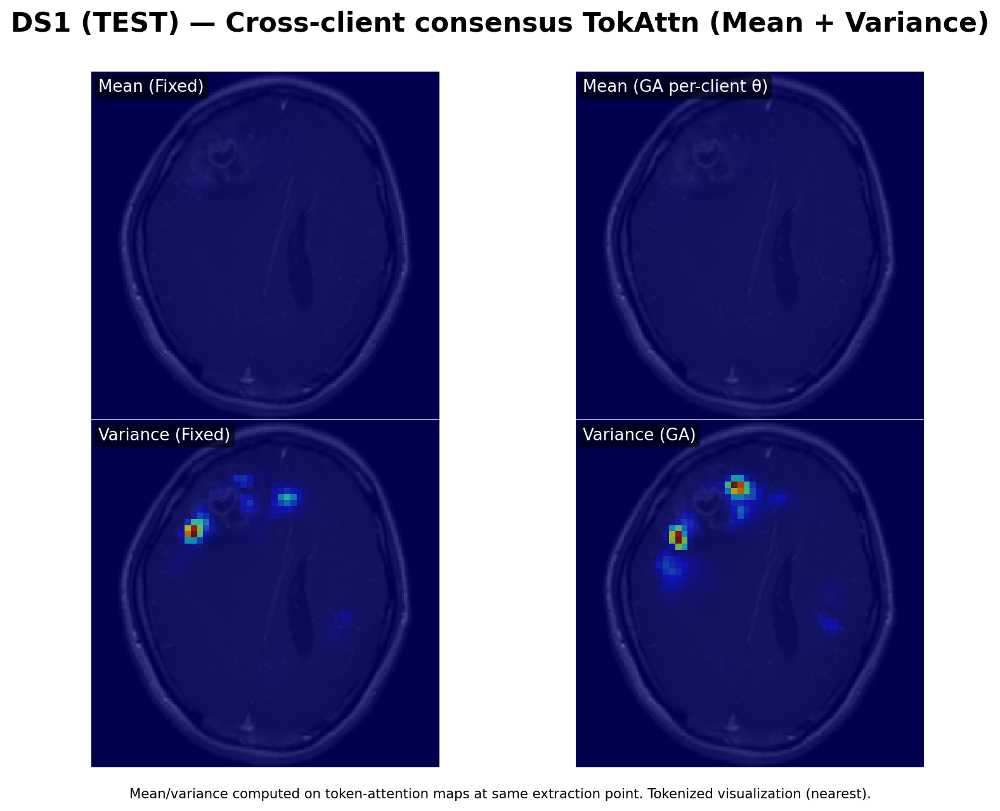
    


    
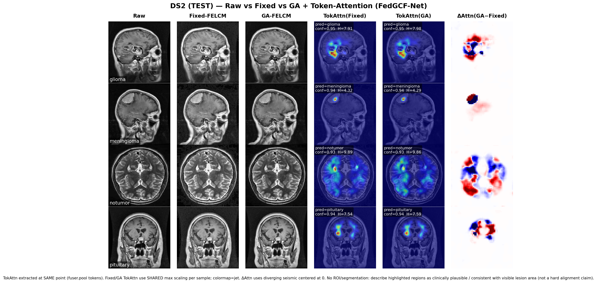
    


    
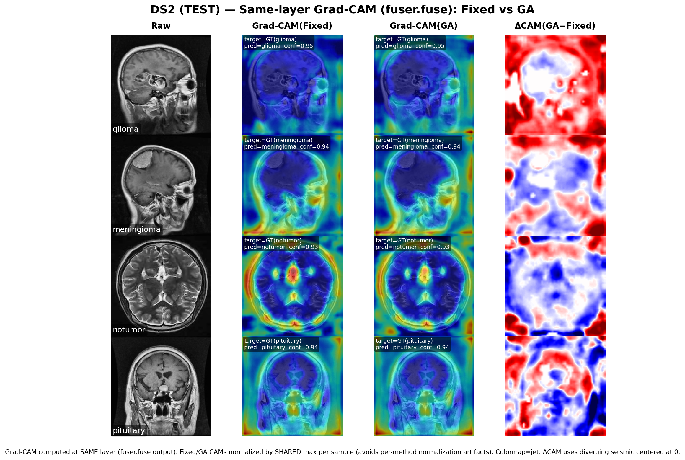
    


    
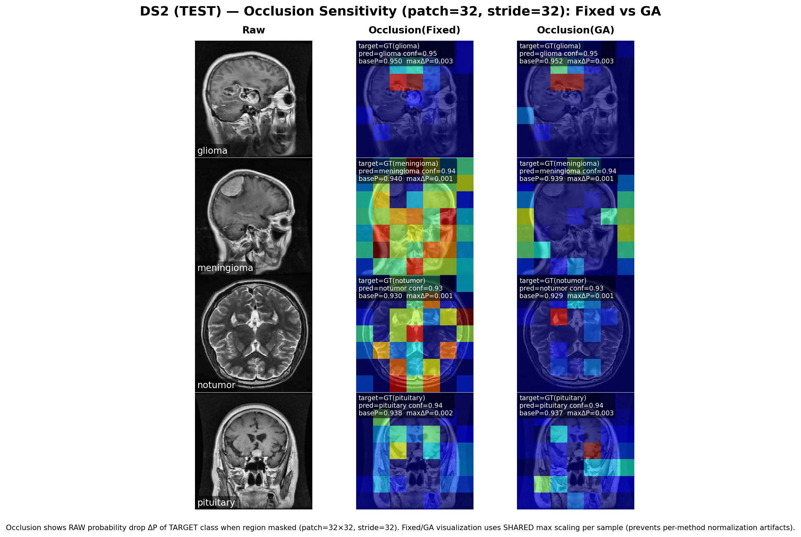
    


    
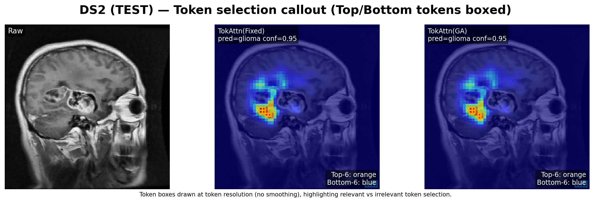
    


    
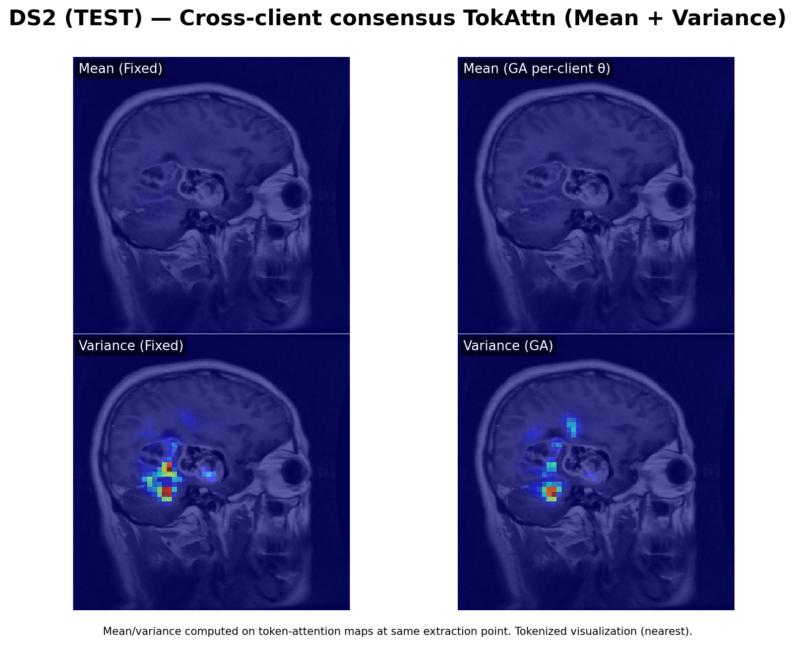
    


    ✅ Done. All quantitative stats are computed on the TEST split (70/15/15 stratified).
    
