```python
import numpy as np
import matplotlib.pyplot as plt
import matplotlib.colors as mcolors
import textwrap

# -----------------------------
# 1) CONFIG / STYLE
# -----------------------------
plt.rcParams.update({
    "font.family": "serif",
    "font.serif": ["Times New Roman", "DejaVu Serif"],
    "font.size": 20,
    "axes.titlesize": 34,
    "axes.titleweight": "bold",
    "axes.labelsize": 28,
    "axes.labelweight": "bold",
    "xtick.labelsize": 24,
    "ytick.labelsize": 22,
    "legend.fontsize": 22,
    "axes.linewidth": 1.8,
    "grid.alpha": 0.25,
    "pdf.fonttype": 42,
    "ps.fonttype": 42,
})

def wrap_keep_newlines(label: str, width: int = 16) -> str:
    parts = label.split("\\n")
    wrapped_parts = [
        textwrap.fill(p, width=width, break_long_words=False, break_on_hyphens=False)
        for p in parts
    ]
    return "\n".join(wrapped_parts)

def value_box_style(edge_color):
    r, g, b = mcolors.to_rgb(edge_color)
    fc_color = (r * 0.12 + 0.88, g * 0.12 + 0.88, b * 0.12 + 0.88, 0.93)
    return dict(
        boxstyle="round,pad=0.30,rounding_size=0.18",
        fc=fc_color,
        ec=edge_color,
        lw=1.8,
        alpha=0.95,
    )

# -----------------------------
# 2) DATA
# -----------------------------
methods = [
    "FedGCF-Net\n(w/o preprocess)", "FedFθCF-Net\n(Fixed-θ)", "Fixed Gates",
    "Zero-Conditioning\n(θ=source=client=0)", "Dirichlet\n(α=1.0)",
    "Centralized\nGCF-Net", "Local-only\n(No Aggregation)", "ResNet-50",
    "ViT-B/16", "PVTv2-B3", "MAE", "External\nvalidation", "Proposed Model"
]
x = np.arange(len(methods))

score_metrics = {
    "Accuracy":  [0.976, 0.977, 0.938, 0.939, 0.967, 0.966, 0.678, 0.724, 0.934, 0.948, 0.945, 0.978, 0.978],
    "Precision": [0.975, 0.977, 0.937, 0.941, 0.967, 0.965, 0.767, 0.818, 0.935, 0.948, 0.943, 0.955, 0.978],
    "Recall":    [0.975, 0.977, 0.934, 0.935, 0.966, 0.966, 0.673, 0.716, 0.930, 0.943, 0.941, 0.954, 0.977],
    "F1":        [0.975, 0.977, 0.934, 0.933, 0.966, 0.965, 0.596, 0.701, 0.930, 0.944, 0.941, 0.955, 0.977],
}

logloss = np.array(
    [0.140, 0.133, 0.223, 0.228, 0.167, 0.175, 0.951, 0.879, 0.264,
     0.200, 0.201, 0.137, 0.124],
    dtype=float
)

colors_palette = ['#0077B6', '#E63946', '#2A9D8F', '#F77F00']   # metrics
linestyles = ['-', '--', '-.', ':']
logloss_color = '#9B5DE5'
markers = ['o', 's', '^', 'D']
logloss_marker = 'P'
metric_names = list(score_metrics.keys())

# -----------------------------
# 3) BACKGROUND VARIANTS (12)
# fig face, axes face, suffix, use_bands flag
# -----------------------------
backgrounds = [
    ("white",   "white",   "bg_white_pure_nobands", False),  # 1 pure white, no bands
    ("white",   "white",   "bg_white_pure_bands",  True),    # 2 pure white with bands
    ("#F9FAFB", "#FFFFFF", "bg_white_soft",        True),    # 3 soft white
    ("#F5F6FA", "#FAFBFF", "bg_soft_default",      True),    # 4 original soft
    ("#E6F4FF", "#F4FAFF", "bg_light_blue",        True),    # 5 light blue
    ("#FFF7E6", "#FFF9EC", "bg_warm_cream",        True),    # 6 warm cream
    ("#F0FFF0", "#F7FFF7", "bg_mint",             True),    # 7 mint
    ("#FFF0F5", "#FFF6FA", "bg_rose",             True),    # 8 rose
    ("#E6E6FA", "#F2F2FF", "bg_lavender",         True),    # 9 lavender
    ("#ECECEC", "#F5F5F5", "bg_grey_paper",       True),    # 10 light grey paper
    ("#101010", "#181818", "bg_dark_strict",      False),   # 11 very dark, no bands
    ("#1E1E24", "#262633", "bg_dark_soft",        True),    # 12 dark with bands
]

# -----------------------------
# 4) LOOP OVER BACKGROUNDS
# -----------------------------
for fig_color, ax_color, suffix, use_bands in backgrounds:
    fig, ax = plt.subplots(figsize=(30, 24), dpi=150)

    fig.patch.set_facecolor(fig_color)
    ax.set_facecolor(ax_color)

    dark = (ax_color in ["#181818", "#262633"])
    title_color = "white" if dark else "#1B1B2F"
    label_color = "white" if dark else "#1B1B2F"
    tick_color  = "white" if dark else "#2B2D42"
    grid_color  = "#888888" if dark else "#B0B0C0"

    ax.set_title(
        "Comprehensive Performance Breakdown: FedGCF-Net Variants & Evaluation Controls",
        pad=34, fontweight="bold", color=title_color
    )
    ax.set_ylabel("Performance Scores", labelpad=22, color=label_color)
    ax.set_xlabel("Models and Methods", labelpad=26, color=label_color)

    ticks = np.linspace(0.0, 1.0, 11)
    ax.set_yticks(ticks)
    ax.set_yticklabels([f"{v:.1f}" for v in ticks], color=tick_color)
    ax.set_ylim(0.0, 1.08)
    ax.set_xlim(-0.80, len(methods) - 0.20)

    ax.grid(True, axis="y", linestyle="--", linewidth=0.8,
            alpha=0.30, color=grid_color)
    ax.grid(False, axis="x")

    # Alternating bands only when use_bands is True
    if use_bands:
        for i in range(len(methods)):
            if i % 2 == 0:
                ax.axvspan(
                    i - 0.5, i + 0.5,
                    color='#E8ECF4' if not dark else "#333344",
                    alpha=0.25, zorder=0
                )

    for spine in ax.spines.values():
        spine.set_color("white" if dark else "#8D99AE")
        spine.set_linewidth(1.5)

    # -------------------------
    # LINES
    # -------------------------
    lines = []
    for i, m in enumerate(metric_names):
        y = np.array(score_metrics[m], dtype=float)

        ax.plot(x, y, color=colors_palette[i], linewidth=7, alpha=0.12, zorder=3)

        ln = ax.plot(
            x, y,
            color=colors_palette[i],
            linestyle=linestyles[i],
            marker=markers[i],
            linewidth=3.2,
            markersize=13,
            markeredgecolor="white",
            markeredgewidth=2.2,
            label=m,
            zorder=5
        )[0]
        lines.append(ln)

    ax.plot(x, logloss, color=logloss_color, linewidth=7, alpha=0.12, zorder=3)

    ll_line = ax.plot(
        x, logloss,
        color=logloss_color,
        linestyle="-",
        marker=logloss_marker,
        linewidth=3.4,
        markersize=13.5,
        markeredgecolor="white",
        markeredgewidth=2.2,
        label="Log Loss",
        zorder=5
    )[0]
    lines.append(ll_line)

    # -------------------------
    # VALUE BOXES (your base logic)
    # -------------------------
    BASE_DROP = 0.070
    ROW_GAP   = 0.060
    X_OFF_METRIC = -0.33
    X_OFF_LOG    = 0.33

    ymin, ymax = ax.get_ylim()

    for xi in x:
        # 4 stacked metric labels
        for mi, m in enumerate(metric_names):
            y0 = float(score_metrics[m][xi])

            y_text = y0 - (BASE_DROP + mi * ROW_GAP)
            if y_text < ymin + 0.03:
                y_text = y0 + (BASE_DROP + mi * ROW_GAP)
            y_text = min(max(y_text, ymin + 0.03), ymax - 0.03)

            c = colors_palette[mi]
            ax.annotate(
                f"{y0:.3f}",
                xy=(xi, y0),
                xytext=(xi + X_OFF_METRIC, y_text),
                textcoords="data",
                ha="right",
                va="center",
                fontsize=20,
                fontweight="bold",
                color=c,
                bbox=value_box_style(c),
                arrowprops=dict(arrowstyle="-", color=c, lw=1.2, alpha=0.70),
                zorder=20,
                clip_on=False
            )

        # Logloss label
        y_ll = float(logloss[xi])
        y_ll_text = min(max(y_ll, ymin + 0.04), ymax - 0.04)

        x_off = X_OFF_LOG
        extra_y_shift = 0.0
        if xi == 7:  # ResNet-50
            x_off = 0.80
            extra_y_shift = 0.04

        y_ll_text = min(max(y_ll_text + extra_y_shift, ymin + 0.04), ymax - 0.04)

        ax.annotate(
            f"{y_ll:.3f}",
            xy=(xi, y_ll),
            xytext=(xi + x_off, y_ll_text),
            textcoords="data",
            ha="left",
            va="center",
            fontsize=20,
            fontweight="bold",
            color=logloss_color,
            bbox=value_box_style(logloss_color),
            arrowprops=dict(arrowstyle="-", color=logloss_color, lw=1.2, alpha=0.70),
            zorder=25,
            clip_on=False
        )

    # -------------------------
    # X LABELS + LEGEND + SAVE/SHOW
    # -------------------------
    wrapped_methods = [wrap_keep_newlines(m, width=16) for m in methods]
    ax.set_xticks(x)
    ax.set_xticklabels(
        wrapped_methods,
        rotation=32,
        ha="right",
        rotation_mode="anchor",
        color=tick_color
    )

    leg = ax.legend(
        handles=lines,
        loc="upper center",
        bbox_to_anchor=(0.5, 1.24),
        ncol=5,
        frameon=True,
        fancybox=True,
        borderpad=0.8,
        columnspacing=1.4,
        handlelength=2.8,
        edgecolor='#8D99AE',
        facecolor='#F0F2F8',
        shadow=True,
    )
    leg.set_zorder(50)
    for text in leg.get_texts():
        text.set_fontweight('bold')
        text.set_color('#1B1B2F')

    plt.tight_layout()
    plt.subplots_adjust(top=0.82, bottom=0.30, left=0.06, right=0.98)

    pdf_name = f"metrics_logloss_{suffix}.pdf"
    png_name = f"metrics_logloss_{suffix}.png"
    plt.savefig(pdf_name, bbox_inches="tight", pad_inches=0.05)
    plt.savefig(png_name, dpi=300, bbox_inches="tight", pad_inches=0.05)

    print(f"Saved {pdf_name} and {png_name}")
    plt.show()

```

    Saved metrics_logloss_bg_white_pure_nobands.pdf and metrics_logloss_bg_white_pure_nobands.png
    


    
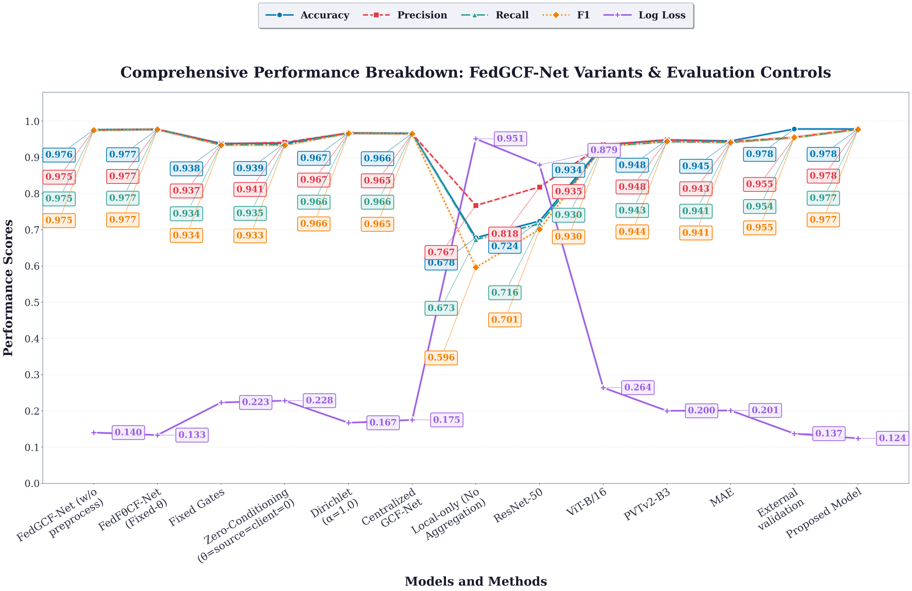
    


    Saved metrics_logloss_bg_white_pure_bands.pdf and metrics_logloss_bg_white_pure_bands.png
    


    
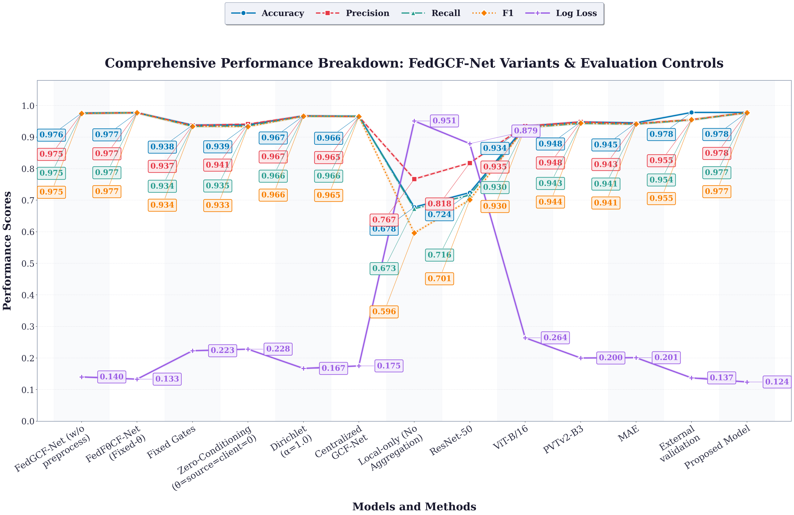
    


    Saved metrics_logloss_bg_white_soft.pdf and metrics_logloss_bg_white_soft.png
    


    
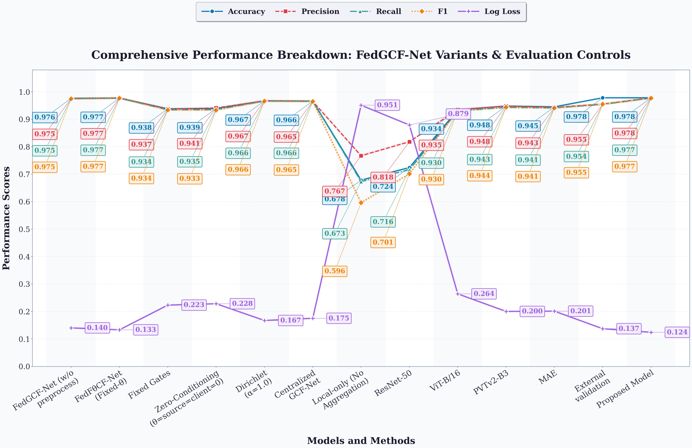
    


    Saved metrics_logloss_bg_soft_default.pdf and metrics_logloss_bg_soft_default.png
    


    
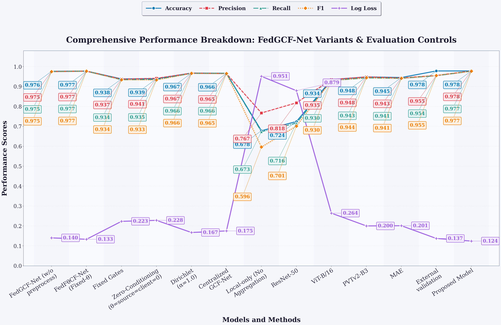
    


    Saved metrics_logloss_bg_light_blue.pdf and metrics_logloss_bg_light_blue.png
    


    

    


    Saved metrics_logloss_bg_warm_cream.pdf and metrics_logloss_bg_warm_cream.png
    


    
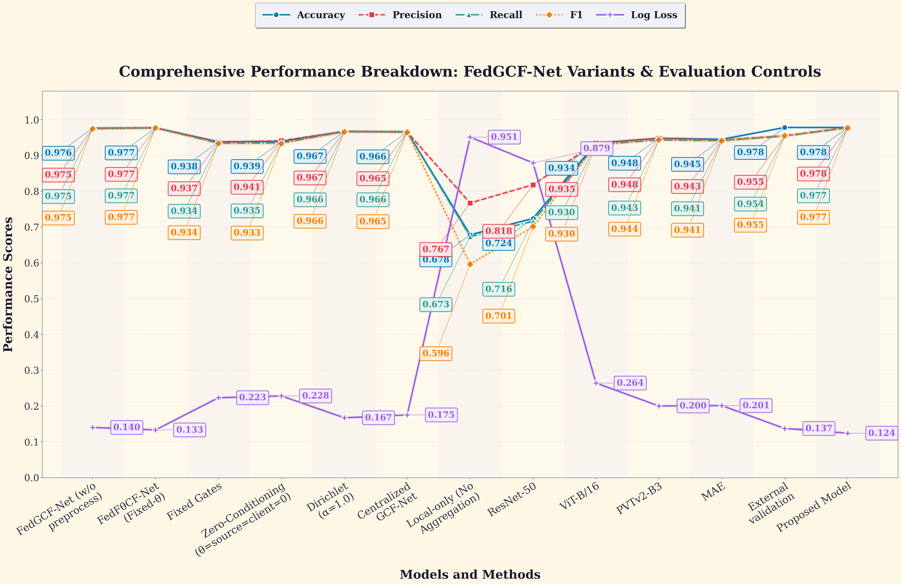
    


    Saved metrics_logloss_bg_mint.pdf and metrics_logloss_bg_mint.png
    


    
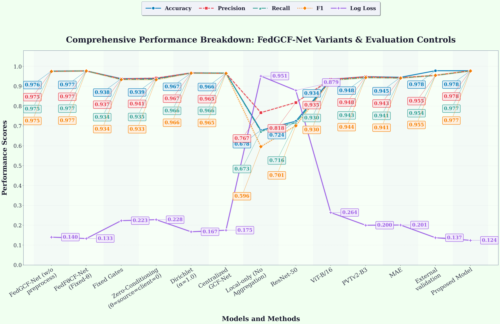
    


    Saved metrics_logloss_bg_rose.pdf and metrics_logloss_bg_rose.png
    


    
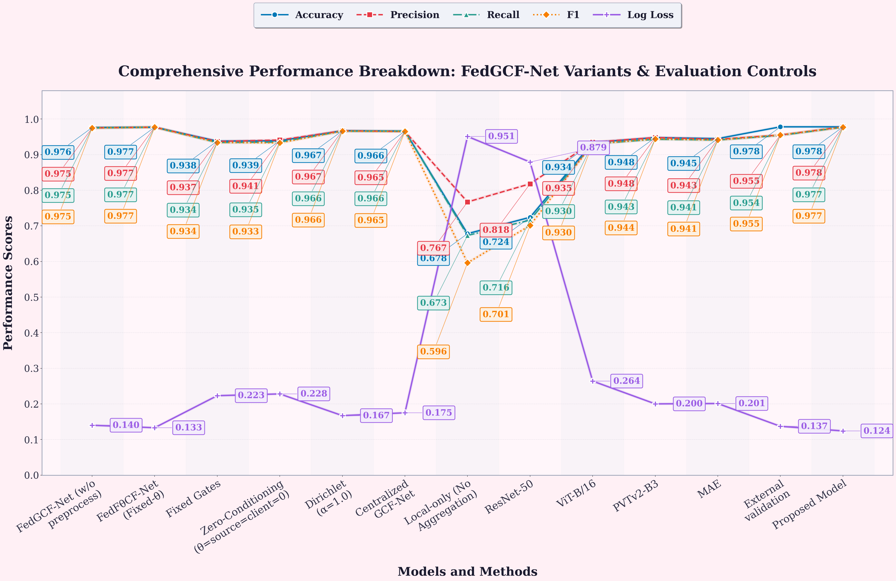
    


    Saved metrics_logloss_bg_lavender.pdf and metrics_logloss_bg_lavender.png
    


    
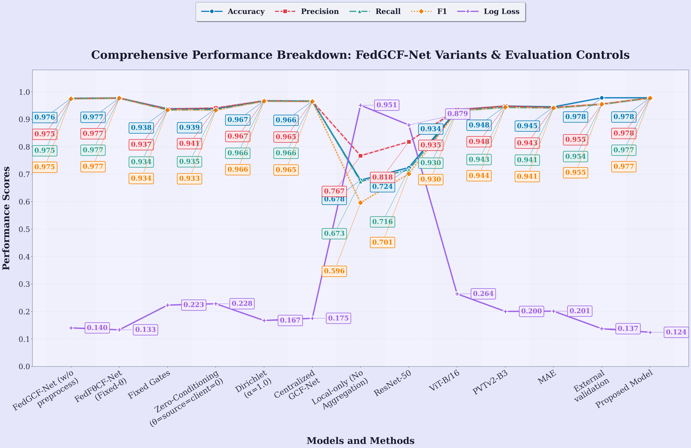
    


    Saved metrics_logloss_bg_grey_paper.pdf and metrics_logloss_bg_grey_paper.png
    


    
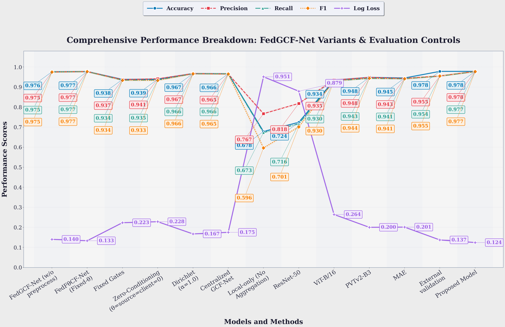
    


    Saved metrics_logloss_bg_dark_strict.pdf and metrics_logloss_bg_dark_strict.png
    


    
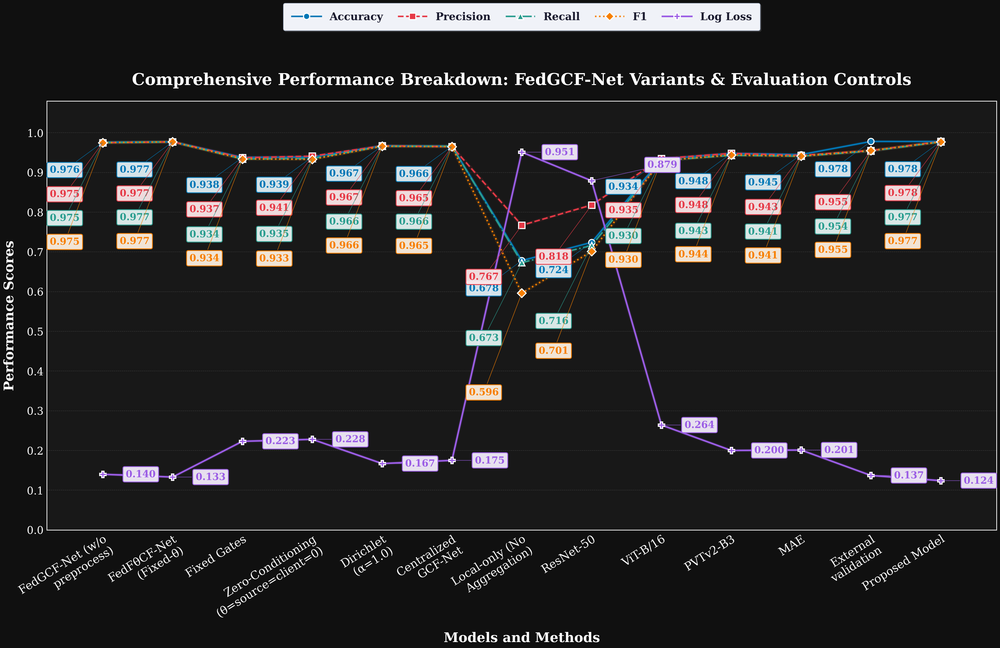
    


    Saved metrics_logloss_bg_dark_soft.pdf and metrics_logloss_bg_dark_soft.png
    


    
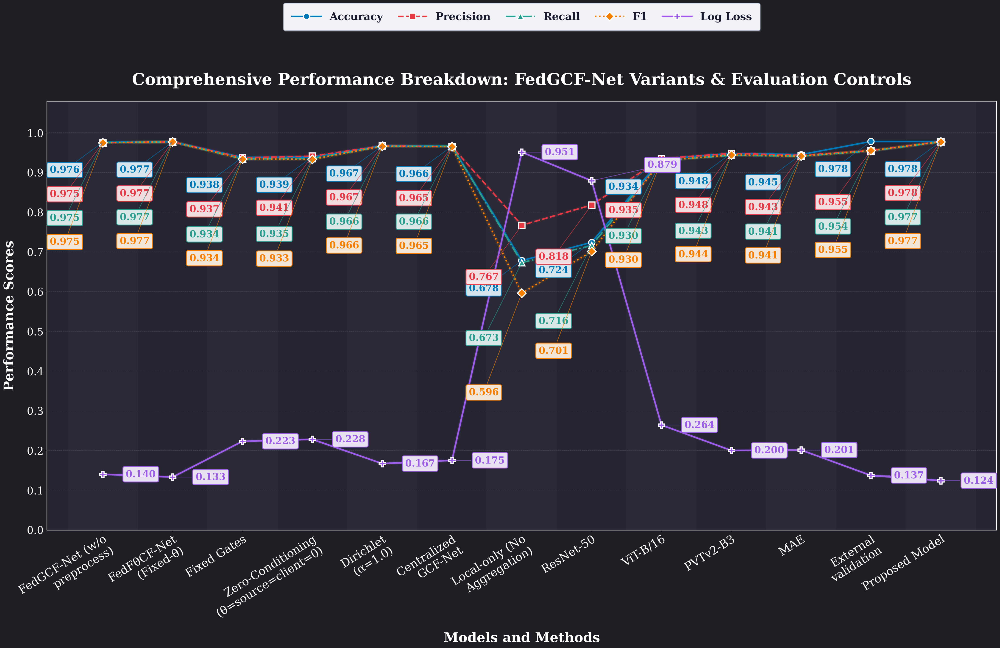
    


```python

```
